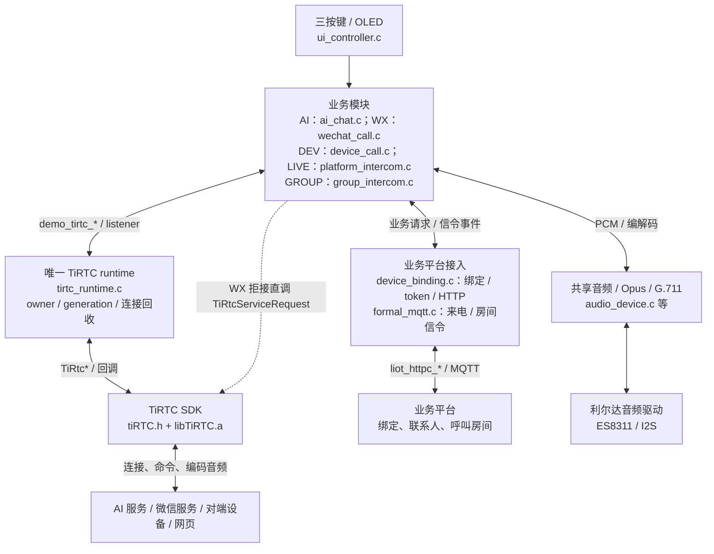
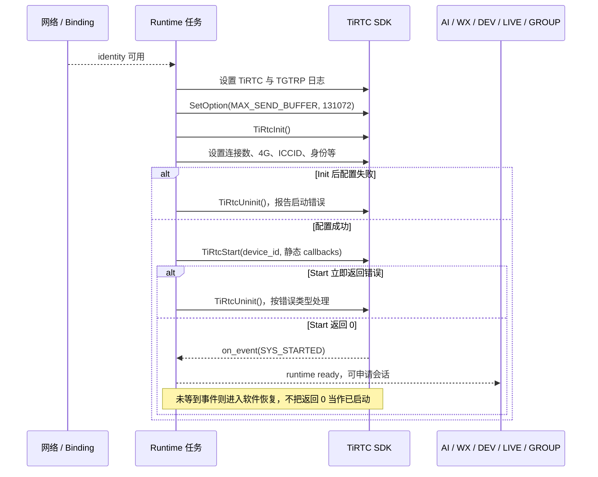
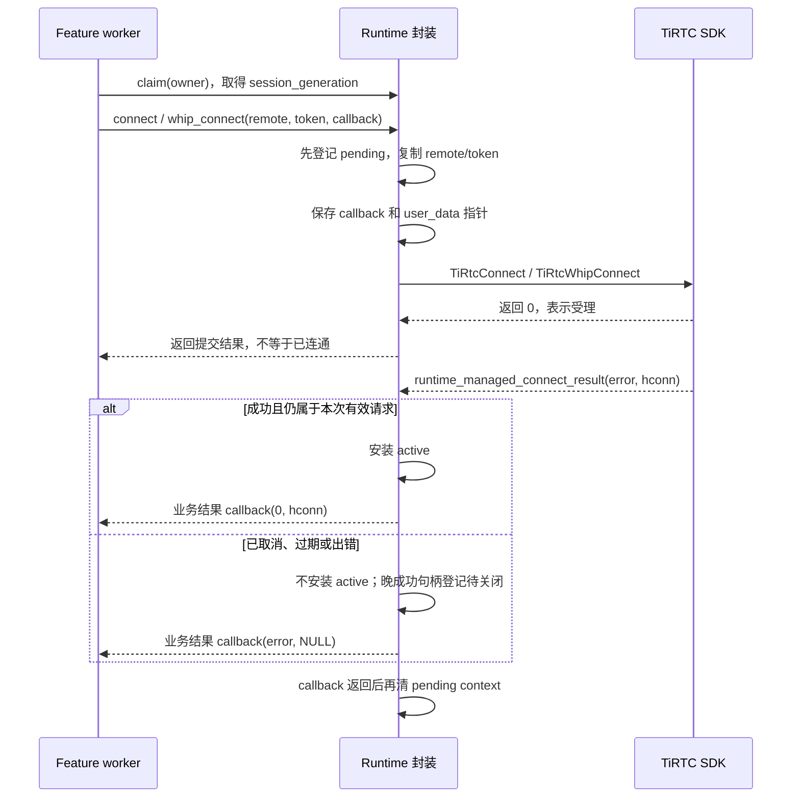
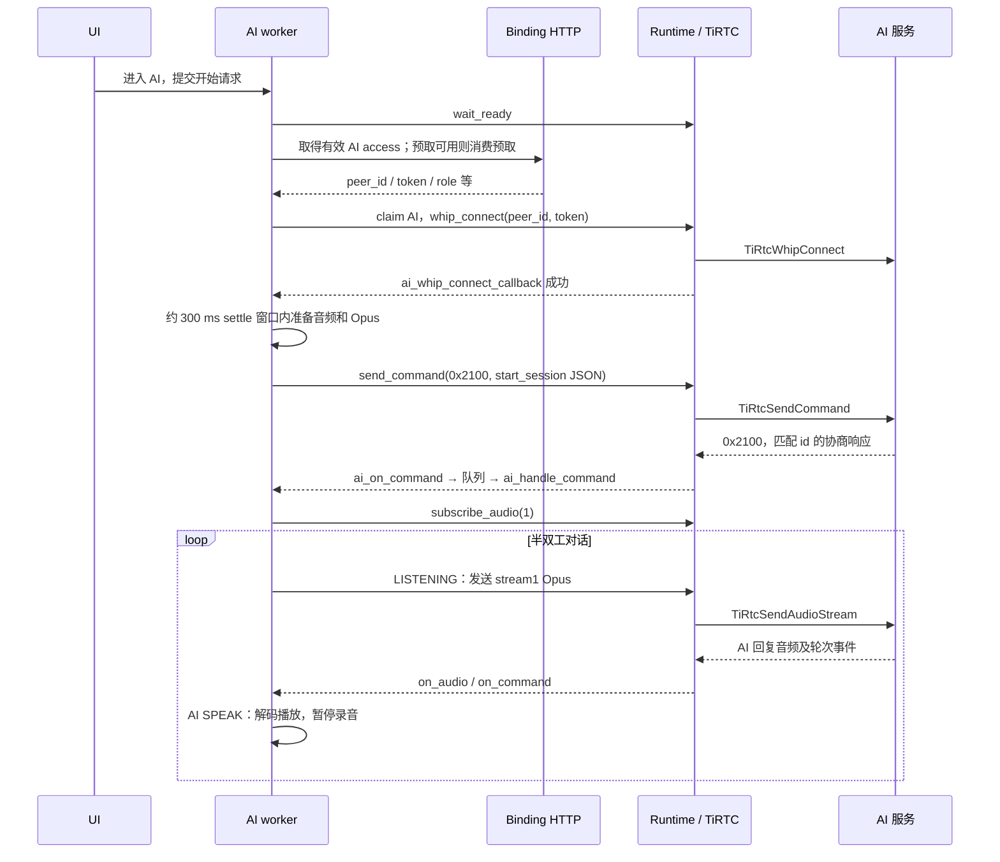
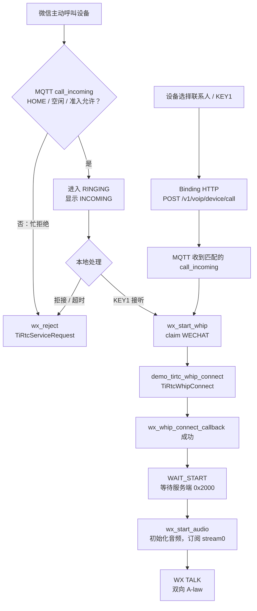
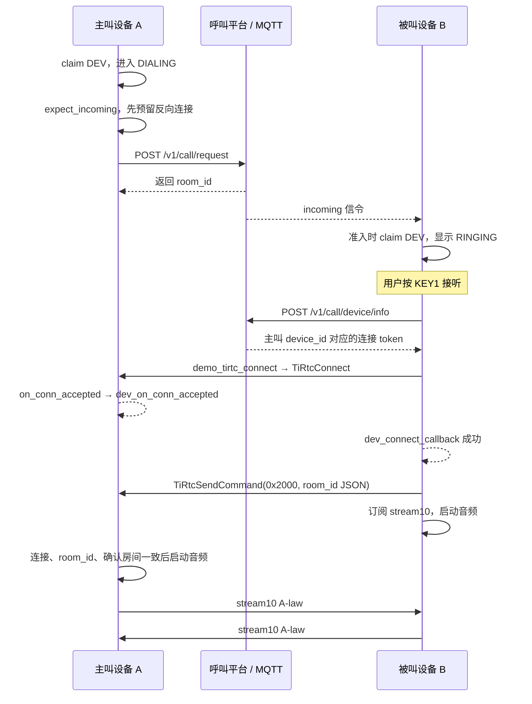
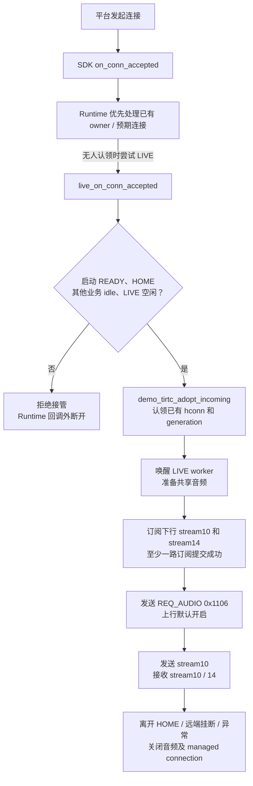
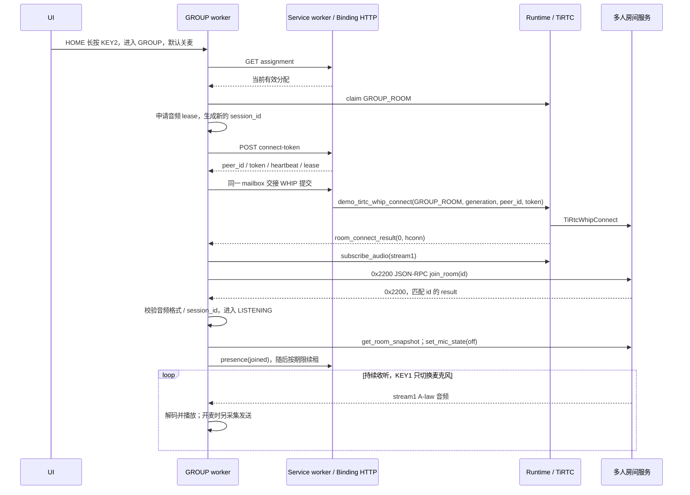
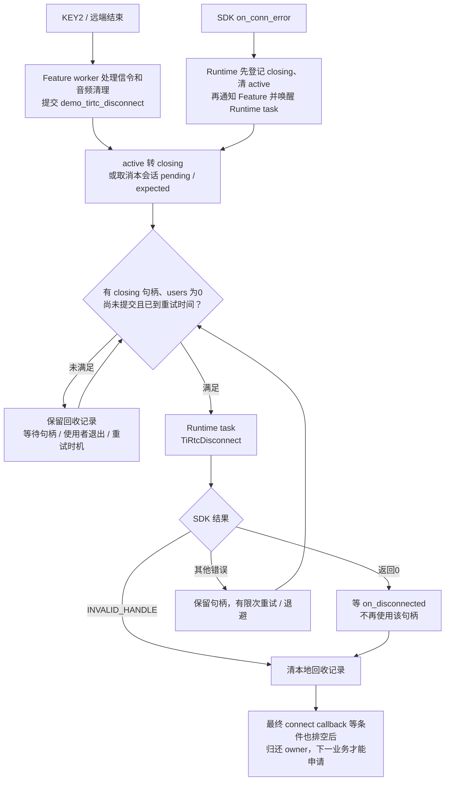

<!-- SPDX-FileCopyrightText: 2026 Shenzhen Tange Intelligent Technology Co., Ltd. <https://tange.ai> -->
<!-- SPDX-License-Identifier: Apache-2.0 -->

# TiRTC 接口调用与模块流程

> 适用工程：`L_CT4IT00_YP00W_01_V04/tirtc`；硬件：NT26F6D0 / F6D_A。  
> 当前预编译 SDK：`v2.5.0-87c3c290`；2026-09-08 同步按次刷新后的 AI 联系人呼叫流程。<br>
> 更新日期：2026-09-14；同步当前日志配置、应用异常保护及源码调用位置。源码链接和索引按本次代码核对，后续改码仍以函数名定位。<br>
> 本文解释“应用在哪里调用 SDK、传什么、等什么回调、完成什么功能”。2026-09-11 按当前代码补全 GROUP：`demo_tirtc_whip_connect` → `0x2200 join_room` → stream 1 G.711A → managed disconnect/release；接口及生命周期见第 9A 章，构建与验证见[应用说明](../README.md#当前固件与验证)。

## 1. 阅读范围与文档分工

| 文档 | 主要回答的问题 |
| --- | --- |
| [当前设备操作](当前设备操作.md) | 用户怎样绑定、按键、对讲，OLED 显示什么 |
| [AI 呼叫微信与设备配置详解](AI呼叫微信与设备配置详解.md) | 联系人、智能体及设备端插件怎样配置，如何让 AI 发起微信/设备语音呼叫 |
| [代码与流程详解](代码与流程详解.md) | 工程各文件职责、任务、资源及状态机怎样配合 |
| 本文 | 这些业务最终用到了哪些 TiRTC API；调用方向、参数、回调与释放边界是什么 |

建议先看第 2 章架构，再按“启动 → AI / WX / DEV / LIVE / GROUP → 退出恢复”阅读；查具体函数可直接看第 14 章完整调用索引。

### 1.1 以哪个版本为准

本文以**本地头文件和实际 C 调用表达式**为主，使用[官方 C API 说明](https://docs.tange.ai/products/tirtc/api-reference/c.html)核对公开契约。在线文档中的其他平台、新版本示例或仅出现在注释里的函数，不代表当前固件已经调用。

`sdk/include/tirtc` 放的是声明、类型和说明，不是完整 SDK 实现。真正的连接协商、传输等实现链接自 `sdk/lib/libTiRTC.a`。本文不会把“头文件声明了某接口”写成“应用已经接入”，也不凭声明推断静态库内部线程和释放细节。

### 1.2 头文件的分工

| 头文件 | 内容 | 当前应用使用情况 |
| --- | --- | --- |
| [tiRTC.h](../sdk/include/tirtc/tiRTC.h) | 生命周期、配置、连接、音视频、命令、订阅、日志、WHIP、服务请求；29 个函数声明 | 直接调用情况见第 14 章 |
| [tgtrp.h](../sdk/include/tirtc/tgtrp.h) | 下层 listener / connection / channel、媒体传输、WHIP、统计及日志；44 个函数声明 | 只直接调用 2 个日志函数；错误回调注册另经链接 wrapper 适配 |
| [tiRTC_stat.h](../sdk/include/tirtc/tiRTC_stat.h) | 耗时统计、视频发送监控、连接方式选择标志；3 个函数声明 | 当前业务没有调用 |
| [basedef.h](../sdk/include/tirtc/basedef.h) | 基础类型、导出宏、编译器与结构体打包定义 | 由 `tiRTC.h` 引入；没有可调用函数 |
| [ticloudstorage.h](../sdk/include/tirtc/ticloudstorage.h) | 云存储服务、编码帧队列和上传请求；14 个函数声明 | 当前业务没有接入，不代表设备已有云录像功能 |

因此本工程直接调用此目录声明的 **20 种 SDK 函数，共 32 处调用表达式**。统计范围为应用源码，不包括头文件里的示例、宏定义展开示意、库内部调用或 `__real_*` 链接适配入口。

AI 联系人呼叫和 GROUP 仅新增既有 runtime 封装的调用点和业务 facade，上述 SDK API 种类数不变。

## 2. 整体架构：三条路径不要混淆



### 2.1 业务平台路径

服务发现、六位码绑定、AI token、WX 联系人、DEV 房间、GROUP assignment / token / presence 等，主要经过 `device_binding.c` 的 HTTP 封装；来电和 GROUP 分配变化提示通过正式 MQTT 接收。

这些不是 `TiRtcConnect()` 自动替应用完成的业务。`network_manager.c` 的注册、PDP、时间，及绑定的 NVM 存储，也不是这四个 TiRTC 头文件里的能力。

### 2.2 实时连接路径

AI / WX / DEV / LIVE / GROUP 不各自 `TiRtcInit()`。它们共享 `tirtc_runtime.c` 启动的一个设备级 runtime，通过 `demo_tirtc_*` 管理连接、命令和音频。

唯一重要的功能性直调例外是 WX 的 `TiRtcServiceRequest()`；此外业务文件会直接调用 `TiRtcGetErrorStr()` 打印错误。

### 2.3 声音硬件路径

TiRTC 发送或接收**已经编码的音频数据**，不替这块板子配置 ES8311、录音、Opus/G.711 编解码或播放 PCM。麦克风和扬声器由本地音频层驱动。

`SET` 页面只调整音量和麦克风级别，没有自己的 TiRTC 连接，也不调用此目录里的音量 API——这里没有这种音量 API。

## 3. 模块一：开机、联网绑定与 SDK 启动

主要文件：[app_entry.c](../src/app/app_entry.c)、[network_manager.c](../src/services/network_manager.c)、[device_binding.c](../src/services/device_binding.c)、[tirtc_runtime.c](../src/core/tirtc_runtime.c#L2087)。

### 3.1 启动前先准备什么

`user_main()` 创建业务、网络、绑定和 runtime 等任务。任务创建不等于功能就绪：WX / DEV 可以先建立信令接收入口，再等待绑定和 TiRTC ready；LIVE 的接收路由也要先注册，避免 SDK 启动后入站连接没有接收者。

`demo_tirtc_task()` → `runtime_start_until_terminal()` 等待 `demo_binding_get_tirtc_identity()` 提供身份，然后调用 `runtime_start()`。身份快照的用途如下：

| 数据 | 去向 | 不要混淆 |
| --- | --- | --- |
| `device_id` | `TiRtcStart(device_id, &s_callbacks)` | 设备身份，不是 AI/WX 的 service descriptor |
| `device_key` | `TIRTC_OPT_DEVICE_SECRET_KEY` | 长期设备密钥，不是某次呼叫的 token |
| `client_id` | `TIRTC_OPT_CLIENT_ID` | 稳定的硬件/生产标识 |
| `iccid` | `TIRTC_OPT_ICCID` | 当前 4G SIM 信息，不是对端设备 ID |
| `tirtc_endpoint` | 条件设置 `TIRTC_OPT_SERVICE_ENDPOINT` | TiRTC 服务入口，不等同于所有业务 HTTP 的 base URL |

### 3.2 实际启动时序



图省略了 Init 本身失败等立即返回路径；这些路径不会继续调用 Start。正常运行期间 runtime 常驻，退出一个业务不会重新初始化整个 SDK。启动立即失败且错误可重试时，会在约 5 秒后重试启动；已经受理 Start 的生命周期异常则走第 11 章软件恢复。

### 3.3 当前显式设置的参数

配置来源：[tirtc_config.mk](../config/tirtc_config.mk#L35)，由 [tirtc_app.mk](../tirtc_app.mk#L90) 传入编译。以下按当前配置赋值核对；命令行覆盖构建变量时应重新核对。

| 顺序 / 选项 | 传入内容 | 调用位置 `tirtc_runtime.c` | 功能 |
| --- | --- | --- | --- |
| `TiRtcLogSetCallback` | `tirtc_sdk_log_callback` | [2106](../src/core/tirtc_runtime.c#L2106) | 接管高层日志输出 |
| `tgtrp_set_log_callback` | `tirtc_transport_log_callback` | [2107](../src/core/tirtc_runtime.c#L2107) | 接管传输层日志输出 |
| `TiRtcLogSetLevel` | 3 | [2108](../src/core/tirtc_runtime.c#L2108) | 使用当前 `TIRTC_LIBRARY_LOG_LEVEL` 配置 |
| `tgtrp_set_log_level` | `3`＝`0x03` | [2109](../src/core/tirtc_runtime.c#L2109) | 传输层级别为 3；`TIRTC_TRANSPORT_STATS_EN=0`，统计日志关闭 |
| `MAX_SEND_BUFFER` | `uint32_t`，131072 B＝128 KiB | [2114](../src/core/tirtc_runtime.c#L2114) → [2077](../src/core/tirtc_runtime.c#L2077) | **在 Init 前**设置发送缓冲上限；不是当前实际已用量 |
| `MAX_CONNECTIONS` | `int`，1 | [2144](../src/core/tirtc_runtime.c#L2144) → [2077](../src/core/tirtc_runtime.c#L2077) | 一次仅允许一条媒体连接 |
| `NETWORK_TYPE` | `int`，`TIRTC_NETCONN_4G` | [2148](../src/core/tirtc_runtime.c#L2148) → [2077](../src/core/tirtc_runtime.c#L2077) | 明确本机通过 4G 联网 |
| `ICCID` | `identity->iccid` | [2153](../src/core/tirtc_runtime.c#L2153) → [2077](../src/core/tirtc_runtime.c#L2077) | 4G SIM 信息 |
| `RESTRICTED_NETWORK` | `int`，1 | [2158](../src/core/tirtc_runtime.c#L2158) → [2077](../src/core/tirtc_runtime.c#L2077) | 当前工程按受限网络配置；不是由所有 4G 自动推导 |
| `SERVICE_ENDPOINT` | 自定义入口字符串 | [2167](../src/core/tirtc_runtime.c#L2167) → [2077](../src/core/tirtc_runtime.c#L2077) | 只有非默认入口才显式设置 |
| `DEVICE_SECRET_KEY` | `identity->device_key` | [2174](../src/core/tirtc_runtime.c#L2174) → [2077](../src/core/tirtc_runtime.c#L2077) | 设备模式身份配置 |
| `CLIENT_ID` | `identity->client_id` | [2181](../src/core/tirtc_runtime.c#L2181) → [2077](../src/core/tirtc_runtime.c#L2077) | 稳定生产标识 |

当前日志配置值为 **3 / 3 / 0**，与 [runtime 源码回退值](../src/core/tirtc_runtime.c#L31) 一致；命令行覆盖这些变量后，实际构建值以覆盖后的配置为准。

表内省略了选项统一前缀 `TIRTC_OPT_`。`runtime_set_option()` 才是实际调用 `TiRtcSetOption()` 的地方。数值传地址和 `sizeof`；身份字符串传指针和 `strlen`，不把末尾 NUL 算入长度。

`runtime_is_default_endpoint()` 将空入口及内置默认域名视为“不覆盖 SDK 默认值”。当前没有显式设置 `TIRTC_OPT_WAKEUP`、`TIRTC_OPT_CONNECT_CACHE`、`TIRTC_OPT_APP_ID`、`TIRTC_OPT_TGTRP_POLL_TIMEOUT`，不能把 SDK 缺省值写成应用已经设置的行为。

启动完成依据是 `TIRTC_EVENT_SYS_STARTED`，不是 Start 返回 0；这与[官方连接流程](https://docs.tange.ai/products/tirtc/guides/connection.html)一致。当前启动事件等待上限为 30 秒；超时走第 11 章恢复流程。

## 4. 模块二：公共 Runtime 封装

主要文件：[tirtc_runtime.h](../include/tirtc_runtime.h#L126)、[tirtc_runtime.c](../src/core/tirtc_runtime.c#L2298)。

### 4.1 业务为什么不直接拿句柄调用 SDK

连接句柄 `tirtc_conn_t` 是 SDK 的不透明对象，不是应用可以 `free()` 的内存。本项目在 SDK 外再记录 owner、generation、引用计数和正在关闭的连接，防止上一通的清理影响下一通。

| 应用概念 | 本项目含义 |
| --- | --- |
| `owner` | AI、WECHAT、DEV_CHAT、LIVE、GROUP_ROOM 中哪一个业务占用共享连接 |
| `session_generation` | 一次业务占用的代次，申请 owner 时产生 |
| `request_generation` | 一次异步建连尝试的代次 |
| `connection_generation` | 连接状态更新时使用的代次 |
| `active` | 当前允许收发的句柄 |
| `closing` | 已停止业务访问，但仍待 SDK 释放确认的句柄 |
| `users` | 尚未退出的受管理句柄使用者数量 |
| pending / reservation | 尚未完成的连接请求、回调或回收记录；不能因 UI 已返回就清空 |

这些 generation 是应用实现的保护，不是 SDK 自动附带到每个回调中的连接 ID。它们需要配合固定 context、句柄匹配及真实释放边界一起工作。

### 4.2 封装到 SDK 的对应关系

| 业务调用 | 最终 SDK 调用 | 封装额外做什么 |
| --- | --- | --- |
| `demo_tirtc_connect()` | `TiRtcConnect()` | 检查 owner/代次，预留 pending，复制 remote ID/token，注册中间结果回调 |
| `demo_tirtc_whip_connect()` | `TiRtcWhipConnect()` | 同上；此路径要求非空服务描述和 token |
| `demo_tirtc_send_command()` | `TiRtcSendCommand()` | 校验 owner/代次，临时持有 active 引用 |
| `demo_tirtc_send_audio()` | `TiRtcSendAudioStream()` | 校验帧和数据，再保护 active 引用 |
| `demo_tirtc_subscribe_audio()` | `TiRtcSubscribeAudio()` | 向对端申请接收指定音频流 |
| `demo_tirtc_get_send_buffer_used()` | `TiRtcGetSendBufferUsed()` | 安全查询，通过输出参数交回已用字节数 |
| `demo_tirtc_disconnect()` | 稍后由 runtime task 调 `TiRtcDisconnect()` | 按 owner/代次撤销本会话等待，或原子地将 active 转为 closing；不改变全局 ready，不是同步释放 |

下列名称**没有同名 SDK 接口**，只操作本地协调状态：

| 应用函数 | 作用 |
| --- | --- |
| `demo_tirtc_session_claim()` / `demo_tirtc_session_release()` | 申请、归还共享媒体 owner |
| `demo_tirtc_expect_incoming()` / `demo_tirtc_cancel_expected_incoming()` | 为 DEV 主叫登记、取消预期的反向连接 |
| `demo_tirtc_adopt_incoming()` | LIVE 认领 SDK 已经交付的入站句柄；不再创建连接 |
| `demo_tirtc_set_listener()` / `demo_tirtc_set_feature_listener()` | 注册 AI / WX / DEV / GROUP 的业务回调路由 |
| `demo_tirtc_set_incoming_listener()` | 注册 LIVE 被动连接路由 |
| `demo_tirtc_admission_try_enter()` / `demo_tirtc_admission_leave()` | 把 HOME 准入检查和本地占用更新组成一个短事务 |
| `demo_tirtc_wait_ready()` / `demo_tirtc_wait_connections_idle()` | 等待应用维护的就绪或资源排空条件 |
| `demo_tirtc_require_restart()` | 通知 runtime task 请求 SDK 软件恢复，不执行整机复位 |

### 4.3 主动连接如何回到业务模块



这张图表达逻辑完成关系，不保证结果回调一定晚于提交函数返回。代码先登记 pending，正是为了应对快速回调。Runtime 不深拷贝 `user_data` 指向的业务 context，调用方必须保持它有效直到结果 callback 完成。上层的等待期限也只能在提交 API 返回后执行，不能替代底层库自身的超时保证。

## 5. SDK 回调：从库回到哪个模块

静态注册表是 [s_callbacks](../src/core/tirtc_runtime.c#L2057)，整个 SDK 生命周期都有效。`TiRtcStart()` 得到的是这张表，不是 AI/WX/DEV/GROUP 各自的 listener。

### 5.1 全局回调表

| SDK 回调 | Runtime 入口 | 最终处理 |
| --- | --- | --- |
| `on_event` | `runtime_on_event()` | 维护 started/ready/stopped/restart 状态，不转给业务 listener |
| `on_conn_accepted` | `runtime_on_conn_accepted()` | 预期 DEV 反向连接，或无人认领时尝试 LIVE；拒收的句柄交异步回收 |
| `on_conn_error` | `runtime_on_conn_error()` | 记录错误与待回收状态，通知相应业务停止使用连接 |
| `on_disconnected` | `runtime_on_disconnected()` | 普通连接通知业务并清 closing；拒绝队列的句柄只清拒绝槽，不通知业务 |
| `on_audio` | `runtime_on_audio()` | 转给 `ai_on_audio` / `wx_on_audio` / `dev_on_audio` / `live_on_audio` / `room_on_audio` |
| `on_command` | `runtime_on_command()` | 转给对应模块的 `*_on_command` |
| `on_subscribe_audio` | `runtime_on_subscribe_audio()` | 对端请求设备上行；返回是否接受 |
| `on_unsubscribe_audio` | `runtime_on_unsubscribe_audio()` | 对端停止订阅请求；具体是否关闭采集由各业务决定 |
| `on_subscribe_video` / `on_unsubscribe_video` | 同名 `runtime_on_*` | 仅转给 LIVE incoming listener，处理兼容性请求 |
| `on_video` | `runtime_on_video()` | 空实现，不播放视频 |
| `on_message` | `runtime_on_message()` | 空实现；不是 `on_command` 的替代入口 |
| `on_request_key_frame` | `runtime_on_request_key_frame()` | 空实现，没有视频编码器 |
| `on_update_bitrate` | `runtime_on_update_bitrate()` | 空实现，没有视频码率自适应业务 |

连接结果是另一类回调：`TIRTCCONNECTCALLBACK`。它通过 `TiRtcConnect/WhipConnect` 的参数注册，**不在 `TIRTCCALLBACKS` 结构里**。

| 业务 | Listener 定义 / 注册位置 | 主动连接结果链路 |
| --- | --- | --- |
| AI | [ai_chat.c](../src/features/ai_chat.c) 的 `s_tirtc_listener` / `demo_ai_chat_task` | SDK → `runtime_managed_connect_result` → `ai_whip_connect_callback` |
| WX | [wechat_call.c](../src/features/wechat_call.c) 的 `s_tirtc_listener` / `demo_wechat_task` | SDK → 同一中间回调 → `wx_whip_connect_callback` |
| DEV | [device_call.c](../src/features/device_call.c) 的 `s_tirtc_listener` / `demo_dev_chat_task` | SDK → 同一中间回调 → `dev_connect_callback` |
| LIVE | `platform_intercom.c:673 / 1233` | 没有主动 connect callback，走 `live_on_conn_accepted`（318） |
| GROUP | [group_intercom.c](../src/features/group_intercom.c) 的 `s_listener` / `demo_group_intercom_init` | SDK → `runtime_managed_connect_result` → `room_connect_result` |

### 5.2 分发不是无条件广播，也不是永远单播

通常 active 句柄、owner 和 generation 匹配时，音频、命令等只转给当前 owner，并保护引用计数。

未匹配 managed 路径时，代码仍保留兼容分发：先 LIVE incoming listener，再遍历 feature listener；各模块必须自行检查句柄/会话。音频订阅会尝试全部有效接收者，任一个返回 0 即视为接受。

入站连接的规则不同：已有 owner 时只能按其预期条件接收；无 owner 时按 feature 顺序尝试，首个接受即停止，最后才尝试 LIVE。当前 AI/WX/GROUP 没实现入站接受回调，原 AI → WX → DEV 的顺序保留。`on_conn_error(NULL, …)` 直接忽略；拒绝句柄的 `on_disconnected` 只完成拒绝回收，不再分发。不要把所有回调都画成同一种路由。

### 5.3 回调内的数据和线程边界

- SDK 回调中的 audio / command payload 在回调返回后不再有效。Runtime 同步转发，不替业务复制。
- 需要后续处理的数据，由 feature 复制到固定 pool，再把 slot index 投入队列，交 worker 处理。
- callback 不执行耗时 HTTP、录音、播放清理、`TiRtcStop/Uninit` 或整机 reset。
- `on_conn_error` 不是已释放通知；应先停止业务收发，再由 worker 提交断开。
- 音频订阅回调是同步决定接受/拒绝的入口，要迅速返回，不能在那里长时间初始化硬件。

## 6. 模块三：AI 对讲

主要文件：[ai_chat.c](../src/features/ai_chat.c)，业务入口 `ai_run_session()`。

### 6.1 建连、协商、媒体时序



AI access 的获取是业务 HTTP，不是 `TiRtcServiceRequest()`。进入会话时可以消费 HOME 预取的短期、单次凭据；过期或不可用时走原有 fresh request。

### 6.2 函数调用索引

| 阶段 | `ai_chat.c` 中的函数 | 封装 → SDK / 功能 |
| --- | --- | --- |
| 等待 runtime | `ai_run_session` | `demo_tirtc_wait_ready`，不重复 Init/Start |
| 申请 owner | `ai_run_session` | `demo_tirtc_session_claim(AI)` |
| 主动连接 AI 服务 | `ai_whip_submit` | `demo_tirtc_whip_connect` → `TiRtcWhipConnect` |
| 启动应用会话 | `ai_send_start_session` | `demo_tirtc_send_command` → `TiRtcSendCommand` |
| 回复 AI 呼叫动作 | `ai_handle_device_action` → `ai_call_reply` | 原 `0x2100` 通道通过 `demo_tirtc_send_command` 返回相同 id；不新增 SDK API |
| 订阅回复音频 | `ai_run_session` | `demo_tirtc_subscribe_audio(1)` → `TiRtcSubscribeAudio` |
| 检查发送积压 | `ai_send_uplink_20ms` | `demo_tirtc_get_send_buffer_used` → `TiRtcGetSendBufferUsed` |
| 发送麦克风音频 | `ai_send_uplink_20ms` | `demo_tirtc_send_audio` → `TiRtcSendAudioStream` |
| 通知服务结束 | `ai_send_end_session` | 相同 `0x2100` 通道发送 `end_session` JSON |
| 关闭连接 / 取消 pending | `ai_disconnect_and_wait`；`ai_session_cleanup` | `demo_tirtc_disconnect`，最终由 runtime 调 SDK Disconnect |
| 归还 owner | `ai_release_tirtc_session` | `demo_tirtc_session_release` |

### 6.3 AI 不是“连接成功就开始播放”

1. WHIP callback 成功，只说明实时连接已建立。
2. 应用还要发送 `start_session`，等待匹配 JSON-RPC `id` 的响应。
3. 响应需要非空 `session_id`；若包含 input/output 音频格式，必须匹配 Opus / 16000 Hz / 单声道。
4. 协商成功后才订阅 stream1，进入对话循环。

AI 发送和接收都使用**完整命令字 `0x2100`**，不是“低 16 位等于即可”；`ai_on_command()` 和 `ai_handle_command()` 都有完整值检查。应用请求/响应靠 JSON `id` 关联，没有使用 SDK 的 `atomic_get_cmd_sn()`。

`round_start`、`round_end`、`interrupt`、`end_session` 是 JSON 内的业务方法，不是新的 TiRtc API。`round_end` 允许剩余音频播完；`interrupt` 会 Stop 音频、清队列和重置解码状态，但当前底层播放恢复仍有已知限制，不能据此声称下一轮一定正常。

### 6.4 半双工和退出

AI 上行是 20 ms / 320 个 16 kHz PCM sample，经 Opus 编码发送。服务正在说话或本地播放尚未完成时，代码不开始录音。发送缓存**大于** 12 KiB 时跳过本轮采集；发送返回 `TIRTC_E_BUSY` 时丢当前帧。

退出的实际主线：Stop 本地音频 → 条件允许时尝试发送 `end_session` → 关闭应用接收准入、等待 producer 并 drain 队列 → 提交 managed disconnect → 归还音频和 TiRTC owner。未完成的 WHIP 即使尚未给业务公开句柄，也要取消本地请求并保留最终回调的回收责任。

### 6.5 AI 指令如何转成 WX/DEV 呼叫

呼叫联系人使用[官方 AI `device_action` 事件](https://docs.tange.ai/products/ai-chat/api-reference/events.html#device_action)，并非 `tiRTC.h` 新增的“AI 呼叫”函数。云端只下发动作和目标，联系人查询、资源交接、创建呼叫房间仍在设备应用层完成。

平台在命令字 `0x2100` 中下发：

```json
{
  "jsonrpc": "2.0",
  "id": "call-001",
  "method": "device_action",
  "params": {
    "action": "call_contact",
    "data": {
      "target": "妈妈",
      "contact_type": "wechat",
      "call_type": "audio"
    }
  }
}
```

- `id` 必须为非空、有界字符串，并原样返回；缺失或超长时不执行动作。
- 呼叫 JSON 不允许内嵌 NUL（包括 `\u0000` 转义）或尾随其他数据；异常消息记录日志后忽略，避免截断名称/ID 后误呼叫。正常转义反斜杠、尾随空白及单个末尾 NUL 不受影响，原有 AI 事件处理不变。
- `action` 推荐 `call_contact`；兼容 ESP32 插件的 `call_device`，两者不指定类型时均查 WX/DEV；`call_wechat` 默认仅查 WX。
- 目标名称/ID 必填，标准字段为 `data.target`，也接受下表的目标字段别名。WX/DEV 各最多保存 8 条；每次有效呼叫都请求所需列表的下一次 HTTP 刷新，成功后按完整备注/名称或 ID 精确唯一匹配，不用旧缓存、OLED 过滤名或模糊匹配兜底。
- `contact_type` 可选；微信值为 `wechat/wechat_voip/wx/voip/微信/微信联系人`，设备值为 `device/device_call/tirtc/设备/设备联系人`。通用呼叫未指定类型时刷新并查两类；只指定一类时只刷新该类，不把另一张未加载的表当空表而误选同名联系人。
- `call_type` 空或不填按音频处理，接受 `audio/voice`，也兼容上述联系人类型值；仅当 `contact_type` 缺失或为空，才从 `call_type` 的类型值推导搜索范围。仍不支持视频；微信专用 action 与设备类型冲突时拒绝。目标设备须在本次刷新结果中在线；微信联系人须已授权/上报且服务就绪。对端随后仍可能掉线，不能保证每次呼通。

**ESP32 参数兼容与边界**

对照 [P4 参数解析](https://github.com/tangeai/xiaotai-esp32/blob/cb30059b6611acad5f220fe1c4b301bfe218dee2/esp32-p4/complete-applications/device-monitor/main/services/ai_chat_events.c#L244)及 [S3 参数解析](https://github.com/tangeai/xiaotai-esp32/blob/cb30059b6611acad5f220fe1c4b301bfe218dee2/esp32-s3/complete-applications/device-monitor/main/services/ai_chat_events.c#L240)，兼容以下入参；后台仍建议配置标准 `target`，不必改插件名称。

| 项目 | 优先顺序 |
| --- | --- |
| 参数包装 | `params.data`；缺失时选首个对象 `arguments → args → input → payload → parameters`；仍无对象则直接使用 `params` |
| action 位置 | `params.action`；缺失时选首个非空字符串 `params.name → params.tool → params.function → payload.action → payload.tool → payload.function`，不把 `payload.name` 当动作 |
| 目标字段 | `target → target_device → target_device_id → device → device_id → device_name → device_alias → contact → contact_name → name → alias → remark → callee → callee_device_id → peer → peer_id → nickname → query` |
| 媒体字段 | `call_type → type → media → mode` |
| 联系人类型字段 | `contact_type → target_type → contact_source → route` |

每个字段名先查所选参数对象，再查外层 `params`，然后才查下一个别名；若 `params.name` 已用作 action，则不再把它当联系人名，避免遮盖 `remark/nickname` 等目标。action 支持
`call_contact/call_device/device_call/start_device_call/call` 和
`call_wechat/wechat_call/call_wechat_contact/call_voip_contact/voip_call`；action 与类型值对 ASCII 大小写不敏感，联系人名称不变。

为保留利尔达原有防误拨校验，**显式 `data` 非对象仍拒绝；字段取第一个存在的值，不跳过无效值去用另一个别名**。
因此 `target` 类型错误、为空或超长时，不能用另一个有效 `contact_name` 绕过校验；目标去除首尾空白后限 1–256 字节，不截断名称。
`query` 是本机为呼叫 action 增加的最低优先级目标名称别名；`{"query":"小李"}` 可进入同一路径，
但显式 `target` 非法时不能被它覆盖。后台仍推荐标准 `target`；这不代表新增了联系人状态查询 action。
参考 ESP32 会跳过部分空/非字符串字段，并提供子串匹配；本机保留严格校验、精确唯一匹配和现有缓存/任务结构。
本次对齐的是语音呼叫的入参兼容和“先回包、再释放 AI、最后调用原拨号”时序，不移植 P4 视频、额外联系人状态查询或整个 ESP32 生命周期实现。

例如 `params.data={"contact_name":"小李"}` 与 `params.data={"target":"小李"}` 均可提取同一目标，
随后还需通过本次刷新、唯一性及路由校验。串口 `fields ... target=contact_name`、`params target_string=1 target_bytes=6`
只表示正确识别目标，不表示已经接通。

受理成功响应示例：

```json
{"jsonrpc":"2.0","id":"call-001","result":{"message":"已受理语音呼叫，正在切换","ok":true,"status":"accepted","contact_type":"wechat","call_type":"audio"}}
```

失败响应示例：

```json
{"jsonrpc":"2.0","id":"call-001","error":{"message":"目标设备当前不在线","code":-32000,"data":{"ok":false,"status":"offline"}}}
```

失败状态还包括 `invalid_params`、`unsupported`、`unsupported_call_type`、`busy`、
`network_offline`、`contacts_timeout`、`contacts_unavailable`、`not_found`、`ambiguous`。
每次呼叫按类型申请关联 ticket，由原 WX/DEV worker 刷新；AI worker 在原约 10 ms 主循环中
异步查询同一次 RPC 的进度，继续处理音频和取消，绝不阻塞等待联系人 HTTP。仅本次 ticket
刷新成功后继续匹配并回复；旧在途 HTTP 不能完成新 ticket。

本地约 12 秒仍未完成返回 `contacts_timeout`，失败或不可用返回 `contacts_unavailable`；
均不是 `not_found/offline`，也不使用旧缓存兜底。12 秒仅为本地预算，不是云端规定。
拒绝后保持 AI，用户可稍后重新下令；本次刷新成功则直接继续原呼叫，不必重复下令。
AI 入口另有一次异步预热，没有周期轮询或 TTL；HTTP 失败仍保留原列表显示并约 10 秒退避，
但后续普通重试不能把已失败的 ticket 改为成功。

同一 pending RPC id 去重，其他 id 返回 busy；取消、会话结束或换请求后丢弃迟到结果。
同一已受理 id 不会重复发起呼叫。`accepted` 只表示通过本地校验并接受转接，
不表示云端建房成功、对端响铃或媒体已建立。

调用链：

```text
TiRTC on_command(0x2100)
→ runtime listener → ai_on_command（复制入现有队列）
→ AI worker: ai_handle_command → ai_handle_device_action
→ 按类型申请 WX/DEV call-refresh ticket（原 worker 下一次 HTTP）
→ ai_active_loop → ai_poll_call_lookup（继续音频，每轮非阻塞查询同次 RPC）
  ├─ 取消/会话结束/换请求：丢弃迟到结果，不拨号
  ├─ 失败/不可用/本地 12 秒超时：回复对应 error，结束本次动作、保持 AI
  └─ 本次刷新成功：find_contact 精确唯一匹配
     ├─ 无匹配/同名/离线：回复对应 error，结束本次动作、保持 AI
     └─ 通过原呼叫条件
        → ai_call_reply（accepted）→ demo_tirtc_send_command → TiRtcSendCommand
        → 仅完整长度发送成功且当前请求有效时，发布单个 request_id 转接
        → UI: demo_ai_chat_take_call_request → demo_ai_chat_stop
        → 留在 AI 页 CALL WX / CALL DEV，非阻塞等待 feature + runtime 全部 idle
        → demo_wechat_call_contact / demo_dev_chat_call_device（按唯一 ID 预约快照）
        → 原 WX/DEV worker 创建呼叫房间并继续原 WHIP/P2P 流程
```

`ai_call_reply()` 要求返回值恰好等于完整 JSON 长度加 4 字节命令字；发送失败或非完整计数时不发起转接。
UI 复用约 6 秒 handoff 预算，转接期间不开放 HOME/LIVE 或无关来电；KEY2、联网绑定
失效可取消。仅 AI 转 DEV 时，DEV 联系人仍在 SYNCING 也需在该预算内等其完成，不改变
通用 idle 规则。清理/同步超时或定向请求未受理时显示 `CALL ERR`，不强行释放对象、不重启。
发起前重新校验并复制联系人快照，因此随后刷新列表不会改变实际被叫对象；通话结束
沿用原流程回 HOME，不自动重开 AI。

后台需给本次会话的通用 AI Pipeline 角色配置设备端插件，配置步骤见
[AI 呼叫微信与设备配置详解](AI呼叫微信与设备配置详解.md)；设备试用见
[当前设备操作](当前设备操作.md)第 6.4 节。
Coze `forward` 不自动映射为 `device_action`；这条最小接入不增加 Coze 原生工具协议。

## 7. 模块四：微信 WX 对讲

微信端使用“探鸽小钛”小程序；设备端仍以 `WX` 菜单和 `wechat_call.c` 模块承载该功能。

主要文件：[wechat_call.c](../src/features/wechat_call.c)。

### 7.1 主叫与被叫共用哪段流程



两种角色都由设备主动发起 WHIP，到达 WHIP 成功回调后都要等服务端 `0x2000`。本地 KEY1 接听触发的是 WHIP，不是设备发送一个 `0x2000` 作为接听指令。

GROUP 页面收到真实微信来电时，先用带 ticket 的预约让 GROUP 释放资源，再沿用上述响铃、接听或拒接流程；不自动接听，交接边界见第 9A.5 节。

### 7.2 函数调用索引

| 阶段 | `wechat_call.c` 中的函数 | 封装 → SDK / 功能 |
| --- | --- | --- |
| 同步 / 呼叫业务 | `wx_fetch_contacts`、`wx_sync_profile`、`wx_start_outgoing_call` | Binding HTTP；不直接调用 TiRtc 连接 API |
| 主动建立实时连接 | `wx_start_whip` | `demo_tirtc_whip_connect` → `TiRtcWhipConnect` |
| 订阅下行 | `wx_start_audio` | `demo_tirtc_subscribe_audio(0)` → `TiRtcSubscribeAudio` |
| 发送上行 | `wx_send_uplink` | `demo_tirtc_send_audio` → `TiRtcSendAudioStream` |
| 已连接时通知挂断 | `wx_cleanup_session` | `demo_tirtc_send_command(0x2001, reason JSON)` → `TiRtcSendCommand` |
| 关闭 / 取消连接 | `wx_cleanup_session`；延迟回收 `wx_drain_unwanted` | `demo_tirtc_disconnect` |
| 归还 owner | `wx_release_tirtc_session` | `demo_tirtc_session_release` |
| 无媒体连接的拒接等 | `wx_reject` | **直接 `TiRtcServiceRequest`** |

### 7.3 `TiRtcServiceRequest` 在哪里、为什么调用

[wechat_call.c](../src/features/wechat_call.c) 中的 `wx_reject()` 构造 JSON 后调用：

```c
TiRtcServiceRequest(WX_REJECT_PATH, json, NULL,
                    wx_service_response, NULL);
```

| 参数 | 当前值 / 含义 |
| --- | --- |
| `path` | `/v1/wxvoip/reject` |
| `json_body` | `wx_app_id`、`wx_model_id`、`wx_session_token`、`wx_room_id`、`wx_payload`、`hangup_reason` |
| `token` | `NULL`，使用设备身份访问；不是 WX/AI 建连 token |
| `cb` | `wx_service_response`，当前仅记录收到响应，不解析业务成功状态 |
| `user_data` | `NULL` |

用途不局限于手动拒接，还包括忙、超时、异常以及尚未建立媒体连接时关闭相关信令房间。若连接已建立，清理路径可先发送 `0x2001` 再 disconnect；不能用关闭 TiRTC 连接代替所有业务房间关闭操作。

此调用使用 SDK 服务请求路径，**不经过** `device_binding.c` 的 `liot_httpc_*` singleton/reaper。排查问题时，两套 HTTP 生命周期不能混为一谈。入口长度等保护仍受当前 SDK 和应用校验约束。

### 7.4 媒体与命令

- 上下行使用 stream0。设备上行：16 kHz PCM 两点平均降为 8 kHz，再编码 A-law，160 B / 20 ms。
- 下行只接受 A-law，兼容 8 kHz / 16 kHz；8 kHz 解码后重复采样到板端 16 kHz。
- `wx_command_is()` 兼容完整命令、低 16 位及去相应标志后的低 15 位；不要把此兼容规则套用到 AI 或 DEV。
- `on_unsubscribe_audio` 当前为空操作；没有调用 `TiRtcUnsubscribeAudio()`。
- WX 为同时收发，无已验证 AEC；编解码与播放仍由本地音频层完成。

## 8. 模块五：DEV 设备互呼

主要文件：[device_call.c](../src/features/device_call.c)。

### 8.1 最重要的角色区别

**业务主叫设备是这次 P2P 的被动接受方；业务被叫设备在接听后主动调用 `TiRtcConnect()` 连回主叫。** “谁先按呼叫”与“谁调用 P2P Connect”不是同一个概念。



图按正常业务关系排列；网络回调可能交错到达。主叫端特意在呼叫 HTTP **之前**登记 `expect_incoming`，并在激活音频前核对房间，不能把这两步移到“全部 HTTP 已完成之后”才处理。

GROUP 页面收到真实设备来电时，先显示原来电状态并预约 GROUP 清理；`dev_group_process_pending()` 等资源释放后才 claim DEV，仍须本地确认才接听。普通后台 `/v1/call/room` 查询的隔离规则见第 9A.5 节。

### 8.2 函数调用索引

| 阶段 | `device_call.c` 中的函数 | 封装 → SDK / 功能 |
| --- | --- | --- |
| 主叫占用 owner | `dev_start_outgoing_call` → `dev_tirtc_claim` | `demo_tirtc_session_claim(DEV_CHAT)` |
| 主叫等待反向 P2P | `dev_start_outgoing_call` → `dev_tirtc_expect_current` | `demo_tirtc_expect_incoming`；这里不调用 `TiRtcConnect` |
| 创建呼叫 | `dev_start_outgoing_call` | Binding HTTP `/v1/call/request` |
| 被叫接听获取凭据 | `dev_accept_incoming` | Binding HTTP `/v1/call/device/info` |
| 被叫主动 P2P | `dev_submit_callee_connect` | `demo_tirtc_connect` → `TiRtcConnect` |
| 被叫发房间确认 | `dev_process_signals` | `demo_tirtc_send_command(0x2000, room_id JSON)` |
| 订阅下行 | `dev_start_audio` | `demo_tirtc_subscribe_audio(10)` → `TiRtcSubscribeAudio` |
| 发送麦克风数据 | `dev_send_uplink` | `demo_tirtc_send_audio` → `TiRtcSendAudioStream` |
| 通知对端挂断 | `dev_finish_session` | 条件允许时发送 `0x2001` / `{"reason":0}` |
| 撤销等待 / 断开 | `dev_tirtc_begin_release` | cancel expected → `demo_tirtc_disconnect` |
| 归还 owner | `dev_tirtc_try_release` | `demo_tirtc_session_release` |

### 8.3 房间信令和媒体连接分别关闭

DEV 的 `/v1/call/reject`、`/v1/call/cancel`、`/v1/call/hangup` 通过后台 room-action HTTP worker 执行；它们不使用 WX 的 `TiRtcServiceRequest()`。

房间结束不表示 P2P 内存已经释放；`TiRtcDisconnect()` 提交成功也不表示服务器房间已经关闭。因此 `dev_finish_session()` 根据角色和结束原因分别处理 HTTP 房间动作、可选的对端挂断命令、本地音频和 managed connection。

主叫固定保护由本会话 `s_late_incoming_possible` 决定：普通外呼提交 HTTP 前置位，冷恢复
主叫默认置位，只有连接、房间确认及 `dev_start_audio()` 全部成功后才清除。结束时按
`caller && s_late_incoming_possible` 同时设置 owner 归还等待和迟到入站拒绝期限。因此已接通
后挂断、POST 前本地取消/失败不再额外等固定 10 秒；未接通的 `40201`、HTTP 不确定及
`40202` 恢复仍保留保护。`[DEV] teardown late_peer_guard_ms=0/10000` 记录这一选择，不代表
SDK 已完成断开；真实 callback、closing、audio 和 owner 检查不变。

后台冷恢复 `/v1/call/room` 只在 HOME/空闲 DEV 准入且原资源条件满足时启动，提交前在
临界区复核准入。用户请求进入 AI/WX/SET 后不再启动新的冷恢复 HTTP；已开始的查询正常
完成、响应后再次校验，不强行中断。查询尚未完成时仍可能让菜单显示 `WAIT AUDIO`。

### 8.4 数据格式与超时

- 命令严格匹配完整值：确认 `0x2000`、挂断 `0x2001`，不像 WX 有位掩码兼容。
- 音频上下行均 stream10、A-law、8 kHz 单声道；上行 160 B / 20 ms。
- 下行 callback 最多接受 640 B 合并包，不保证“一次回调就是一帧 20 ms”；它明确拒绝 16 kHz flags。
- 被叫当前只提交一次主动连接尝试，应用等待 P2P callback 约 15 秒。超时结束本次业务，不整机复位；迟到连接由 runtime 保留的 context 安全接回并关闭。
- 已提交但未接通的主叫清理仍保留约 10 秒迟到入站保护，避免未完成的反向连接被认成其他功能；已接通后挂断不再额外等待，仍须完成真实资源清理。
- video 类型房间在本固件仍按 audio-only 处理，不代表调用了视频 SDK API。

## 9. 模块六：主页远端 LIVE

主要文件：[platform_intercom.c](../src/features/platform_intercom.c)，准入来源：[ui_controller.c](../src/ui/ui_controller.c) 的 `ui_sync_live_policy()`。

### 9.1 LIVE 是接管连接，不是设备主动外呼



这里只描述走到 LIVE 的连接。DEV 已登记反向 P2P 时优先归 DEV；已有业务占用时不能让 LIVE 抢占。

### 9.2 函数调用索引

| 阶段 | `platform_intercom.c` 中的函数 / 调用行 | 封装 → SDK / 功能 |
| --- | --- | --- |
| 注册被动路由 | `demo_live_talk_task`，1233 | `demo_tirtc_set_incoming_listener` |
| HOME 准入和接管 | `live_on_conn_accepted`，361 | `demo_tirtc_adopt_incoming(LIVE, hconn)`；不调 Connect 或 WhipAccept |
| 订阅远端音频 | `live_begin_claimed_session`，745、748 | `demo_tirtc_subscribe_audio(10/14)` → `TiRtcSubscribeAudio` |
| 请求远端开麦 | 同上，769 | `demo_tirtc_send_command` → `TiRtcSendCommand` |
| 设备麦克风上行 | `live_send_uplink_20ms`，970 | `demo_tirtc_send_audio` → `TiRtcSendAudioStream` |
| 清理连接 | `live_cleanup_session`，1041 | `demo_tirtc_disconnect` |
| 归还 owner | `live_release_tirtc_session`，268 | `demo_tirtc_session_release` |

### 9.3 流和命令约定

下表的远端控制命令只对当前连接生效，且要求 `cmdw & 0x8000 == 0`；带响应位的命令只记录日志，不切换上行或挂断。

| 项目 | 当前实际行为 |
| --- | --- |
| 设备上行 | stream10，A-law / 8 kHz / 单声道，160 B / 20 ms |
| 设备下行 | 接受 stream10 或14，A-law / 8 kHz 或16 kHz；最多640 B |
| 下行订阅 | 两路都尝试；都返回错误才结束准备，提交成功不代表已收到声音 |
| `REQ_AUDIO` | 发送 `((generation & 0xffff) << 16) \| 0x1106`，payload 为单字节1 |
| 远端 `0x1106 / 0x1108` | 控制设备音频上行；无 payload 默认开，有 payload 看首字节是否非零 |
| 远端 `0x1104` | 请求结束 LIVE |
| 对端订阅 stream10 | 置 subscribed 和 remote-audio-enabled 为 true |
| 对端退订 stream10 | 清上述标志，停止上行 |
| 视频 stream11 | 订阅回调返回0仅兼容 VIEW，不发送视频帧 |

与[官方语音对讲示例](https://docs.tange.ai/products/tirtc/guides/voice-talkback.html)的客户端 stream14 约定相衔接，本工程同时保留 stream10 下行兼容。

接管时 `s_remote_audio_enabled` 默认 true，worker 以上述标志决定是否采集发送，**不把 `s_uplink_subscribed` 当作发送的硬门槛**。因此 LIVE 激活后即可尝试设备麦克风上行，不需要本地再次按键。

只移动 HOME 光标不会退出 LIVE；按 `KEY1` 请求进入 AI/WX/DEV/SET 时立即关闭 LIVE 准入，要求当前 LIVE 清理。等待期间显示目标标题和 `WAIT AUDIO`，不是隐藏在主页同步卡等；资源就绪后自动进入，约 30 秒超时显示 `AUDIO BUSY`，可取消或重试。LIVE 正常运行时仍显示主页，没有单独 LIVE 页面。

## 9A. 模块八：多人对讲 GROUP

主要文件：[group_intercom.c](../src/features/group_intercom.c)、[group_intercom.h](../include/group_intercom.h)。

GROUP 是独立业务，使用 `DEMO_TIRTC_OWNER_GROUP_ROOM` 和 `DEMO_AI_AUDIO_OWNER_GROUP_ROOM`，复用唯一 runtime 与共享音频设备。它不复用 AI 会话、WX 呼叫房间、DEV P2P 房间或 LIVE 入站连接；也不另起 TiRTC / MQTT 实例。构建开关为 `HWDEMO_GROUP_ROOM_EN`，默认 `y`。

### 9A.1 公共入口与工作任务

| 应用接口 | 当前调用与完成边界 |
| --- | --- |
| `demo_group_intercom_init()` | `user_main()` 在绑定 / 正式 MQTT 启动前同步注册路由，创建 GROUP worker 和 service worker；返回 0 为初始化成功，失败返回 `-6105`，不阻止原业务启动 |
| `demo_group_intercom_enter()` / `exit()` | UI 提交进入 / 退出意图；进入默认关麦，退出立即关闭本地收发准入，资源由 worker 异步释放；返回不等于媒体已经加入 / 释放 |
| `demo_group_intercom_toggle_mic_for_generation()` | UI 用按键事件携带的有效 generation 切麦；同一有效会话且有收听准入时才返回 true，旧页面 / 旧连接按键不生效；无参数版本只是读取当前 generation 后转调 |
| `demo_group_intercom_retry()` | `NO ROOM` / `ERROR` 时由确认键提交新意图、重新同步，默认关麦 |
| `demo_group_intercom_set_foreground_allowed()` | UI 传入页面及原业务空闲条件；撤销许可立即关闭门控，并保留一次待处理暂停请求 |
| `demo_group_intercom_set_audio_levels()` | 共用 SET 音量 / 麦克风级别，限定 1–10；由 GROUP worker 更新当前音频 lease |
| `demo_group_intercom_get_snapshot()` | 返回状态、错误、六位房间号、麦克风开关、enabled、generation 及丢帧计数；没有音频准入时 generation 为 0 |
| `demo_group_intercom_is_idle()` | 媒体已释放、producer 为 0 且没有在执行 SDK 建连提交；不代表普通 HTTP / 终态上报已经结束 |
| `demo_group_intercom_is_enabled()` | 用户仍希望留在 GROUP；暂停、重连或暂无分配时也可能为 true，不等同于已加入 |
| `reserve_call()` / `call_ready()` / `release_call()` / `has_call()` | 均带 `demo_group_intercom_` 前缀；供 WX/DEV 使用的来电预约和排空检查，见第 9A.5 节；不是 SDK API |

`group_room` worker 负责状态、音频、命令解析和清理；`room_http` service worker 执行阻塞 HTTP 与 WHIP 提交。两者通过单个不可变 job / result mailbox 交接，回调只复制有界数据或登记事件。服务请求不阻塞媒体循环，UI 与 MQTT / TiRTC callback 不直接执行这些请求。

### 9A.2 服务器分配、正式 MQTT 与业务 HTTP

房间创建、加入分配由服务器页面操作。设备端以 assignment 为准，没有新增本地创建 / 删除分配接口；`room_code` 只用于显示六位房间号，后续接口使用 `room_id`。

使用入口为[设备列表](https://xiaotai.chat/devices) → 目标设备 → 多人对讲；网页创建/加入及
板端操作见[当前设备操作](当前设备操作.md)第 10A 章。网页分配成功后，设备还需由
`ui_process_group()` 提交进入意图，再经过本节 HTTP 和第 9A.3 节的媒体加入流程；
“已有房间分配”与“正在房间中收听”是两个完成状态。

| 方法 / 路径 | 请求和响应用途 |
| --- | --- |
| `GET /v1/call/group/device/assignment` | 读取 `room_id`、`room_code`、`assignment_version`、`desired_state`、`state`；`desired_state=joined`、版本非零、room_id 非空且 room_code 为六位数字才表示可入房；`state=room_closed` 优先视为房间关闭 |
| `POST /v1/call/group/device/connect-token` | 提交 `room_id`、`assignment_version`、本地新生成的 `session_id`；取得 `peer_id`、`token`、`heartbeat_seconds`、`lease_seconds`，有数值型 `expires_at` 时检查是否已经过期 |
| `POST /v1/call/group/device/presence` | 提交相同三元组，再加 `state`；正常加入及续租用 `joined`，退出 / 暂停 / 失败用 `left` / `suspended` / `connect_failed` |

三条请求均调用 `demo_binding_service_request_timeout(DEMO_BIND_SERVICE_CALL, …, 10000)`，使用服务发现得到的 call-server 和正式 MQTT 身份 token 的 Bearer 鉴权。调用返回 0 只表示 HTTP 事务完成；GROUP 还要求 **HTTP 状态 200、JSON `code=200`，以及对应字段校验通过**。10 秒控制收发 / 响应预算，底层关闭释放仍遵循原 HTTP singleton / reaper 契约，不是强制销毁期限。

`formal_mqtt.c` 对 `room_assignment_changed` 做局部兼容：若没有对象型 `payload`，把完整顶层 JSON 传给业务 handler；其他消息包装不变。`room_mqtt()` 仅受理 COMMAND 通道的该类型，检查 `assignment_version`，忽略可确认过期的 `expires_at` 及低于本地版本的提示，只增加同步序号并唤醒 worker。通知不会直接改 assignment、申请媒体或开始录音。

进入页面、恢复在线 / 前台许可、有效 MQTT 提示会触发 assignment 同步；GROUP 启用时另有约 60 秒兜底同步。关闭页面时只合并待处理同步，且须无来电预约、runtime 无 owner / 在途连接后才提交，不周期抢占原业务。相同分配不重建连接，较旧 HTTP 分配不会覆盖新版本；房间、版本或加入意图确实变化时，先关闭旧会话，再按新分配处理。

### 9A.3 WHIP、`join_room` 与命令时序



实际异步回调可能交错，图中的完成条件不能互相代替。`TiRtcWhipConnect` 提交成功、结果 callback 成功、`join_room` 成功是三步；只有最后一步才开放 GROUP 下行播放和切麦。这里的 subscribe 在发送 join 之前，与 AI 的“协商后订阅”顺序不同。

| `0x2200` JSON-RPC 方法 / 数据 | 当前实现 |
| --- | --- |
| `join_room` | 请求含数值 `id`；`params` 含业务 `room_id`、`device_id`、`input_audio` / `output_audio`，两者均为 `g711a / 8000 / 1` |
| join 响应 | 同一 id、无 error、非空媒体 `session_id`，且两个音频格式精确匹配才接受；可选 `room_id` 也需匹配 |
| `set_mic_state` | 通知的 `params.mic_state` 为 `on` / `off`；只表达本机开关，不是抢麦 / 排他发言协议 |
| `get_room_snapshot` / `room_snapshot` | 加入后请求一次快照；收到匹配房间的 `participants` 数组后记录人数，未实现成员名单 UI |
| `participant_joined` / `participant_left` / `participant_mic_state_changed` | 匹配当前房间后记录事件，不改变本机麦克风开关 |
| `room_closed` | 匹配当前房间后清理媒体，转 `NO ROOM / 40400` |
| `leave_room` | 退出、暂停或失败清理时，若已加入则尽力发送；不删除服务器分配关系 |

上述方法共用**完整 `0x2200`**，不是取低位匹配。业务 HTTP 的 `session_id` 是本地租约会话标识，join 响应的媒体 `session_id` 另行保存，不互相覆盖。房间匹配接受原业务 room_id，或首次确认的 `前缀:业务room_id` 媒体房间标识；之后不接受另一个前缀房间。

### 9A.4 持续收听、切麦与有界媒体

GROUP 上下行均为 stream1 / `TIRTC_AUDIO_ALAW` / `TIRTC_AUDIOSAMPLE_8K16B1C`；该 flags 枚举值为 **0**，不要误写为数值 1（1 表示 16 kHz）。设备上行 16 kHz PCM 两点平均为 8 kHz，编码为 160 B / 20 ms；下行 A-law 解码后重复采样到本地 16 kHz 播放。

每轮先处理下行，再检查本地麦克风门控；关麦只停止本机采集和发送，不退订、不关闭播放、不重建连接。`room_subscribe()` 接受匹配连接的 stream1 订阅，但不据此开启本机麦克风；本机开麦仍由当前有效按键控制。开麦时同时收听，未增加 AEC。

`set_mic_state` 发送返回负值时，只保留最新状态待补发，约每秒最多重试一次，不因这条通知失败而断开音频；发送期间再次切麦不会丢失最新变更。清理时取消旧重试，下一次成功加入仍默认关麦。这里使用当前 GROUP 的 `<0` 判断，不套用 AI 联系人回包的“长度加 4”转接门槛。

| 有界处理 | 当前限制与行为 |
| --- | --- |
| 下行音频 | 8 个槽，每帧最多 640 B，排队合计最多 1280 B；超过 160 ms 的旧帧丢弃，格式不匹配不入队 |
| 上行积压 | 发送缓冲大于 4096 B 或发送返回 `TIRTC_E_BUSY` 时丢本轮帧，增加 `tx_dropped`；其他负发送错误交会话恢复 |
| 命令 | 2 个槽，每条最多 4096 B；超长消息略过并请求 assignment 同步，槽耗尽可能丢失关闭事件，因此主动重建已不确定的会话 |
| 数据归属 | callback 校验句柄 / epoch、复制后入队；worker 清理先停准入并等 producer 退出，旧会话数据不能进入新会话 |

### 9A.5 真实来电预约与原业务隔离

GROUP 页面仍允许真实 WX / DEV MQTT 来电。`demo_group_intercom_reserve_call(caller, &ticket)` 的返回值和生命周期如下：

| 返回值 / 接口 | 处理方式 |
| --- | --- |
| `1` | 已取得唯一来电预约，保存非零 ticket；立即关麦并停止 GROUP 新媒体准入，唤醒 worker 清理 |
| `0` | GROUP 未初始化，或未启用且无媒体占用，使用原来电路径 |
| `-1` | 参数无效或已有预约；正常来电分支按忙处理，不抢占已有 ticket |
| `call_ready(caller, ticket)` | caller / ticket 匹配，GROUP 媒体、producer 和 SDK 提交均已排空才为 true |
| `release_call(caller, ticket)` | 只释放匹配预约；WX/DEV 须在响铃 / 通话结束且自身资源清理后调用，旧 ticket 不能释放新来电 |

```text
真实 WX/DEV 来电 → 原消息校验 → reserve_call
→ 保留原来电身份与超时，显示原响铃页
→ GROUP 关门控、managed disconnect / release
→ wx_group_process_pending / dev_group_process_pending 等 call_ready
→ 原 KEY1 接听或 KEY2 拒接（清理期间可记录显式接听请求）
→ 原通话结束、拒接、取消或超时 → 原资源清理 → release_call
→ 来电从 GROUP 页面跳出且用户仍启用 GROUP 时返回，重新查分配 / 获取 token / 加入，默认收听
```

预约成功或前台许可撤销时还会记录 `s_suspend_requested`。即使来电马上取消、ticket 已释放或 UI 已恢复许可，worker 仍会先完成这一次暂停清理，再重新加入，避免“界面显示收听，接收门控却已经关闭”的无声状态。预约不意味着自动接听，也不允许跳过 runtime 的真实释放条件。

DEV 的普通冷恢复 `GET /v1/call/room` 是另一条路径：`dev_recovery_owner_safe()` 与 `dev_recover_room()` 在发布 `s_recovery_inflight` 前，检查 GROUP 未启用、媒体已 idle 且没有来电预约；进入 GROUP 后延后这类查询，完整退出后恢复。这样普通查询不会把 DEV 标记忙而误触 GROUP 暂停；原 `demo_dev_chat_is_idle()` 的在途保护、真实 MQTT 来电和实际呼叫恢复路径保留。

AI / WX / DEV / LIVE 与 GROUP 仍按唯一媒体 owner 互斥。LIVE 只在 HOME 准入，GROUP 页面不允许它抢占；退出 GROUP 等媒体释放后，才恢复 HOME 和原业务入口。`HWDEMO_GROUP_ROOM_EN=n` 时这些 GROUP 条件分支不编译，原模块继续使用原接口。

### 9A.6 租约、异常与退出完成边界

connect-token 返回的 heartbeat / lease 均须为正整数，heartbeat 不超过 3600 秒、lease 不超过 86400 秒，且 lease 大于 heartbeat 的两倍。租约从该请求开始时刻计算，presence 成功也按本次请求开始时刻续期，不以慢响应到达时刻向后延长。`joined` 后立即提交一次 presence；后续按 heartbeat 周期继续，单次普通 HTTP 失败约 1 秒后再试，未续租至期限则退出旧媒体。

`401 / 40300 / 40921 / 40400` 的 presence 结果进入会话失败处理；可重试失败按 1 / 2 / 4 / 8 / 16 秒递增，计算上限 30 秒，另加最多 500 ms 抖动；普通连续第 6 次失败后转 `ERROR`，不再自动提交下一次。租约冲突 `40921` 使用一次固定等待预算（已知 lease，否则 60 秒），不能每次失败都延长；协议 / 音频及特定参数权限错误直接转 `ERROR`。掉网或 MQTT / runtime 未就绪期间等待 ready，不反复提交建连。用户确认可重试，真实分配变化也可恢复终止状态，同一旧分配不会自动重开已终止的错误会话。

正常退出、来电暂停或故障统一走 `room_close()` / `room_cleanup()`：

1. 关闭麦克风和音频 / 命令接收门控，取消旧麦克风状态补发。
2. 若已加入，尽力发送 `set_mic_state(off)`、`leave_room`；停止本地音频，排空 callback producer 与固定队列。
3. 提交 `demo_tirtc_disconnect(GROUP_ROOM, generation)`，直到 `demo_tirtc_session_release()` 成功，再释放音频 lease；不直接对原始句柄调用 SDK Disconnect。
4. 清除本次媒体会话和敏感临时数据，标记 idle。presence 终态保留旧 room/version/session 三元组，由 service worker 尽力上报，不以 HTTP 成功作为原业务接管媒体的前提。

仍在执行的 SDK 建连提交、迟到 connect callback 或 managed closing 未排空时，不能假装 idle；普通在途 HTTP 的旧结果也不能启动新媒体。主动退出清除本地进入意图，保留服务器 assignment，下次长按可重新进入。网络 / MQTT 重连保留用户 GROUP 意图；确认解绑或重新绑定流程清除旧意图及本地分配缓存。

## 10. 五种业务的命令与音频对照

### 10.1 流格式一览

| 功能 | 建连方式 | 设备发送 | 设备接收 | 本地音频行为 |
| --- | --- | --- | --- | --- |
| AI | 主动 WHIP | stream1 / Opus / 16 kHz | stream1 / Opus / 16 kHz | 半双工，回复时停录音 |
| WX | 主动 WHIP；主叫被叫均如此 | stream0 / A-law / 8 kHz | stream0 / A-law / 8或16 kHz | 同时收发，无 AEC |
| DEV | 被叫主动 P2P、主叫接受入站 | stream10 / A-law / 8 kHz | stream10 / A-law / 8 kHz | 同时收发，无 AEC |
| LIVE | 被动接收并 adopt | stream10 / A-law / 8 kHz | stream10或14 / A-law / 8或16 kHz | 同时收发，无 AEC |
| GROUP | 主动 WHIP，再 `join_room` | stream1 / A-law / 8 kHz | stream1 / A-law / 8 kHz | 默认持续收听，KEY1 切换上行；开麦时同时收发，无 AEC |

这些 stream ID 是当前业务协议约定，不是“TiRTC 所有应用必须使用”的固定编号。帧字段定义见 [TIRTCFRAMEINFO](../sdk/include/tirtc/tiRTC.h#L346)。

| 帧字段 | 本工程填写方式 |
| --- | --- |
| `stream_id` | 上表对应业务流 |
| `media` | `TIRTC_AUDIO_OPUS` 或 `TIRTC_AUDIO_ALAW`，说明 payload 的实际编码 |
| `flags` | 对应的 8 kHz 或16 kHz / 16bit / 单声道规格；不是 A-law 每个编码字节的位宽 |
| `reserved` | 清零 |
| `ts` | 单调时间，单位毫秒；GROUP 填当前运行时间减本次会话开始时间，其他业务沿用原取值；不是右上角时钟的北京时间字符串 |
| `length` | 编码 payload 字节数，不包含帧头；Opus 长度可变 |

上行：采集 PCM → 应用编码 → 填帧头 → `demo_tirtc_send_audio()` → `TiRtcSendAudioStream()`。下行：SDK `on_audio` → runtime 路由 → 业务复制入队 → worker 解码/采样转换 → 本地播放。不能把调用 SendAudio 当作“SDK 自动录音”，也不能把收到 callback 当作“已经播放”。

### 10.2 命令字不能统一套一套位规则

| 功能 | 当前规则 |
| --- | --- |
| AI | 完整 `0x2100`；JSON `method/id/session_id` 决定业务语义 |
| WX | `0x2000` 开始、`0x2001` 挂断；接收做兼容匹配 |
| DEV | 完整 `0x2000` 确认房间、完整 `0x2001` 挂断 |
| LIVE | 低15位识别命令；`0x8000` 为该业务使用的响应标志，高16位可携带代次 |
| GROUP | 完整 `0x2200`；JSON-RPC 数值 id 关联 `join_room` 响应，method / room_id 区分本房间通知 |

`tiRTC.h` 还定义了 `GET_CMD`、`GET_SN`、`MAKE_CMDW`、`RESPONSE_BIT` 等通用辅助宏，但当前这些业务没有用它们构造命令。特别是通用 `RESPONSE_BIT=0x0001` 与 LIVE 自己的 `0x8000` **不是一回事**，DEV/WX 的 `0x2001` 也不能擅自解释为上一条命令的通用应答。

不要把现有探鸽业务命令“规范化”为另一套编号。新自定义业务应另行约定命令范围，并参考[官方收发命令说明](https://docs.tange.ai/products/tirtc/guides/command-messaging.html)；它不能代替当前服务的既有协议。

### 10.3 返回值也不能统一判断 `ret != 0`

| 接口类别 | 当前头文件契约 / 应用判断 |
| --- | --- |
| Init / SetOption / Start / Connect / WhipConnect | 0 为初始化、配置或提交成功；异步步骤还要等对应事件/回调 |
| SendCommand | 当前 SDK 返回值包含 4 字节命令字；AI 呼叫结果回包要求返回值等于 JSON 长度加 4，才允许后续转接，负值或非完整计数不转接 |
| GROUP 的 SendCommand 调用 | join / 麦克风通知用 `<0` 判断提交失败；join 仍须等匹配的协议响应，麦克风通知失败限频补发，不以提交成功代替服务端状态确认 |
| SendAudioStream | 依具体业务判断，正数可表示发送字节数，不能见非零就判失败 |
| SubscribeAudio | 非负值为成功，负值为错误；不代表已经收到媒体 |
| GetSendBufferUsed | SDK 直接返回 `size_t` 字节数；无效句柄可返回0，不可单靠0证明连接健康 |
| `demo_tirtc_get_send_buffer_used` | 封装返回状态码，通过 `size_t *` 交回字节数，与 SDK 原型不同 |
| ServiceRequest | 0为成功，负数为底层错误，还可能返回 HTTP 状态或平台业务码；不能套用“只检查负数”的发送接口规则 |

## 11. 挂断、迟到回调与 SDK 软件恢复

### 11.1 普通挂断只结束会话

`demo_tirtc_disconnect()` 按 owner/generation 处理本会话：撤销 pending/expected，或在同一临界区内先成功登记 closing，再清 active；此后业务不能再取得该 active 句柄。它不关闭全局 ready。Runtime task 在 `users==0`、尚未提交断开且重试期限已到时，于 SDK 回调之外执行 `TiRtcDisconnect()`。



图展示需要回收句柄的分支；只有 expected、且没有实际句柄/异步请求时，取消 expected 后即可按本地条件归还。若 connect 尚未完成，应用取消的是请求有效性，不能假装已经取消 SDK 内部 worker。

连接错误路径中，runtime 的句柄回收与 feature worker 的业务清理可分别推进，不要求先清完本地音频才断开。早到的 `on_conn_error` 也可能先交出待关闭句柄；最终 connect callback 尚未结束不必然阻止该句柄断开，但仍会阻止 owner 复用及 Stop/Uninit。

业务层等待 5 秒、AI 转呼/来电接听等待约 6 秒、HOME 菜单待进入约 30 秒、DEV 建连等待 15 秒等，都是各自的观察期限，不是 SDK 对象可以强制释放的证明。callback 长期缺失时，reservation 可能一直保留，表现为后续 BUSY。

HOME 菜单入口不新增 SDK API，也不改变原 idle 条件：记录目标后，UI 每轮检查 AI/WX/DEV
是否空闲，再以 `demo_live_talk_wait_idle(0U)`、`demo_tirtc_wait_connections_idle(0U)` 查询
LIVE 和 runtime；零超时只读状态，不在按键处理里等待。就绪只进入一次；等待中重复确认
忽略，`KEY2` 取消回 HOME，`KEY0` 取消并选下一项。超时保持目标标题和 `AUDIO BUSY`，
`KEY1` 可重试；有效来电抢占、掉网或绑定失效取消旧请求。AI 凭据预取继续由原 worker 处理。
已提交但未接通 DEV 主叫的约 10 秒保护、原 DEV 错误状态约 3 秒可见期限、AI 转呼约 6 秒
和来电接听约 6 秒路径均保留。已接通 DEV 挂断只取消额外固定保护，不改变 SDK 回收策略；
实际 cleanup 或已提交的房间查询仍可能延迟进入 AI，也不保证其他 UI 路径无阻塞。

### 11.2 需要恢复整个 SDK 时

`demo_tirtc_require_restart()` 登记恢复请求时就清 ready、记录 restart/error 并唤醒任务；它不在调用现场执行 Stop/Uninit。Runtime task 随后执行：

1. 清 ready，停止新连接准入；撤销 expected，让 active 进入 closing。
2. 处理 managed disconnect 和拒绝队列；等待连接、结果 callback、引用、入站 callback 和短准入事务排空。
3. 已经提交 Start 且未停止时，调用 `TiRtcStop()`，等待 `SYS_STOPPED`。
4. `TiRtcUninit()`，推进 generation、记录退休 owner，重新取得 identity 并启动。

drain 等待上限5秒，Stop 事件等待上限10秒；失败后保留状态，约5秒后再处理。**不是超时后强行 Uninit，更不是整机复位。** 逻辑 owner 本身不是 drain 的硬条件，避免业务等回收、回收又等业务归还的循环等待。

不能仅凭 `SYS_STOPPED` 就绕过前面的 pending/closing 检查。当前接口不提供应用可用的通用 connect-cancel/join 保证；相关限制详见[代码与流程详解](代码与流程详解.md)第25章。

例外不要漏写：Init 后选项失败、Start 立即返回错误时，当前代码直接 Uninit；此时不采用“已受理 Start 的运行期恢复”流程。

## 12. 模块七：日志、移植和链接适配

### 12.1 两套 SDK 日志

| SDK 入口 | 本地实现 | 输出特点 |
| --- | --- | --- |
| `TiRtcLogSetCallback` | [tirtc_sdk_log_callback](../src/core/tirtc_runtime.c#L448) | 接收字符串和长度；不能假定字符串以 NUL 结束 |
| `tgtrp_set_log_callback` | [tirtc_transport_log_callback](../src/core/tirtc_runtime.c#L480) | 接收格式字符串与 `va_list`；与高层 callback 签名不同 |
| `TiRtcLogSetLevel` | `runtime_start` | 当前构建配置 3，在 `config/tirtc_config.mk` 调整；未传编译宏时源码回退也为 3 |
| `tgtrp_set_log_level` | `runtime_start` | 当前级别 3、统计开关 0，传入 `0x03`；未传编译宏时源码回退同样为级别 3、统计关闭 |
| `TiRtcGetVersion` | `runtime_start` | 启动后记录实际库报告的版本 |
| `TiRtcGetBuildInfo` | `runtime_dev_connect_needs_cleanup` | 读取构建信息，限定已核验的 DEV 失败句柄回收版本 |
| `TiRtcGetErrorStr` | runtime及部分feature的错误日志 | 只用于可读描述，不代替数值错误判断 |

`tgtrp.h` 的 `TGTRP_INTERFACE_VERSION="tag.v1.5.18"` 是头文件接口版本宏，不能和当前库的
`TiRTC v2.5.0-87c3c290`、`tgtrp tag.v1.5.18-f72f5d3c` 或应用 `APP_VERSION=01` 混为一个版本。

### 12.2 SDK 调用平台实现，是另一方向

下面这些主要在 [runtime 前部](../src/core/tirtc_runtime.c#L217) 实现，并由 [tirtc_app.mk](../tirtc_app.mk#L99) 接入；它们不是 `sdk/include/tirtc` 的业务 API：

| 本地适配 | 用途 / 方向 |
| --- | --- |
| `__wrap_freertos_ThreadCreateWithStackSize` | SDK 线程创建 ABI 经过本地 wrapper，再转真实平台实现 |
| `__wrap_app_log_time` | 平台时间/日志兼容入口 |
| `__wrap_printf` / `__wrap_Logf` | SDK 输出适配到本机可用日志路径 |
| `__wrap_sha256_hmac` | SDK 的 HMAC 调用接到平台 mbedTLS |
| `__wrap_tgtrp_connection_set_on_error` | 仅对已核验的 DEV 连接失败实现捕获待回收句柄，其他注册透传 |
| `strdup` / `strndup` | 补齐当前运行库所需字符串分配函数 |
| `netif_list` 符号绑定 | 构建时从底包 ELF 取得地址并链接；不是业务主动调用的函数 |

公开 callback 的方向是“SDK → 应用业务通知”；上述 ABI wrapper 的方向是“SDK → 平台能力”。不要把它们全部写成应用主动调用的 TiRtc API。

失败句柄回收白名单为 `v2.4.0-7f41aae1 / 7750ab42` 和 `v2.5.0-87c3c290 / f72f5d3c`。
更换未知 SDK 需重新核验，不以“版本较新”代替生命周期验证，也不修改供应库对象布局。

移植时应配套核对头文件、静态库和底包，而非只修改 include 路径。[官方 C SDK 接入说明](https://docs.tange.ai/products/tirtc/guides/sdk-integration/c.html)也要求核对预编译包的构建契约；本项目现有 wrapper 不应原样套到不同模组/SDK版本。

### 12.3 应用侧异常保护

[rtos_compat.c](../src/core/rtos_compat.c#L16) 适配的是应用/驱动调用平台任务创建的方向，不属于 TiRtc 业务 API，也不在 runtime 文件内。它调用原 `liot_rtos_task_create()`，仅在返回 `LIOT_OSI_TASK_CREATE_FAIL`（`0x81000002`）时补一次 `xTaskResumeAll()`；成功和参数错误保持原处理，原返回值和已有调度挂起层数不变。

这项补偿仅由 [F6D_A 构建分支](../tirtc_app.mk#L23) 启用。构建会核对当前 `libliot_os.a` 的完整 SHA-256，摘要不同即停止并要求重新审核，防止更换已经修复的底包后重复恢复调度。此适配不修改供应库，也不新增通用参数校验；不能推广成所有 RTOS 错误的恢复规则。

[json_guard.h](../include/json_guard.h#L18) 为 binding 的 5 个入口、正式 MQTT 的 1 个入口、AI 的 1 个入口、WX 的 3 个入口和 DEV 的 7 个入口，共 **17 个解析入口**增加非递归深度预检。首个 JSON 值的容器嵌套超过 **16 层**时，在进入 cJSON、分配解析节点之前返回失败，随后沿用各调用点的原有失败处理。GROUP 继续使用已有的 [room_parse_json](../src/features/group_intercom.c#L246) 深度限制。

预检识别字符串、转义、BOM 和显式长度，首个容器结束后即停止；预检通过后，各入口仍调用原来对应的 Parse 变体，因此保留既有的尾随内容和解析结束位置语义，不新增字段或完整性要求。预检不使用动态分配，限制的是递归增长，不能代替各任务整体栈高水位的实机验证。

## 13. 头文件里有，但当前工程没有接入的接口

### 13.1 `tiRTC.h` 尚未直接调用的 11 个函数

| 接口 | 未使用意味着什么 |
| --- | --- |
| `TiRtcConnSetUserData` / `TiRtcConnGetUserData` | 当前连接上下文由 runtime 自行管理，不绑定到这些接口 |
| `TiRtcConnSetVideoBitrateParams` | 没有视频发送码率配置 |
| `TiRtcSendMessageStream` | 应用没有直接发送流内消息；不能据此推断 SendAudio 的库内实现不用它 |
| `TiRtcSendVideoStream` | 没有视频帧上行 |
| `atomic_get_cmd_sn` | 当前业务使用各自协议的请求ID/代次，不用 SDK 命令序号生成器 |
| `TiRtcRequestKeyFrame` | 没有请求视频关键帧 |
| `TiRtcSubscribeVideo` / `TiRtcUnsubscribeVideo` | 没有主动订阅/退订远端视频；与被动视频订阅回调不同 |
| `TiRtcUnsubscribeAudio` | 业务主要通过结束连接停止整个会话，不显式发送该退订 API |
| `TiRtcWhipAccept` | 设备不是 WHIP HTTP 服务端；LIVE 的入站接管不是这个函数 |

`TiRtcSendReq`、`TiRtcSendReqWithSn`、`TiRtcSendResp` 是宏，也没有在当前业务中使用。

### 13.2 统计与底层 TGTRP

`tiRTC_stat.h` 中的三个接口全部未接入：

- `TiRtcConnGetTimeStats()`：连接层传输耗时统计。
- `TiRtcSetVideoSendMonitor()`：视频发送监控。
- `TiRtcSetConnFlag()`：连接方式选择标志；虽然放在统计头里，但不是统计查询。

`tgtrp.h` 的其他 42 个函数包含 init/uninit、listener、connection、channel、WHIP、媒体发送和统计，当前业务均未直接调用；其中错误回调注册由第 12.2 节链接 wrapper 透传或适配。底层能力由高层 SDK 管理；不要绕开 runtime 另起一套 listener/connection 生命周期。

若以后接入 `tgtrp_connection_get_time_stats()` 或 `TiRtcConnGetTimeStats()`，窗口统计是最近有效数据样本的传输耗时/RTT汇总，不应解释成“最近10次设备建连用时”。`TGTRP_LOG_FLAG_STAT` 只是日志开关，打开它也不代表应用已经调用这些查询 API。

## 14. 完整直接调用索引

此表可用于代码检索和修改影响分析。`R`＝[tirtc_runtime.c](../src/core/tirtc_runtime.c)，`A`＝[ai_chat.c](../src/features/ai_chat.c)，`W`＝[wechat_call.c](../src/features/wechat_call.c)，`D`＝[device_call.c](../src/features/device_call.c)，`L`＝[platform_intercom.c](../src/features/platform_intercom.c)。以下 20 种 API、32 处调用表达式及其行号已按 2026-09-14 源码核对，后续改码请以函数名重新定位。

| 头文件 / API | 实际调用位置 | 所在函数或用途 |
| --- | --- | --- |
| `tiRTC.h` / `TiRtcInit` | [R:2122](../src/core/tirtc_runtime.c#L2122) | `runtime_start` |
| `TiRtcUninit` | [R:2187](../src/core/tirtc_runtime.c#L2187)、[2217](../src/core/tirtc_runtime.c#L2217)、[3035](../src/core/tirtc_runtime.c#L3035) | 启动前错误回收；`runtime_graceful_stop_and_uninit` |
| `TiRtcStart` | [R:2212](../src/core/tirtc_runtime.c#L2212) | `runtime_start` |
| `TiRtcStop` | [R:3001](../src/core/tirtc_runtime.c#L3001) | `runtime_graceful_stop_and_uninit` |
| `TiRtcSetOption` | [R:2077](../src/core/tirtc_runtime.c#L2077) | `runtime_set_option`，集中承接第3章选项 |
| `TiRtcConnect` | [R:2613](../src/core/tirtc_runtime.c#L2613) | `runtime_connect_submit` 的 DEVICE 分支 |
| `TiRtcWhipConnect` | [R:2621](../src/core/tirtc_runtime.c#L2621) | 同一函数的 WHIP 分支 |
| `TiRtcDisconnect` | [R:1171](../src/core/tirtc_runtime.c#L1171)、[1406](../src/core/tirtc_runtime.c#L1406) | `runtime_process_managed_disconnect` / `runtime_process_rejects` |
| `TiRtcSendCommand` | [R:2697](../src/core/tirtc_runtime.c#L2697) | `demo_tirtc_send_command` |
| `TiRtcSendAudioStream` | [R:2719](../src/core/tirtc_runtime.c#L2719) | `demo_tirtc_send_audio` |
| `TiRtcSubscribeAudio` | [R:2735](../src/core/tirtc_runtime.c#L2735) | `demo_tirtc_subscribe_audio` |
| `TiRtcGetSendBufferUsed` | [R:2756](../src/core/tirtc_runtime.c#L2756) | `demo_tirtc_get_send_buffer_used` |
| `TiRtcServiceRequest` | [W:1117](../src/features/wechat_call.c#L1117) | `wx_reject`；功能性直调例外 |
| `TiRtcLogSetCallback` | [R:2106](../src/core/tirtc_runtime.c#L2106) | `runtime_start` |
| `TiRtcLogSetLevel` | [R:2108](../src/core/tirtc_runtime.c#L2108) | `runtime_start` |
| `TiRtcGetVersion` | [R:2245](../src/core/tirtc_runtime.c#L2245) | 启动完成后的库版本日志 |
| `TiRtcGetBuildInfo` | [R:202](../src/core/tirtc_runtime.c#L202) | `runtime_dev_connect_needs_cleanup`，核对失败句柄回收白名单 |
| `TiRtcGetErrorStr` | [R:2082](../src/core/tirtc_runtime.c#L2082)、[2126](../src/core/tirtc_runtime.c#L2126)、[2216](../src/core/tirtc_runtime.c#L2216)、[3015](../src/core/tirtc_runtime.c#L3015)；[A:1937](../src/features/ai_chat.c#L1937)、[2113](../src/features/ai_chat.c#L2113)、[2553](../src/features/ai_chat.c#L2553)；[D:1695](../src/features/device_call.c#L1695)；[L:427](../src/features/platform_intercom.c#L427)、[981](../src/features/platform_intercom.c#L981) | 选项、启动、停止、建连或发送错误的文字日志；A 为 `ai_send_start_session`、`ai_send_uplink_20ms`、`ai_run_session`，D 为 `dev_submit_callee_connect` |
| `tgtrp.h` / `tgtrp_set_log_callback` | [R:2107](../src/core/tirtc_runtime.c#L2107) | 传输日志 callback 注册 |
| `tgtrp_set_log_level` | [R:2109](../src/core/tirtc_runtime.c#L2109) | 传输日志级别和统计位 |

## 15. 从问题反查模块

| 现象 / 想改的功能 | 先看哪里 | 对应 SDK 交界点 |
| --- | --- | --- |
| 已绑定但一直无法进入 RTC ready | `runtime_start`、identity、选项、启动日志 | Init / SetOption / Start / SYS_STARTED |
| AI 有连接但没有开始对话 | `ai_send_start_session`、`ai_handle_command` | SendCommand / on_command；核对完整0x2100和JSON id |
| AI 对话正常但不能呼叫联系人 | `[AI-DIAG]` 核对角色/会话，`[AI-CMD]` 核对方法/丢弃，`[AI-CALL]` 核对匹配/转接；见[操作文档](当前设备操作.md)第 11.3 节 | 0x2100 device_action → 同 id 回包 → 全部 idle → 原 WX/DEV 外呼 |
| WX WHIP成功却没有声音 | `wx_process_connection_events`、`wx_start_audio` | 服务端0x2000、SubscribeAudio(0) |
| DEV 主叫一直等对端 | `dev_start_outgoing_call`、被叫接听路径、房间确认 | 先 expect，再 HTTP；被叫 Connect；主叫 on_conn_accepted |
| 主页 LIVE 无法接入 | UI HOME policy、`live_on_conn_accepted` | incoming 路由及 adopt，不是查设备主动 Connect |
| GROUP WHIP 成功但没有进入收听 | `room_connect_result`、`room_signal_json`、token 租约期限 | SubscribeAudio(1) → 完整 0x2200 join 响应及格式校验 |
| GROUP 收听 / 开麦反复暂停重连 | `[ROOM] state/error/epoch`、`dev_recovery_owner_safe`、真实来电预约及 ready 状态 | 先区分本地 SUSPENDING / error=0 与连接错误；普通 DEV 轮询不应撤销 GROUP 许可 |
| GROUP 来电取消后无声 / 麦克风状态未同步 | `s_suspend_requested`、`room_cleanup`、`s_mic_dirty` / `s_mic_retry_at` | 暂停请求须完成一次清理；通知失败补发与持续下行互不替代 |
| 收到音频但没有播放 | feature RX queue、decoder、audio_device | SDK on_audio 只交付编码数据，播放是本地职责 |
| 挂断后下一功能 BUSY | connection snapshot、pending/closing/reject、producer | Disconnect 返回与 on_disconnected 的完成边界 |
| 想获取 RTT/链路质量 | 先评估统计头API、库兼容和句柄生命周期 | 当前尚未接入，不要把日志字段当现成产品功能 |

最后记住四层完成关系：**平台业务成功 ≠ TiRTC 已连通；已连通 ≠ 协商/订阅完成；收到媒体 ≠ 已播放；界面退出 ≠ SDK 对象已释放。** 新增功能或排查异常时，先判断卡在哪一层，再定位对应调用与回调。
