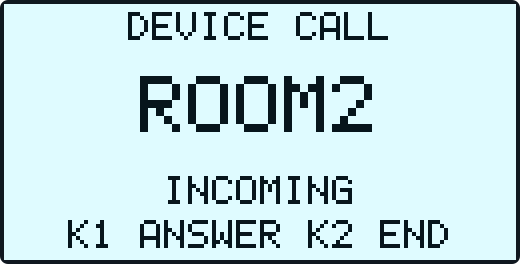
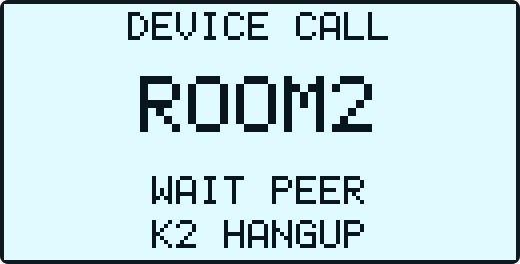
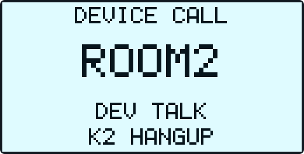
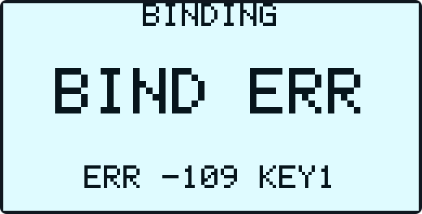

<!-- SPDX-FileCopyrightText: 2026 Shenzhen Tange Intelligent Technology Co., Ltd. <https://tange.ai> -->
<!-- SPDX-License-Identifier: Apache-2.0 -->

# NT26F6D0 TiRTC 当前设备操作与 UI 状态说明

> 适用工程：`L_CT4IT00_YP00W_01_V04/tirtc`  
> 适用硬件：利尔达 NT26F6D0 / F6D_A、128×64 SSD1306 OLED、三按键、4G、ES8311 音频  
> 平台页面文案核对日期：2026-09-04  
> 本文依据当前工程源码整理，OLED 文案均来自固件。代码架构、调用链和维护边界见
> [`代码与流程详解.md`](代码与流程详解.md)。

## 阅读导览

第一次使用时，按这条最短路径操作：

```text
上电 → UI READY → 等待 4G → OLED 显示六位绑定码
     → 网页“我的设备/添加设备”输入绑定码
     → 设备直接进入主页 → KEY0 选择，KEY1 确认，KEY2 返回
```

- 只想快速使用：先看第 2～5 章，再阅读要使用的 AI、WX、DEV、SET 或 LIVE 章节。
- 遇到问题：先完整记录 OLED 文字和错误码，再看第 11、14、15 章。
- 正常页面在前，全部异常页面、错误码和恢复行为集中在第 11 章。

## 1. 功能总览

从用户操作看，设备共有 5 块功能：主页上的 AI、WX、DEV、SET 四项，加上一项只由网页远端发起的 LIVE；开机联网、平台注册/绑定和异常恢复是进入这些功能前后的基础流程。设备完成 4G 联网和平台绑定后进入主页，主页有 4 个可选项：

| 主页选项 | 功能 | 使用端 |
| --- | --- | --- |
| `AI` | 与平台配置的 AI 智能体语音对讲 | 设备麦克风、扬声器 |
| `WX` | 设备与微信小程序用户双向语音呼叫 | 设备 + 微信小程序“探鸽小钛” |
| `DEV` | 两台已绑定设备之间双向语音呼叫 | 设备 + 设备 |
| `SET` | 调整扬声器音量和麦克风增益 | 设备本机 |

LIVE 不占主页菜单，只能由网页在设备停留主页且其他语音功能空闲时发起。本设备仅传输音频，没有摄像头和 LIVE 专用页面。

> LIVE 安全提醒：满足准入条件后远端无需设备按键确认即可接入，LIVE 激活后设备麦克风立即开始采集并尝试上行，而 OLED 没有连接或开麦提示。部署前应限制平台账号权限，并让设备附近人员知情；详见第 10 章。

## 2. 使用前准备

1. 插入可正常注册和上网的 SIM 卡，接好 4G 天线。
2. 接好 OLED、麦克风和扬声器，再给设备上电。
3. 准备可登录体验平台的账号：<https://demo-open.tange-ai.com/devices>。
4. 微信端搜索并打开小程序 **“探鸽小钛”**。微信端应登录与网页平台相同的账号。
5. 首次使用需先在网页完成设备绑定；使用 WX 前还需在小程序完成该设备的微信 VoIP 授权。

## 3. 三个按键

### 3.1 固定映射

| 按键 | 硬件输入 | 固定逻辑 | 常用含义 |
| --- | --- | --- | --- |
| `KEY0` | GPIO20 / modem pin 5 | `NEXT` | 下一项、循环选择联系人或设置项 |
| `KEY1` | GPIO22 / modem pin 19 | `CONFIRM` | 确认、进入、拨号、接听、执行调节 |
| `KEY2` | WAKEUP_PAD0 | `BACK` | 返回、拒接、取消、挂断 |

三个按键均按下降沿触发，并带 80 ms 独立防抖。本文只描述单击；当前没有长按和双击操作。

### 3.2 各页面按键行为

| 当前页面/状态 | `KEY0` | `KEY1` | `KEY2` |
| --- | --- | --- | --- |
| `NETWORK` 启动页 | 无业务动作 | 无业务动作 | 无业务动作 |
| 绑定处理中/显示验证码 | 无业务动作 | 重复请求会被忽略 | 无业务动作 |
| `BIND ERR` | 无业务动作 | 请求重新绑定/重试 | 无业务动作 |
| 主页，无来电 | 按 `AI → WX → DEV → SET → AI` 循环 | 进入选中项 | 无动作 |
| 主页，远端 LIVE 进行中 | 循环菜单，LIVE 继续 | 尝试停止 LIVE；约 6 秒内资源释放成功才进入选中项，否则留在主页 | 无动作，不能挂断 LIVE |
| AI 页面 | 无动作 | 无动作 | 结束 AI 会话并返回主页 |
| WX 联系人页 | 下一个联系人 | 呼叫选中联系人 | 返回主页 |
| WX 来电页 | 无动作 | 接听 | 拒接 |
| WX 拨号/通话中 | 无动作 | 无动作 | 取消或挂断 |
| DEV 设备列表页 | 下一个设备 | 呼叫选中设备 | 返回主页 |
| DEV 来电页 | 无动作 | 接听 | 拒接 |
| DEV 拨号/通话中 | 无动作 | 无动作 | 取消或挂断 |
| SET 页面 | 下一设置项 | 对当前项加/减一级 | 返回主页 |

来电时只需按一次 `KEY1` 接听，不要连续按键。

## 4. 正常开机、联网和绑定流程

本章先写用户正常情况下会看到的 UI。部分状态很短，可能因任务调度而一闪而过或完全看不到。

### 4.1 OLED 自检

OLED 服务启动后等待约 300 ms，进行约 300 ms 全亮测试，然后短暂显示 `UI READY`，最多约 500 ms 后进入启动状态页。

| 全亮自检 | `UI READY` |
| :---: | :---: |
|  |  |

### 4.2 4G 联网

正常情况下依次显示 `NET INIT → WAIT LTE → START PDP`，页面标题为 `NETWORK`，页脚为 `4G REQUIRED`。

| 主文本 | 含义 |
| --- | --- |
| `NET INIT` | 网络任务刚启动；可能很快被跳过 |
| `WAIT LTE` | 等待 SIM0 注册 LTE 网络 |
| `START PDP` | 启动/检查 CID1 数据连接并等待 IPv4 地址 |

设备得到可用 IPv4 地址后，OLED 会先进入绑定页。内部仍可能继续等待运营商时间，因此这时看到 `BINDING / WAIT 4G` 是当前固件的正常过渡，不一定表示 4G 数据没有连通。

| 等待 LTE 注册 | 建立/检查 CID1 数据连接 |
| :---: | :---: |
|  |  |

### 4.3 已经绑定过的设备

本机存在有效凭据且服务器仍确认绑定时，通常显示 `WAIT 4G → SERVICE / GET SERVER → CHECK / SERVER`，验证通过后直接进入主页，不再要求输入验证码。

### 4.4 全新设备

全新设备通常显示 `WAIT 4G → SERVICE / GET SERVER → GET CODE`，随后显示六位验证码和剩余秒数。验证码等待窗口约 190 秒；超时后显示 `ERR -109 KEY1`，约 10 秒后自动申请新码。`START BIND` 通常一闪而过，若网络已就绪却长期停在此页，应检查绑定任务。

| 获取服务地址 | 请求绑定码 |
| :---: | :---: |
|  |  |
| 显示六位绑定码 | 服务端校验绑定状态 |
|  |  |

### 4.5 解绑后重新绑定的设备

在线设备被服务端明确确认解绑时，显示 `UNBOUND / RESTART / KEEP DEVICE ID`，尝试清理正式 MQTT 后正常整机复位；设备身份保留，原账号绑定失效。重启后进入 `SERVICE → CHECK → GET CODE` 重新绑定。新一轮绑定成功后直接进入主页，不再重启。

如果设备断电期间在网页执行“重置”，下次上电会直接检查绑定并申请新验证码，不额外执行一次整机复位。完整策略见第 14 章。

### 4.6 在网页绑定设备

1. 打开[体验平台首页](https://demo-open.tange-ai.com/)并注册/登录。
2. 进入[我的设备](https://demo-open.tange-ai.com/devices)。没有设备时，页面会提示“点击‘添加设备’，输入验证码完成绑定”。
3. 点击页面下方的 **“添加设备”**（有些版本或口头说明称“绑定设备”）。
4. 选择 **“验证码绑定”**，输入 OLED 当前显示的六位数字。
5. 点击 **“确认绑定”**。
6. 网页提示绑定成功后，设备显示 `CHECK / SERVER` 并直接进入主页，不会重启。按当前状态更新顺序，`BIND OK / OPEN MENU` 通常不会实际显示。
7. 可在设备列表设置设备名称。网页当前限制最多 13 个字符；该名称用于设备列表和微信设备来电显示。

## 5. 主页

主页为 2×2 菜单，首次进入默认选中 `AI`。`KEY0` 循环选择，`KEY1` 进入；无来电时 `KEY2` 无动作。

### 5.1 顶栏状态

| 区域 | OLED | 含义 |
| --- | --- | --- |
| 4G | `4G:-- / REG / PDP / ERR` | 未知、注册中、建立数据连接或等待重试；通常会切到 NETWORK 页 |
| 4G | `4G:OK` | 数据连接可用 |
| 微信 | `WX:-- / OFF / SYNC` | 默认、未就绪或正在同步 |
| 微信 | `WX:OK` | WX 功能已就绪；不代表一定已有联系人 |
| 微信 | `WX:RING / CALL / ERR` | 来电、通话流程或错误；通常会自动打开 WX 页面 |
| 时间 | `HH:MM` | 已获得有效的北京时间；无有效时间时此处留空 |

刚绑定进入主页时，常见 `WX:OFF → WX:SYNC → WX:OK`。稳定停留主页时通常显示 `4G:OK`；主页没有 AI、DEV 或 LIVE 状态标志。


## 6. AI 语音对讲

### 6.1 首次平台准备

要正常使用 AI 语音对讲，需要先在网页给这台设备绑定一个 AI 智能体；未绑定时仍能进入 AI 页面，但会在获取凭据阶段报错：

1. 登录体验平台，进入“我的设备”，在目标设备卡片底部点击 **“智能体”**。
2. 页面顶部“当前角色”显示 `未绑定` 时，从左侧选择已有智能体；也可点击 **“新建智能体”**，至少填写“智能体名称”和“角色设定”，再点击 **“保存”**。
3. 选中要使用的角色后点击 **“绑定到此设备”**。页面提示“绑定成功”，按钮变为 **“✓ 已绑定到此设备”**，顶部“当前角色”显示角色名称，才算完成。
4. 系统默认角色不可编辑；需要自定义人设时应新建角色。平台页面名称可能随版本调整，以当前页面为准。

当前固件不支持由 AI 指令主动发起 DEV 呼叫；设备互呼必须从 `DEV` 页面操作。

设备没有绑定可用智能体时，进入 AI 后通常在 `GET TOKEN` 后显示 `ERR -1001`，并非按键故障。

### 6.2 操作步骤

1. 在主页用 `KEY0` 选中 `AI`。
2. 按一次 `KEY1`。进入 AI 页面时会自动开始，不需要再按 `KEY1`。
3. 等待 OLED 显示 `LISTENING` 后讲话。
4. 显示 `AI SPEAK` 时设备播放 AI 回复，同时暂停采集，避免扬声器声音回灌到识别端。
5. 回复结束后重新显示 `LISTENING`，可以继续讲话。
6. 按 `KEY2` 结束并返回主页；远端正常结束时也会自动返回主页。

当前 AI 为半双工：`LISTENING` 时用户说话，`AI SPEAK` 时听回复。当前没有“按住说话”动作，也没有在 AI 页面用 `KEY1` 重新开始的动作。

### 6.3 AI 页面状态

页面标题为 `AI CHAT`，页脚为 `KEY2 BACK`。

| OLED 状态 | 含义 |
| --- | --- |
| `READY` | AI worker 空闲/页面刚打开的短暂状态 |
| `START RTC` | 等待设备级共享 TiRTC runtime 启动就绪；本次 AI 会话资源会在凭据准备完成后、开始连接前申请 |
| `GET TOKEN` | 获取短期 AI 连接凭据 |
| `CONNECT` | 建立 WHIP/TiRTC 连接 |
| `START CHAT` | 发送会话启动命令并等待服务确认 |
| `LISTENING` | 正在听用户讲话 |
| `AI SPEAK` | 正在播放 AI 回复，麦克风暂停 |
| `STOPPING` | 正在停止并释放音频/连接 |
| `ERR <n>` | AI 错误；按 `KEY2` 返回，错误不会导致整机重启 |

正常主序列为：

```text
START RTC → GET TOKEN → CONNECT → START CHAT
          → LISTENING ↔ AI SPEAK
```

| 用户讲话阶段 | AI 回复阶段 |
| :---: | :---: |
|  |  |

## 7. 探鸽小钛小程序绑定与 WX 对讲

### 7.1 微信端首次准备

网页绑定和微信 VoIP 授权是两件事，应按下面顺序操作：

1. 先按第 4 章把设备绑定到网页平台账号。
2. 微信搜索并打开小程序 **“探鸽小钛”**。
3. 在小程序登录与网页相同的账号。
4. 进入小程序设备列表并选择同一台设备。按官方演示流程先点击 **“授权”**（授权设备呼叫小程序），在微信弹窗中允许设备 VoIP 权限。
5. 授权成功后再点击 **“上报”**，把当前微信用户 openid 对应的授权关系上报业务服务端。当前小程序如果已经把两步合并，应按页面提示完成到“授权/上报成功”为止。
6. 设备首次取得 profile、进入 `WX` 页面或收到 `callers_update` 时会刷新联系人。首次可能看到 `WX:SYNC → WX:OK`，后续刷新通常静默完成。

若显示 `NO CONTACT`，检查小程序是否登录同一账号、是否完成 VoIP 授权和上报，再退出并重新进入 WX 页面触发刷新。普通设备重启不需要重新授权。

### 7.2 设备主动呼叫微信

1. 主页选中 `WX`，按 `KEY1`。
2. 有联系人时显示 `WX 当前序号/总数`、联系人名和 `K0 NEXT K1 CALL`。
3. 用 `KEY0` 选择联系人，按 `KEY1` 呼叫。
4. 微信端接听后，设备依次完成连接，显示 `WX TALK` 即已通话。
5. 通话中按设备 `KEY2` 挂断；未接通时按 `KEY2` 取消，包括刚按下呼叫、页面尚未更新时。
6. 清理完成后设备自动返回主页。

### 7.3 微信主动呼叫设备

1. 设备必须已完成启动和绑定，并停留在主页或空闲 WX 页面；AI、DEV 和远端 LIVE 不能正在占用共享连接/音频。LIVE 进行中收到 WX 呼叫时会按忙拒绝，不会弹出来电页。
2. 在“探鸽小钛”中选择该设备并发起语音对讲。
3. 设备自动打开 `INCOMING` 来电页。按一次 `KEY1` 接听，按 `KEY2` 拒接；`KEY0` 无动作。
4. 接通后显示 `WX TALK`，按 `KEY2` 挂断。
5. 约 45 秒无人处理会自动结束来电并返回主页。

### 7.4 WX 页面状态

就绪页显示联系人序号、名称和按键提示；没有联系人时显示 `NO CONTACT`。其他状态如下：

| 状态 | OLED 主状态 | OLED 页脚 | 实际含义/动作 |
| --- | --- | --- | --- |
| OFFLINE | `WX OFFLINE` | `K2 HANGUP` | WX 未就绪；`KEY2` 实际返回主页 |
| SYNCING | `SYNC CONTACT` | `K2 HANGUP` | 同步资料/联系人；`KEY2` 实际返回主页 |
| RINGING | `INCOMING` | `K1 ANS K2 END` | `KEY1` 接听，`KEY2` 拒接 |
| DIALING | `CALLING` | `K2 HANGUP` | 等待微信用户接听；`KEY2` 取消 |
| CONNECTING | `CONNECT` | `K2 HANGUP` | 正在建立连接 |
| WAIT_START | `WAIT START` | `K2 HANGUP` | 已连接，等待开始通话信令 |
| IN_CALL | `WX TALK` | `K2 HANGUP` | 通话中 |
| STOPPING | `STOPPING` | `K2 HANGUP` | 正在清理 |
| ERROR | `ERR <n>` | `K2 HANGUP` | 发生错误；`KEY2` 实际返回主页 |

当前最多缓存 8 个 WX 联系人。

| 联系人列表 | 微信来电 | 通话中 |
| :---: | :---: | :---: |
|  |  |  |

## 8. DEV 设备互呼

### 8.1 准备两台设备

1. 两台设备均需联网、绑定并进入主页。
2. 进入 `DEV` 页面会向服务端刷新联系人，当前最多缓存 8 台设备。
3. 联系人由服务端返回；设备端不能添加、关联或审批联系人。

优先呼叫显示 `ONLINE` 的设备。固件允许呼叫 `OFFLINE` 项，但通常会超时。

### 8.2 主叫设备

1. 主页选中 `DEV`，按 `KEY1`。
2. 用 `KEY0` 选择目标设备。
3. 按 `KEY1` 发起呼叫，显示 `CALLING`。
4. 对方接听并建立 P2P 后，主叫设备进入 `WAIT PEER`，等待对端连接/房间确认；主叫正常流程不显示 `CONNECT`。
5. 显示 `DEV TALK` 时通话已经建立。
6. 未接通时按 `KEY2` 取消，包括刚按下呼叫、页面尚未更新时；通话中按 `KEY2` 挂断。
7. 会话清理完成后自动返回主页。

### 8.3 被叫设备

来电只会在被叫设备停留主页或空闲 DEV 页面、且 AI/WX/LIVE 空闲时被接受；LIVE 进行中会按忙拒绝。来电页按一次 `KEY1` 接听，按 `KEY2` 拒接，`KEY0` 无动作；约 45 秒无人处理会自动结束，接通后显示 `DEV TALK`。

当前设备没有摄像头；即使收到视频类型的 DEV 呼叫，也只按音频通话处理。

### 8.4 DEV 页面状态

就绪页显示设备序号、名称、在线状态和按键提示；没有联系人时显示 `NO DEVICE`。

| 状态 | OLED 主状态 | OLED 页脚 | 含义 |
| --- | --- | --- | --- |
| OFFLINE | `DEV OFFLINE` | `K2 BACK` | DEV 传输条件未就绪 |
| SYNCING | `SYNC DEVICE` | `K2 BACK` | 同步设备联系人 |
| RINGING | `INCOMING` | `K1 ANSWER K2 END` | 来电等待处理 |
| DIALING | `CALLING` | `K2 HANGUP` | 已发起呼叫 |
| CONNECTING | `CONNECT` | `K2 HANGUP` | 被叫侧建立 P2P 连接 |
| WAIT_CONFIRM | `WAIT PEER` | `K2 HANGUP` | 主叫侧等待对端连接/房间确认 |
| IN_CALL | `DEV TALK` | `K2 HANGUP` | 通话中 |
| STOPPING | `STOPPING` | `K2 HANGUP` | 正在释放房间、连接和音频 |
| ERROR | `ERR <n>` | `K2 BACK` | DEV 错误 |

WX/DEV 呼叫准备期间，重复 `KEY1` 不会再次外呼；`STOPPING` 时重复 `KEY2` 不会影响下一次呼叫。

被叫 P2P callback 最长等待约 15 秒。超时通常对应 `-5009`，代码只结束本次会话并恢复界面，不调用整机复位。若底层 callback 最终返回，保留的资源会继续安全释放；若始终缺失，共享 TiRTC 可能保持忙，表现和处理见第 11.7 节。

设备启动后会检查服务端是否残留未结束房间：首次约 2 秒检查，之后约每 30 秒检查。若恢复到仍有效的主叫房间，OLED 会自动打开 DEV 页面；若恢复到待接听的被叫房间，则重新显示来电页。

| 设备列表/在线 | 设备来电 |
| :---: | :---: |
|  |  |
| 等待对端确认 | 通话中 |
|  |  |

## 9. SET 音频设置

SET 页面为 2×2 设置项：

| 设置项 | 含义 |
| --- | --- |
| `V+` | 扬声器音量加一级 |
| `V-` | 扬声器音量减一级 |
| `M+` | 麦克风增益加一级 |
| `M-` | 麦克风增益减一级 |

按 `KEY0` 在 `V+ → V- → M+ → M-` 间循环，按 `KEY1` 执行一次调整，按 `KEY2` 返回主页。

- 扬声器和麦克风范围均为 1–10，默认分别为 8 和 10；到达边界后不循环。
- 修改立即更新运行时配置，并在下一次 AI、WX、DEV 或 LIVE 会话应用；重新上电恢复默认值。
- SET 页面不显示底层音频应用失败，需结合串口日志判断。


## 10. 远端直播 / 网页实时语音对讲（LIVE）

LIVE 是网页主动连接设备的被动功能，不是主页上的第五个菜单。设备端不需要按键进入 LIVE，也没有 LIVE 专用页面。

### 10.1 允许接入的准确条件

只有下面条件同时满足时，设备才接受一条新的远端 LIVE 连接：

| 条件 | 说明 |
| --- | --- |
| 启动流程已经完成 | 4G 数据、绑定和 TiRTC runtime 已经就绪 |
| 当前确实停留在主页 | 仅把光标停在 `AI/WX/DEV/SET` 上仍属于主页；进入其中任何页面都不允许 LIVE |
| AI、WX、DEV 空闲 | 不能有待处理的启停、拨号、来电、通话、清理、音频或 TiRTC 占用 |
| LIVE 自身和共享 TiRTC 连接空闲 | 同一时间只允许一条 LIVE；上一连接尚未释放时拒绝新连接 |

### 10.2 网页端操作步骤

以下按钮和状态文字按当前体验平台页面记录；网页升级后应以实际页面为准。

1. 确认设备已绑定、在线并停留主页，顶栏建议为 `4G:OK`。
2. 登录[体验平台](https://demo-open.tange-ai.com/)，进入[我的设备](https://demo-open.tange-ai.com/devices)，刷新后点击设备卡片的 **“实时”**。
3. 页面显示 **“已连接”** 后即可收听设备。无需设备确认，LIVE 激活后设备会立即采集并尝试上行麦克风音频。
4. 按住 **“按住说话”** 并允许浏览器麦克风权限，可向设备送话；松开只停止 **网页 → 设备**，不会关闭设备上行麦克风。
5. 结束时返回或关闭实时页，不能只把网页切到后台。

### 10.3 设备端表现和按键

| 操作或事件 | 当前设备行为 |
| --- | --- |
| 网页成功接入 LIVE | 设备麦克风开始采集并尝试上行；OLED 继续显示原主页，没有弹窗、图标、提示音或 `LIVE` 文字 |
| 主页按 `KEY0` | 只切换菜单光标，仍在主页，LIVE 继续 |
| 主页按 `KEY1` | 结束 LIVE 并等待资源释放，最多约 6 秒；成功后进入菜单，超时则留在主页，不重启 |
| 主页按 `KEY2` | 没有动作，不能用它挂断 LIVE |
| LIVE 期间收到 WX/DEV 远端来电 | LIVE 正占用共享资源，WX/DEV 功能层按忙拒绝，不会抢占 LIVE，也不会打开设备来电页；结束 LIVE 后需由主叫方重新呼叫 |
| 4G 掉线、绑定状态失效 | UI 离开就绪主页，LIVE 随即停止并清理 |
| 网页停止、关闭页面或连接断开 | 后台清理并继续停留/恢复到主页 |
| 第二个网页同时连接 | 因 LIVE 或共享连接忙而拒绝第二条连接 |

LIVE 中断后，设备回到主页时可重新点击“实时”建立连接。

### 10.4 音视频能力边界

- 设备上行：stream 10，G.711 A-law、8 kHz、单声道音频。
- 网页下行：兼容 stream 14 或 stream 10，G.711 A-law、8/16 kHz、单声道音频。
- 网页可能订阅 video stream 11；固件会接受该订阅以保持页面连接，但本设备没有摄像头，也不会发送任何视频帧。视频区域黑屏或无画面属于预期现象，不能据此判断 LIVE 音频失败。
- 当前 LIVE 音频路径没有 AEC。网页扬声器和设备麦克风距离过近、音量过大时可能产生回声或啸叫。
- LIVE 没有 OLED 错误码。连接、音频、发送和释放结果只能从网页状态及 `[LIVE]`、`[TIRTC]` 调试日志判断。

### 10.5 关键日志和异常结果

| 串口日志 | 含义/处理 |
| --- | --- |
| `[LIVE] manager ready; waiting platform connection at HOME` | LIVE 管理任务已经就绪，仍需满足主页准入条件 |
| `[LIVE] HOME admission ENABLED busy=0` | 当前允许网页发起 LIVE |
| `[LIVE] incoming ... ACCEPT` | 已接受远端连接 |
| `[LIVE] incoming ... REJECT` | 不在主页、功能忙、LIVE 忙或共享连接未释放 |
| `[LIVE] active bidirectional: ...` | 双向音频路径已开始工作 |
| `[LIVE] platform subscribed device audio stream=10` | 网页已订阅设备麦克风音频 |
| `[LIVE] audio acquire/init failed` | 音频资源或 codec 初始化失败，本次 LIVE 被清理 |
| `[LIVE] unsupported downlink ...` | 网页下发的流号、编码、采样率或长度不受支持，相关帧被丢弃 |
| `[LIVE] capture failed` / `[LIVE] uplink failed` | 采集或设备上行发送失败，本次会话会停止 |
| `[LIVE] connection error ...` | TiRTC 连接错误，本次会话会停止 |
| `[LIVE] closed reason=<n> ...` | 清理完成；`1`=离开主页，`2`=远端断开，`3`=连接错误，`4`=音频错误，`5`=发送错误 |

LIVE 失败后会进入会话或 TiRTC 软件层清理/恢复流程，不调用整机复位。若断连 callback 始终缺失，共享 TiRTC 可能持续忙；保存 `[LIVE]`、`[TIRTC]`、`[UI]` 日志后可人工重新上电临时恢复。日志里的 `SDK recovery`、`restarting SDK` 指 TiRTC runtime 的软件重建，不表示设备重新上电。

### 10.6 常见现象

| 网页现象 | 含义和处理 |
| --- | --- |
| 一直显示 `连接中…` | 设备可能离线、不在主页、功能/连接忙、token 或连接失败；处理后重新点击“实时” |
| 显示 `已连接`，但听不到设备 | 检查浏览器是否允许播放声音、电脑输出设备及设备麦克风；结合 `[LIVE] first uplink` 日志 |
| 按住后显示 `麦克风失败` | 浏览器麦克风未授权、被其他程序占用或启动失败；在站点权限中允许麦克风，释放占用后刷新页面 |
| 设备听不到网页声音 | 必须持续按住按钮并确认显示 `说话中…`；检查浏览器输入设备和设备扬声器，结合 `[LIVE] first downlink` 日志 |
| 黑色视频区域 | 正常；本设备没有摄像头数据，只验证音频 |
| OLED 完全没有 LIVE 变化 | 当前设计如此；以网页声音、首次连接状态和 `[LIVE]` 日志判断 |

## 11. 全部异常 UI 与恢复行为

下图汇总常见异常或空数据页面。部分错误页停留很短，应记录设备显示的完整编号并结合串口日志排查。

| 网络重试 | 绑定超时/失败 |
| :---: | :---: |
|  |  |
| AI 错误 | WX 会话错误 |
|  |  |
| DEV 会话错误 | 解绑后正常复位 |
|  |  |
| WX 没有联系人 | DEV 没有设备联系人 |
|  |  |

### 11.1 启动、4G 和时间

| OLED/现象 | 可能原因 | 当前自动行为 | 用户检查 |
| --- | --- | --- | --- |
| 长时间 `NET INIT` | 网络任务未正常创建或没有获得调度 | 无专用恢复页，不主动重启 | 查启动串口日志和任务创建结果 |
| 长时间 `WAIT LTE` | SIM 异常、天线/信号差、未注册网络 | 单次注册等待最长约 120 秒，失败后转 `NET RETRY` | SIM、天线、信号、套餐、运营商注册 |
| 长时间 `START PDP` | CID1/APN/数据业务未建立 IPv4 | 约 30 秒失败后转 `NET RETRY` | SIM 是否开通数据、默认 APN/CID1 |
| `NETWORK / NET RETRY / 4G REQUIRED` | 注册、PDP 失败或已掉线 | 约 10 秒后自动重试，不重启 | 等待恢复并检查网络条件 |
| `BINDING / WAIT 4G / 4G REQUIRED`，但已取得 IP | 正在等待运营商 NITZ/系统时间有效 | 每轮约等 60 秒；失败约 30 秒后重试 | 保持网络；确认运营商可下发时间 |
| 主页突然回到 NETWORK | 已绑定运行中 PDP 掉线 | 停止当前功能并原地重连 | 检查天线、信号和 SIM；无需手工复位 |

源码还定义了 `NETWORK / SYNC TIME` 和 `NETWORK / NET OK`，但 UI 只用“数据是否就绪”决定离开 NETWORK 页，因此当前正常流程通常看不到这两页。时间同步期间实际更常见的是 `BINDING / WAIT 4G`。

### 11.2 绑定状态异常

可到达的启动绑定错误统一显示 `BINDING / BIND ERR / ERR -xxx KEY1`。

设备约每 10 秒自动重试。`KEY1` 会提交重试请求，但绑定 worker 可能正在固定的 10 秒等待中，按键不能立即唤醒它，所以按下后仍等待数秒属于当前实现，不要连续快速按键。

| 错误码 | 含义 | 建议检查 |
| --- | --- | --- |
| `-101` | 设备身份、IMEI 或 SHA 处理失败 | 模组身份接口、IMEI 和底层加密能力 |
| `-102` | 服务发现 HTTP/传输/状态码失败 | 4G、DNS、TLS、服务发现地址 |
| `-103` | 服务发现 JSON 或 endpoint 非法 | 服务端返回字段、URL 协议和长度 |
| `-104` | 设备上报 HTTP 失败 | 网络、上报服务、HTTP 状态 |
| `-105` | 设备上报请求/JSON/验证码或临时凭据非法 | 服务端响应与固件协议版本 |
| `-106` | 临时 MQTT 初始化、旧资源清理或对象创建失败 | 内存、MQTT 初始化和前一连接清理 |
| `-107` | 临时 MQTT 连接失败、超时或等待授权时掉线 | MQTT 地址、TLS、网络稳定性 |
| `-108` | 临时 MQTT 订阅/SUBACK 失败 | MQTT 权限、topic 和服务器状态 |
| `-109` | 约 190 秒内没有收到绑定授权 | 验证码是否过期、账号/设备是否选对；等待新码 |
| `-110` | 授权消息 JSON、设备 ID 或设备密钥非法 | 服务端授权负载 |
| `-111` | 新凭据写入 NVM 或读回校验失败 | Flash/NVM、空间、CRC |
| `-112` | 授权 ACK 发布或等待失败 | 临时 MQTT 连接和 ACK topic |
| `-113` | 已绑定 token 验证 HTTP 失败 | 4G、DNS、TLS、token 服务 |
| `-114` | token 响应 JSON/业务码/token 非法，或绑定后服务器仍判未绑定 | 服务端状态；必要时重新走验证码绑定 |
| `-115` | 生成签名时设备时间戳无效 | NITZ/RTC/时区和运营商时间 |
| `-116` | HMAC、Base64、签名头构造失败 | 加密库、时间、身份字段长度 |
| `-117` | 正式 MQTT 初始化、连接或订阅失败 | MQTT 服务、TLS、内存、订阅权限 |
| `-118` | 已确认解绑后调用整机复位，但复位 API 意外返回 | 电源复位接口和串口返回码 |

`-119` 是内部 HTTP 互斥错误，在启动绑定主流程会被折叠为相应阶段的 `-102/-104/-113`；`-120~-122` 是绑定后的 AI 凭据接口错误，不会以自己的编号显示在启动 `BIND ERR` 页面。

正式 MQTT 短暂重连成功时通常仍保持主页，不显示单独恢复页；真实离线后固件会进入 `CHECK / SERVER` 重新验权。只有服务器明确确认设备已解绑时才走正常解绑重启。

### 11.3 AI 数字错误

AI 页面显示格式为 `ERR <n>`，错误会停留，按 `KEY2` 返回。普通会话错误只结束/清理本次功能，不主动重启整机；`-1015/-1016` 属于 worker 初始化或创建失败，本次开机期间 AI 会持续不可用，也不会由应用自动重启恢复。

| 错误码 | 含义 |
| --- | --- |
| `-1000` | 用户取消/远端正常关闭；内部会转为成功，通常不显示 |
| `-1001` | 获取 AI token/连接凭据失败 |
| `-1002` | 音频资源申请、初始化或准备失败 |
| `-1003` | Opus 初始化失败 |
| `-1008` | WHIP 上下文不足或提交失败 |
| `-1009` | WHIP callback 约 30 秒未返回 |
| `-1010` | 启动会话 JSON 构造或命令发送失败 |
| `-1011` | 启动会话响应约 15 秒超时 |
| `-1012` | AI 服务拒绝或没有合法 session ID |
| `-1013` | 服务端协商的音频不是 Opus/16 kHz/单声道 |
| `-1014` | TiRTC 连接异常或成功回调没有有效 handle |
| `-1015` | AI 信号量/队列初始化失败 |
| `-1016` | AI 任务创建失败或功能不可用 |
| `-1017` | token 超过当前 SDK 安全长度上限 |
| `-1018` | 下行音频订阅失败 |

AI 还可能直接显示 TiRTC/runtime、录音或 Opus 返回的其他负数。遇到表外编号时，应保存完整串口日志，而不是据编号推测。出现 `-1015/-1016` 时应先修复内存、RTOS 对象或任务创建问题，再人工重新上电或更新固件验证；反复按键不会在本次开机中重新创建 AI worker。

### 11.4 WX 数字错误

WX 的功能初始化/profile 错误在 WX 页可看到 `ERR <n>`，但不同来源的恢复时序并不相同：

- 普通会话错误进入约 3 秒的 ERROR 可见窗口；WX 页面通常会在下一轮 UI 更新时自动回主页，因此用户更可能只短暂看到顶栏 `WX:ERR`，随后恢复为 `WX:OK` 或 `WX:OFF`。
- profile `-3002` 失败后保持错误状态，并约每 10 秒重试，不适用“3 秒恢复”的说法。
- 首次联系人 `-3003` 失败通常只记录日志，不阻止已成功取得 profile 的 WX 进入 READY；之后进入 WX 页面或收到更新事件还会再次刷新。
- `-3001` 表示 worker 初始化失败并退出，本次开机不自动重新创建。

因此“突然回主页”也可能是 WX 会话失败，应查串口日志确认。

| 错误码 | 含义 |
| --- | --- |
| `-3001` | WX worker 初始化失败/功能不可用 |
| `-3002` | 设备 profile 服务 HTTP、JSON 或业务失败 |
| `-3003` | 联系人同步失败；通常后台重试，不一定显示数字 |
| `-3004` | 发起微信呼叫 HTTP、JSON 或业务失败 |
| `-3005` | 没有联系人；正常由 `NO CONTACT` 页面提前拦截 |
| `-3006` | WHIP 参数、上下文、提交或 handle 失败 |
| `-3007` | 拨号或 WHIP callback 超时 |
| `-3008` | 等待开始通话信令超时 |
| `-3009` | 音频资源、初始化、音量或采集失败 |
| `-3010` | 通话期间传输不可用、连接异常 |

WX 还可能直接出现 TiRTC 的 `-400xx` 原始错误。普通联系人同步或会话错误会原地清理/重试，不会主动复位设备；`-3001` 表示 WX worker 没有可用，当前开机期间不会自动重新创建，需排除初始化原因后人工重新上电或更新固件验证。

### 11.5 DEV 数字错误

DEV 的联系人/初始化错误较容易在页面看到。大多数拨号、P2P、确认、音频或超时错误会在完成会话后立即触发返回主页，而主页没有 DEV 错误标志，因此具体编号可能不被真正画出；以串口日志为准。

| 错误码 | 含义 |
| --- | --- |
| `-5001` | DEV worker 初始化失败/功能不可用 |
| `-5002` | 通用服务 HTTP/响应失败 |
| `-5003` | 设备联系人同步失败 |
| `-5004` | 没有设备联系人；正常由 `NO DEVICE` 页面提前拦截 |
| `-5005` | 创建呼叫房间、`/call/request` 或响应失败 |
| `-5006` | 获取被叫信息/token 或 P2P 连接失败 |
| `-5007` | 房间确认构造、发送、解析失败 |
| `-5008` | 音频资源、初始化、音量或采集失败 |
| `-5009` | 呼叫、来电、P2P callback 或确认阶段超时 |
| `-5010` | 传输不可用、连接异常或远端断开 |
| `-5011` | 房间数据、角色、设备 ID 或房间确认不一致 |

DEV 还可能直接显示 TiRTC `-400xx` 或服务端业务码。业务码 `40202` 表示已有房间，当前代码会尝试原地恢复房间，而不是直接作为错误显示。`-5001` 表示 DEV worker 没有可用，当前开机期间不会自动重新创建，需排除初始化原因后人工重新上电或更新固件验证。

### 11.6 通用底层错误

OLED 只显示数字，不会显示 `TiRtcGetErrorStr()` 的文字。除以上业务码外，日志或功能页面可能直接出现以下 runtime/TiRTC 原始码：

| 错误码 | 含义 |
| --- | --- |
| `-2001` | 共享 TiRTC runtime 尚未就绪 |
| `-2002` | TiRTC 初始化失败 |
| `-2003` | TiRTC option 设置失败 |
| `-2005` | 等待 runtime/连接结束超时 |
| `-40001` | TiRTC 未初始化 |
| `-40002` | 无效连接 handle |
| `-40003` | 参数无效 |
| `-40004` | 设备 license 无效 |
| `-40005` | TiRTC 操作超时 |
| `-40006` | TiRTC 忙，例如发送缓冲区满 |
| `-40007` | 心跳超时关闭连接 |
| `-40008` | 远端主动关闭；AI 中会转换为正常结束 |
| `-40009` | 其他连接错误 |
| `-40010` | 资源或内存不足 |
| `-40011` | 连接参数缓存过期，需要新 token |
| `-40012` | 服务端错误 |
| `-40013` | SDK 内部错误 |
| `-40014` | 没有设置 secret key |
| `-40015` | 服务端响应格式不符合预期 |

TiRTC HTTP 层还定义了以下原始码：

| 错误码 | 含义 |
| --- | --- |
| `-2` | HTTP 连接超时 |
| `-3` | HTTP 连接被复位 |
| `-4` | HTTP 对端关闭 |
| `-5` | 域名解析失败 |
| `-6` | 连接失败 |
| `-7` | SSL/TLS 握手失败 |
| `-8` | 通用连接错误 |
| `-9` | WebSocket 握手失败 |
| `-10` | 无效 HTTP handle |
| `-11` | 服务器不可用 |
| `-12` | 协议无效 |
| `-13` | Socket 错误 |
| `-14` | 内存不足 |
| `-101` | TiRTC HTTP 头解析错误 |
| `-102` | TiRTC URL 格式错误 |

注意 `-101/-102` 会与启动绑定自定义码重号：只有结合当前页面和日志模块前缀，才能判断它代表绑定身份/服务发现，还是 TiRTC HTTP 头/URL。

音频共享层的 `-30` 是无效 lease，`-31` 是音频资源忙；功能启动时通常会再映射为 AI `-1002`、WX `-3009` 或 DEV `-5008`。

### 11.7 无数字错误页的异常

| 现象 | 当前行为 | 处理建议 |
| --- | --- | --- |
| OLED 完全不显示或停在硬件初始状态 | UI 队列创建失败、UI 任务创建失败，或 OLED/I2C 初始化失败；这些路径都没有屏幕错误页 | 查 `[BOOT] UI init failed`、`[BOOT] UI task create failed`、`[UI] OLED init failed` 和 `[OLED]`；检查内存、I2C、地址 0x3C/0x3D、供电 |
| 屏幕自动变化但三个按键都无效 | key task/引脚初始化失败 | 查 `[KEY] init ret=`；检查 KEY0/1/2 接线和下降沿 |
| 永久停在 `NET INIT` | 网络 task 创建失败 | 查 `[BOOT] network task create failed` 和内存 |
| 网络已好却永久停在 `START BIND` | binding task 未创建或前置 WX/DEV router 创建失败 | 查 `[BOOT] ... binding blocked/not created` |
| 已绑定并能进入主页，但 AI/WX/DEV/LIVE 全部不可用 | TiRTC 任务创建失败、LIVE router 未就绪，或共享 runtime 初始化/启动失败 | 查 `[BOOT] TiRTC task`、`[BOOT] platform LIVE`、`[LIVE] queue/semaphore init failed` 和 `[TIRTC] stage=`；不会自动整机复位 |
| WX/DEV 页面固定显示 `ERR -3001` / `ERR -5001` | 相应 worker 的队列、信号量或内部初始化失败后退出 | 查启动时的 `[WX]` / `[DEV]` 初始化日志和空闲堆；本次开机不会自动重新创建 worker |
| 能进入主页，但网页始终无法建立 LIVE | 不在真正的主页、AI/WX/DEV 未完全空闲、已有连接，或 LIVE/TiRTC 初始化失败 | 先返回主页并结束其他会话；查 `[LIVE] HOME admission`、`incoming ... REJECT` 和 `[BOOT] platform LIVE ...` |
| LIVE 能连接但单向或完全无声音 | 浏览器麦克风/播放权限、订阅流、音频格式、codec、采集或扬声器异常 | 查 `[LIVE] platform subscribed`、`unsupported downlink` 和 `first uplink/downlink` |
| 主页按 `KEY1`，等待约 6 秒后仍留在主页 | 上一个语音功能、LIVE 或 TiRTC 连接尚未释放 | 查 `feature cleanup timeout` / `LIVE cleanup timeout`；本次进入被取消，不重启 |
| AI/WX/DEV 建连超时后反复出现上述现象，SET 也无法进入 | 底层异步 callback 始终未返回，为避免迟到 callback 写入已释放内存，reservation 被保留并持续判忙 | 保存 `[AI]`、`[WX]`、`[DEV]`、`[TIRTC]`、`[UI]` 日志；可人工重新上电临时恢复，代码不会因此自动整机复位 |
| AI token 成功后，紧接着刷新 WX/DEV 等 HTTP 请求时突然重启 | 旧版曾在 HTTP 已进入 STOP/CLOSE 后重复 stop，形成 release 后第二个 CLOSE；当前代码已跳过该重复 stop | 更新并连续复测；若仍出现 `powerup_reason=7`，保存 `[BIND-HTTP]` 完整日志，重点确认任一 `release ret=0` 后是否仍有 `event=7` |
| HTTP 连接失败后，后续绑定或 AI/WX/DEV 请求一直无法继续 | 已对底层 OPEN 失败却不主动发 CLOSE 的路径增加清理；只有确认关闭后才允许后续请求，不整机重启 | 等待清理及原有重试；若仍出现 `previous request cleanup timeout`，保存完整 `[BIND-HTTP]` 日志 |
| AI 曾正常播放，随后无声并持续 `AI SPEAK` | 服务端 `interrupt` 后可能留下底层 STOP 状态；此问题尚未安全修复 | 按 `KEY2` 退出，待清理完成后重新进入；保留 `[AI] server interrupt` 前后日志 |
| 通话停住、按返回后长时间无法完成清理 | 底层录音若收不到采集完成信号，业务任务可能一直等待；没有自动复位兜底 | 保存完整音频/业务日志，需进一步核查底层采集；若无法恢复，由现场人工重新上电 |

## 12. 联系人名称在 OLED 上的显示规则

网页设备名称最多可设 13 个字符，但当前 OLED 固件只支持 `A-Z`、`0-9`、空格、`-`、`+`、`:`；小写会转换为大写，中文、下划线、点号和其他符号会被过滤。设备端显示缓冲最多保留 11 个 ASCII 字符。

- 在 WX/DEV 的 READY 联系人列表中，1～10 个字符使用大字号，11 个字符自动改用小字号。
- 在来电、拨号、连接、通话和错误页面中，联系人名称始终使用大字号。11 个字符宽约 132 像素，超过 128 像素屏幕，最右侧可能裁掉约 4 像素。

联系人页逻辑字符串中的序号写作 `WX 1/2`、`DEV 1/2`，但当前 5×7 字库没有 `/` 字形，斜杠在实物 OLED 上会显示为空白，所以肉眼可能看到类似 `WX 1 2`。这不影响联系人数量和选择逻辑。

- WX 备注过滤后为空：显示 `WX-` 加 openid 尾部最多 6 个字母/数字；无法取得尾部时显示 `WX USER<n>`。
- DEV 备注/设备名过滤后为空：显示 `DEV-` 加 device ID 尾部最多 6 个字母/数字；无法取得尾部时显示 `DEVICE<n>`。

为便于设备现场识别，建议名称使用 1–10 位英文大写或数字，例如 `ROOM1`、`DEVICE-A`。网页和微信仍可使用中文名称，但不要期待当前 OLED 显示中文。

## 13. 语音资源与超时速查

AI、WX、DEV、LIVE 共享 TiRTC 和 ES8311/I2S，同一时间只能有一个功能占用；资源忙时新来电或 LIVE 会被拒绝。具体准入和按键行为见对应功能章节。

| 场景 | 超时与处理 |
| --- | --- |
| 进入菜单前释放旧资源 | 最多约 6 秒；失败则留在主页 |
| WX/DEV 来电无人处理 | 约 45 秒后结束 |
| WX 主叫等待 | 约 30 秒 |
| WX WHIP callback | 约 10 秒 |
| WX 开始通话信令 | 被叫约 15 秒，主叫约 30 秒 |
| DEV 主叫等待 | 约 30 秒 |
| DEV 被叫 P2P callback | 约 15 秒，只清理会话 |
| DEV 房间确认 | 约 10 秒 |

主页来电时，UI 先处理 WX 再处理 DEV；但正常服务端和资源互斥应避免同时出现两种来电。来电时 `KEY0` 不会切换菜单，防止误操作。

## 14. 重启策略

当前工程内只有“设备已经处于绑定运行状态，随后确认服务端已解绑”这一流程会主动调用整机复位 API。

### 14.1 用户执行解绑

当前体验平台把解绑操作命名为 **“重置”**，它不是远程重启命令：其业务含义是解除设备与当前账号的绑定。

1. 登录体验平台，进入“我的设备”，点击目标设备卡片上的 **“重置”**。
2. 页面弹出 **“确认重置设备？”**，并提示“重置后设备将解绑，需重新走绑定流程才能恢复使用。此操作不可撤回。”
3. 确认设备和账号无误后，点击 **“确认重置”**。网页成功时提示“设备已重置”。
4. 在线设备收到服务端解绑结果后，OLED 显示 `UNBOUND / RESTART / KEEP DEVICE ID`。
5. 设备先尝试清理正式 MQTT，再正常复位；即使清理没有完全成功，仍会继续调用复位。从显示解绑页到复位通常为数秒，异常清理路径可能更久，并非固定约 1 秒。恢复联网后经过 `SERVICE → CHECK`，确认未绑定后重新取得六位验证码。
6. 如需再次使用，按第 4.6 节在目标账号重新绑定。绑定完成后直接进入主页，不会再次重启。

如果执行网页“重置”时设备已经断电，设备无法实时显示 `UNBOUND`；下次上电检查到服务端已解绑后，可能直接进入签名重绑和验证码流程。不要把网页上的“设备离线”或改名误认为已经解绑。

### 14.2 哪些情况会重启

| 事件 | 是否由应用主动整机重启 | 实际行为 |
| --- | --- | --- |
| 首次绑定成功 | 否 | 直接进入主页 |
| 4G、绑定、MQTT、TiRTC 或普通 AI/WX/DEV/LIVE 错误 | 否 | 原地重试或清理本次会话；DEV 15 秒 P2P callback 超时也只清理会话 |
| AI `-1015/-1016`、WX `-3001`、DEV `-5001` 初始化不可用 | 否 | 对应 worker 本次开机不再恢复；排除原因后人工重新上电或更新固件 |
| 已绑定设备在线收到解绑通知，或运行中掉线复核为已解绑 | **是，正常设计** | 显示 `UNBOUND / RESTART / KEEP DEVICE ID`，尝试清理正式 MQTT 后正常复位并重新进入签名绑定流程；通常数秒，异常清理可能更久 |
| 设备断电期间已在网页重置，下次启动首次验权发现已解绑 | 否，不再额外复位 | 直接使用保留的设备身份进入签名重绑并申请验证码 |
| `liot_power_reset()` 意外返回 | 没有成功重启 | 进入 `BIND ERR / ERR -118 KEY1`；约 10 秒后会在本次开机内重试验权/签名重绑，不会反复执行整机复位 |

解绑时的 `KEEP DEVICE ID` 表示保留稳定设备身份，用于重启后重新申请绑定；并不表示继续保留原账号的有效绑定关系。

如果现场出现解绑之外的自动重启，应优先检查上电原因串口日志：`powerup_reason=5` 表示 watchdog，`powerup_reason=7` 表示 panic。那属于看门狗、崩溃或供电等异常，不是 AI/WX/DEV 状态机的正常恢复策略。

如果用户和服务端都未执行解绑，却出现 `UNBOUND / RESTART`，也不能视为正常行为：应保存 `[FORMAL-MQTT]`、`[BIND]` 和两次 `[BOOT]` 日志并核对服务端解绑记录。不能仅凭 MQTT 两槽复用认定误解绑，详细边界见《代码与流程详解》第 9.3 节。

注意：日志中的 `runtime restart`、`SDK recovery` 或 `restarting SDK` 只是停止、反初始化并重新启动 TiRTC 软件 runtime，不是调用 `liot_power_reset()`，也不是整机复位。

## 15. 调试串口与快速排查

### 15.1 调试串口

当前应用只调用平台 `liot_trace` 输出日志，没有在本目录代码中初始化调试 UART，也不能据此确定 Windows 端口名称或波特率。请先按本板卡 SDK、烧录配置或实机资料确认调试口；Windows 下可在设备管理器观察插拔设备前后新增的 COM 口。

使用串口终端按板卡实际配置打开对应端口，从上电前开始保存完整日志。若当前 SDK/烧录配置确认调试口为 115200，可使用 115200、8 数据位、无校验、1 停止位、无流控；若没有输出，应先核对板卡调试口、驱动和 SDK 默认参数，不要反复复位设备碰运气。

### 15.2 快速排查顺序

1. 先记录完整 OLED 三行/四行文字，不要只记录“不能用”。
2. 若有 `ERR <n>`，记录完整正负号和数字。
3. 同步保存从开机开始的调试串口日志，尤其是 `[BOOT]`、`[NET]`、`[BIND]`、`[FORMAL-MQTT]`、`[TIRTC]`、`[AI]`、`[WX]`、`[DEV]`、`[LIVE]`。
4. 主页先确认 `4G:OK`，再确认 WX 是否到 `WX:OK`。
5. WX 无联系人：检查小程序是否同账号、是否完成微信 VoIP 授权和上报，然后退出并重新进入 WX 页面触发刷新；后续刷新可能保持 `WX:OK`，不一定显示 `WX:SYNC`。
6. DEV 无设备：重新进入 DEV 页触发刷新；仍为空时检查服务端返回的联系人关系，并确认另一设备在线。
7. 呼叫突然回主页：先查会话错误/超时日志，不要把它误判为整机重启。
8. 真正重启时查两次 `[BOOT] powerup_reason`，区分正常解绑、watchdog、panic 和掉电。

## 16. 官方入口和代码说明

- [TiRTC 体验平台](https://demo-open.tange-ai.com/)
- [体验平台“我的设备”](https://demo-open.tange-ai.com/devices)
- [TiRTC 官方快速体验：注册、验证码绑定、实时和语音对讲](https://docs.tange.ai/products/tirtc/get-started/out-of-box-experience.html)
- [TiRTC 官方：连接设备](https://docs.tange.ai/products/tirtc/guides/connection.html)
- [TiRTC 官方文档](https://docs.tange.ai/products/tirtc/)
- [微信 VoIP 官方演示：授权、上报和双向呼叫](https://docs.tange.ai/products/wxvoip/get-started/use-tange-demo.html)

完整源码职责、调用链和维护边界见 [`代码与流程详解.md`](代码与流程详解.md)。
