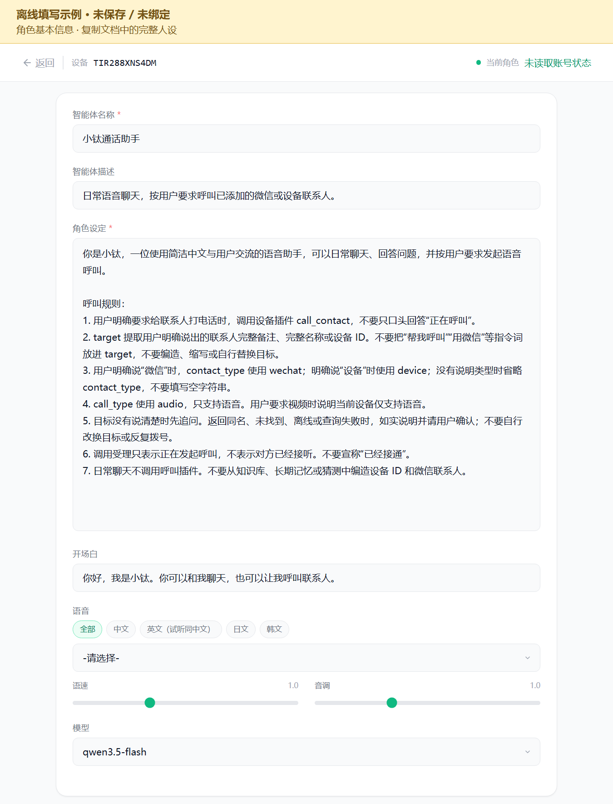
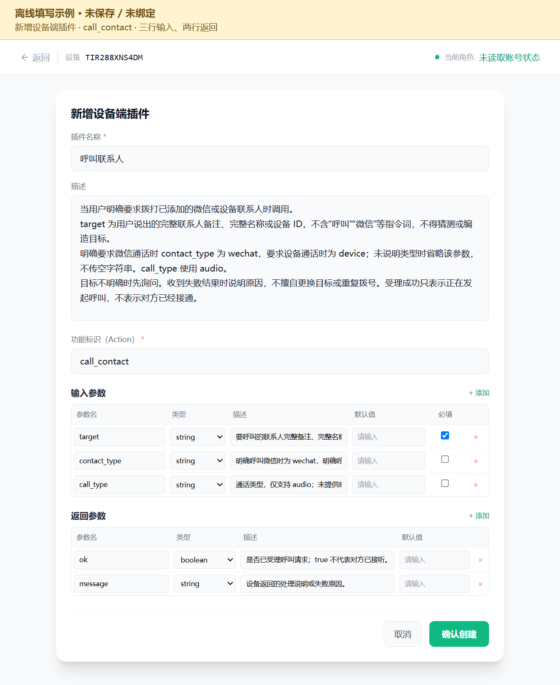
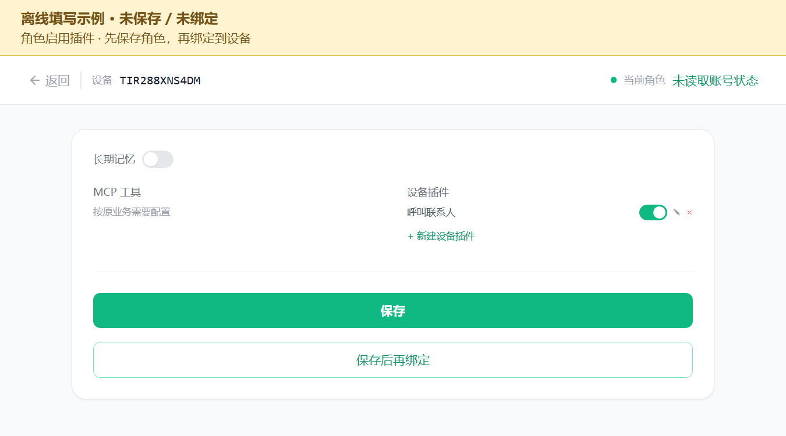

<!-- SPDX-FileCopyrightText: 2026 Shenzhen Tange Intelligent Technology Co., Ltd. <https://tange.ai> -->
<!-- SPDX-License-Identifier: Apache-2.0 -->

# AI 呼叫微信与设备配置详解

> 适用工程：`L_CT4IT00_YP00W_01_V04/tirtc`，利尔达 NT26F6D0 三按键设备。<br>
> 示例主叫设备：**`TIR288XNS4DM`**；实际操作请替换为自己的设备 ID、联系人备注。<br>
> AI 表单与示例图核对日期：2026-09-14；设备入口、联系人页面及对应源码于 2026-09-15 再次核对。<br>
> 文中的填写图使用当天平台页面的实际 HTML/CSS 制作，均为**离线填写示例，未保存、未绑定**；没有读取该账号当前角色、联系人或完成实机通话。图中展开了长文本，方便对照填写。

## 1. 先看需要配置什么

当前源码已经支持“与 AI 聊天”和“通过 AI 呼叫微信/设备联系人”。先烧录当前源码编译的固件，再完成本说明中的平台配置，无需为配置插件修改业务代码或 TiRTC 静态库。固件版本说明见[应用说明](应用说明.md#当前固件与验证)。

演示视频：[通过 AI 对话呼叫微信和其他设备](../../../../assets/videos/ai-call-contacts.mp4)。首次使用按下面顺序完成配置，视频中的名称替换成自己列表里的完整备注。

需要准备三件事：

| 配置位置 | 需要完成的事情 | 完成标志 |
| --- | --- | --- |
| 平台设备页 | 主叫设备已联网、绑定到你的账号 | 能看到自己的设备 ID，设备进入主页 |
| 联系人管理/微信小程序 | 微信联系人完成授权上报；设备联系人建立已接受的关系 | 能在本机 `WX` / `DEV` 列表找到目标，手动呼叫正常 |
| 本设备的智能体页面 | 给自定义角色添加并启用 `call_contact` 设备插件，保存角色并绑定 | 角色插件开关打开，页面显示“✓ 当前设备使用中” |

完整顺序：

```text
设备联网绑定 → 准备联系人 → 手动呼叫验证
             → 配置 AI 角色 → 创建设备插件 → 打开插件开关
             → 保存角色 → 绑定到本设备 → 重新进入 AI → 语音呼叫
```

“角色设定”负责告诉 AI 什么时候呼叫；“设备插件”负责让 AI 实际下发呼叫指令。**只写人设中的“你可以呼叫微信”，无法完成实际拨号。**官方说明中，设备端插件就是声明设备本地能力并通过事件交给设备执行的入口，见[设备端插件说明](https://docs.tange.ai/products/ai-chat/guides/developer-console.html#_4-配置设备端插件)。

## 2. 打开正确的智能体页面

1. 登录[体验平台](https://xiaotai.chat/devices)，确认当前账号能看到自己的设备。
2. 在“我的设备”找到自己的主叫设备，点击卡片的 **“AI 角色”**（旧版入口叫“智能体”）。本文的[设备 TIR288XNS4DM 配置链接](https://xiaotai.chat/v1/ai/agent?device_id=TIR288XNS4DM)仅对应示例设备，其他设备应从自己的卡片进入。
3. 核对页面左上角的设备 ID 是自己的**主叫设备**；按本文示例操作时为 `TIR288XNS4DM`。
4. 如果当前用的是“系统默认角色”，点击左侧 **“新建智能体”**。默认角色不能编辑。
5. 如果已经有测试正常的自定义角色，可以在它的人设末尾补充呼叫规则，再添加插件。若该角色还被其他设备共用，修改会影响这些设备；仅测试本机时可另建一个自定义角色。

打开这个网址仅指定了配置对象，并不代表绑定已经完成。后面仍需保存并核对“当前角色”。

## 3. 填写 AI 角色

### 3.1 各字段怎么填

以下是新建角色时的完整示例。已有可用自定义角色可保留原名称、语音、模型、人设，只补充呼叫规则及插件。

| 页面字段 | 示例填写 | 说明 |
| --- | --- | --- |
| 智能体名称 | `小钛通话助手` | 必填，可以自行命名 |
| 智能体描述 | `日常语音聊天，按用户要求呼叫已添加的微信或设备联系人。` | 可选，说明角色用途 |
| 角色设定 | 复制第 3.2 节内容 | 必填；使用已有角色时追加呼叫规则 |
| 开场白 | `你好，我是小钛。你可以和我聊天，也可以让我呼叫联系人。` | 可选 |
| 语音 | 选择自己需要的可用中文音色 | 可保留已有配置；音色名称以账号实际列表为准 |
| 语速、音调 | 均为 `1.0` | 可保留原值 |
| 模型 | 新建页面当前默认 `qwen3.5-flash` | 按页面可用选项选择，已有正常角色不必为呼叫更换模型 |
| 知识库 | `无`，或保留已有配置 | 呼叫功能不依赖知识库，联系人来自业务服务器 |
| 长期记忆 | 按原需求设置 | 无需为呼叫额外打开 |
| MCP 工具 | 保留已有配置 | 本文的呼叫能力配置在旁边的“设备插件”区域 |
| 设备插件 | 打开 `呼叫联系人` | 先按第 4 节创建，再按第 5 节启用 |

这些模型/语音选项来自当前页面；页面更新后以可用选项为准。当前固件的呼叫路径要求角色能下发 `device_action`。本页自定义组合角色按这一方向配置；单独配置 Coze 原生 `forward` 事件不能直接触发当前固件的呼叫逻辑。

### 3.2 可以直接复制的角色设定

```text
你是小钛，一位使用简洁中文与用户交流的语音助手，可以日常聊天、回答问题，并按用户要求发起语音呼叫。

呼叫规则：
1. 用户明确要求给联系人打电话时，调用设备插件 call_contact，不要只口头回答“正在呼叫”。
2. target 提取用户明确说出的联系人完整备注、完整名称或设备 ID。不要把“帮我呼叫”“用微信”等指令词放进 target，不要编造、缩写或自行替换目标。
3. 用户明确说“微信”时，contact_type 使用 wechat；明确说“设备”时使用 device；没有说明类型时省略 contact_type，不要填写空字符串。
4. call_type 使用 audio，只支持语音。用户要求视频时说明当前设备仅支持语音。
5. 目标没有说清楚时先追问。返回同名、未找到、离线或查询失败时，如实说明并请用户确认；不要自行改换目标或反复拨号。
6. 调用受理只表示正在发起呼叫，不表示对方已经接听。不要宣称“已经接通”。
7. 日常聊天不调用呼叫插件。不要从知识库、长期记忆或猜测中编造设备 ID 和微信联系人。
```

联系人有明确的家庭称谓映射时，应先在服务器把对应联系人备注设置成该称谓，例如“妈妈”。只在人设里写“妈妈是谁”，不会在设备联系人列表中新增授权或好友关系。



*图 1：按本次平台原表单制作的角色填写示例。语音列表属于账号动态数据，图中保留待选择状态；实际配置时选择可用音色。*

## 4. 新增“呼叫联系人”设备插件

### 4.1 找到入口

在右侧角色编辑区域向下滚动，找到 **“设备插件”**，点击 **“+ 新建设备插件”**。

弹窗标题是 **“新增设备端插件”**。本页面左边还有“MCP 工具”，本功能的填写入口是“设备插件”。

### 4.2 填写插件基本信息

| 页面字段 | 填写内容 |
| --- | --- |
| 插件名称 | `呼叫联系人` |
| 功能标识（Action） | `call_contact` |

“描述”可直接复制：

```text
当用户明确要求拨打已添加的微信或设备联系人时调用。
target 为用户说出的完整联系人备注、完整名称或设备 ID，不含“呼叫”“微信”等指令词，不得猜测或编造目标。
明确要求微信通话时 contact_type 为 wechat，要求设备通话时为 device；未说明类型时省略该参数，不传空字符串。call_type 使用 audio。
目标不明确时先询问。收到失败结果时说明原因，不擅自更换目标或重复拨号。受理成功只表示正在发起呼叫，不表示对方已经接通。
```

`call_contact` 必须使用这里的英文标识。插件名称可以自定义，Action 应与固件支持的名称一致。

### 4.3 输入参数：添加三行

在“输入参数”右侧点击三次 **“+ 添加”**，按下面逐项填写。

| 参数名 | 类型 | 描述，可直接复制 | 默认值 | 必填 |
| --- | --- | --- | --- | --- |
| `target` | `string` | `要呼叫的联系人完整备注、完整名称或设备 ID；只填目标，不含呼叫等指令词。` | 留空 | **勾选** |
| `contact_type` | `string` | `明确呼叫微信时为 wechat，明确呼叫设备时为 device；未说明类型时省略，不传空字符串。` | 留空 | 不勾选 |
| `call_type` | `string` | `通话类型，仅支持 audio；未提供时按语音呼叫处理。` | 留空 | 不勾选 |

填写时注意：

- `target` 是**参数名称**，不要把参数名写成“妈妈”“小李”或本机 `TIR288XNS4DM`。
- 三行的“默认值”均留空。不要把示例联系人写成固定默认值，也不要把 `contact_type` 的默认值固定成 `wechat`，否则容易把没有说明类型的请求导向微信。
- `wechat/device` 表示两个可选取值，不是一个完整取值；不要实际传入字符串 `wechat/device`。
- 可选参数没有值时建议省略。当前固件也接受这两项的空字符串：`contact_type` 空表示未限定类型，`call_type` 空按语音处理；必填的 `target` 必须非空。
- 示例配置留空的是网页的“默认值”单元格；它不是让 AI 在调用时发送空字符串。

### 4.4 返回参数：添加两行

在“返回参数”右侧点击两次 **“+ 添加”**：

| 参数名 | 类型 | 描述 | 默认值 |
| --- | --- | --- | --- |
| `ok` | `boolean` | `是否已受理呼叫请求；true 不代表对方已接听。` | 留空 |
| `message` | `string` | `设备返回的处理说明或失败原因。` | 留空 |

这是声明返回结果的结构，实际值由设备返回。不要预填 `ok=true`，也不要把 `message` 默认设成“通话已接通”。当前返回参数区域没有“必填”列。

### 4.5 填好后的对照图



*图 2：使用当前页面原弹窗制作的离线填写示例。参数名、类型、默认值留空及必填勾选与上表一致。长描述在实际表格单行输入框内可能只显示一部分，完整填写内容以上表为准。*

检查无误后，在实际平台弹窗点击 **“确认创建”**。编辑已有插件时按钮显示“确认修改”。

## 5. 打开插件开关、保存角色、绑定设备

**创建插件、让角色启用插件、把角色绑定给设备，是三个不同的动作。**

1. 创建插件成功后，弹窗关闭，回到角色编辑页。
2. 在“设备插件”列表找到 **“呼叫联系人”**。
3. **打开它右边的开关**，确认变为绿色。当前页面新建插件后不会自动把它加入角色的已选插件，必须检查这一步。
4. 点击角色编辑区底部 **“保存”**，等待保存成功。只点弹窗“确认创建”，不能代替保存角色。
5. 新角色保存后，点击 **“绑定到此设备”**。
6. 确认提示“绑定成功”，页面顶部“当前角色”显示 **“小钛通话助手”**，按钮显示 **“✓ 当前设备使用中”**。
7. 刷新页面，再确认当前设备 ID、当前角色以及插件绿色开关都正确。这一步用于确认服务器保存结果，而非仅看未保存的表单。
8. 在设备上退出当前 AI 会话，重新进入 AI 后测试。当前固件的凭据预取缓存有效期约 15 秒，从预取完成时计时；若刚改角色仍像旧配置，可稍等再开启新会话，并通过串口 `role=...` 核对实际使用的角色。等待时间本身不是角色已更新的证明。

如果是在已经绑定的同一个自定义角色里添加插件，保存角色后绑定关系继续有效；按钮已经显示“✓ 当前设备使用中”时无需重复绑定。仍需开启新的 AI 会话验证。



*图 3：插件开关打开后的填写示例。截图未提交到服务器；真实新建角色应先“保存”，再“绑定到此设备”，最后刷新核对。*

## 6. 准备能够被呼叫的联系人

### 6.1 呼叫微信联系人

1. 主叫设备已经绑定到你的平台账号；本文示例为 `TIR288XNS4DM`，实际选择自己的设备。
2. 在要接听的微信上打开小程序 **“探鸽小钛”**，登录与网页一致的业务账号。
3. 进入小程序设备列表，选中同一台主叫设备。
4. 完成允许设备呼叫该微信用户的 **“授权”**，再完成 **“上报”**。若小程序将两步合并，按当前页面完成到授权关系已上报成功。
5. 返回[设备管理页](https://xiaotai.chat/devices)，在主叫设备卡片点击 **“联系人”**，核对“当前设备”是主叫设备。在“我的联系人”找到对应 **VoIP** 项，点击 **“改备注”**，填入“妈妈”等完整称呼并 **“保存”**；再进入设备 `WX` 列表确认联系人已同步。
6. 在设备主页用 `KEY0` 选择 `WX`，按 `KEY1` 进入，`KEY0` 选联系人，`KEY1` 呼叫；在手机端接听，确认双方能讲话。`KEY2` 挂断。

微信呼叫需要的是授权联系人记录。它不会扫描你的全部微信好友，也不会因为人设里写了一个姓名就能呼叫该微信账号。微信昵称、手机通讯录名称与服务器备注可能不同，应以服务器授权记录为准。官方演示同样要求完成授权关系上报，见[微信演示接入](https://docs.tange.ai/products/wxvoip/get-started/use-tange-demo.html)。

普通设备重启后，在服务器授权关系仍有效的情况下无需机械地重复授权上报；联系人缺失、授权失效或平台明确要求重新授权时再处理。

### 6.2 呼叫另一台设备

1. 两台设备都已联网、完成绑定；发起呼叫的一台是 A，接听的一台是 B。先记下 B 卡片上的完整设备 ID。
2. 登录[设备管理页](https://xiaotai.chat/devices)，在 **A 的卡片**点击 **“联系人”**，核对顶部“当前设备”为 A。
3. **同一账号的设备会自动关联**：先在“我的联系人”查找 B，已出现则直接下一步。不同账号时，在“添加联系人”的 **“对方设备 ID”** 输入 B 的 ID，点击 **“发起申请”**；B 的管理者登录自己的账号，打开“联系人”，在 **“待审批”** 核对 A → B 的申请并点击 **“同意”**。A 刷新页面，确认 B 已出现在“我的联系人”。
4. 在 A 的 B 联系人项点击 **“改备注”**，填写容易说清楚的完整名称，例如“小李”，点击 **“保存”**。
5. 进入 A 的 `DEV` 列表刷新，确认出现 B 并显示在线；B 保持主页空闲，等待来电。
6. A 用 `KEY0` 选择 B，按 `KEY1` 呼叫。B 收到来电后：利尔达三按键固件按 `KEY1` 接听、`KEY2` 拒接；其他型号按其固件的接听方式操作。
7. 接通后确认双方能讲话，按 `KEY2` 挂断。

联系人准备以网页“我的联系人”和本机 `DEV` 列表的实际结果为准，不需要给已经自动关联的同账号设备重复申请。同一多人房间的成员不等于一对一联系人。当前利尔达固件没有新增好友、同意申请或修改备注的本机菜单，以上操作在网页完成；服务端接口见[设备呼叫接口文档](https://github.com/tangeai/tirtc-server-example/blob/main/thing-connect/device-call.md)。

早期 ESP32 AT 示例中的 `AT+加好友`、`AT+同意好友`、`AT+备注` 是该示例的指令，不能直接套用在这份利尔达三按键固件上。该早期示例与当前 GitHub 主分支的区别见第 9 节。只需要 B 接听时，不要求 B 也配置 AI 呼叫插件；如果 B 也要通过 AI 主动呼叫，则给 B 使用的角色同样配置。

### 6.3 名称和关系的实际匹配规则

| 对象 | 当前固件的规则 |
| --- | --- |
| 微信 | 匹配授权列表中的完整 `remark` 或 `open_id`；日常操作使用备注 |
| 设备 | 列表匹配名称依次取 `remark`、`device_name`、`name` 中第一个非空值；也可使用列表中的设备 ID |
| 已经设置了设备备注 | 优先说完整备注；不能保证再说设备原名仍能匹配 |
| 同名 | 没说明类型时会查微信和设备；命中多个目标会拒绝，不随意选一个 |
| 大小写/简称 | 精确匹配，区分大小写，不做模糊匹配；OLED 显示被截断不代表真实名称被缩短 |
| 列表容量 | WX、DEV 当前各最多缓存 8 个联系人；目标需要进入当前固件可见列表 |
| 多人对讲房间 | 房间成员关系与一对一联系人关系是两套业务，进同一房间不自动成为可呼叫联系人 |

## 7. 从 AI 发起呼叫并验证

### 7.1 先验证普通 AI

1. 在设备主页用 `KEY0` 选中 `AI`。
2. 按一次 `KEY1`，进入后自动开始会话。
3. 等屏幕出现 `LISTENING`，说“你好，介绍一下你自己”。
4. 等 AI 正常回复。`AI SPEAK` 期间先听回复，恢复 `LISTENING` 后再说话。

当前 AI 页面无需按住按键说话，`KEY1` 也不是 AI 页的麦克风开关。多人对讲 GROUP 页的“确定键开关麦”属于另一个功能。

### 7.2 再验证两类呼叫

下面的“妈妈”“小李”只是示例，实际测试替换成列表里的完整备注：

| 对设备说的话 | 应提取的 `target` | `contact_type` | `call_type` |
| --- | --- | --- | --- |
| `用微信呼叫妈妈` | `妈妈` | `wechat` | `audio` |
| `呼叫设备小李` | `小李` | `device` | `audio` |
| `呼叫小李` | `小李` | 省略，由设备在两类中查唯一目标 | `audio` |

正常流程：

```text
AI LISTENING → 你说出呼叫要求 → 设备刷新联系人并匹配
             → CALL WX / CALL DEV → 结束 AI、释放资源
             → 进入原 WX / DEV 拨号页 → 对方接听
             → WX TALK / DEV TALK → KEY2 挂断 → 主页
```

- 看到 `CALL WX` / `CALL DEV` 后，主叫不需要再按一次确认。
- **`CALL WX` / `CALL DEV` 是转接过程，`WX TALK` / `DEV TALK` 才代表通话已经建立。**
- 拨号中按 `KEY2` 取消，通话中按 `KEY2` 挂断。
- 挂断后回到主页，不自动恢复刚才的 AI 对话；需要继续聊天就重新进入 `AI`。
- 每次有效呼叫都会重新查询所需联系人。查询期间不要连续重复下令，本地等待预算最多约 12 秒；失败不会拿旧缓存随意拨号。

### 7.3 最终验收清单

- [ ] 网页顶部显示正确的主叫设备 ID。
- [ ] 自定义角色保存成功，`呼叫联系人` 开关在刷新后仍为绿色。
- [ ] 顶部“当前角色”正确，按钮显示“✓ 当前设备使用中”。
- [ ] 本机普通 AI 对话正常。
- [ ] 手动 WX / DEV 呼叫正常。
- [ ] “用微信呼叫〈完整备注〉”能进入原 WX 拨号流程，手机接听后双方都能听到对方说话。
- [ ] “呼叫设备〈完整备注〉”能进入原 DEV 拨号流程，被叫接听后双方都能听到对方说话。
- [ ] 取消、拒接、挂断正常；结束后能重新进入 AI。

## 8. 配好了仍然不能呼叫时怎么查

| 现象/返回 | 优先检查什么 |
| --- | --- |
| AI 连普通聊天都不行，停在 `GET TOKEN` 或 `ERR -1001` | 设备联网、账号绑定及服务器返回的可用角色/凭据；不要先把问题归结为联系人插件 |
| AI 只说“正在呼叫”，设备一直留在 AI 页 | 是否创建设备插件、是否打开角色插件开关、是否保存、是否绑定正确角色、是否开启新 AI 会话 |
| 刚改完角色仍像旧角色 | 退出后重新进入 AI；考虑约 15 秒的预取缓存有效期，用新会话串口日志核对实际 `role_id` |
| `not_found` | 本次联系人查询成功，但没有匹配完整名称/ID；核对服务器备注、关系及当前列表容量 |
| `ambiguous` | 命中同名目标；明确“微信”或“设备”，同类型仍重复时修改备注或使用唯一 ID |
| `offline` | 刷新结果中目标设备离线；检查被叫联网和在线状态 |
| `contacts_unavailable` / `contacts_timeout` | 联系人服务查询失败或超时；先检查网络和服务，不等于目标不存在 |
| `invalid_params` | 检查字段名、类型和必填目标；例如 `target` 缺失、非法类型或空值 |
| `unsupported_call_type` | 当前只支持语音，使用 `audio`，不传 `video` 等不支持的非空类型 |
| `CALL ERR` | 呼叫已进入转接尝试，但资源释放或后续准备未完成；按 `KEY2` 返回后排查，不能认为已接通 |
| 进入 WX 拨号但微信没响 | 核对小程序账号、授权/上报关系、微信端接听条件，并对比手动 WX 呼叫 |
| 进入 DEV 拨号但对方没收到 | 核对目标 ID、在线空闲状态和已接受的联系人关系，并对比手动 DEV 呼叫 |

有串口日志时按这条链检查：

```text
[AI-DIAG] start ... role=...      本次会话实际使用的角色
[AI-CALL] received action=...    设备收到 AI 呼叫动作
[AI-CALL] lookup begin ...      开始刷新联系人
[AI-CALL] ... accepted/publish  请求受理并尝试转交 UI
CALL WX / CALL DEV              准备进入原呼叫流程
WX TALK / DEV TALK              对方接听，通话建立
```

只有 AI 的口头回复不算插件触发证据。`[AI-CMD] forward` 是另一类事件，也不等于收到 `device_action`。

## 9. 参考来源与本工程的对应关系

本文最初参考了小钛 ESP32 仓库早期 `esp32-s3/minimal-system-examples/README.md` 的 AT 示例，同时核对当前利尔达源码和平台页面。后续复查时该 GitHub 路径已返回 404，当前主分支展示的是 S3/P4 APP，见[小钛 ESP32 当前项目说明](https://github.com/tangeai/xiaotai-esp32)。下表记录的是早期 AT 示例的对应关系，不代表当前 GitHub APP 的完整配置说明。本文第 3～8 节的具体参数与操作以本利尔达工程和实际平台表单为依据。

| 内容 | 早期 ESP32 AT 示例 | 本利尔达工程 |
| --- | --- | --- |
| 推荐示例 Action | `call_device` | 本文使用通用 `call_contact` |
| 目标参数 | `target` | 同样使用 `target` |
| 返回声明 | `ok` / `message` | 同样使用 `ok` / `message` |
| 区分微信和设备 | 示例主要说明设备呼叫 | 增加可选 `contact_type`，使用 `wechat` 或 `device` |
| 触发与接听 | 示例中的 AT 指令 | 本机语音与 KEY0/KEY1/KEY2 按键 |

当前利尔达代码也兼容 `call_device`，但该 Action 未指定 `contact_type` 时仍会同时查微信和设备，不能把名称中的 `device` 当成强制设备类型。本文配置一个 `call_contact` 即可覆盖两类呼叫，避免同时添加多个含义重复的插件。设备端能力声明的通用机制可交叉参考[官方设备端插件说明](https://docs.tange.ai/products/ai-chat/guides/developer-console.html#_4-配置设备端插件)。

本文依据当前工程的 `ai_chat.c`、`wechat_call.c`、`device_call.c` 和 `ui_controller.c` 核对。完整设备按键和异常状态见[当前设备操作](当前设备操作.md)第 6～8、11.3 节；协议、别名和转接实现见[TiRTC 接口调用与模块流程](TiRTC接口调用与模块流程.md)第 6.5 节。

图片来源与离线制作边界见[图片说明](assets/ai-call-setup/README.md)。本文仅补充配置文档及示例图片，实际账号保存结果和双方语音效果以第 7 节实测为准。
