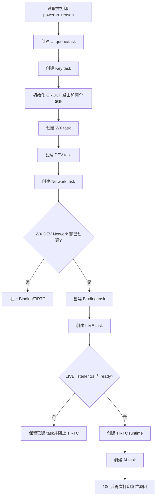
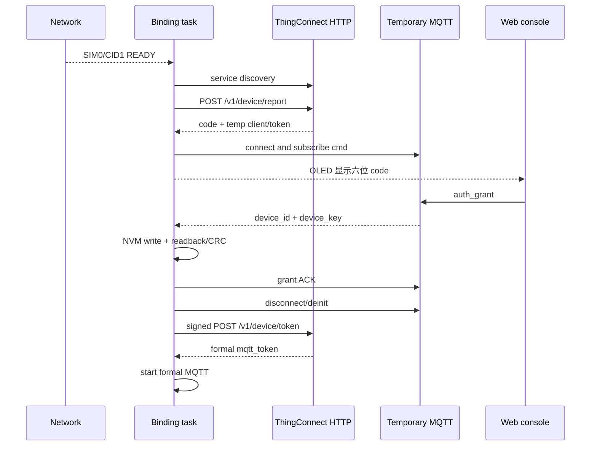
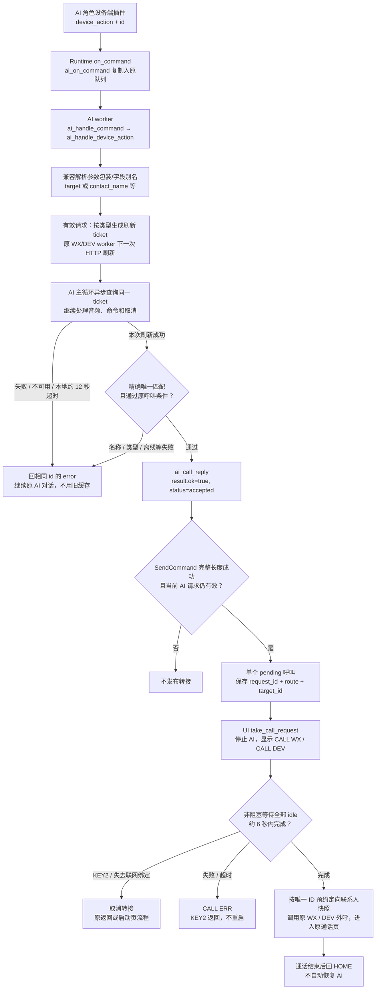
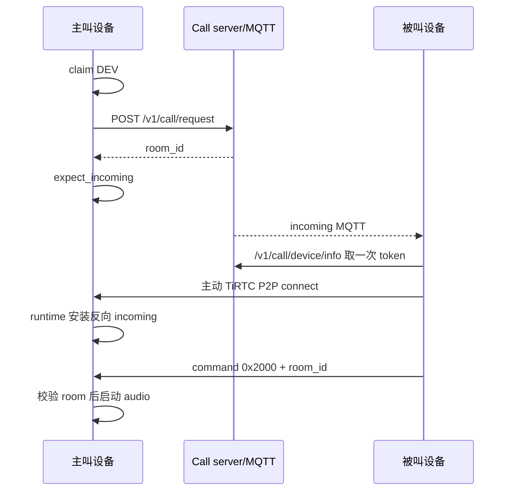

<!-- SPDX-FileCopyrightText: 2026 Shenzhen Tange Intelligent Technology Co., Ltd. <https://tange.ai> -->
<!-- SPDX-License-Identifier: Apache-2.0 -->

# Lierda NT26F6D0 TiRTC 代码与流程详解

> 适用目录：`examples/L_CT4IT00_YP00W_01_V04/tirtc_lite`  
> 目标硬件：Lierda NT26F6D0 / F6D_A OpenCPU  
> 目标读者：第一次接手此工程的嵌入式、客户端、服务端、测试和开源发布人员  
> 文档基线：2026-09-07；2026-09-11 按当前代码补全 GROUP 多人对讲及交接边界，独立流程见第 17A 章，构建和验证说明见[应用说明](应用说明.md#当前固件与验证)。2026-09-14 同步公共 JSON 深度保护、F6D_A 任务创建失败适配、当前日志配置和内存预算。

## 1. 这套代码解决什么问题

本目录是探鸽智能在利尔达 OpenCPU SDK 上的产品应用层。它不是单一“RTC demo”，而是
把以下能力组合成一台三按键、128×64 OLED、蜂窝联网的语音终端：

- SIM0/CID1 蜂窝注册、PDP 数据连接和运营商时间；
- 探鸽服务发现、六位码绑定、设备凭据持久化和永久 MQTT；
- 共享的 TiRTC device runtime；
- AI 语音对讲，以及由 AI 指令发起的微信/设备联系人语音呼叫；
- 微信小程序“探鸽小钛”与设备的双向语音呼叫；
- 两台设备之间的语音呼叫；
- 网页从平台发起、只在 HOME 接入的 LIVE 远端对讲；
- HOME 长按 KEY2 进入的 GROUP 多人对讲：独立状态机及串行 HTTP 任务，共享单连接和音频租约；
- ES8311/I2S 音频、Opus/G.711 编解码；
- 三个按键和 OLED 状态机。

使用者视角的开机、绑定、按键、页面和全部 UI 文案，请先看
[`当前设备操作.md`](当前设备操作.md)。本文只解释代码为什么这样组织、每个文件做
什么、跨模块如何交接，以及维护时不能破坏哪些不变量。

两项新增功能可按下表从操作读到代码：

| 功能 | 配置与体验 | 本文对应代码 |
| --- | --- | --- |
| AI 呼叫微信和设备 | [AI 呼叫微信与设备配置详解](AI呼叫微信与设备配置详解.md)：联系人、智能体和设备端插件 | 第 14.5 节：AI 动作 → 刷新并匹配联系人 → 释放 AI → 原 WX/DEV 外呼 |
| GROUP 多人对讲 | [当前设备操作](当前设备操作.md)第 10A 章：网页创建/加入房间、设备收听和切麦 | 第 17A 章：读取分配 → WHIP / join_room → 持续收听 → 退出/来电清理 |

## 2. 建议阅读顺序

第一次阅读不要从 3000 多行的 `device_call.c` 开始。推荐顺序：

1. `config/tirtc_config.mk`：确认本次固件实际启用了什么。
2. `tirtc_app.mk`：看编译依赖和哪些文件被链接。
3. `src/app/app_entry.c`：掌握 task 创建顺序和失败传播。
4. `include/*.h`：先理解模块边界和非阻塞 facade。
5. `src/services/network_manager.c`、`device_binding.c`、`formal_mqtt.c`：理解网络和身份。
6. `src/core/tirtc_runtime.c`：理解唯一 runtime、owner、generation 和 handle 生命周期。
7. `src/media/*`：理解共享音频和网络 codec。
8. `src/ui/*`：理解 HOME 准入和页面切换。
9. 按 AI → WX → DEV → LIVE → GROUP 的顺序阅读 `src/features/*`。
10. 结合 [`当前设备操作.md`](当前设备操作.md) 按实机流程走读本文第 20～25 章，掌握
    跨功能互斥、内存模型、错误恢复、扩展步骤和已知限制。

## 3. 总体架构

```text
                               user_main()
                                   │
                 ┌─────────────────┼──────────────────┐
                 │                 │                  │
                 ▼                 ▼                  ▼
             UI / Key         Network/Binding     Feature workers
                 │                 │                  │
                 │                 ├── HTTP owner     ├── AI
                 │                 ├── temp MQTT      ├── WX
                 │                 └── formal MQTT    ├── DEV
                 │                                    ├── LIVE
                 │                                    └── GROUP + room_http
                 │                    │                  │
                 │                    ▼                  ▼
                 │              TiRTC runtime ◄── owner/generation
                 │                    │                  │
                 └── snapshot ◄───────┴──────────────► Audio lease
                                                          │
                                                    ES8311 / I2S
```

目录分层：

```text
tirtc_lite/
├─ src/app/          只做 task 编排
├─ src/core/         唯一 TiRTC SDK 生命周期、connection owner 和平台异常适配
├─ src/services/     蜂窝网络、绑定、HTTP、MQTT
├─ src/features/     AI、WX、DEV、LIVE、GROUP 独立状态机
├─ src/media/        共享音频和 codec
├─ src/ui/           按键、OLED primitive、页面策略
├─ include/          模块间公开契约
├─ config/           产品功能和运行参数
├─ board/            本硬件变体引脚
├─ sdk/              单独授权的 TiRTC 供应 SDK
├─ docs/             当前设备操作、代码与流程详解及 OLED 图片资源
├─ tirtc_app.mk      与利尔达 SDK 的构建接入
└─ README.md         入口索引
```

### 3.1 依赖方向

| 模块 | 可以依赖 | 不应依赖/不应做 |
| --- | --- | --- |
| UI | 各模块 snapshot 和非阻塞 facade | 不做 HTTP/MQTT/TiRTC/audio teardown |
| Key ISR | UI 的 ISR-safe 投递入口 | 不画屏、不等待、不分配、不打印长日志 |
| Network | 利尔达网络/数据拨号/RTC API | 不启动第二个业务 PDP owner |
| Binding | Network、HTTP、临时 MQTT、Formal MQTT | 不持有 feature 内部状态 |
| Formal MQTT | MQTT API、固定 handler | callback 不做业务 HTTP/媒体清理 |
| TiRTC runtime | Binding identity、TiRTC SDK | feature 不直接接管 opaque handle |
| Feature | Binding facade、Formal MQTT、TiRTC facade、Audio facade | 不 Init/Uninit 全局 TiRTC |
| Audio | ES8311/I2S 驱动 | 不理解 AI/WX/DEV/LIVE/GROUP 信令 |
| Codec | 纯数据转换 | 不管理会话、网络或 UI |

## 4. 构建入口和功能依赖

### 4.1 `config/tirtc_config.mk`

当前默认配置：

| 选项 | 当前值 | 含义 |
| --- | ---: | --- |
| `APP_VERSION` | `01` | 应用版本字段 |
| `DEMO_NAME` | `tirtc_app` | 选择本目录应用 |
| `BUILD_THPART_CJSON_ENABLE` | `y` | JSON |
| `BUILD_THPART_MBEDTLS_ENABLE` | `y` | HMAC/SHA/Base64 |
| `BUILD_THPART_OPUS_ENABLE` | `y` | AI Opus |
| `HWDEMO_KEY_EN` | `y` | 三按键 |
| `HWDEMO_LCD_SSD1306_EN` | `y` | OLED/UI |
| `HWDEMO_NET_TIME_EN` | `y` | LTE/PDP/time owner |
| `HWDEMO_BINDING_EN` | `y` | 绑定和正式 MQTT |
| `HWDEMO_TIRTC_EN` | `y` | TiRTC runtime |
| `HWDEMO_AI_CHAT_EN` | `y` | AI |
| `HWDEMO_WECHAT_EN` | `y` | 微信呼叫 |
| `HWDEMO_DEV_CHAT_EN` | `y` | 设备呼叫 |
| `HWDEMO_LIVE_TALK_EN` | `y` | HOME 平台 LIVE |
| `HWDEMO_GROUP_ROOM_EN` | `y` | 独立 GROUP 多人对讲 |
| `TIRTC_GROUP_BACK_HOLD_MS` | `2000` | HOME 返回键长按进入 GROUP 的毫秒阈值 |
| `TIRTC_MAX_SEND_BUFFER_BYTES` | `131072` | Init 前设置的发送缓冲上限 |
| `TIRTC_LIBRARY_LOG_LEVEL` | `3` | SDK 日志级别，由平台日志适配层输出 |
| `TIRTC_TRANSPORT_LOG_LEVEL` | `3` | 传输层日志级别，由平台日志适配层输出 |
| `TIRTC_TRANSPORT_STATS_EN` | `0` | 默认关闭传输统计日志 |
| `TIRTC_AI_PREBUFFER_PACKETS` | `1` | AI 首包低延迟策略 |

日志等级在 `config/tirtc_config.mk` 调整，修改后需全量编译并重新烧录。上述开关不控制应用直接调用 `liot_trace` 输出的 `[AI-CALL]`、`[WX]`、`[DEV]`、`[BIND-HTTP]` 等业务日志。

`restricted_network=1` 不在该配置文件中；它由 `tirtc_runtime.c` 针对蜂窝目标固定。

### 4.2 `tirtc_app.mk`

该文件完成六件事：

1. 设置应用、源码、SDK、IO 配置和 memory map 路径。
2. 为每个 `HWDEMO_*_EN` 选择 `.o` 和编译宏。
3. 在 make 配置阶段检查依赖，防止生成“能链接但运行必坏”的半功能固件。
4. 加入 `libTiRTC.a`、`-fno-lto` 和 TiRTC ABI wrapper。
5. 从基础 `ap_lierda_app.elf` 解析 `netif_list` 地址；找不到时立即停止构建。
6. F6D_A 链接 `src/core/rtos_compat.c`，并校验已核验的 `libliot_os.a` 摘要。

依赖检查：

```text
KEY ───────────────► OLED ─────────► LCD driver
BINDING ───────────► NETWORK
TIRTC ─────────────► BINDING
AI ────────────────► TIRTC + BINDING + OPUS
WX / DEV ──────────► TIRTC + BINDING + OLED + KEY
LIVE ──────────────► TIRTC + OLED
GROUP ─────────────► TIRTC + BINDING + OLED + KEY
任一媒体功能 ──────► audio_device
WX / DEV / LIVE / GROUP ─► g711_codec
```

GROUP 不依赖 AI、WX、DEV 或 LIVE 的功能开关；关闭 `HWDEMO_GROUP_ROOM_EN` 时，其源码、
owner/listener 扩展、按键入口和来电交接分支一起排除，原功能仍使用各自的依赖检查。

链接 wrapper 不可随意删除：

- `Logf`：统一 SDK 日志和敏感字段过滤；
- `sha256_hmac`：适配 mbedTLS HMAC；
- `freertos_ThreadCreateWithStackSize`：适配 SDK worker task 栈；
- `app_log_time`：日志时间；
- `printf`：SDK 输出入口；
- `liot_rtos_task_create`：F6D_A 平台任务创建异常适配，成功和参数错误照原实现返回，仅在
  `LIOT_OSI_TASK_CREATE_FAIL`（`0x81000002`）时补一次 `xTaskResumeAll()`，防止创建失败
  后调度仍被挂起。它属于应用侧适配，不修改供应库，也不改变业务任务的正常逻辑。

此补偿仅适用于 SHA-256 为
`12b2a51796698fff748ade88e7e356ae05848a7e6828d139af33f3be41277b40` 的 F6D_A
`libliot_os.a`。更换底包后摘要不匹配会主动停止构建，需重新核验失败分支，不能直接更新
摘要绕过检查。供应库若已修复，重复补偿会破坏原有调度挂起层级。

### 4.3 `board/iodriver.ini`

- I2C0：ES8311 codec；
- I2C1：OLED，SCL pin66、SDA pin57；
- SPI0：SCLK/SSN/MOSI/MISO 使用 86/83/85/84，避开 OLED pin66；
- I2S0：沿用目标板默认映射；
- UART：使用默认映射。

改板时必须同时核对 `audio_device.c`、`ssd1306_display.c` 中的总线编号和 pinmux，
不能只改 INI。

## 5. task、callback 和运行时对象

### 5.1 task 创建表

`user_main()` 按以下顺序创建常驻/启动 task：

| 顺序 | task | 入口 | 栈 | 主要所有权 |
| ---: | --- | --- | ---: | --- |
| 1 | `demo_ui` | `demo_ui_task` | 8192 B | 页面状态、OLED render |
| 2 | `demo_key` | `demo_key_task` | 4096 B | 一次性按键初始化，完成后自删 |
| 3 | `room_http` | `room_http_task` | 12 KiB | GROUP 串行 HTTP、WHIP 提交 |
| 4 | `group_room` | `room_task` | 24 KiB | GROUP 状态、信令、媒体和清理 |
| 5 | `demo_wechat` | `demo_wechat_task` | 48 KiB | WX 状态、信令和媒体 |
| 6 | `demo_dev_chat` | `demo_dev_chat_task` | 32 KiB | DEV 状态、信令和媒体 |
| 7 | `demo_net_time` | `demo_net_time_task` | 10240 B | SIM0/CID1/time |
| 8 | `demo_binding` | `demo_binding_task` | 12288 B | binding/HTTP/temp MQTT/formal maintenance |
| 9 | `demo_live_talk` | `demo_live_talk_task` | 24 KiB | passive LIVE/audio |
| 10 | `demo_tirtc` | `demo_tirtc_task` | 64 KiB | TiRTC SDK/runtime/connection |
| 11 | `demo_ai_chat` | `demo_ai_chat_task` | 96 KiB | AI HTTP/JSON/Opus/media |

GROUP 两个 task 由 `user_main()` 同步调用 `demo_group_intercom_init()` 创建；该函数先
注册 MQTT handler 和 TiRTC listener，再创建 task，因此也早于 binding 上线。两者属于
进程期对象，退出 GROUP 页面不删除 task；初始化失败只使 GROUP 不可用，不阻止原功能。

下列 task 由功能内部创建，不存在相对于 `user_main()` 各 task 的固定全局顺序：

| 创建条件 | task | 入口 | 栈 | 主要所有权 |
| --- | --- | --- | ---: | --- |
| DEV 初始化 | `dev_call_http` | `dev_room_action_task` | 12 KiB | reject/cancel/hangup HTTP job |
| HTTP close 无法同步确认 | `bind_http_reaper` | `binding_http_reaper_task` | 3072 B | 等待异步 close 并安全回收 callback context |

HTTP reaper 只在异步 close 不能立即安全回收时按需创建，不是每个 HTTP 请求都创建的
常规 worker。

此外，当前 TiRTC 的 `rtc_thread` 在建连期间动态创建，不计入上述应用常驻 task 表。
本地 wrapper 将栈参数最小设为 16384；当前供应适配按参数除以 2 作为 FreeRTOS 栈深度，
目标每项 4 B，对应 32768 B（32 KiB）栈。参数、栈深度和实际字节不能混用；
更换 SDK 后需重新确认，不能仅依据这个数字缩减栈配置。

### 5.2 为什么 WX/DEV 在 binding 之前创建

永久 MQTT 一旦上线就可能立即收到来电。如果先连接 MQTT、后注册 WX/DEV handler，
启动窗口中的 `call_incoming` 会丢失。因此 WX/DEV task 先建立 queue 和 handler；它们在
网络、binding、runtime 未 ready 时只保持 OFFLINE，不会提前呼叫。

### 5.3 callback 的共同规则

TiRTC、MQTT、GPIO callback 都运行在非业务 owner 的上下文中，因此只允许：

- 验证 handle/generation/长度；
- 把小事件复制到固定 pool；
- 向 queue 投递 slot index；
- 设置原子/临界区保护的 flag 或 counter；
- release semaphore 唤醒 owner task。

禁止在 callback 中执行 HTTP、长 JSON 流程、音频 stop/release、同步等待、OLED render、
TiRTC disconnect/Uninit 或整机复位。

## 6. 开机编排：`src/app/app_entry.c`

`user_main()` 是唯一 composition root，不包含业务循环。



失败传播：

- UI/key 失败不阻止网络和后台服务，但 UI 失败时 HOME policy 不会开放，LIVE 不接入；
- GROUP 初始化失败记录错误并撤回已安装的路由，不阻止 WX/DEV/binding；已经创建的
  task/RTOS 对象保留，不强制删除可能仍在运行的 owner；
- WX/DEV/network 任一 task 创建失败会阻止 binding；
- binding 失败阻止 LIVE、TiRTC、AI；
- LIVE task 或 2 秒 ready barrier 失败会阻止 TiRTC，避免被动 connection 无路由；
- TiRTC task 失败只阻止最后创建的 AI；早已创建的 WX/DEV 保持不可用；
- 已启动且可能持有 callback/queue 的 task 不被强制删除，采用 fail-closed。

`powerup_reason` 开机打印一次，10 秒后再打印一次，是为了让较晚枚举的 USB 日志也能
看到上次复位是正常、watchdog 还是 panic；这段代码不触发复位。

## 7. 网络：`network_manager.c/.h`

### 7.1 对外接口

| API | 作用 |
| --- | --- |
| `demo_net_time_task()` | 唯一网络 owner task |
| `demo_net_time_get_state()` | 返回状态枚举快照 |
| `demo_net_time_is_data_ready()` | CID1 是否可供业务复用 |
| `demo_net_time_get_local()` | 复制当前本地时间；未有效时返回 false |

状态：

```text
INIT → REGISTERING → DATA_CALL → TIME_SYNC → READY
          │              │            │
          └──────────────┴────────────┴──失败→ RETRY → 重走流程
```

### 7.2 关键内部函数

| 函数 | 作用 |
| --- | --- |
| `net_ipv4_call_is_ready()` | 检查 IP 类型为 IPv4/IPv4v6，且 IPv4 地址非零；CID1 profile active 由调用方另查 |
| `net_default_pdn_is_ready()` | 检查模组已有默认 PDN，避免重复拨号 |
| `net_network_event_cb()` | 网络事件只置状态，不运行完整恢复流程 |
| `net_start_data()` | 等注册、读取默认 APN、复用或启动 SIM0/CID1 |
| `net_wait_network_time()` | 读取 modem RTC/NITZ，验证年份后发布 time ready |

注册最长约 120 秒，数据连接约 30 秒，首次有效时间约 60 秒。失败通常等待 10 秒后
重走注册/PDP；时间失败按约 30 秒重试。READY 后约每 5 秒检查 CID1 profile；profile
inactive 时清 `data_ready` 并由同一 task 恢复，但当前不会重新读取 IPv4。时间一旦有效
不会因一次短暂掉线立刻清掉。

这里不访问 NTP。右上角时间来自蜂窝网络维护的 modem clock，时区固定为中国
`UTC+8`（32 个 15 分钟单位）。

## 8. 绑定和通用 HTTP：`device_binding.c/.h`

### 8.1 对外数据

`demo_binding_snapshot_t` 是 UI 的只读快照，包含 binding state、六位 code、剩余秒数
和错误码。feature 不读取内部全局字符串，而通过以下有界复制 API 获取资料：

| API | 使用者 | 说明 |
| --- | --- | --- |
| `demo_binding_get_snapshot()` | UI | 复制绑定显示状态 |
| `demo_binding_get_tirtc_identity()` | runtime | device_id/key/client_id/ICCID/endpoint |
| `demo_binding_fetch_ai_access()` | AI | 获取一次 AI peer/token/role/app |
| `demo_binding_clear_ai_access()` | AI | 擦除 token 等敏感缓冲 |
| `demo_binding_service_request()` | WX/DEV | 对 discovery 后的业务服务发鉴权 HTTP |
| `demo_binding_service_request_timeout()` | WX/DEV/GROUP | 同上，允许显式超时 |

### 8.2 首次绑定



先订阅成功、后在 OLED 暴露 code，避免用户已点击绑定但设备还收不到 grant。

### 8.3 已有凭据启动

1. NVM 记录校验 magic、version、size、字符串终止和 CRC。
2. 服务发现。
3. 使用 device key 构造带 timestamp、nonce、HMAC-SHA256 的签名请求。
4. `/v1/device/token` 返回有效 token：直接启动永久 MQTT。
5. 服务端明确返回未绑定：保留设备 ID/key，进入 signed report/rebind。
6. 网络或服务器临时错误：显示错误并重试，不擦凭据、不复位。

CRC 只能发现意外损坏，不是加密、认证或防篡改。生产设备必须确认模组 NVM 的安全
属性，或使用硬件绑定密钥包装长期 device key。

### 8.4 HTTP singleton 和 reaper

利尔达 HTTP client 可能在调用者超时后仍有 DNS/connect worker 和 callback。代码因此：

1. 用 `s_http_mutex` 串行化请求入口和同步执行阶段；
2. request/response 存放在 heap-owned `binding_http_ctx_t`；
3. callback 只更新该 context；
4. 普通请求的 `perform()` 成功后先给 worker 20 ms 收尾；仅在尚未 close 且
   `liot_httpc_is_running()` 为 true 时提交一次 `liot_httpc_stop()`；若 worker 已进入
   STOP/CLOSE，不重复 stop；未成功提交 `perform()` 的初始化失败路径仍按原流程 stop；
5. 若不能确认 close，context 转交唯一 reaper，pending gate 阻止第二个 client；
6. 普通路径的 reaper 只等待 close，不重复 stop；`SESSION_OPEN` 明确失败时例外，见下文；
7. 收到 close 后保留原有 1 秒收尾间隔，再调用 `liot_httpc_release()`；
8. release 成功后再等待 worker settle（普通路径约 2 秒；socket-open 失败约 10 秒），
   随后清 pending gate 并释放 context；deferred 路径的调用者可能已经先解锁 mutex。

不能把这里改成“HTTP 超时立即 free”，也不能让正常收尾的 reaper 重复 stop；否则晚 callback
会写入已释放内存，或在 release 后再次进入已释放的 HTTP client。

旧版实机日志曾出现 deferred AI-token 请求在 `release` 返回 0 后再次收到第二个 CLOSE，
随后下一次 `liot_httpc_new()` 附近发生 `powerup_reason=7` 的 panic。对 F6D_A HTTP 库的
状态和消息流程核对后确认：`running=0` 不能证明 worker 已退出；正常响应进入 STOP/CLOSE 时
再次调用 `stop()` 会排入冗余停止消息，存在迟到 callback/UAF 风险。当前代码
已在同步和 deferred 清理入口共同拦截该重复 stop，同时保留原来的 AI 预取、CLOSE 等待、
reaper 和 pending gate。供应 API 仍没有 worker-terminated 通知，因此不能把固定延时当作
通用释放证明；没有收到 CLOSE 时必须继续 fail-closed，不能强制 free 或复用 client。

**OPEN 失败是单独核实过的例外。** 当前 F6D_A 库在 DNS/connect 等导致 OPEN 失败后，
直接退出 worker，不产生 CLOSE，也不消费排队的 STOP；仅等待 CLOSE 会永久占住 HTTP。
`binding_http_wait_close()` 只对明确收到失败 OPEN 的 context 重试 stop。worker 真正退出后，
供应 `stop()` 会同步回调 CLOSE；未收到这个真实回调，仍保留 context 和 pending gate。
同步清理、reaper 和 reaper 创建失败后的无分配补偿入口共用这条规则。

这条错误恢复可能在供应全局队列留下 STOP。紧随其后的 `binding_http_perform()` 临时将
调用者优先级从当前应用的 12 提到 24，保证供应 priority-23 worker 不会在 `perform()`
重置队列之前消费旧消息；调用返回立即恢复原优先级。只对这类失败恢复启用，普通请求
不调整优先级，也不改变原有错误码、重试预算和 AI 预取流程。此适配已按当前 F6D_A
二进制核对；更新供应库必须重新确认队列顺序和线程优先级，不能套用于未知版本。

### 8.5 临时 MQTT

`binding_wait_for_grant()` 拥有临时 client：connect → subscribe → wait grant → ACK →
disconnect/deinit。callback 更新 connect/sub/pub/disconnect 状态；收到消息时执行有界
JSON 解析、grant 字段校验和凭据复制，再设置 grant flag 并唤醒 task。ACK、凭据持久化
和 client 生命周期清理由 owner task 完成；JSON 深度保护见第 21.4 节。
临时 MQTT token、grant device key 和相关工作缓冲在清理时擦除；长期设备凭据和正式
MQTT token 必须由各自 owner 保留，不能在一次临时流程结束时清掉。

当前 callback 使用全局 semaphore，且没有独立 generation 校验；异步 deinit 后固定
等待约 5 秒便会删除该 semaphore。当前供应实现会等待接收 worker 退出再释放 client，
因此不能把“使用全局 semaphore”直接判成已发生的 UAF。但应用未显式等待异步 deinit
完成；若它超过等待窗口且仍有 callback，删除 semaphore 仍有风险。升级 SDK 或压测时
应确认这一完成边界，而不能把固定 5 秒当作所有情况下的静默保证。

### 8.6 主循环和复位

BOUND 后 binding task 每 500 ms 调 `demo_formal_mqtt_maintenance()`。正式 MQTT 掉线时
先向服务端复核 token：临时网络错误继续重试；只有正式 `unbind` 消息或服务端权威
返回“已解绑”，才进入 `binding_reboot_after_unbind()`。

解绑复位顺序：给 command ACK 约 500 ms → 断永久 MQTT → 再等约 500 ms →
`liot_power_reset(LIOT_RESET_NORMAL)`。这是应用层唯一整机复位调用。

## 9. 永久 MQTT：`formal_mqtt.c/.h`

### 9.1 连接参数

- client ID：`sn_{device_id}`；
- username：`device_id`；
- password：服务端返回的 `mqtt_token`；
- QoS1 订阅：`device/sn_{id}/cmd`、`device/sn_{id}/notify`；
- command ACK：`device/sn_{id}/ack`；
- heartbeat：`device/sn_{id}/up`，约 30 秒一次 QoS0。

### 9.2 对外接口

| API | 说明 |
| --- | --- |
| `demo_formal_mqtt_connect()` | 复制 URL/凭据并建立永久连接 |
| `demo_formal_mqtt_disconnect()` | owner task 发起安全退役 |
| `demo_formal_mqtt_is_online()` | UI/feature 的 readiness 条件之一 |
| `demo_formal_mqtt_take_unbind()` | binding task 消费一次 unbind 标志 |
| `demo_formal_mqtt_copy_token()` | binding HTTP 为业务请求复制 bearer |
| `demo_formal_mqtt_register_handler()` | 注册固定容量消息 handler |
| `demo_formal_mqtt_unregister_handler()` | 从注册表清除匹配 handler；不等待已经复制的 callback 返回 |
| `demo_formal_mqtt_maintenance()` | 补订阅、heartbeat、清理 retired client |

handler 最多 4 个，不动态扩容。callback 解析出 `kind/type/channel/payload` 后复制
handler 数组，再逐一调用。`payload` 只在 callback 期间有效，handler 必须复制需要的
字段或投递固定事件，不能保存 cJSON 指针。当前 handler/user 都是进程期静态对象；若
以后允许释放动态 user，必须为 unregister 增加 inflight/epoch 同步。

GROUP 的 `room_assignment_changed` 是顶层 command；没有内嵌 `payload` 对象时，分发层
为它传递完整消息对象，沿用原 ACK 路径。原 WX/DEV channel 路由保留。`room_mqtt()` 只
校验版本/有效期、合并同步意图并唤醒 worker，不直接接受通知中的房间关系，不在 callback
内查询、建连或开麦。

### 9.3 client generation

正式 MQTT 使用两个静态 client slot，避免下一代立即覆盖刚退役的 storage；
disconnect/deinit 无法立即完成时，client 进入 retired 状态，maintenance 后续处理。
应用同时校验 client 身份和 context/generation。当前供应 callback 传入的是接收 worker
持有的 client 值，并非应用静态 slot 的地址；供应 deinit 等接收 worker 退出后才释放
内部 client。因此，仅凭“两槽会复用”不足以认定旧 callback 会污染新连接，更不能
据此认定会发生误解绑复位。本次未改动正式 MQTT 流程。

维护边界仍是 deinit 完成后才能复用；若换库后该契约变化，需要重新核对迟到 callback。
`formal_exception_cb()` 没有 `arg`，只能靠 client 身份判断，不能仅用 cookie 替代
底层 worker 退出保证。

### 9.4 F6D_A RX compatibility

当前 F6D_A 公共 MQTT API 没有 receive-buffer option，而呼叫消息可能超过默认 1642 B。
`DEMO_F6DA_LIOT_MQTT_RX_COMPAT` 把 opaque handle 当作私有对象地址，先从固定偏移读取，
再校验字段值并把 RX buffer 调到 4608。字段校验只能阻止一部分错误写入，不能证明前置
私有偏移读取安全；handle 表示或布局变化时，读取本身就可能 HardFault。该宏在当前
F6D_A binding 构建中自动启用；更换 base package/LIOT MQTT archive 前必须先禁用，或
锁定并核对精确版本与二进制哈希。最终应改用供应商公开 option/API。

## 10. TiRTC 核心：`tirtc_runtime.c/.h`

### 10.1 为什么必须只有一个 runtime

该产品的 TiRTC 配置是 device mode、`MAX_CONNECTIONS=1`。AI/WX/DEV/LIVE/GROUP 都共享同一
设备身份和 SDK 生命周期。feature 只能 claim/release 逻辑 session，不能各自
`TiRtcInit()` 或 `TiRtcStart()`，否则会产生重复线程、重复 socket、CID1 争用和 opaque
handle 的跨实例误用。

### 10.2 owner、session generation 和 connection generation

owner 枚举区分 NONE、AI、WECHAT、DEV_CHAT、LIVE、GROUP_ROOM。claim 成功返回非零
`session_generation`，后续 connect/send/subscribe/disconnect/release 都必须同时带
owner 和 generation。

```text
claim(owner) → session generation S
connect request → request generation R
SDK handle accepted → connection generation C
audio acquire → audio lease generation A
```

指针值可能被 SDK 重用，因此 `handle == old_handle` 不能证明是同一连接。代码使用
owner + S/R/C/A 组合防止晚 callback 或旧 cleanup 操作新会话，即 ABA 防护。

### 10.3 connection 状态

`s_connection` 主要字段可理解为：

- `owner/session_generation`：当前逻辑会话；
- `expected_owner/expected_generation`：等待被动 P2P 的 owner；
- `connect_request_pending`：业务仍需要该请求；
- `connect_callback_pending`：SDK callback 尚未返回；
- `pending_handle`：callback 和安装状态之间的临时 handle；
- `active` + `active_owner/generation`：可发送的连接；
- `users`：正在执行 send/subscribe/get-buffer 的短引用；
- `closing` + closing owner/generation：已禁止新用户但等待 SDK 释放；
- `disconnect_submitted/attempts/retry_at`：异步断开提交状态。

### 10.4 对外 managed API

| API | 关键语义 |
| --- | --- |
| `demo_tirtc_session_claim()` | 原子占用唯一 session，返回 generation |
| `demo_tirtc_session_release()` | 只有 active/closing/pending/users 都清空才成功 |
| `demo_tirtc_expect_incoming()` | DEV 主叫声明下一条被动连接属于自己 |
| `demo_tirtc_cancel_expected_incoming()` | 取消尚未到来的预期连接 |
| `demo_tirtc_adopt_incoming()` | LIVE 在 accept 路径认领无 owner 入站 |
| `demo_tirtc_connect()` | 主动 P2P connect；复制 remote/token 到 static context |
| `demo_tirtc_whip_connect()` | AI/WX/GROUP 的 WHIP connect |
| `demo_tirtc_send_command()` | 短引用 active handle 后发送 command |
| `demo_tirtc_send_audio()` | 短引用 active handle 后发送 audio |
| `demo_tirtc_subscribe_audio()` | 订阅指定 stream |
| `demo_tirtc_get_send_buffer_used()` | feature 背压判断 |
| `demo_tirtc_disconnect()` | active 转 closing，真正 SDK 调用由 runtime task 做 |
| `demo_tirtc_wait_connections_idle()` | UI handoff 等待全部 callback/reject/connection 空闲 |
| `demo_tirtc_require_restart()` | 请求 SDK 软件恢复，不是整机 reboot |

虽然 SDK 头文件把 WHIP connect 描述为异步，当前预编译实现的 `TiRtcWhipConnect()` 仍会
在调用内部每约 50 ms 轮询状态，且没有绝对超时，单函数固定栈帧约 8264 B（含保存寄存器，未计下层调用）。内部 worker 若
不再推进，调用它的 AI/WX task 会永久停在提交调用内，业务层 deadline 无法执行。该
等待应由 SDK 增加绝对超时；应用不能通过强杀 task 来回收仍被 SDK 使用的状态。

GROUP 将 WHIP 提交放在 `room_http` task，媒体 owner 仍可处理退出和显示状态；但这不等于
取消了 SDK 内部阻塞。`s_sdk_submit_busy` 或 runtime pending/closing 未清时，GROUP 仍
保留资源交接保护，不能借超时强行让新功能复用连接。

### 10.5 SDK 启动

```text
等待 binding identity
→ 安装 SDK/transport 日志 sink
→ 设置 MAX_SEND_BUFFER（Init 前）
→ TiRtcInit()
→ 设置 MAX_CONNECTIONS=1、network=4G、ICCID、restricted_network=1
→ 设置 optional endpoint、device secret、client ID
→ TiRtcStart(device_id, callback table)
→ 最长 30s 等 TIRTC_EVENT_SYS_STARTED
→ s_ready=true
```

当前预编译 `libTiRTC.a` 的 `TiRtcServiceRequest()` 会把 endpoint 与 path 拼入内部 128 B
栈缓冲区，但未执行有界格式化。当前唯一调用路径 `/v1/wxvoip/reject` 长 17 B，因此自定义
endpoint 最多为 110 B，才能连同结尾 `\0` 放入缓冲区。`DEMO_BIND_TIRTC_ENDPOINT_MAX`
现为 111 B 容量，discovery 会拒绝 111 B 及以上的 endpoint，并由 `_Static_assert` 约束
endpoint 容量、reject path 和 SDK 128 B 缓冲的组合边界；不能截断 URL 后继续运行。预编译
SDK 内部仍应由供应方改成有界拼接，应用入口校验不能替代库本身的修复。

日志 wrapper 会丢弃可能含 bearer、device secret、ICE username/password、TURN password、
nonce 等敏感内容的整行。即使打开 level 15 也不应绕过脱敏 gate。

### 10.6 入站路由

1. 若某 owner 已 `expect_incoming()`，runtime 原子安装 handle 并只通知该 owner。
2. 无 expected owner 时，feature listeners 按固定策略尝试认领。
3. 仍无人认领时交给 LIVE passive listener。
4. LIVE 也拒绝或当前不在 HOME，handle 进入固定 reject slot。
5. runtime task 在 callback 栈之外调用 disconnect。

reject queue 深度固定，`MAX_CONNECTIONS=1` 下正常不会堆积。callback 中不直接
disconnect，是为了避免 SDK callback stack 上重入 teardown。

### 10.7 active 引用和 disconnect

发送前 `runtime_active_acquire()` 验证 owner/generation 并增加 `users`；发送完成
`runtime_active_release()` 减少。disconnect 先阻止新 acquire，等 users=0，再由
runtime task 调 `TiRtcDisconnect()`。

`TiRtcDisconnect()` 返回 0 只表示请求提交成功，不是释放完成。closing reservation
继续存在，直到 `on_disconnected` 或 SDK 明确返回 `TIRTC_E_INVALID_HANDLE`。这条规则
防止新会话复用 SDK 仍在内部访问的 handle。

### 10.8 软件恢复

触发条件包括 Start 超时、SDK 自发 `SYS_STOPPED`、多次 disconnect 提交失败或内部
生命周期不变量破坏。恢复顺序：

```text
ready=false / 关闭入站
→ active 转 closing、取消 expected incoming
→ 等 connect callback/users/reject/admission/connection drain
→ TiRtcStop
→ 等 SYS_STOPPED
→ TiRtcUninit
→ 推进所有 generation，记录 retired session
→ 重新读取 binding identity 并 Start
```

这套恢复是 fail-closed，而不是强制回收：connect/disconnect callback 永久缺失时，
reservation 会一直保留；`TiRtcStop()` 返回 0 但 `SYS_STOPPED` 永久缺失时，
`s_stop_requested` 保持 true，后续恢复只会继续等待而不会重复提交 Stop。这样能避免迟到
callback 访问已释放对象，但本次开机内所有 RTC 功能可能持续 BUSY，只能保留诊断后人工
重新上电。真正自动恢复需要 SDK 提供可证明完成的 cancel/deinit 边界。

drain 超时会保留状态、5 秒后再尝试，日志中的 `module reset disabled` 表示不调用整机
reset。强制清零 closing 可能制造 UAF，因此没有 SDK 保证时不能这么改。

当前预编译库的 `TiRtcStop()` 关闭 server 后直接通知 `SYS_STOPPED`；该事件本身不是
所有连接 worker 已退出的证明。因此不能删除 Stop 之前的 pending/closing drain 条件。

## 11. 共享音频：`audio_device.c/.h`

### 11.1 音频格式

- 板端：signed PCM S16LE；
- 采样率：16 kHz；
- 声道：mono-right；
- 一帧：20 ms = 320 samples = 640 bytes；
- codec/总线：ES8311 + I2C0/I2S0；
- PA：GPIO11。

### 11.2 lease

`demo_ai_audio_acquire(owner, &lease)` 返回 `{owner,generation}`。每个 audio API 都验证
lease，旧会话的 delayed cleanup 因 generation 不匹配而不能停止新会话。

GROUP 使用独立 `DEMO_AI_AUDIO_OWNER_GROUP_ROOM`；`demo_ai_audio_*` 是沿用的共享音频
接口名称，不表示 GROUP 运行在 AI 状态机里。切换麦克风只改变 GROUP 本地采集/发送门，
不重新 prepare/stop 音频，也不撤销下行收听。

| API | 作用 |
| --- | --- |
| `acquire/release` | 获取/释放唯一逻辑 owner |
| `init` | 首次初始化硬件；后续会话通过 Pause/Resume 恢复播放状态并应用音量 |
| `prepare_session` | 保存本次扬声器/麦克风级别，再调用 `init` 的首次或后续会话路径 |
| `record_20ms` | 读取固定 20 ms PCM |
| `play/play_done` | 异步播放和完成查询 |
| `stop` | 停止本次 session，不销毁全局驱动 |
| `set/get/apply_levels` | UI 1..10 音量/麦克风级别 |

硬件只初始化一次。正常 session 用 Pause/Resume/Stop，不调用会导致当前 F6D 模组异常
复位的 `Liot_AudioDeInit()`。

音量 1..10 映射到经过板级验证的 speaker volume、mic gain 和 mic volume 表，不是
简单把 UI 数值直接传给 codec。

底层 `Liot_AudioRecord()` 无超时参数，内部等待采集完成信号；若信号丢失，调用它的
业务 worker 可能无法继续或退出。上层另开计时器不能证明 DMA 已停止，当前不强杀任务、
不释放仍可能被 DMA 使用的缓冲，也不整机复位。可靠恢复需要供应库提供有限等待及
采集取消/停止完成接口。

## 12. Codec

### 12.1 `opus_codec.c/.h`

- AI 专用，16 kHz mono、20 ms；
- encoder application=`OPUS_APPLICATION_VOIP`；
- bitrate 24 kbps，complexity 3；
- 最大网络 packet 1275 B；
- encoder/decoder 是进程单例；会话之间 reset，不重复创建；
- 半初始化失败统一 deinit，防止只泄漏 encoder 或 decoder。

### 12.2 `g711_codec.c/.h`

纯函数式 G.711 A-law 转换：单 sample encode/decode 和批量接口。没有全局状态、heap、
task 或 callback。WX、DEV、LIVE、GROUP 上行均为 8 kHz A-law；DEV/GROUP 下行只接收 8 kHz，WX/LIVE
下行兼容 8/16 kHz；板端仍为 16 kHz PCM：

- 上行：相邻两个 16 kHz sample 平均，降为 8 kHz，再 A-law 编码；
- 下行 8 kHz：每个解码 sample 复制两次，扩成 16 kHz；
- WX/LIVE 支持的 16 kHz 下行按原采样数播放。

## 13. UI 与输入

### 13.1 `key_input.c/.h`

| 物理输入 | 代码语义 | 默认操作 |
| --- | --- | --- |
| KEY0 / GPIO20 / modem pin5 | `DEMO_UI_KEY_NEXT` | 下一项/下一个联系人 |
| KEY1 / GPIO22 / modem pin19 | `DEMO_UI_KEY_CONFIRM` | 进入/呼叫/接听/调节 |
| KEY2 / WAKEUP_PAD0 | `DEMO_UI_KEY_BACK` | 返回/拒接/挂断 |

启用 GROUP 时，READY+HOME 的 KEY2 长按默认 2 秒进入独立页面；其他页面仍按原返回语义
处理。ISR 记录按下时刻并投递下降沿，UI 用 `demo_key_back_is_pressed()` 查询真实电平，
在 UI 任务内判定长按时长。进入后同一次按压必须稳定松开约 80 ms，才允许下一次 KEY2 退出。

当前 HOME 长按许可还要求 AI/WX/DEV 全部 idle、没有菜单进入等待/失败、GROUP 已退出
且无来电预约。DEV 普通后台查房也会暂时变为非 idle；按下时不满足或持压中许可失效，
会取消该按压，之后必须松开重按。候选长按期间一次 HIGH 采样也会取消计时，80 ms
稳定释放判断只用于进入后的按压消耗状态。这里保留原代码行为，不表示这些已知限制已修复。

KEY0/KEY1 使用 GPIO 下降沿，KEY2 使用 wakeup pad；三键分别记录上次 tick，80 ms 内
重复边沿丢弃。ISR 只调用 `demo_ui_post_key_from_isr()`。

初始化完成后 key task 自删除，因为 IRQ 和 callback 已由驱动持有。传给 GPIO init 的
栈上配置会被当前 F6D_A 驱动复制，不被异步保存。

### 13.2 `ssd1306_display.c/.h`

- SSD1306 128×64；
- I2C1，同时探测 `0x3C`/`0x3D`，两者都存在时优先使用 `0x3C`；
- 内置 5×7 ASCII 字库；
- `begin_frame()` 清 framebuffer；
- `draw_text()` / `draw_text_centered()` 只修改 frame；
- `end_frame()` 一次提交；
- init 时 A5 全亮约 300 ms，再回 RAM display，使用当前产品的 inverse 模式并显示
  `UI READY`。

该文件不知道 HOME、AI 或绑定状态；它只提供 primitive。

### 13.3 `ui_controller.c/.h`

UI 是唯一 OLED renderer。公开入口只有 init/deinit/task 和 ISR-safe key post。

启动门：

```text
WAIT_NETWORK：等待 data_ready
WAIT_BINDING：data_ready 已有但尚未 BOUND，包含网络时间和绑定等待
READY：进入 HOME，默认选中 AI，可触发 AI token prefetch
```

页面：HOME、AI、WX、DEV、SET、GROUP_ROOM。HOME 2×2 菜单仍为 AI/WX/DEV/SET；SET 的 V+/V-/M+/M-
将 speaker/mic 1..10 同步给启用的 feature（包括 GROUP）。进入 SET 前媒体已经完成 handoff，因此新值
通常在下一次会话初始化时应用。

从 HOME 进入 AI/WX/DEV/SET 使用独立的非阻塞待进入状态：

1. `KEY1` 记录目标，立即按目标页面策略关闭 LIVE 准入并请求其停止；AI 凭据仍可后台预取。
2. 显示目标标题及 `WAIT AUDIO / K0 NEXT K2 BACK`；UI 主循环用零超时检查原 AI/WX/DEV、LIVE 和 runtime idle 条件，不在按键回调内循环睡眠等待。
3. 全部就绪后清除待进入状态，只提交一次原功能进入请求；等待中重复 `KEY1` 不重复启动。
4. `KEY2` 取消并回 HOME；`KEY0` 取消、回 HOME 并选择下一菜单。有效来电抢占、掉网或绑定失效同样取消，旧目标不会迟到进入。
5. 最多约 30 秒仍不满足条件时，保留目标标题并显示 `AUDIO BUSY / K1 RETRY K2 BACK`；`KEY1` 重试，`KEY2` 返回，`KEY0` 返回并切换下一项，不自动重启或强制归还 owner。

`s_entry_pending/s_entry_page/s_entry_deadline` 保存进入意图，`s_entry_failed` 记录超时提示。
`ui_process_entry()` 调用 `ui_entry_audio_idle()` 查询就绪状态，等待期间 UI 队列每轮最多等约
50 ms；`ui_cancel_entry()` 清除意图，不向尚未启动的目标发送 LEAVE。实际 `s_page` 仍为 HOME，
等待时 `ui_sync_live_policy()` 按目标页面计算准入，`ui_render()` 优先显示等待/超时内容。

HOME 菜单不再同步等待约 6 秒；所有真实资源 idle 判定仍保留。DEV 已接通后挂断不再额外
等待固定 10 秒，已提交但未接通主叫的迟到入站保护见第 16.6 节。WX/DEV 来电接听仍走原约
6 秒等待，不能据此认为全部 UI 路径都已非阻塞，也不保证挂断后能瞬时启动 AI。

AI 指令转接是另一条受控入口：`ui_process_ai_call()` 留在 AI 页显示 `CALL WX/DEV`，
关闭来电/LIVE 准入并停止 AI，仍以非阻塞轮询使用原约 6 秒资源释放预算；全部 idle 后
才向 WX/DEV 提交定向呼叫，再进入对应页面。KEY2 可取消；失败留在 AI 页显示
`CALL ERR / KEY2 BACK`，不在转接中途经过 HOME，详见第 14.5 节。

WX/DEV 来电携带 `incoming_generation`，按键接听时必须仍匹配，防止用户接听已经取消的
旧来电。页面使用 session/completed sequence，防止旧 cleanup 把新会话页面退出。

WX/DEV 用 `s_call_starting` 覆盖“worker 已取走呼叫请求、尚未进入 DIALING”的窗口。
此时 KEY2 仍能取消，重复 KEY1 不会再排入一次外呼，跨功能 handoff 也不会误判 idle。
提交 HTTP 前再检查取消；HTTP 已提交后的取消沿用原有清理。STOPPING 中重复 KEY2
不再遗留下一轮 hangup；DEV 取消时仍完成原 session sequence，不改变页面退出条件。

UI queue 是进程生命周期对象。OLED ready 前 `s_ui_accept_keys=false`，即使按键 IRQ 已
注册也只丢弃事件；运行中不删除 queue，避免 ISR 检查后使用与 queue delete 竞态。

GROUP 入口由 `ui_process_group()` 单独处理，不占 HOME 菜单项。进入时先关闭 LIVE 准入，
再发布 GROUP 意图；原 LIVE 的 closing 仍由 runtime 管理，GROUP 显示 `WAIT AUDIO` 等待。
页面内 KEY1 只在 `LISTENING/MIC ON` 切麦，`NO ROOM/ERROR` 时请求重新查询，其余准备和
清理状态不排队开麦；KEY0 无业务操作。KEY2 立即关麦并请求退出，显示 `STOPPING`，
`demo_group_intercom_is_idle()` 成立后才回 HOME。

GROUP 的队列事件保存按下时的页面、按键 epoch、会话 generation 和动作类型；消费时
重新校验，旧页面、旧连接或准备阶段的 KEY1 不能在新连接上开麦，也不能接听刚出现的来电。
由 GROUP 进入 WX/DEV 来电页时记录 `s_group_return_after_call`，原通话结束且 GROUP 仍启用时
返回 GROUP，新会话默认收听且关麦。普通断网/绑定复核保留进入意图；明确解绑或重新绑定才取消意图。

## 14. AI：`ai_chat.c/.h`

### 14.1 状态

```text
IDLE → START_SDK → GET_TOKEN → CONNECTING → NEGOTIATING
                                              │
                                              ▼
                           LISTENING ⇄ SPEAKING
                                │          │
                                └──► STOPPING ──► IDLE/ERROR
```

`demo_ai_chat_start()` 只增加 control sequence 并唤醒 worker，返回 request ID；UI 不在
按键处理里执行 HTTP。`prepare()` 允许 HOME 光标选中 AI 时预取一次 15 秒、RAM-only、
single-use 凭据。过期、已消费或失败都回退为会话内 fresh request。

### 14.2 会话流程

1. 检查 binding 和 runtime ready。
2. 取得预取或调用 `/v1/ai/token`。
3. claim `DEMO_TIRTC_OWNER_AI`。
4. WHIP connect，最长约 30 秒。
5. 利用约 300 ms KCP settle 窗口 acquire/prepare audio、init/reset Opus。
6. 发送 JSON-RPC `start_session`，使用完整 command `0x2100`。
7. 最长约 15 秒等匹配 response；校验 session ID 和可选音频格式。
8. subscribe audio stream 1。
9. 进入 active loop。

### 14.3 半双工媒体

当前板卡没有验证过 AEC，因此 AI 采用半双工：

- LISTENING：每 20 ms 录 320 PCM sample，Opus encode 后发送；
- send buffer 高于约 12 KiB 时丢当前帧，防止延迟无限累积；
- 收到 server audio：固定 pool/queue 入队，Opus decode 后批量播放；
- SPEAKING：暂停录音，避免扬声器回灌 ASR；
- `round_end`：只清 server-speaking 标志，让已入队音频自然播放完后回 LISTENING；
- `interrupt`：调用 Stop、清应用队列并 reset decoder，逻辑上回 LISTENING；底层播放恢复
  仍有下述限制，不能据此认为同一会话下一轮一定正常。

已确认当前 F6D_A `Liot_AudioStop()` 将播放状态留在 STOP；AI interrupt 分支没有执行
新会话初始化中的播放状态恢复。后续播放可能入队却不启动 DMA，表现为无声并停在
`AI SPEAK`。本轮没有直接追加 Pause/Resume：Stop 是异步的，FINISH 可能早于当前 DMA
完全停止，迟到 STOP 还可能清掉新音频。需要供应库提供明确的 stop-complete 边界再修复，
不能用固定延时或第一个 FINISH 冒充停止完成。现场可先按 KEY2 退出，清理完成后重新进入。

固定资源：16 个 audio slot、8 个 command slot、4 个 WHIP context、4 深度 unwanted
queue。callback slot 使用 producer counter；cleanup 先清 connection admission，再等
producer=0 后 drain，不在 teardown 与 callback 之间泄漏 slot。

### 14.4 清理

STOPPING → stop audio → best-effort `end_session` → managed disconnect → drain audio/
command/unwanted → release audio lease → release TiRTC session → 擦除 token/peer/role。

普通 token、WHIP、协商、codec、发送或超时错误只结束本次会话并显示错误，不整机复位。

### 14.5 AI 呼叫微信和设备联系人

此功能在原有 AI 命令处理、UI handoff 和 WX/DEV 外呼之间增加一条转接，不新增任务、
连接类型或 SDK API，也不从 ASR 字幕中猜测呼叫意图。只有云端通过 `0x2100` 下发
JSON-RPC `device_action` 才处理。设备需要配置通用 AI Pipeline 角色的设备端插件，
标准动作为 `call_contact`，参数为 `target/contact_type/call_type`；完整填写示例见
[AI 呼叫微信与设备配置详解](AI呼叫微信与设备配置详解.md)，设备试用见
[当前设备操作](当前设备操作.md)第 6.4 节。



关键函数及边界：

| 文件 / 函数 | 责任 |
| --- | --- |
| `ai_chat.c` / `ai_call_json_is_complete` | 仅对新增呼叫事件拒绝内嵌 NUL 和 JSON 后附加数据，避免联系人或请求 id 被截断后误匹配 |
| `ai_chat.c` / `ai_call_payload`、`ai_call_field`、`ai_call_action` | 接受 ESP32 的参数包装、字段及 action 位置；正式字段优先，已有字段无效时不以较低优先级别名绕过校验 |
| `ai_chat.c` / `ai_call_ascii_equal`、`ai_call_route` | action/类型值兼容 ASCII 大小写及微信/设备类型别名；不改变联系人名称的精确匹配规则 |
| `ai_chat.c` / `ai_handle_device_action` | 校验 `jsonrpc/id`、action/参数、当前会话和呼叫类型；保存同一次 RPC 并请求按次刷新 |
| `ai_chat.c` / `ai_refresh_call_contacts` | 实际 AI 对话入口非阻塞预热一次，不设周期或 TTL |
| `ai_chat.c` / `ai_poll_call_lookup` | 由 `ai_active_loop` 每轮调用，核对当前 ticket、刷新结果、取消和本地截止时间；成功后匹配并回复原 RPC |
| `wechat_call.c` / `demo_wechat_refresh_contacts_for_call` | 返回 WX 本次刷新 ticket，必须由请求后的 HTTP 完成；入口不执行 I/O |
| `device_call.c` / `demo_dev_chat_refresh_contacts_for_call` | 返回 DEV 本次刷新 ticket；与普通 UI/MQTT 刷新共用原 worker |
| `wechat_call.c` / `demo_wechat_find_contact` | 核对 ticket 和刷新结果，按原备注/OpenID 精确查询；-2 等待、-1 不可用、0/1/>1 为匹配数 |
| `device_call.c` / `demo_dev_chat_find_contact` | 核对 ticket 后按原始首选名称/device ID 精确查询；唯一命中时返回本次结果的在线标志 |
| `ai_chat.c` / `ai_call_reply` | 通过原 `demo_tirtc_send_command` 返回同一 JSON-RPC id；当前 SDK 返回 JSON 长度加 4 字节命令字，完整发送成功才允许转接 |
| `ai_chat.c` / `demo_ai_chat_take_call_request` | UI 按当前 AI request ID 一次性领取，不领取其他代次的旧请求 |
| `ui_controller.c` / `ui_process_ai_call` | 非阻塞清理/等待/取消；全部 idle 后调用定向外呼，失败显示 `CALL ERR` |
| `wechat_call.c` / `demo_wechat_call_contact` | 按已知 OpenID 重新校验唯一项并保存联系人快照，交原 WX worker |
| `device_call.c` / `demo_dev_chat_call_device` | 按已知 device ID 再次检查在线及可用性，保存快照和 session sequence，交原 DEV worker |

WX/DEV 各最多保存 8 条联系人，不在 SDK 回调或 AI 解析线程内执行联系人 HTTP，
也不向云端上传整份联系人。Token、WHIP 和会话准备完成后，AI 入口异步预热一次，
没有周期轮询或缓存 TTL。预热不能代替呼叫校验：每次有效呼叫都通过
`demo_wechat_refresh_contacts_for_call()` / `demo_dev_chat_refresh_contacts_for_call()`
请求所需列表的下一次 HTTP，并保存 ticket、RPC id、AI request sequence 和本地截止时间。
AI worker 在原约 10 ms 主循环中轮询这些轻量状态，继续音频、命令及取消处理，不等待 HTTP。

只有与本次 ticket 对应的成功刷新才能进入匹配。旧在途 HTTP 不能完成之后才创建的 ticket；
取消、会话结束或换请求后的结果不再触发拨号。同一 pending RPC id 不重复刷新，其他 id 返回
`busy`。所需列表任一失败或不可用即 `contacts_unavailable`，本地约 12 秒超时则
`contacts_timeout`，两者都不用旧缓存兜底，不冒充 `not_found/offline`。这是本地处理预算，
不是云端契约；失败后的后台重试不会自动恢复这个呼叫。刷新成功后继续处理原请求，无需用户
重复下令，但拼错名称、类型不符、同名或设备离线仍会失败，也不保证对端随后不会掉线。

普通 UI/MQTT 刷新仍沿用原 worker；失败保留原显示数组并约 10 秒退避，新的 AI 请求也
不绕过退避。DEV 缓存保留原始首选名称，
来源顺序为 `remark → device_name → name`；
WX 使用原 `remark`。匹配区分大小写，不使用 OLED 的 11 字符过滤名，不做子串或同音
模糊匹配。跨列表同名必须返回 `ambiguous`；不能把另一张尚未完成本次刷新的列表当空表
而误选联系人。

`call_contact`、兼容的 `call_device` 未指定 `contact_type` 时同时查询 WX/DEV；
指定 `device` 或 `wechat` 时限定类型，`call_wechat` 默认只查 WX。`call_type` 默认为
音频，接受 `audio/voice`，拒绝视频；兼容 ESP32 的类型别名及 `call_type` 中携带微信/设备路由。
有效 DEV 快照中离线项会被 AI 入口拒绝，原按键呼叫离线项的行为不变。后台优先使用正式的
`data.target/contact_type/call_type`；参数包装、别名顺序及与 ESP32 的保留差异见
[接口调用与模块流程](TiRTC接口调用与模块流程.md)第 6.5 节。`contact_name` 也能进入相同的精确查找与转接路径；
`query` 是最低优先级目标名称别名；呼叫 action 携带 `{"query":"小李"}` 时可进入相同路径，
但显式 `target` 非法时不会跳过它去用 `query`。这不是新增联系人查询 action。
`fields` 日志仅记录采用的字段名，不输出联系人原文。

查询和转接共用一个待处理请求：同一 pending id 不重复刷新，同一已受理 id 不重复拨号，
另一个 id 返回 busy。
成功回包后还会复查 control/request sequence，防止发送期间的 KEY2 或新会话使旧请求
重新生效。UI 预约呼叫时复制整条联系人，随后 `enter()` 引发的刷新/重排不会把目标
换成另一人。AI 转 DEV 时如联系人仍处于 SYNCING，UI 在原约 6 秒交接期限内等其完成；
这一等待仅用于定向交接，不改变其他页面的通用 idle 判断。`accepted` 不表示已响铃或接听，
HTTP、房间、连接和媒体仍由原状态机决定。

此路径依赖通用 AI Pipeline 的设备端插件。Coze `forward` 不会自动映射为
`device_action`，没有配置插件或只收到 Coze 原生事件时不会触发呼叫。协议说明见
[官方 device_action](https://docs.tange.ai/products/ai-chat/api-reference/events.html#device_action)。

## 15. 微信呼叫：`wechat_call.c/.h`

### 15.1 准备和联系人

transport ready 条件是 binding BOUND、formal MQTT online、TiRTC runtime ready。
worker 上线后：

1. 上报 `/v1/voip/device/profile`；
2. 拉取 `/v1/voip/device/contacts`；
3. profile 成功后进入 READY；有联系人时显示当前联系人，无联系人或拉取失败时显示
   对应状态并按策略刷新；
4. 联系人更新 MQTT、UI refresh、AI 入口预热或每次 AI 呼叫请求重新同步。

首次及后续联系人同步统一由 `wx_refresh_contacts_now()` 执行。失败保留原列表显示，
但清除 AI 查询可用标记、保留刷新意图，并约 10 秒后重试；重复请求不绕过退避。
HTTP 开始时记录所属呼叫 ticket，结束时只完成这张 ticket；普通重试成功不能把已经失败的
ticket 改成成功，新的呼叫须申请新的 ticket。
profile 已成功时，联系人失败不撤销微信来电服务；音频和原外呼流程不因此重建。

MQTT channel=`wx`。固定 3 个 MQTT event slot；handler 复制 open_id、app_id、model_id、
room、peer/token 等有界字段后立即返回。

### 15.2 设备呼叫微信

```text
选联系人 → POST /v1/voip/device/call → DIALING
→ 等匹配的 MQTT call_incoming（携 WHIP peer/token）
→ claim WECHAT → WHIP connect
→ WAIT_START，等 command 0x2000
→ acquire audio + subscribe stream0
→ IN_CALL
```

### 15.3 微信呼叫设备

```text
MQTT call_incoming
→ 检查 UI 在 HOME/WX 且 AI/DEV/LIVE/runtime 可准入
→ RINGING，保存 incoming_generation
├─ KEY1：claim + WHIP → WAIT_START；收到远端 command 0x2000 后启用音频 → IN_CALL
├─ KEY2：调用 reject service
└─ 约45s：timeout reject
```

GROUP 页收到真实微信来电时，先预约唯一交接 ticket、关闭 GROUP 媒体门并进入原 RINGING；
`group_pending` 期间显示 `WAIT AUDIO`，KEY1 可记录本次接听意图，worker 等 GROUP 和原
音频/RTC 条件满足后才执行。来电取消、拒接、超时和资源清理仍由 WX owner 处理，详见第 20 章。

远端 command `0x2001` 表示挂断。WX 接受 stream0 的 8/16 kHz A-law，下行统一变换为
板端 16 kHz；上行为 8 kHz、160 B/20 ms。板端 I2S PLAY_RECORD 支持该功能全双工，
但没有 AEC。

固定资源：8 个 audio slot、3 个 WHIP context、unwanted connection queue。音频 callback
使用 producer barrier，cleanup 不再无条件清 `s_audio_queued`。

会话错误一般显示约 3 秒，清理完成后回 READY 或 OFFLINE；profile 同步失败约 10 秒后
重试。两者都不会整机复位。

## 16. 设备呼叫：`device_call.c/.h`

### 16.1 为什么有两个 worker

主 DEV worker 负责呼叫状态、P2P connection 和实时媒体。reject/cancel/hangup HTTP
可能很慢，放在同一 task 会阻塞音频和 SDK cleanup，因此固定的 `dev_call_http` worker
通过 job queue 异步执行这些 room action。

联系人 HTTP 仍由主 DEV worker 通过 `dev_refresh_contacts_now()` 执行。只有实际开始
HTTP 才消费刷新意图；同批已存在呼叫请求时先处理呼叫，保留待刷新标志。同步失败保留
原显示数组，但将缓存置为不可供 AI 查询并保留刷新意图，约 10 秒后重试；完成结果只属于
HTTP 开始时记录的 ticket。显示数组仍有联系人不等于本次 AI 呼叫已经取得新结果，旧在途
请求或后续普通重试也不能冒充本次刷新成功。

旧 TiRTC owner 尚待归还时（`s_tirtc_release_pending`），`dev_process_control()` 延后启动
新的普通联系人 HTTP，保留刷新意图和 ticket；已经发出的 HTTP 不会因此取消。

### 16.2 主叫方向



“主叫等待入站、被叫主动连接主叫”是本协议最容易看反的地方。主叫不是拿 token 主动
连被叫。

### 16.3 被叫方向

MQTT channel=`device` 的 incoming 到达后检查 HOME/DEV policy、其他 feature idle 和
runtime owner。通过后进入 RINGING，约 45 秒有效。KEY1 answer 后调用
`/v1/call/device/info`，以 `purpose=call` 获取 caller ID 和一次性 token，主动
`demo_tirtc_connect(caller)`；成功后发 `0x2000` 携 room ID，再启 audio。

GROUP 页的真实 DEV 来电先取得交接 ticket 并保持原 RINGING。`dev_group_process_pending()`
等 GROUP 清理完成后才 claim DEV；明确 KEY1 接听和当前 `incoming_generation` 校验仍是
后续连接前提，不因房间后台通知或资源就绪自动接听。

### 16.4 确认和媒体

- stream 10；
- G.711 A-law、8 kHz、mono、20 ms；
- command `0x2000`：连接/房间确认；
- command `0x2001`：挂断；
- 若 room 类型带 video，本无摄像头产品降级为 audio-only。

主叫等待反向连接整体约 30 秒；被叫 connect callback 约 15 秒；room confirm 约 10 秒。
被叫 P2P callback 15 秒未到时调用 `dev_finish_session()`，只清理本次 session，不调用
`liot_power_reset()`。

### 16.5 room recovery

runtime ready 后首次检查计划约 2 秒后，之后约每 30 秒检查 `/v1/call/room`。
`dev_recovery_safe()` 要求 HOME/空闲 DEV 准入及原资源空闲条件；`dev_recover_room()` 在
临界区再次检查准入后才置 `s_recovery_inflight`。请求进入 AI/WX/SET 时不再插入新的冷恢复
HTTP；已提交的 HTTP 正常完成，响应后仍复核 owner 和准入，不强行中断或抢占其他功能：

- 恢复 caller room：重新 arm expected incoming；
- 恢复 callee room：重新暴露来电；
- 恢复 active caller 会让 UI 进入 DEV，避免隐藏麦克风留在 HOME；
- `/call/request` 返回业务码 40202 表示已有 room，保留 DEV owner 并原地 reconcile。

GROUP 页虽然允许真实 DEV 来电，但不允许上述普通冷恢复查询。`dev_recovery_owner_safe()`
要求 GROUP 未启用、媒体已 idle、没有来电预约；`dev_recover_room()` 在设置
`s_recovery_inflight` 的同一临界区再次检查，覆盖查询预检后用户进入 GROUP 的窗口。
否则一次普通 `/v1/call/room` 就会让 `demo_dev_chat_is_idle()` 返回 false，UI 误撤销
GROUP 前台许可，造成无业务错误的周期性暂停/重连。退出 GROUP 且资源归还后恢复原轮询；
真实 MQTT 来电、已发生呼叫的 room reconcile，以及原 `!s_recovery_inflight` 保护均保留。

### 16.6 固定池和 teardown

audio callback 在同一临界区验证 connection/state、占 slot 并增加 producer；cleanup
先清 `s_conn`/state，等待 producer=0，drain queue，再推进 generation。late connect
callback 由 connect context generation 判旧；若晚成功，交 runtime 安全断开。

`s_late_incoming_possible` 记录本会话是否仍可能收到未完成的反向连接，而不是用结束时
`s_conn` 是否为空推断；断连 callback 可能已经提前清空该句柄。具体规则：

- `dev_begin_session(caller)` 默认按角色设置，冷恢复的主叫直接保留保护；普通新外呼在
  POST 前准备阶段清为 false，实际提交 `/v1/call/request` 前置 true。
- 只有 `dev_start_audio()` 成功、连接和房间确认已完成后才清为 false；仅收到入站连接或
  服务端 `answered` 不足以清除。`40202` 原地恢复继续保留，恢复为被叫则按被叫规则处理。
- `dev_finish_session()` 用 `caller && s_late_incoming_possible` 同时决定 owner 归还前的
  `s_tirtc_release_at` 和新呼叫准入的 `s_reject_incoming_until`；需要保护时仍为约 10 秒，
  否则两者归零。已接通后挂断、未提交 POST 的本地取消/失败不再额外等固定 10 秒。

未接通主叫的 `40201`、HTTP 结果不确定及尚未完成的房间恢复仍走保守保护，不凭单个业务
失败码认定没有迟到连接。日志 `[DEV] teardown late_peer_guard_ms=0/10000` 表示是否保留
额外保护，不是释放完成通知。实际 closing、pending callback、producer/queue、audio lease
及 owner 条件仍须满足；原 ERROR 约 3 秒可见期限及其后的 cleanup 检查不变。已开始的房间
查询还会保持 `s_recovery_inflight`，故回到主页或 guard 为 0 都不保证立即进入 AI。

DEV 外呼 JSON 构造只有在 `cJSON_AddItemToObject("targets")` 成功时才转移数组所有权；
OOM 时保留本地指针交公共 cleanup，避免泄漏和发送残缺请求。

## 17. 平台 LIVE：`platform_intercom.c/.h`

### 17.1 它没有菜单页

LIVE 是网页端从平台发起的被动对讲，不是 HOME 第五个菜单。UI 只通过
`demo_live_talk_set_home_allowed()` 控制准入：严格在 READY+HOME，且 AI/WX/DEV 都
idle 时允许。HOME 上 KEY0 移动光标不会关闭 LIVE；KEY1 真正进入功能页时会先关闭
准入并执行 handoff。

### 17.2 accept

1. runtime 收到无人预期的 passive connection；
2. `live_on_conn_accepted()` 获取 process-wide admission gate；
3. 再检查 HOME、feature idle、LIVE not busy；
4. `demo_tirtc_adopt_incoming(OWNER_LIVE)`；
5. LIVE task acquire/init audio；
6. 订阅下行 stream10 和 14，至少一个成功；
7. 发送 `REQ_AUDIO 0x1106`；
8. active loop。

### 17.3 媒体和 command

- 设备上行：stream10，G.711 A-law 8 kHz；
- 网页下行：stream14；兼容设备/参考 profile 的 stream10；
- 下行 flags 可为 8 kHz 或 16 kHz；
- video stream11 subscription 返回成功以兼容 VIEW，但本设备不发视频；
- `0x1106` / `0x1108`：远端音频请求/开关；
- `0x1104`：远端挂断；
- 12 个 RX slot；默认预缓冲 3 包或最长约 80 ms；
- 无 AEC。

当前接入后 `remote_audio_enabled` 默认打开，网页 LIVE 一旦通过 HOME 准入就会启动麦克风
上行；因此 HOME-only 是隐私边界。若产品需要显式本地确认，应另加按键授权状态，不能
只改网页文案。

### 17.4 离开 HOME 和残余边界

离开 HOME：关闭 admission → 标记 stop → 停 audio → 等 RX producer → drain → managed
disconnect → release audio/TiRTC → 清 busy。

feature 最多观察 disconnect callback 约 5 秒；runtime 仍以 callback/INVALID_HANDLE
作为真实释放边界。如果 SDK 接受 disconnect 却永不 callback，closing reservation 会
长期保留，后续功能可能 BUSY。这是安全的 fail-closed，但属于可用性软死锁；需要 SDK
提供强制完成/查询或 Stop 安全契约后才能做 bounded software recovery，不能直接清
handle，也没有整机复位兜底。

## 17A. 多人对讲：`group_intercom.c/.h`

### 17A.1 独立状态与进入意图

GROUP 由自己的 `room_task()`/`room_step()`、snapshot、固定池和串行 service worker 管理，
不借用 AI、WX、DEV 或 LIVE 的通话状态。共享范围仍是唯一 TiRTC runtime、audio lease、
绑定身份和通用 HTTP。房间创建、设备加入分配关系、移除和解散由服务器/网页完成，设备
根据权威 assignment 接入媒体；本地 KEY2 退出不删除服务器分配关系。

网页入口是[设备列表](https://xiaotai.chat/devices)中目标设备下的“多人对讲”。创建房间、
输入房间号加入等操作步骤见[当前设备操作](当前设备操作.md)第 10A 章。网页配置只改变
服务器分配；设备仍需在 HOME 长按 KEY2 进入，收到有效 `join_room` 回包并显示
`LISTENING` 后才开放媒体。房间号、绑定码和设备 ID 各有用途，不能互换。

```text
IDLE ── HOME 长按 KEY2 ──► SYNCING
                           ├─ 无分配 / 房间关闭 ──► NO_ROOM
                           └─ 有分配 ──► WAIT_RESOURCE → 取 token（SYNCING）
                                        → CONNECTING → JOINING → LISTENING ⇄ MIC_ON

真实来电 / 前台许可关闭 → SUSPENDING → SUSPENDED → 重新查询/加入 → LISTENING
KEY2 → STOPPING → IDLE
临时故障 → STOPPING → RECONNECTING → 重新查询/加入 → LISTENING
永久错误 / 重试耗尽 → STOPPING → ERROR
```

`s_enabled` 表示用户仍要留在 GROUP，`s_media_idle` 表示本地媒体已归还，两者不能混用。
`NO_ROOM`、断网、来电暂停时仍可保留 enabled；首次进入、故障重连和来电恢复均重新加入，
默认关麦。`ERROR/NO_ROOM` 的 KEY1 发起新 intent 重新查询，不能沿用旧会话直接开麦。

### 17A.2 assignment、连接和媒体协议

1. 网络、binding、formal MQTT、runtime ready 后，通过 CALL discovery 服务查询
   `GET /v1/call/group/device/assignment`，校验 `assignment_version/desired_state/room_id/room_code`。
2. 用户 enabled、UI 允许前台、无来电预约且旧资源可用时，claim `OWNER_GROUP_ROOM`，
   acquire/prepare GROUP audio lease，并生成本次随机 `session_id`。
3. `POST /v1/call/group/device/connect-token` 携本次房间、分配版本和 session，取得一次
   `peer_id/token` 及心跳/租约参数；由 service worker 调 managed WHIP connect。
4. 连接成功后 subscribe stream1，发 command `0x2200` 的 JSON-RPC `join_room`。
   只有匹配当前请求 id 的成功回包、房间及输入/输出格式有效，才进入 `LISTENING`。
5. 加入后请求 `get_room_snapshot`，处理 `room_snapshot`、成员变化及 `room_closed`。
   成员快照当前只校验并输出人数日志，不维护可滚动的成员列表。

上、下行均为 stream1、G.711 A-law、8 kHz、单声道。上行每 20 ms 采集 320 个板端
16 kHz PCM sample，降采样编码为 160 B；下行从 A-law 解码并扩到板端 16 kHz 播放。
服务端提供房间混音，设备不建立多个成员连接，也不在本地逐成员混音。

`room_audio_tick()` 始终先处理下行，只有本地 `s_mic_gate` 打开才采集/发送上行。
KEY1 同时标记 `set_mic_state` 通知待发送，该通知只同步服务器麦克风状态，不负责本地
音频启动/停止。通知发送失败保留 dirty 标志，约每秒补发一次最新状态，不能因此重建
房间；发送期间的新按键意图仍保留。退出、暂停和新会话会清理旧重试并默认关麦。

### 17A.3 串行 HTTP、代次和在线租约

`room_http` 仅持有一个固定 job/result mailbox，串行执行 assignment、connect-token、
presence 和 WHIP 提交；业务 HTTP 仍调用 `demo_binding_service_request_timeout()`，
共享第 8.4 节的 singleton、mutex 和 reaper，不创建第二套 HTTP client。

每个 job 固定保存 `intent/epoch/room_id/assignment_version/session_id`；结果消费时
复核所属意图和媒体代次，旧 token、旧 presence 或旧连接结果不能启动新会话。
assignment 另以 `sync_sequence` 合并 MQTT/定时查询意图，拒绝较低版本回退；相同
assignment 不重建连接，实际分配变化才先清理旧房间，再接入新分配。

启用期间约每 60 秒复核 assignment；MQTT 变更和 transport 恢复也触发复核。未进入
GROUP 时允许在没有来电预约及 runtime owner/连接占用时做一次合并后的后台同步，
只缓存关系，不 claim 媒体、不自动进入页面、不取连接 token。

加入后按 token 返回的 `heartbeat_seconds` 向 presence 接口上报 `state=joined`。租约截止时间从
请求开始时刻计算，不能从慢 HTTP 返回时重新延长。presence 与 assignment 在 service
worker 执行，媒体 task 可继续收听；租约过期、权威鉴权/房间错误仍须结束旧会话。
短暂 presence 失败约 1 秒后重试，但不能越过租约期限继续发送。

### 17A.4 清理和来电交接边界

```text
关闭本地麦克风、下行和命令 admission
→ best-effort set_mic_state(off) / leave_room
→ stop 本次 audio session
→ 等 producer=0 并 drain 固定池
→ 等 WHIP 提交退出；managed disconnect / session release
→ release GROUP audio lease，擦除本次会话数据
→ 发布 media_idle；按后续目标进入 IDLE / NO_ROOM / SUSPENDED / RECONNECTING / ERROR
```

来电预约或前台许可关闭时还锁存 `s_suspend_requested`。即使来电在 GROUP worker 下一轮
运行前就已取消，仍完成一次清理并重新加入，不能留下“状态显示收听、下行门实际已关”的
旧会话。预约本身和清理完成是两个条件；释放 ticket 不等于媒体已经重新可用。

退出/暂停保存原房间、版本、session 的终态 tuple，供串行 worker 尽力上报 `left`、
`suspended` 或 `connect_failed`。旧 HTTP 可以继续结束，不占住已归还的媒体；新 GROUP
会话必须等待自己的 mailbox 和待发终态处理，不以旧 tuple 覆盖新会话。HTTP context
仍由 binding/reaper 持有，UI 退出不强制 free、取消供应线程或销毁全局服务。

`is_idle()` 只证明 GROUP 媒体/producer/WHIP 提交边界满足，不表示进程期 task、静态池、
全部后台 HTTP 或共享 SDK 已销毁。退出只释放本次会话，保留房间分配关系和原功能服务。

### 17A.5 有界资源与故障恢复

| 项目 | 当前边界 |
| --- | --- |
| 下行池 | 8 × 640 B；队列总负载最多 1280 B，超过约 160 ms 的旧帧丢弃 |
| 命令池 | 2 × 4096 B；callback 只复制并投递 slot |
| HTTP 响应 | 固定 4096 B；JSON 解析前限制嵌套深度不超过 16 层 |
| 发送背压 | SDK 发送缓冲超过 4096 B 时丢当前音频帧，不积压重放 |
| 资源/建连/join 等待 | 约 30 秒 / 20 秒 / 8 秒；SDK 内部提交阻塞仍受第 10.4 节限制 |
| 普通临时错误 | 指数退避并加入最多 500 ms 抖动，最多 6 次失败后转人工重试 |
| `40921` 租约冲突 | 按已知租约或未知时约 60 秒的固定预算等待，不因每次失败延长预算 |

超大 command 丢弃并合并一次 assignment 复核，避免因成员快照超过固定容量而无限重连；
正常大小的 command 因池满丢失时，可能错过 `room_closed`，因此结束当前会话后重建。
协议/音频等不可自动恢复错误进入 `ERROR` 等 KEY1；普通网络恢复保留 enabled，按策略
重新查询并关麦加入。所有这些错误都不调用整机复位；底层不可证明释放时仍 fail-closed。

## 18. `include/*.h` 公共契约索引

| 头文件 | 调用者应知道的内容 |
| --- | --- |
| `network_manager.h` | 网络 state/readiness/time 只读查询 |
| `device_binding.h` | binding snapshot、identity、AI access、鉴权 HTTP facade |
| `formal_mqtt.h` | 永久 MQTT 生命周期、token copy、固定 handler fan-out |
| `json_guard.h` | 外部 JSON 解析前的非递归 16 层深度限制；保留原解析变体和失败清理 |
| `tirtc_runtime.h` | listener、owner/generation、managed connection API、软件恢复 |
| `audio_device.h` | audio owner/lease、16 kHz PCM 和 level API |
| `opus_codec.h` | AI Opus 固定格式和 encode/decode/reset |
| `g711_codec.h` | 无状态 A-law 转换 |
| `ai_chat.h` | AI state/snapshot、start/stop/prepare，以及当前请求的单次呼叫转接领取 |
| `wechat_call.h` | WX state/snapshot、按次刷新 ticket/精确查询、选中/定向呼叫、接听/挂断、HOME policy |
| `device_call.h` | DEV state/snapshot、按次刷新 ticket/精确查询、选中/定向呼叫、接听/挂断、HOME policy |
| `platform_intercom.h` | LIVE HOME policy、音量、active/idle/ready |
| `group_intercom.h` | GROUP snapshot、进入/退出/按代次切麦/重试、前台 policy、音量，以及来电 ticket 预约/就绪/释放 |
| `ui_controller.h` | key enum、UI task 和 ISR post |
| `key_input.h` | 一次性 key init task；GROUP 启用时提供返回键实时电平查询 |
| `ssd1306_display.h` | OLED init 和 frame primitive |

公开 API 的 buffer 参数都是调用方所有；函数若需要跨异步边界会复制。snapshot 是值
复制；callback payload 若注释标记“仅 callback 期间有效”，调用方不得保存指针。

## 19. `sdk/` 文件说明

| 文件 | 作用 |
| --- | --- |
| `sdk/include/tirtc/basedef.h` | TiRTC 基础类型和平台宏 |
| `sdk/include/tirtc/tgtrp.h` | 底层传输配置/日志接口 |
| `sdk/include/tirtc/tiRTC_stat.h` | SDK 统计类型/接口 |
| `sdk/include/tirtc/tiRTC.h` | TiRTC public API、error、option、callback、frame 类型 |
| `sdk/include/tirtc/ticloudstorage.h` | 云存储服务、帧队列及上传 API 声明；当前业务未接入 |
| `sdk/lib/libTiRTC.a` | NT26F6D0/F6D_A 预编译实现 |

当前预编译库 build info 为 `v2.5.0-87c3c290`，传输库为 `tag.v1.5.18-f72f5d3c`。
更换库时仍需重新核对 ABI、发送返回值、失败句柄回收及异步生命周期，不能仅凭版本号
认定平台兼容补丁已经不再需要。
`runtime_dev_connect_needs_cleanup()` 仅对已核验的 `v2.4.0-7f41aae1 / 7750ab42`
与 `v2.5.0-87c3c290 / f72f5d3c` 启用 DEV 失败句柄回收；不套用到未知版本，
也不修改库内对象布局或原有成功连接流程。

这些文件是单独授权的供应 SDK，不是本项目自研源码，也不适用应用代码的 SPDX
许可证。公开分发前必须确认供应商授权范围并保留必要的第三方声明。

## 20. 跨功能互斥与 handoff

系统有两层互斥：

1. TiRTC session owner：确保最多一个逻辑 RTC 会话；
2. audio lease owner：确保最多一个功能操作 ES8311/I2S。

只有一层不够。某连接可能仍在 closing 但 audio 已停，也可能 TiRTC 尚未连接但 feature
已为协商准备 audio。UI、WX/DEV incoming、LIVE accept 都必须同时看 feature idle、
runtime connection 和 audio/session 生命周期。

典型 HOME → AI：

```text
HOME KEY1，当前可能有 LIVE 或上次 DEV 保护期
→ 记录 AI 目标并立即关闭 LIVE admission，后台 AI prepare
→ WAIT AUDIO：每轮零超时检查 AI/WX/DEV、LIVE、runtime idle
  ├─ KEY2 / KEY0 / 来电抢占 / 掉网解绑：取消待进入
  ├─ 约 30 秒未就绪：AUDIO BUSY，等待重试或返回
  └─ 全部 idle：清除待进入标志，只提交一次 AI start
     → AI claim TiRTC → AI acquire audio
```

典型来电竞争：WX 和 DEV handler 都可收到 MQTT，但只有满足 HOME/对应页 policy、其他
feature idle、runtime owner 空闲且 generation 当前的一方进入 RINGING。LIVE 是最后的
passive fallback，不会抢走 DEV 已 `expect_incoming()` 的反向 P2P。

GROUP 页的真实来电使用额外的短期交接预约，但不增加第二条 RTC connection：

```text
WX/DEV 有效 incoming → reserve_call(caller, ticket)
→ GROUP 立即关麦、关闭媒体门并请求暂停；来电进入原 RINGING
→ 记录明确的 KEY1 接听，等待 call_ready(ticket) 和原 RTC/audio idle 条件
→ 执行原 WX/DEV 接听流程，或按原取消/拒接/超时结束
→ WX/DEV 自身 session、pending callback、audio/owner 等清理完成后 release_call(ticket)
→ UI 返回仍 enabled 的 GROUP，重新查询/加入并默认关麦
```

预约只有一个，WX/DEV 不能同时获得；每次释放必须同时匹配 caller 和 ticket。GROUP
handoff 等待上限约 30 秒，原来电期限同时继续计时，不因等待而重置。预约持续覆盖
响铃、通话和原模块资源清理；UI 回到 GROUP 也不跳过该条件。普通 DEV 冷恢复不属于
真实 incoming，在 GROUP 使用期间延后，见第 16.5 节。

AI 和 LIVE 不预约抢占 GROUP：AI 仍从原菜单/转接入口进入；LIVE 始终受 HOME-only
准入约束。`dev_other_features_idle()`/WX 原呼叫检查继续用于真正的接听交接，不能把
“GROUP enabled”直接塞进这些共用条件，否则 GROUP 为来电保留的意图会阻止接听。

## 21. 内存模型

### 21.1 静态优先

实时媒体不在 callback 中 malloc。AI/WX/DEV/LIVE/GROUP 均使用固定 frame pool，queue 只携带
1 字节 slot index。队列满时丢帧并计数，保持内存上界和 callback 延迟上界。

### 21.2 动态分配

| 来源 | 生命周期 |
| --- | --- |
| cJSON parse tree | 当前解析函数，`cJSON_Delete` |
| cJSON print string | 当前 HTTP/command 请求，`cJSON_free` |
| HTTP context | 一个序列化请求，或安全移交 reaper |
| Opus encoder/decoder | 进程生命周期，失败路径配对 destroy |
| TiRTC internal allocations | 预编译 SDK，经 runtime ABI malloc/free |
| RTOS task/queue/sem/mutex | owner task 或进程生命周期 |

### 21.3 producer quiesce

固定 pool 仍有并发所有权。正确 teardown 顺序是：

```text
禁止新 callback acquire
→ 等已占 slot 的 producer 结束复制/投递
→ drain queue
→ 清 slot bitmap/count
→ 下一 generation
```

AI/WX/DEV/LIVE/GROUP 均按此顺序完成 producer quiesce。不能在未证明 producer=0 时直接
`memset(pool_used, 0)`，否则旧 callback 和新 callback 可能同时写同一 slot。

### 21.4 外部 JSON 的递归深度保护

`include/json_guard.h` 在绑定、临时/正式 MQTT、AI 命令、WX/DEV HTTP 等 17 个解析
入口调用 cJSON 前执行非递归预检查。容器嵌套超过 16 层时直接返回失败，沿用调用者
原来的失败分支与清理；GROUP 保留原有的 16 层检查。单纯限制响应字节数不能替代深度限制。

预检查识别 BOM、字符串和转义，显式长度入口不越过给定长度；检查在首个容器值结束时
停止，语法与尾部数据是否允许仍交由原先的 Parse / ParseWithLength / ParseWithLengthOpts
及业务校验处理。正常字段处理、信令和会话状态不变，不新增堆分配、任务或全局缓冲。

当前应用使用 F6D_A 预编译 `libcjson.a`；只改头文件中的递归宏不会重编这个库。
此保护限制递归增长，不表示整个任务调用链的栈余量已经实测，也不覆盖 TiRTC SDK 内部
的解析器。动态对象仍按第 21.2 节回收。

## 22. 错误、重试、软件恢复和整机复位

| 错误层级 | 示例 | 处理 |
| --- | --- | --- |
| 单帧 | queue 满、send buffer 高 | 丢帧、计数、继续会话 |
| 单请求 | HTTP/JSON/token/联系人失败 | 显示错误，定时重试 |
| 单会话 | connect/WHIP/confirm/audio/remote hangup | teardown 本会话，回 READY/OFFLINE |
| TiRTC runtime | SYS_STOPPED、Start/内部 teardown 异常 | Stop/Uninit/Start 软件恢复 |
| 网络 | 注册/PDP/time 掉线 | network owner 循环恢复 |
| 身份 | 服务端确认 unbind | 断 MQTT 后唯一一次正常整机复位 |
| 不安全释放 | callback/worker completion 不明 | 保留对象、fail-closed、记录诊断 |

特别强调：DEV 被叫 15 秒 P2P callback 超时只清理会话；AI/WX/DEV/LIVE/GROUP 普通错误不会
重启设备；`demo_tirtc_require_restart()` 的“restart”是 SDK 软件生命周期，不是
`liot_power_reset()`。

## 23. 日志定位

常用 tag：

| Tag | 模块/用途 |
| --- | --- |
| `[BOOT]` | task 创建和 reset cause |
| `[NET]` | 注册/PDP/time |
| `[BIND]`、`[BIND-AI]`、`[BIND-HTTP]`、`[BIND-MQTT]` | provisioning 和 transport |
| `[FORMAL-MQTT]` | permanent MQTT |
| `[TIRTC]`、`[TIRTC-ADAPTER]`、`[TIRTC-RTOS]` | SDK lifecycle、handle 和 RTOS adapter |
| `[AI]`、`[AI-AUDIO]`、`[AI-LATENCY]`、`[AI-CLEANUP]`、`[AI-PREFETCH]`、`[AI-WHIP]`、`[AI-OPUS]` | AI 业务、媒体、时延和释放 |
| `[WX]`、`[WX-MQTT]` | 微信状态、信令和媒体 |
| `[DEV]`、`[DEV-HTTP]`、`[DEV-MQTT]` | 设备呼叫、room recovery 和信令 |
| `[LIVE]` | HOME passive intercom |
| `[ROOM]` | GROUP 状态/错误/epoch、HTTP job 结果、成员快照和命令丢失诊断 |
| `[UI]`、`[OLED]`、`[KEY]` | 页面、显示和按键 |

日志不应打印 device key、MQTT token、WHIP token、完整 Authorization、ICE/TURN 密码、
binding grant 或服务端完整响应。定位认证问题记录长度、业务码和脱敏 ID 即可。

`[ROOM] state=6/7` 分别表示 LISTENING/MIC_ON，`state=8/9` 是 SUSPENDING/SUSPENDED。
后者带 `error=0` 通常是本地交接或前台许可变化，不是服务器报错；无来电、无退出时若
周期出现，应先核对 UI policy 与其他 feature idle。`service ... code=200` 只代表对应
HTTP 成功，连接成功后还需完成 `join_room` 才算进入收听。

## 24. 如何新增功能

### 24.1 新增 TiRTC feature

1. 扩展 runtime feature/owner enum 和固定 listener slot。
2. 新建独立 worker、固定 queue/pool、snapshot 和非阻塞 UI facade。
3. 所有 callback 采用 generation + producer barrier。
4. 更新 WX/DEV/LIVE 的 `other_features_idle()` 和 UI HOME policy。
5. 若用音频，扩展 audio owner enum，不能绕过 lease。
6. 更新 `tirtc_app.mk` feature 依赖和源码选择。
7. 实机测 task stack，不凭源码猜测缩栈。

GROUP 已按此方式接入；需要允许某功能被来电暂停时，应单独定义 ticket 预约和恢复意图，
不要仅修改通用 idle 返回值，也不要把普通后台查询当作媒体抢占理由。

### 24.2 新增 MQTT channel

用 `demo_formal_mqtt_register_handler()` 注册。handler 只复制字段/投队列；若超过 4 个
handler，先评估并明确扩大固定数组，不要在 callback 动态扩容。

### 24.3 新增业务 HTTP service

扩展 `demo_binding_service_e` 和 discovery endpoint；继续走 serialized binding HTTP。
不要在 feature 中直接创建第二个 libliot HTTP singleton。

### 24.4 增加视频

当前 runtime `on_video` 不处理帧，LIVE 只接受 stream11 subscription 而不发送。
真正视频功能需同时增加 camera driver、固定 video pool、背压、所有权、编码、发送、
privacy/UI policy 和更大内存预算，不是把 subscribe 返回值改成 0 就完成。

### 24.5 改为多连接

`MAX_CONNECTIONS=1` 是整个模型的基础。改为多连接必须重构 active/closing/pending、
listener route、reject、session owner、audio policy 和 UI，不是只改一个 SDK option。


## 25. 当前已知限制

- 单 TiRTC connection、单 audio owner；
- AI 半双工，WX/DEV/LIVE/GROUP 无 AEC；
- GROUP 当前只支持服务端混音的 G.711 A-law 8 kHz 单声道；固定成员快照容量有限，
  不提供设备端建房/输入房间号、成员列表或本地多路混音；
- AI 呼叫只支持本次刷新结果中的唯一联系人和音频类型；未配置通用角色设备端插件、
  同名、刷新失败/超时或目标设备离线时不转接；呼叫完成后回 HOME，不自动恢复 AI；
- AI 收到 `interrupt` 后，同一会话下一轮可能无声并停在 `AI SPEAK`；需底层停止完成
  契约配合修复，见第 14.3 节；
- 底层录音等待没有超时；采集完成信号丢失可阻塞业务 worker，见第 11 节；
- LIVE 无独立 OLED 页面，本地只有 HOME policy；
- LIVE video11 只是协议兼容，不提供视频；
- 服务发现若返回 HTTP/MQTT 明文 endpoint，不具备生产链路机密性；
- NVM CRC 不是安全存储；
- READY 后只复查 CID1 profile；若 profile 仍 active 但 IPv4 已失效，`data_ready` 可能
  继续保持 true；
- AI/WX/DEV/GROUP 建连 callback 或 LIVE/GROUP disconnect callback 永久缺失时，相关 reservation
  可能 fail-closed，使后续 RTC 功能持续 BUSY；
- 当前 `TiRtcWhipConnect()` 会在 SDK 调用内部无截止时间地等待内部状态；worker 卡住时
  AI/WX task 或 GROUP service worker 与全局单连接 runtime 会失去进展；
- `TiRtcStop()` 成功提交但 `SYS_STOPPED` 永久缺失时，软件恢复会持续等待且不再重提
  Stop；
- HTTP OPEN 明确失败后不主动发 CLOSE 的供应路径已增加定向清理；除此之外，真实 CLOSE
  始终无法取得时仍保留 context 和 pending gate，后续 HTTP 请求会被阻止；
- HTTP 供应 API 没有 worker-terminated 通知；应用已拦截实机命中的 closing/closed 状态
  重复 stop 路径，但仍需用连续请求、断网和超时注入做实机 soak；
- formal MQTT unregister 不等待已经复制的 callback；当前静态 user 安全，改成动态
  user 前必须增加同步；
- 临时 LIOT MQTT 未显式等待异步 deinit 完成；若超出固定 settle 且仍回调，semaphore
  删除存在风险；正式 MQTT 两槽复用本身不构成已确认的误解绑证据，见第 8.5、9.3 节；
- 预编译 TiRTC SDK 的 service-request URL 拼接仍是无界实现；应用已拒绝超过 110 B 的
  自定义 endpoint 并加入编译期校验，供应库仍应修复；
- F6D_A 构建自动启用 MQTT 私有 ABI 偏移读取/写入；字段校验发生在读取之后，换底包时
  可能在验证前 HardFault；
- 当前 TiRTC 创建连接的内部对象分配失败分支仍需供应方处理；应用的错误返回检查无法
  覆盖库内部判空之前的访问。按本次范围约束保留 SDK，不把应用两项防护当作已修复此问题；
- 音频底包在播放回收通知投递失败时存在丢失待释放缓冲的路径，队列满的实机发生率未测；
  固定应用音频池不能据此证明底包没有泄漏；
- 静态审计不能证明预编译 TiRTC SDK 内部无泄漏，必须实机 soak。

此前补丁涉及 WX/DEV 按键取消竞态及 HTTP OPEN 失败清理，未改协议、菜单、正常
通话超时或解绑复位。F6D_A 全工程编译、链接、打包通过；真实应用函数提取的 ARM
交错/故障模型测试通过，但不等同于真实 modem、DMA 和无线网络验证。正式更新前至少
回归：快速 KEY1→KEY2、STOPPING 连按 KEY2 后再呼叫、HTTP 连接失败后恢复网络、
AI/WX/DEV/LIVE 连续切换，以及正常绑定/解绑。上述未修复限制不能因此视为已消除。

本次 AI 联系人呼叫在上述流程上增加定向转接，既有编译/模型测试结论不等于该新功能
已经实机验收。更新后应单独验证：微信和设备语音呼叫成功、中文完整名称、同名歧义、
联系人未就绪/离线、重复指令、转接中 KEY2 取消、转接超时/断网，以及通话后回主页。
原按键呼叫、AI 普通对话、LIVE 和解绑流程也应回归。

2026-09-14 两项应用异常防护已通过完整功能及 GROUP 关闭配置的编译、链接和打包；
136 项已有回归、1985 项 JSON 检查、24 项任务创建检查通过。当前源码与验证记录已
重新核对。它们是主机模型和构建证据，实机混音、DMA、弱网以及堆/栈长稳仍需补测，
具体包和验收项见[应用说明](应用说明.md#当前固件与验证)。

维护原则可以归纳为一句话：**任何异步对象都必须由唯一 owner 管理；正常返回值不是
释放边界，只有可证明的 callback/状态边界才能允许下一代复用。**
