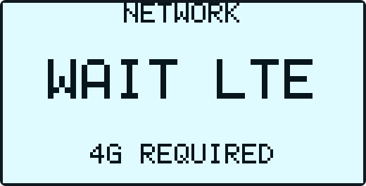
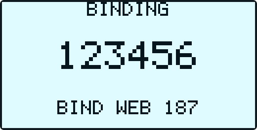
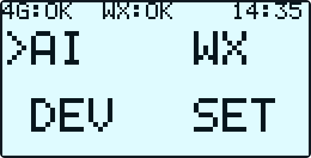
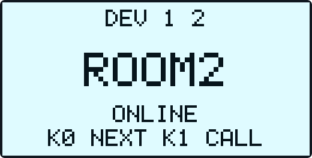
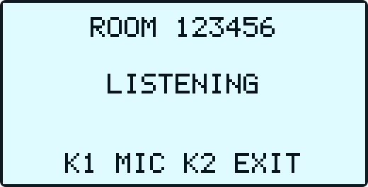
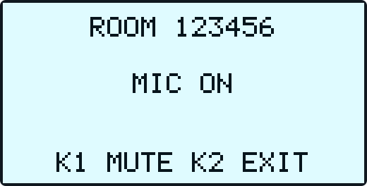
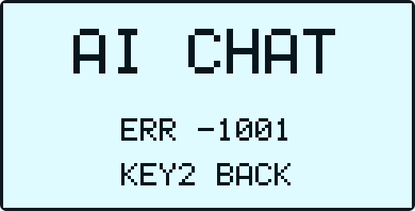
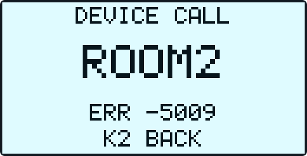
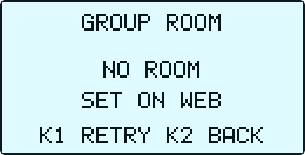
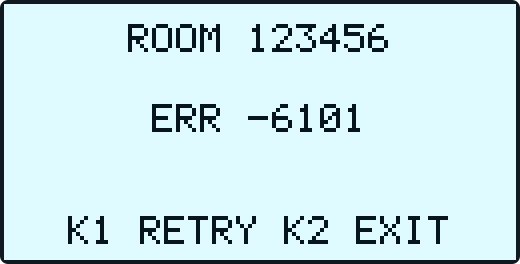

<!-- SPDX-FileCopyrightText: 2026 Shenzhen Tange Intelligent Technology Co., Ltd. <https://tange.ai> -->
<!-- SPDX-License-Identifier: Apache-2.0 -->

# NT26F6D0 TiRTC 当前设备操作与 UI 状态说明

> 适用工程：`L_CT4IT00_YP00W_01_V04/tirtc_lite`  
> 适用硬件：利尔达 NT26F6D0 / F6D_A、128×64 SSD1306 OLED、三按键、4G、ES8311 音频  
> 平台页面文案核对日期：2026-09-04；AI 角色与设备插件字段于 2026-09-14、设备入口/联系人/多人对讲页面于 2026-09-15 再次核对。<br>
> 本文依据当前工程源码整理，OLED 文案均来自固件。代码架构、调用链和维护边界见
> [`代码与流程详解.md`](代码与流程详解.md)。
> 2026-09-14 按当前源码再次核对：多人对讲的按键、收听、来电后恢复规则不变；本次异常防护不增加操作步骤。构建与实机待测项见[应用说明](应用说明.md#当前固件与验证)。

## 阅读导览

第一次使用时，按这条最短路径操作：

```text
上电 → UI READY → 等待 4G → OLED 显示六位绑定码
     → 网页“我的设备/添加设备”输入绑定码
     → 设备直接进入主页 → KEY0 选择，KEY1 确认，KEY2 返回
```

- 只想快速使用：先看第 2～5 章，再阅读要使用的 AI、WX、DEV、SET、LIVE 或第 10A 章 GROUP 多人对讲；烧录包与验收见[应用说明](应用说明.md#当前固件与验证)。
- 遇到问题：先完整记录 OLED 文字和错误码，再看第 11、14、15 章。
- 正常页面在前，全部异常页面、错误码和恢复行为集中在第 11 章。

## 1. 功能总览

从用户操作看，设备共有 6 块功能：主页上的 AI、WX、DEV、SET 四项，加上由网页远端发起的 LIVE 和主页长按返回进入的 GROUP 多人对讲；开机联网、平台注册/绑定和异常恢复是进入这些功能前后的基础流程。设备完成 4G 联网和平台绑定后进入主页，主页有 4 个可选项：

| 主页选项 | 功能 | 使用端 |
| --- | --- | --- |
| `AI` | 与 AI 智能体语音对讲，通过语音呼叫已添加的微信/设备联系人 | 设备麦克风、扬声器 |
| `WX` | 设备与微信小程序用户双向语音呼叫 | 设备 + 微信小程序“探鸽小钛” |
| `DEV` | 两台已绑定设备之间双向语音呼叫 | 设备 + 设备 |
| `SET` | 调整扬声器音量和麦克风增益 | 设备本机 |

LIVE 不占主页菜单，只能由网页在设备停留主页且其他语音功能空闲时发起。本设备仅传输音频，没有摄像头和 LIVE 专用页面。

GROUP 同样不占主页菜单，但有独立页面：主页长按 `KEY2` 约 2 秒进入，默认关麦收听；`KEY1` 按次切换麦克风，`KEY2` 退出。房间创建、分配和永久退出由服务器网页管理，具体操作见第 10A 章。

> LIVE 安全提醒：满足准入条件后远端无需设备按键确认即可接入，LIVE 激活后设备麦克风立即开始采集并尝试上行，而 OLED 没有连接或开麦提示。部署前应限制平台账号权限，并让设备附近人员知情；详见第 10 章。

## 2. 使用前准备

1. 插入可正常注册和上网的 SIM 卡，接好 4G 天线。
2. 接好 OLED、麦克风和扬声器，再给设备上电。
3. 准备可登录体验平台的账号：<https://xiaotai.chat/devices>。
4. 微信端搜索并打开小程序 **“探鸽小钛”**。微信端应登录与网页平台相同的账号。
5. 首次使用需先在网页完成设备绑定；使用 WX 前还需在小程序完成该设备的微信 VoIP 授权。

## 3. 三个按键

### 3.1 固定映射

| 按键 | 硬件输入 | 固定逻辑 | 常用含义 |
| --- | --- | --- | --- |
| `KEY0` | GPIO20 / modem pin 5 | `NEXT` | 下一项、循环选择联系人或设置项 |
| `KEY1` | GPIO22 / modem pin 19 | `CONFIRM` | 确认、进入、拨号、接听、执行调节 |
| `KEY2` | WAKEUP_PAD0 | `BACK` | 返回、拒接、取消、挂断 |

三个按键均按下降沿触发，并带 80 ms 独立防抖。默认启用 GROUP 后，仅在已联网绑定的主页连续按住 KEY2 约 2 秒进入多人对讲；松手不会退出。其他页面的 KEY2 仍在按下时执行原返回/挂断，没有双击操作。

### 3.2 各页面按键行为

| 当前页面/状态 | `KEY0` | `KEY1` | `KEY2` |
| --- | --- | --- | --- |
| `NETWORK` 启动页 | 无业务动作 | 无业务动作 | 无业务动作 |
| 绑定处理中/显示验证码 | 无业务动作 | 重复请求会被忽略 | 无业务动作 |
| `BIND ERR` | 无业务动作 | 请求重新绑定/重试 | 无业务动作 |
| 主页，无来电 | 按 `AI → WX → DEV → SET → AI` 循环 | 请求进入选中项；资源未释放时显示 `WAIT AUDIO` | 短按无动作；长按约 2 秒进入 GROUP |
| 主页，远端 LIVE 进行中 | 循环菜单，LIVE 继续 | 停止 LIVE，显示等待状态，资源释放后自动进入选中项 | 短按无动作；长按进入 GROUP，先释放 LIVE |
| 菜单进入等待 `WAIT AUDIO` | 取消等待，回主页并选中下一项 | 忽略重复确认 | 取消等待并回主页 |
| 菜单进入超时 `AUDIO BUSY` | 取消等待，回主页并选中下一项 | 重试进入原选中项 | 取消并回主页 |
| AI 页面 | 无动作 | 无动作 | 结束 AI 会话并返回主页 |
| AI 显示 `CALL WX / CALL DEV` | 无动作 | 无动作 | 取消本次转接并返回主页 |
| AI 显示 `CALL ERR` | 无动作 | 无动作 | 返回主页，检查后重新进入 AI 或手动呼叫 |
| WX 联系人页 | 下一个联系人 | 呼叫选中联系人 | 返回主页 |
| WX 来电页 | 无动作 | 接听 | 拒接 |
| WX 拨号/通话中 | 无动作 | 无动作 | 取消或挂断 |
| DEV 设备列表页 | 下一个设备 | 呼叫选中设备 | 返回主页 |
| DEV 来电页 | 无动作 | 接听 | 拒接 |
| DEV 拨号/通话中 | 无动作 | 无动作 | 取消或挂断 |
| SET 页面 | 下一设置项 | 对当前项加/减一级 | 返回主页 |
| GROUP 收听/发言 | 无动作 | 切换开麦/关麦，关麦继续收听 | 退出本地对讲、清理资源，保留服务器房间分配 |
| GROUP 查询/等待资源/连接/重连 | 无动作 | 无动作，等待当前流程完成 | 取消本地对讲，清理完成后回主页 |
| GROUP 无房间/错误 | 无动作 | 重新查询/重试 | 退出并返回主页 |
| GROUP 正在退出 `STOPPING` | 无动作 | 无动作 | 忽略重复返回，等待实际资源释放 |

来电时只需按一次 `KEY1` 接听，不要连续按键。

## 4. 正常开机、联网和绑定流程

本章先写用户正常情况下会看到的 UI。部分状态很短，可能因任务调度而一闪而过或完全看不到。

### 4.1 OLED 自检

OLED 服务启动后等待约 300 ms，进行约 300 ms 全亮测试，然后短暂显示 `UI READY`，最多约 500 ms 后进入启动状态页。

| 全亮自检 | `UI READY` |
| :---: | :---: |
|  |  |

### 4.2 4G 联网

正常情况下依次显示 `NET INIT → WAIT LTE → START PDP`，页面标题为 `NETWORK`，页脚为 `4G REQUIRED`。

| 主文本 | 含义 |
| --- | --- |
| `NET INIT` | 网络任务刚启动；可能很快被跳过 |
| `WAIT LTE` | 等待 SIM0 注册 LTE 网络 |
| `START PDP` | 启动/检查 CID1 数据连接并等待 IPv4 地址 |

设备得到可用 IPv4 地址后，OLED 会先进入绑定页。内部仍可能继续等待运营商时间，因此这时看到 `BINDING / WAIT 4G` 是当前固件的正常过渡，不一定表示 4G 数据没有连通。

| 等待 LTE 注册 | 建立/检查 CID1 数据连接 |
| :---: | :---: |
|  |  |

### 4.3 已经绑定过的设备

本机存在有效凭据且服务器仍确认绑定时，通常显示 `WAIT 4G → SERVICE / GET SERVER → CHECK / SERVER`，验证通过后直接进入主页，不再要求输入验证码。

### 4.4 全新设备

全新设备通常显示 `WAIT 4G → SERVICE / GET SERVER → GET CODE`，随后显示六位验证码和剩余秒数。验证码等待窗口约 190 秒；超时后显示 `ERR -109 KEY1`，约 10 秒后自动申请新码。`START BIND` 通常一闪而过，若网络已就绪却长期停在此页，应检查绑定任务。

| 获取服务地址 | 请求绑定码 |
| :---: | :---: |
|  |  |
| 显示六位绑定码 | 服务端校验绑定状态 |
|  |  |

### 4.5 解绑后重新绑定的设备

在线设备被服务端明确确认解绑时，显示 `UNBOUND / RESTART / KEEP DEVICE ID`，尝试清理正式 MQTT 后正常整机复位；设备身份保留，原账号绑定失效。重启后进入 `SERVICE → CHECK → GET CODE` 重新绑定。新一轮绑定成功后直接进入主页，不再重启。

如果设备断电期间在网页执行“重置”，下次上电会直接检查绑定并申请新验证码，不额外执行一次整机复位。完整策略见第 14 章。

### 4.6 在网页绑定设备

1. 打开[体验平台首页](https://xiaotai.chat/)并注册/登录。
2. 进入[我的设备](https://xiaotai.chat/devices)。没有设备时，页面会提示“点击‘添加设备’，输入验证码完成绑定”。
3. 点击页面下方的 **“添加设备”**（有些版本或口头说明称“绑定设备”）。
4. 选择 **“验证码绑定”**，输入 OLED 当前显示的六位数字。
5. 点击 **“确认绑定”**。
6. 网页提示绑定成功后，设备显示 `CHECK / SERVER` 并直接进入主页，不会重启。按当前状态更新顺序，`BIND OK / OPEN MENU` 通常不会实际显示。
7. 可在设备列表设置设备名称。网页当前限制最多 13 个字符；该名称用于设备列表和微信设备来电显示。

## 5. 主页

主页为 2×2 菜单，首次进入默认选中 `AI`。`KEY0` 循环选择，`KEY1` 进入；无来电时短按 `KEY2` 无动作，长按约 2 秒进入 GROUP 多人对讲。

### 5.1 顶栏状态

| 区域 | OLED | 含义 |
| --- | --- | --- |
| 4G | `4G:-- / REG / PDP / ERR` | 未知、注册中、建立数据连接或等待重试；通常会切到 NETWORK 页 |
| 4G | `4G:OK` | 数据连接可用 |
| 微信 | `WX:-- / OFF / SYNC` | 默认、未就绪或正在同步 |
| 微信 | `WX:OK` | WX 功能已就绪；不代表一定已有联系人 |
| 微信 | `WX:RING / CALL / ERR` | 来电、通话流程或错误；通常会自动打开 WX 页面 |
| 时间 | `HH:MM` | 已获得有效的北京时间；无有效时间时此处留空 |

刚绑定进入主页时，常见 `WX:OFF → WX:SYNC → WX:OK`。稳定停留主页时通常显示 `4G:OK`；主页没有 AI、DEV 或 LIVE 状态标志。



### 5.2 进入菜单时的资源等待

主页按 `KEY1` 后，先关闭 LIVE 准入并请求其停止；资源已空闲就自动进入选中项，否则显示目标标题（例如 `AI CHAT`）和以下状态：

| 状态 | OLED 提示 | 操作 |
| --- | --- | --- |
| 等待旧会话、音频或 TiRTC 释放 | `WAIT AUDIO` / `K0 NEXT K2 BACK` | 就绪后自动进入一次；`KEY2` 取消，`KEY0` 取消并切换下一菜单，重复 `KEY1` 无效 |
| 等待超过约 30 秒 | `AUDIO BUSY` / `K1 RETRY K2 BACK` | 不强行进入、不重启；`KEY1` 重试，`KEY2` 返回，`KEY0` 返回并切换下一项 |

等待期间按键和页面仍可更新；选择 AI 时凭据预取继续在后台进行。有效来电抢占、网络掉线或绑定失效会取消待进入请求，不会在原请求失效后自动进入。DEV 已接通后挂断不再额外等待固定 10 秒，但仍须完成真实资源清理；未接通主叫的保护见第 8.4 节。AI 转呼及来电接听原有约 6 秒资源等待不变。

串口 `[UI] entry waiting / ready / cancelled / timeout` 分别对应开始等待、就绪进入、取消和超时；超时不等于设备重启或资源已被释放。

## 6. AI 语音对讲

### 6.1 首次平台准备

要正常使用 AI 语音对讲，需要先在网页确认这台设备有可用的 AI 智能体。当前平台可使用系统默认角色；需要自定义人设或呼叫插件时，按下面步骤创建并绑定自定义角色。无法取得可用角色凭据时仍能进入 AI 页面，但会在获取凭据阶段报错：

1. 登录体验平台，进入“我的设备”，在目标设备卡片点击 **“AI 角色”**（旧版入口叫“智能体”）。
2. 从左侧选择要使用的已有智能体；也可点击 **“新建智能体”**，至少填写“智能体名称”和“角色设定”，再点击 **“保存”**。
3. 保存并选中要使用的角色后点击 **“绑定到此设备”**。页面提示“绑定成功”，顶部“当前角色”显示角色名称，才算完成。2026-09-14 页面按钮显示 **“✓ 当前设备使用中”**；新角色未保存时显示“保存后再绑定”。
4. 系统默认角色不可编辑；需要自定义人设时应新建角色。平台页面名称可能随版本调整，以当前页面为准。

配置设备端呼叫插件后，也可以在 AI 对话中呼叫微信或设备联系人，见第 6.4 节；原有 `WX`、`DEV` 按键呼叫不变。

设备没有绑定可用智能体时，进入 AI 后通常在 `GET TOKEN` 后显示 `ERR -1001`，并非按键故障。

### 6.2 操作步骤

1. 在主页用 `KEY0` 选中 `AI`。
2. 按一次 `KEY1`。进入 AI 页面时会自动开始，不需要再按 `KEY1`。
3. 等待 OLED 显示 `LISTENING` 后讲话。
4. 显示 `AI SPEAK` 时设备播放 AI 回复，同时暂停采集，避免扬声器声音回灌到识别端。
5. 回复结束后重新显示 `LISTENING`，可以继续讲话。
6. 按 `KEY2` 结束并返回主页；远端正常结束时也会自动返回主页。

当前 AI 为半双工：`LISTENING` 时用户说话，`AI SPEAK` 时听回复。当前没有“按住说话”动作，也没有在 AI 页面用 `KEY1` 重新开始的动作。

### 6.3 AI 页面状态

页面标题为 `AI CHAT`，页脚为 `KEY2 BACK`。

| OLED 状态 | 含义 |
| --- | --- |
| `READY` | AI worker 空闲/页面刚打开的短暂状态 |
| `START RTC` | 等待设备级共享 TiRTC runtime 启动就绪；本次 AI 会话资源会在凭据准备完成后、开始连接前申请 |
| `GET TOKEN` | 获取短期 AI 连接凭据 |
| `CONNECT` | 建立 WHIP/TiRTC 连接 |
| `START CHAT` | 发送会话启动命令并等待服务确认 |
| `LISTENING` | 正在听用户讲话 |
| `AI SPEAK` | 正在播放 AI 回复，麦克风暂停 |
| `CALL WX / CALL DEV` | 已接受 AI 呼叫，正在释放 AI 资源，随后转到 WX/DEV；`KEY2` 可取消 |
| `CALL ERR` | AI 转接未完成，未发起新呼叫；按 `KEY2` 返回，不重启 |
| `STOPPING` | 正在停止并释放音频/连接 |
| `ERR <n>` | AI 错误；按 `KEY2` 返回，错误不会导致整机重启 |

正常主序列为：

```text
START RTC → GET TOKEN → CONNECT → START CHAT
          → LISTENING ↔ AI SPEAK
```

| 用户讲话阶段 | AI 回复阶段 |
| :---: | :---: |
|  |  |

### 6.4 通过 AI 呼叫联系人

演示视频：[通过 AI 对话呼叫微信和其他设备](../../../../assets/videos/ai-call-contacts.mp4)。先按下文完成联系人与智能体配置，再跟随视频测试。

**先确认手动呼叫可用**：微信联系人应完成第 7.1 节的授权和上报；设备联系人应在 `DEV` 列表中且在线。WX、DEV 各最多缓存 8 个联系人。进入实际 AI 对话时会后台预热一次；每次收到有效呼叫指令，都会重新获取所需联系人列表，再按本次结果匹配，不用旧缓存兜底，也不会自动添加联系人或拨打任意微信好友。

在设备使用的自定义 AI 角色中，找到“设备插件”，点击“+ 新建设备插件”，按下表填写并“确认创建”。回到角色页后还需打开该插件的开关，再“保存”角色并“绑定到此设备”；创建插件不会自动启用。完整人设、逐项填写、示例截图和测试步骤见[AI 呼叫微信与设备配置详解](AI呼叫微信与设备配置详解.md)。

| 配置项 | 填写内容 |
| --- | --- |
| 插件名称 / 功能标识 | 呼叫联系人 / `call_contact` |
| 输入 `target` | `string`，必填；联系人完整备注、列表实际使用的名称或唯一 ID；设备已有备注时按备注匹配 |
| 输入 `contact_type` | `string`，可选；`wechat` 表示微信，`device` 表示设备；不填时同时查两类 |
| 输入 `call_type` | `string`，可选；填写 `audio`，不填也按音频处理 |
| 返回参数 | `ok: boolean`、`message: string` |
| 插件描述 | 用户要求呼叫联系人时使用。保留用户说出的完整名称；明确提到微信或设备时填写对应类型。目标不清楚时追问，不编造 ID，不声称已经接通。 |

也兼容 ESP32 示例的 `call_device` 插件（未指定类型时仍同时查微信和设备）；若希望固定只呼叫微信，可以单独添加 `call_wechat`，输入 `target` 即可。只支持语音，不支持 `video`。

后台按上表配置即可，无需把 `target` 改名。固件也兼容 `contact_name`、`device_name` 等目标字段、`arguments` 等参数包装，并将 `query` 作为最低优先级的目标名称别名。例如呼叫指令携带 `{"query":"小李"}` 也能解析，但显式 `target` 非法时不能用其他别名绕过校验。具体优先级见[接口调用与模块流程](TiRTC接口调用与模块流程.md)第 6.5 节。`invalid_params` 是入参校验失败，`not_found` 才是本次刷新成功后没有匹配，不能混为一谈。

操作顺序：

1. 确认联系人关系及授权已完成，也可进入对应 `WX`/`DEV` 页面主动刷新。
2. 进入 AI，等 `LISTENING` 后说“呼叫小李”或“用微信呼叫妈妈”。名称应与平台联系人完整备注一致；中文名称也能匹配，不受 OLED 字库限制。
3. 设备后台刷新并处理这同一次呼叫，期间保持 AI 页面，不必重复下令。匹配到唯一目标并受理后，OLED 短暂显示 `CALL WX` 或 `CALL DEV`；此时尚未接通，按 `KEY2` 可以取消。
4. AI 资源释放完成后，设备自动进入原 WX/DEV 呼叫页面；对方接听后显示 `WX TALK` / `DEV TALK`。
5. 按 `KEY2` 取消或挂断。清理后仍按原逻辑回主页，不自动恢复 AI 对话。

联系人刷新本地最多等待约 12 秒；失败、服务不可用或超时都不会使用旧列表拨号，也不能据此认定联系人不存在或离线。刷新成功仍须通过名称、类型、唯一性和在线校验；错误原因返回智能体，由智能体决定如何回答。失败后如需重试，请重新下令；取消或退出后的迟到结果不会恢复呼叫。转接期间资源或 DEV 联系人同步约 6 秒内未完成，或目标已不可用时显示 `CALL ERR`，不重启；详情见第 11.3 节。12 秒是本地等待预算，不是云端时限或必定呼通的保证。匹配区分大小写、不做模糊匹配，不能用 OLED 截断后的别名代替。

此功能依赖支持 `device_action` 的通用 AI Pipeline 角色及设备端插件。Coze 原生 `forward` 事件不会自动变成该指令，不能只配置 Coze 智能体就默认具有呼叫能力。具体配置见[AI 呼叫微信与设备配置详解](AI呼叫微信与设备配置详解.md)，通用机制参考[官方设备端插件说明](https://docs.tange.ai/products/ai-chat/guides/developer-console.html#_4-配置设备端插件)及 [Coze 事件差异](https://docs.tange.ai/products/ai-chat/guides/coze-agent-integration.html#与通用-ai-实时对话引擎事件的差异)。早期 ESP32 AT 示例链接已失效，历史参考与当前仓库的区别见配置详解第 9 节。

## 7. 探鸽小钛小程序绑定与 WX 对讲

### 7.1 微信端首次准备

网页绑定和微信 VoIP 授权是两件事，应按下面顺序操作：

1. 先按第 4 章把设备绑定到网页平台账号。
2. 微信搜索并打开小程序 **“探鸽小钛”**。
3. 在小程序登录与网页相同的账号。
4. 进入小程序设备列表并选择同一台设备。按官方演示流程先点击 **“授权”**（授权设备呼叫小程序），在微信弹窗中允许设备 VoIP 权限。
5. 授权成功后再点击 **“上报”**，把当前微信用户 openid 对应的授权关系上报业务服务端。当前小程序如果已经把两步合并，应按页面提示完成到“授权/上报成功”为止。
6. 设备首次取得 profile、进入 `WX` 页面或收到 `callers_update` 时会刷新联系人；AI 入口预热及每次 AI 呼叫也会请求刷新，没有周期轮询。首次可能看到 `WX:SYNC → WX:OK`，后续刷新通常静默完成。同步失败保留原列表显示，按约 10 秒间隔重试；失败的 AI 呼叫不会因此自动恢复。

若显示 `NO CONTACT`，检查小程序是否登录同一账号、是否完成 VoIP 授权和上报，再退出并重新进入 WX 页面触发刷新。普通设备重启不需要重新授权。

### 7.2 设备主动呼叫微信

1. 主页选中 `WX`，按 `KEY1`。
2. 有联系人时显示 `WX 当前序号/总数`、联系人名和 `K0 NEXT K1 CALL`。
3. 用 `KEY0` 选择联系人，按 `KEY1` 呼叫。
4. 微信端接听后，设备依次完成连接，显示 `WX TALK` 即已通话。
5. 通话中按设备 `KEY2` 挂断；未接通时按 `KEY2` 取消，包括刚按下呼叫、页面尚未更新时。
6. 清理完成后设备自动返回主页。

### 7.3 微信主动呼叫设备

1. 普通来电要求设备已完成启动和绑定，并停留在主页或空闲 WX 页面；AI、DEV 和远端 LIVE 不能正在占用共享连接/音频。LIVE 进行中收到 WX 呼叫时会按忙拒绝，不会弹出来电页。GROUP 的来电交接见本节末尾。
2. 在“探鸽小钛”中选择该设备并发起语音对讲。
3. 设备自动打开 `INCOMING` 来电页。按一次 `KEY1` 接听，按 `KEY2` 拒接；`KEY0` 无动作。
4. 接通后显示 `WX TALK`，按 `KEY2` 挂断。
5. 约 45 秒无人处理会自动结束来电并返回主页。

GROUP 页面也允许首通微信来电进入原来电页：设备先关闭 GROUP 麦克风并释放媒体，期间可能显示 `WAIT AUDIO`；按一次 `KEY1` 会保留接听意图，资源就绪后继续接听。该来电接听结束、拒接、取消或超时后，若 GROUP 进入意图仍保留，则返回 GROUP，重新入房且默认关麦；普通主页/WX 来电仍按上述流程返回主页。详见第 10A.4 节。

### 7.4 WX 页面状态

就绪页显示联系人序号、名称和按键提示；没有联系人时显示 `NO CONTACT`。其他状态如下：

| 状态 | OLED 主状态 | OLED 页脚 | 实际含义/动作 |
| --- | --- | --- | --- |
| OFFLINE | `WX OFFLINE` | `K2 HANGUP` | WX 未就绪；`KEY2` 实际返回主页 |
| SYNCING | `SYNC CONTACT` | `K2 HANGUP` | 同步资料/联系人；`KEY2` 实际返回主页 |
| RINGING | `INCOMING` | `K1 ANS K2 END` | `KEY1` 接听，`KEY2` 拒接 |
| RINGING，GROUP 交接未完成 | `WAIT AUDIO` | `K1 ANS K2 END` | `KEY1` 记录接听意图，资源就绪后继续；`KEY2` 拒接 |
| DIALING | `CALLING` | `K2 HANGUP` | 等待微信用户接听；`KEY2` 取消 |
| CONNECTING | `CONNECT` | `K2 HANGUP` | 正在建立连接 |
| WAIT_START | `WAIT START` | `K2 HANGUP` | 已连接，等待开始通话信令 |
| IN_CALL | `WX TALK` | `K2 HANGUP` | 通话中 |
| STOPPING | `STOPPING` | `K2 HANGUP` | 正在清理 |
| ERROR | `ERR <n>` | `K2 HANGUP` | 发生错误；`KEY2` 实际返回主页 |

当前最多缓存 8 个 WX 联系人。

| 联系人列表 | 微信来电 | 通话中 |
| :---: | :---: | :---: |
|  |  |  |

## 8. DEV 设备互呼

### 8.1 准备两台设备

1. 两台设备均需联网、绑定并进入主页。
2. 在[设备管理页](https://xiaotai.chat/devices)点击主叫设备卡片的 **“联系人”**。同账号设备会自动关联；跨账号设备输入对方 ID“发起申请”，由对方账号在“待审批”中“同意”。联系人项可“改备注”并“保存”。
3. 再进入 `DEV` 页面刷新，确认目标在列表中；当前最多缓存 8 台设备。设备端不能添加、关联或审批联系人，详细步骤见[AI 呼叫配置第 6.2 节](AI呼叫微信与设备配置详解.md#62-呼叫另一台设备)。同一多人房间的成员不等于一对一联系人。

优先呼叫显示 `ONLINE` 的设备。原按键流程允许呼叫 `OFFLINE` 项，最终以服务端呼叫结果为准；AI 每次呼叫先刷新，刷新失败或超时不会当作离线，也不使用旧缓存兜底。本次结果标记离线的设备仍会被拒绝；刷新完成后对端仍可能掉线，最终以呼叫结果为准。

### 8.2 主叫设备

1. 主页选中 `DEV`，按 `KEY1`。
2. 用 `KEY0` 选择目标设备。
3. 按 `KEY1` 发起呼叫，显示 `CALLING`。
4. 对方接听并建立 P2P 后，主叫设备进入 `WAIT PEER`，等待对端连接/房间确认；主叫正常流程不显示 `CONNECT`。
5. 显示 `DEV TALK` 时通话已经建立。
6. 未接通时按 `KEY2` 取消，包括刚按下呼叫、页面尚未更新时；通话中按 `KEY2` 挂断。
7. 会话清理完成后自动返回主页。

### 8.3 被叫设备

普通来电会在被叫设备停留主页或空闲 DEV 页面、且 AI/WX/LIVE 空闲时被接受；LIVE 进行中会按忙拒绝。来电页按一次 `KEY1` 接听，按 `KEY2` 拒接，`KEY0` 无动作；约 45 秒无人处理会自动结束，接通后显示 `DEV TALK`。

GROUP 页面允许首通设备来电预约媒体交接：先关闭 GROUP 麦克风并清理，等待时可按一次 `KEY1` 记录接听意图；资源就绪后继续原接听流程。接听结束、拒接、取消或超时后，若 GROUP 进入意图仍保留，则返回 GROUP 并默认关麦收听；已有预约时不再接入第二通来电。详见第 10A.4 节。

当前设备没有摄像头；即使收到视频类型的 DEV 呼叫，也只按音频通话处理。

### 8.4 DEV 页面状态

就绪页显示设备序号、名称、在线状态和按键提示；没有联系人时显示 `NO DEVICE`。

| 状态 | OLED 主状态 | OLED 页脚 | 含义 |
| --- | --- | --- | --- |
| OFFLINE | `DEV OFFLINE` | `K2 BACK` | DEV 传输条件未就绪 |
| SYNCING | `SYNC DEVICE` | `K2 BACK` | 同步设备联系人 |
| RINGING | `INCOMING` | `K1 ANSWER K2 END` | 来电等待处理 |
| RINGING，GROUP 交接未完成 | `WAIT AUDIO` | `K1 ANSWER K2 END` | 可记录接听意图或拒接，等待旧媒体释放 |
| DIALING | `CALLING` | `K2 HANGUP` | 已发起呼叫 |
| CONNECTING | `CONNECT` | `K2 HANGUP` | 被叫侧建立 P2P 连接 |
| WAIT_CONFIRM | `WAIT PEER` | `K2 HANGUP` | 主叫侧等待对端连接/房间确认 |
| IN_CALL | `DEV TALK` | `K2 HANGUP` | 通话中 |
| STOPPING | `STOPPING` | `K2 HANGUP` | 正在释放房间、连接和音频 |
| ERROR | `ERR <n>` | `K2 BACK` | DEV 错误 |

WX/DEV 呼叫准备期间，重复 `KEY1` 不会再次外呼；`STOPPING` 时重复 `KEY2` 不会影响下一次呼叫。

被叫 P2P callback 最长等待约 15 秒。超时通常对应 `-5009`，代码只结束本次会话并恢复界面，不调用整机复位。若底层 callback 最终返回，保留的资源会继续安全释放；若始终缺失，共享 TiRTC 可能保持忙，表现和处理见第 11.7 节。

DEV 已接通后正常挂断，或呼叫请求尚未提交到服务器就本地取消，不再额外保留固定 10 秒等待。已提交但未接通的主叫仍保留约 10 秒迟到连接保护，包括 `40201` 拒绝、HTTP 结果不确定及尚未接通的 `40202` 房间恢复。串口 `[DEV] teardown late_peer_guard_ms=0` / `10000` 可区分两种情况；`0` 只表示没有额外保护时间，不表示连接和音频已经释放。

返回主页不等于能立即进入 AI：实际连接关闭、迟到 callback、音频清理或已开始的房间查询仍可能需要等待，期间显示 `WAIT AUDIO`。原 DEV 错误状态约 3 秒可见期限也保留，不强制释放资源。

设备在允许 HOME/空闲 DEV 准入、且资源空闲时检查服务端残留房间：首次检查计划约 2 秒后，之后约每 30 秒检查，不满足条件则延后。请求进入 AI/WX/SET 后不再启动新的后台房间查询；已开始的查询正常完成，不强行中断。若恢复到仍有效的主叫房间，OLED 会自动打开 DEV 页面；若恢复到待接听的被叫房间，则重新显示来电页。

GROUP 已启用、尚未完成资源释放或仍有来电预约时，上述普通后台查询也会延后，避免打断持续收听。完整退出并释放后恢复原查询；真实来电通知和已有设备通话的恢复不受此限制。

| 设备列表/在线 | 设备来电 |
| :---: | :---: |
|  |  |
| 等待对端确认 | 通话中 |
|  |  |

## 9. SET 音频设置

SET 页面为 2×2 设置项：

| 设置项 | 含义 |
| --- | --- |
| `V+` | 扬声器音量加一级 |
| `V-` | 扬声器音量减一级 |
| `M+` | 麦克风增益加一级 |
| `M-` | 麦克风增益减一级 |

按 `KEY0` 在 `V+ → V- → M+ → M-` 间循环，按 `KEY1` 执行一次调整，按 `KEY2` 返回主页。

- 扬声器和麦克风范围均为 1–10，默认分别为 8 和 10；到达边界后不循环。
- 修改立即更新运行时配置，并在下一次 AI、WX、DEV 或 LIVE 会话应用；重新上电恢复默认值。
- SET 页面不显示底层音频应用失败，需结合串口日志判断。


## 10. 远端直播 / 网页实时语音对讲（LIVE）

LIVE 是网页主动连接设备的被动功能，不是主页上的第五个菜单。设备端不需要按键进入 LIVE，也没有 LIVE 专用页面。

### 10.1 允许接入的准确条件

只有下面条件同时满足时，设备才接受一条新的远端 LIVE 连接：

| 条件 | 说明 |
| --- | --- |
| 启动流程已经完成 | 4G 数据、绑定和 TiRTC runtime 已经就绪 |
| 当前确实停留在主页 | 仅把光标停在 `AI/WX/DEV/SET` 上仍属于主页；进入其中任何页面都不允许 LIVE |
| AI、WX、DEV 空闲 | 不能有待处理的启停、拨号、来电、通话、清理、音频或 TiRTC 占用 |
| GROUP 已退出并释放 | GROUP 页面、待恢复的多人对讲、来电预约或媒体清理未结束时，不开放 LIVE |
| LIVE 自身和共享 TiRTC 连接空闲 | 同一时间只允许一条 LIVE；上一连接尚未释放时拒绝新连接 |

### 10.2 网页端操作步骤

以下按钮和状态文字按当前体验平台页面记录；网页升级后应以实际页面为准。

1. 确认设备已绑定、在线并停留主页，顶栏建议为 `4G:OK`。
2. 登录[体验平台](https://xiaotai.chat/)，进入[我的设备](https://xiaotai.chat/devices)，刷新后点击设备卡片的 **“实时”**。
3. 页面显示 **“已连接”** 后即可收听设备。无需设备确认，LIVE 激活后设备会立即采集并尝试上行麦克风音频。
4. 按住 **“按住说话”** 并允许浏览器麦克风权限，可向设备送话；松开只停止 **网页 → 设备**，不会关闭设备上行麦克风。
5. 结束时返回或关闭实时页，不能只把网页切到后台。

### 10.3 设备端表现和按键

| 操作或事件 | 当前设备行为 |
| --- | --- |
| 网页成功接入 LIVE | 设备麦克风开始采集并尝试上行；OLED 继续显示原主页，没有弹窗、图标、提示音或 `LIVE` 文字 |
| 主页按 `KEY0` | 只切换菜单光标，仍在主页，LIVE 继续 |
| 主页按 `KEY1` | 关闭 LIVE 准入并请求停止；显示目标标题和 `WAIT AUDIO`，资源释放后自动进入，约 30 秒超时显示 `AUDIO BUSY`；可取消或重试，见第 5.2 节 |
| 主页按 `KEY2` | 短按无动作；长按约 2 秒进入 GROUP，先停止 LIVE 并等待资源释放 |
| LIVE 期间收到 WX/DEV 远端来电 | LIVE 正占用共享资源，WX/DEV 功能层按忙拒绝，不会抢占 LIVE，也不会打开设备来电页；结束 LIVE 后需由主叫方重新呼叫 |
| 4G 掉线、绑定状态失效 | UI 离开就绪主页，LIVE 随即停止并清理 |
| 网页停止、关闭页面或连接断开 | 后台清理并继续停留/恢复到主页 |
| 第二个网页同时连接 | 因 LIVE 或共享连接忙而拒绝第二条连接 |

LIVE 中断后，设备回到主页时可重新点击“实时”建立连接。

### 10.4 音视频能力边界

- 设备上行：stream 10，G.711 A-law、8 kHz、单声道音频。
- 网页下行：兼容 stream 14 或 stream 10，G.711 A-law、8/16 kHz、单声道音频。
- 网页可能订阅 video stream 11；固件会接受该订阅以保持页面连接，但本设备没有摄像头，也不会发送任何视频帧。视频区域黑屏或无画面属于预期现象，不能据此判断 LIVE 音频失败。
- 当前 LIVE 音频路径没有 AEC。网页扬声器和设备麦克风距离过近、音量过大时可能产生回声或啸叫。
- LIVE 没有 OLED 错误码。连接、音频、发送和释放结果只能从网页状态及 `[LIVE]`、`[TIRTC]` 调试日志判断。

### 10.5 关键日志和异常结果

| 串口日志 | 含义/处理 |
| --- | --- |
| `[LIVE] manager ready; waiting platform connection at HOME` | LIVE 管理任务已经就绪，仍需满足主页准入条件 |
| `[LIVE] HOME admission ENABLED busy=0` | 当前允许网页发起 LIVE |
| `[LIVE] incoming ... ACCEPT` | 已接受远端连接 |
| `[LIVE] incoming ... REJECT` | 不在主页、功能忙、LIVE 忙或共享连接未释放 |
| `[LIVE] active bidirectional: ...` | 双向音频路径已开始工作 |
| `[LIVE] platform subscribed device audio stream=10` | 网页已订阅设备麦克风音频 |
| `[LIVE] audio acquire/init failed` | 音频资源或 codec 初始化失败，本次 LIVE 被清理 |
| `[LIVE] unsupported downlink ...` | 网页下发的流号、编码、采样率或长度不受支持，相关帧被丢弃 |
| `[LIVE] capture failed` / `[LIVE] uplink failed` | 采集或设备上行发送失败，本次会话会停止 |
| `[LIVE] connection error ...` | TiRTC 连接错误，本次会话会停止 |
| `[LIVE] closed reason=<n> ...` | 清理完成；`1`=离开主页，`2`=远端断开，`3`=连接错误，`4`=音频错误，`5`=发送错误 |

LIVE 失败后会进入会话或 TiRTC 软件层清理/恢复流程，不调用整机复位。若断连 callback 始终缺失，共享 TiRTC 可能持续忙；保存 `[LIVE]`、`[TIRTC]`、`[UI]` 日志后可人工重新上电临时恢复。日志里的 `SDK recovery`、`restarting SDK` 指 TiRTC runtime 的软件重建，不表示设备重新上电。

### 10.6 常见现象

| 网页现象 | 含义和处理 |
| --- | --- |
| 一直显示 `连接中…` | 设备可能离线、不在主页、功能/连接忙、token 或连接失败；处理后重新点击“实时” |
| 显示 `已连接`，但听不到设备 | 检查浏览器是否允许播放声音、电脑输出设备及设备麦克风；结合 `[LIVE] first uplink` 日志 |
| 按住后显示 `麦克风失败` | 浏览器麦克风未授权、被其他程序占用或启动失败；在站点权限中允许麦克风，释放占用后刷新页面 |
| 设备听不到网页声音 | 必须持续按住按钮并确认显示 `说话中…`；检查浏览器输入设备和设备扬声器，结合 `[LIVE] first downlink` 日志 |
| 黑色视频区域 | 正常；本设备没有摄像头数据，只验证音频 |
| OLED 完全没有 LIVE 变化 | 当前设计如此；以网页声音、首次连接状态和 `[LIVE]` 日志判断 |

## 10A. 独立多人对讲（GROUP）

GROUP 使用服务器为本设备分配的多人房间，设备上不输入房间号或密码。它独立于 AI、WX、DEV 和 LIVE；主页仍保持原四个菜单。

### 10A.1 网页创建房间、加入和查看房间

演示视频：[创建房间多人对讲](../../../../assets/videos/group-intercom.mp4)。准备至少两台已联网、绑定且支持多人对讲的设备，下面称为 A、B；利尔达设备可直接使用 [lite 最新完整烧录包](../../../../firmware/lite/latest.binpkg)，也可在仓库根目录执行 `build_tirtc.bat lite` 编译当前源码。历史 `0.1.0` 固件不包含 GROUP。

1. 登录[设备管理页](https://xiaotai.chat/devices)，找到 **A 的设备卡片**，点击卡片下方 **“多人对讲”**。先核对设备名称/ID，避免给另一台设备分配房间。
2. 在 **“创建房间”** 区域选择 **“无密码”**；需要密码时选择 **“设置密码”**，填写 **4 位数字密码**，再点击 **“创建房间”**。
3. 页面进入 **“当前房间”** 后，记下显示的 **6 位房间号**（开头的 `0` 也要保留）；有密码时也记下密码。创建操作已为 A 建立房间分配，A 不需要再填写一次房间号。
4. 点击 **“返回首页”**，找到 **B 的设备卡片**，打开它的 **“多人对讲”**。不同账号管理的设备，由各自账号完成对应设备的操作。
5. 在 B 的 **“加入房间”** 区域填写 A 的 6 位房间号；有密码则填写相同的 4 位密码，无密码房间留空，点击 **“加入房间”**。
6. 分别重新打开 A、B 的“多人对讲”页面，核对 **“当前房间”中的房间号相同**。更多设备按 B 的步骤加入，不能给每台设备各创建一个不同房间。
7. 再按第 10A.2 节，在每台利尔达设备上长按返回进入 GROUP，完成媒体连接。

每台设备同一时间只分配一个多人房间。打开页面时若已有“当前房间”，可以直接复用；需要换房时先在网页退出原房间，再创建或加入目标房间。

以后查看设备在哪个房间，仍从[设备管理页](https://xiaotai.chat/devices)打开该设备的“多人对讲”，查看“当前房间”。网页的“返回首页”只返回列表；**“退出房间” → “确认退出”会解除该设备的房间分配**，再次使用需重新加入。想保留分配只结束本次收听，应在设备上按 `KEY2`。

网页显示“已安排加入”“正在加入”或创建/加入操作成功，只说明分配已保存或设备正在处理，**不代表已经听到声音**。以设备显示同一 `ROOM 房间号 / LISTENING`，并完成第 10A.5 节双向通话为准。

> 网页的通用提示可能写“按住说话键”或“离线设备上线后自动加入”。本利尔达固件以本文为准：主页长按 `KEY2` 进入，`KEY1` 按次切麦；开机后不会自动开启收听。

### 10A.2 进入、说话和退出

1. 回到已联网绑定的主页，连续按住 `KEY2` 约 2 秒，进入 GROUP 页面后松开。松手不会退出；已有 LIVE 时先停止 LIVE 并等待资源释放。
2. 设备查询分配、领取凭证并连接房间，成功后显示 `ROOM 六位房间号 / LISTENING`。默认关闭麦克风，持续播放远端音频。
3. 按一次 `KEY1` 开麦，显示 `MIC ON`；再次按 `KEY1` 关麦，回到 `LISTENING`。这是按次切换，不需要一直按住；开麦和关麦均继续收听，正常切麦不重建连接。
4. `KEY0` 在此页无动作。查询、连接、重连和清理过程中，`KEY1` 不提前开启麦克风；无房间或错误时，`KEY1` 用于重试。
5. 按 `KEY2` 退出，立即停止本机上行，显示 `STOPPING`；本地连接和音频资源释放后回主页。服务器房间分配保留，下次长按可重新进入。

当前进入条件还要求 AI/WX/DEV 空闲，且没有菜单进入等待、来电或尚未退出的 GROUP。
主页后台查房、上一业务清理或按键电平抖动可能取消本次长按；即使随后恢复空闲，
继续按住也不会重新计时，需要松开后重新长按。从其他页面返回主页的同一次按压也不计入。
这是当前版本的已知限制，不能把进入页面前的等待理解为已经进入 GROUP。

| 默认收听 | 开启麦克风 |
| :---: | :---: |
|  |  |

开机、主页收到房间关系通知、主动退出后恢复网络，都不会自动开启 GROUP。重新上电后需再次长按进入。多人同时说话时，本机播放远端混音；当前没有新增回声消除，应结合设备摆放和 SET 音量测试实际声音。

### 10A.3 GROUP 页面状态

没有房间号时标题为 `GROUP ROOM`，已知房间号时为 `ROOM 六位房间号`。以下文字由当前固件直接显示；部分过渡状态可能一闪而过。

| 状态 | OLED 主文本 | OLED 页脚 | 含义/动作 |
| --- | --- | --- | --- |
| IDLE | `READY` | `K2 BACK` | 进入后的短暂初始状态 |
| SYNCING | `SYNCING` | `K2 BACK` | 查询房间关系或领取凭证 |
| WAIT_RESOURCE | `WAIT AUDIO` | `K2 BACK` | 等待共享连接、音频或请求通道就绪；可返回取消 |
| CONNECTING | `CONNECTING` | `K2 BACK` | 正在建立 TiRTC 连接 |
| JOINING | `JOINING` | `K2 BACK` | 已连接，等待房间确认 |
| LISTENING | `LISTENING` | `K1 MIC K2 EXIT` | 已入房，关麦收听 |
| MIC_ON | `MIC ON` | `K1 MUTE K2 EXIT` | 本机发言，同时继续收听 |
| SUSPENDING | `SUSPENDING` | `K2 BACK` | 暂停并释放资源，准备交给来电等流程 |
| SUSPENDED | `SUSPENDED` | `K2 BACK` | 等待来电结束或前台允许恢复 |
| RECONNECTING | `RECONNECTING` | `K2 BACK` | 网络、连接或租约异常后恢复 |
| NO_ROOM | `NO ROOM` 或 `ROOM CLOSED`，另有 `SET ON WEB` | `K1 RETRY K2 BACK` | 网页处理房间关系后重试 |
| ERROR | `ERR <n>`，错误为 40400 时显示 `ROOM CLOSED` | `K1 RETRY K2 EXIT` | 查看第 11.8 节，重试或退出 |
| STOPPING | `STOPPING` | 用户主动退出时不显示页脚 | 等待真实清理完成，不要重复按键 |

### 10A.4 来电和异常恢复

- 首通 WX/DEV 来电暂停 GROUP 并使用原来电页面；媒体释放前可能显示 `WAIT AUDIO`。按一次确认即可保留接听意图，按返回拒接。
- 交接等待最多约 30 秒，同时不延长来电原约 45 秒有效期。通话结束、拒接、取消或超时后重新进入 GROUP，默认关麦收听；来电刚到就取消也会完成必要清理，不停留在无声的旧会话。
- 真实来电可能使 GROUP 有意暂停并重连一次；普通 DEV 后台房间查询不会再触发这种暂停。GROUP 期间不接入新的平台 LIVE。
- 临时断网、MQTT 恢复或连接异常时，保留本次进入意图，条件恢复后重新查询、连接并关麦收听。主动退出、确认解绑或重新注册/绑定会清除进入意图。
- 网页改变分配关系或关闭房间时，设备同步后清理旧会话；无有效房间显示 `NO ROOM / SET ON WEB` 或 `ROOM CLOSED`。关系提示不会直接打开本机麦克风。

来电后自动回 GROUP 的前提是：这次来电从 GROUP 页面跳出，且本机仍保留 GROUP 进入意图。已退出或确认解绑时不自动恢复。断网、重新验证绑定期间，OLED 可能优先显示 `NETWORK` 或绑定状态页；这不等于 GROUP 的进入意图已经丢失，恢复还需网络、绑定、房间关系和资源均满足条件。

### 10A.5 两台设备快速验证

先把两台设备拉开距离，并把扬声器调到适当音量，避免近距离回声。

1. A、B 分别进入 GROUP，确认显示相同房间号和 `LISTENING`。两台都关麦时没有人发言，安静是正常现象。
2. A 按一次 `KEY1`，显示 `MIC ON`，说“一二三，A 测试”；B 保持 `LISTENING`，应听清 A。
3. A 再按一次 `KEY1` 关麦；B 按一次 `KEY1` 开麦，说“一二三，B 测试”，A 应听清 B。确认关麦没有停止收听。
4. A 按 `KEY2` 退出到主页；网页仍保留 A 的房间分配。A 再次长按进入，应回到同一房间并默认 `LISTENING`，可继续双向讲话。
5. 若要验证来电恢复，从微信或另一设备呼叫正在 GROUP 的设备，接听或拒接；流程结束后应回到 GROUP，默认关麦收听。

未进入页面先按第 10A.2 节松开后重新长按；显示 `NO ROOM` 先检查网页分配，按 `KEY1` 重试；两台房间号一致却无声时，先确认发言端为 `MIC ON`，再检查音量、麦克风和第 11.8 节错误状态。

## 11. 全部异常 UI 与恢复行为

下图汇总常见异常或空数据页面。部分错误页停留很短，应记录设备显示的完整编号并结合串口日志排查。

| 网络重试 | 绑定超时/失败 |
| :---: | :---: |
|  |  |
| AI 错误 | WX 会话错误 |
|  |  |
| DEV 会话错误 | 解绑后正常复位 |
|  |  |
| WX 没有联系人 | DEV 没有设备联系人 |
|  |  |

### 11.1 启动、4G 和时间

| OLED/现象 | 可能原因 | 当前自动行为 | 用户检查 |
| --- | --- | --- | --- |
| 长时间 `NET INIT` | 网络任务未正常创建或没有获得调度 | 无专用恢复页，不主动重启 | 查启动串口日志和任务创建结果 |
| 长时间 `WAIT LTE` | SIM 异常、天线/信号差、未注册网络 | 单次注册等待最长约 120 秒，失败后转 `NET RETRY` | SIM、天线、信号、套餐、运营商注册 |
| 长时间 `START PDP` | CID1/APN/数据业务未建立 IPv4 | 约 30 秒失败后转 `NET RETRY` | SIM 是否开通数据、默认 APN/CID1 |
| `NETWORK / NET RETRY / 4G REQUIRED` | 注册、PDP 失败或已掉线 | 约 10 秒后自动重试，不重启 | 等待恢复并检查网络条件 |
| `BINDING / WAIT 4G / 4G REQUIRED`，但已取得 IP | 正在等待运营商 NITZ/系统时间有效 | 每轮约等 60 秒；失败约 30 秒后重试 | 保持网络；确认运营商可下发时间 |
| 主页突然回到 NETWORK | 已绑定运行中 PDP 掉线 | 停止当前功能并原地重连 | 检查天线、信号和 SIM；无需手工复位 |

源码还定义了 `NETWORK / SYNC TIME` 和 `NETWORK / NET OK`，但 UI 只用“数据是否就绪”决定离开 NETWORK 页，因此当前正常流程通常看不到这两页。时间同步期间实际更常见的是 `BINDING / WAIT 4G`。

### 11.2 绑定状态异常

可到达的启动绑定错误统一显示 `BINDING / BIND ERR / ERR -xxx KEY1`。

设备约每 10 秒自动重试。`KEY1` 会提交重试请求，但绑定 worker 可能正在固定的 10 秒等待中，按键不能立即唤醒它，所以按下后仍等待数秒属于当前实现，不要连续快速按键。

| 错误码 | 含义 | 建议检查 |
| --- | --- | --- |
| `-101` | 设备身份、IMEI 或 SHA 处理失败 | 模组身份接口、IMEI 和底层加密能力 |
| `-102` | 服务发现 HTTP/传输/状态码失败 | 4G、DNS、TLS、服务发现地址 |
| `-103` | 服务发现 JSON 或 endpoint 非法 | 服务端返回字段、URL 协议和长度 |
| `-104` | 设备上报 HTTP 失败 | 网络、上报服务、HTTP 状态 |
| `-105` | 设备上报请求/JSON/验证码或临时凭据非法 | 服务端响应与固件协议版本 |
| `-106` | 临时 MQTT 初始化、旧资源清理或对象创建失败 | 内存、MQTT 初始化和前一连接清理 |
| `-107` | 临时 MQTT 连接失败、超时或等待授权时掉线 | MQTT 地址、TLS、网络稳定性 |
| `-108` | 临时 MQTT 订阅/SUBACK 失败 | MQTT 权限、topic 和服务器状态 |
| `-109` | 约 190 秒内没有收到绑定授权 | 验证码是否过期、账号/设备是否选对；等待新码 |
| `-110` | 授权消息 JSON、设备 ID 或设备密钥非法 | 服务端授权负载 |
| `-111` | 新凭据写入 NVM 或读回校验失败 | Flash/NVM、空间、CRC |
| `-112` | 授权 ACK 发布或等待失败 | 临时 MQTT 连接和 ACK topic |
| `-113` | 已绑定 token 验证 HTTP 失败 | 4G、DNS、TLS、token 服务 |
| `-114` | token 响应 JSON/业务码/token 非法，或绑定后服务器仍判未绑定 | 服务端状态；必要时重新走验证码绑定 |
| `-115` | 生成签名时设备时间戳无效 | NITZ/RTC/时区和运营商时间 |
| `-116` | HMAC、Base64、签名头构造失败 | 加密库、时间、身份字段长度 |
| `-117` | 正式 MQTT 初始化、连接或订阅失败 | MQTT 服务、TLS、内存、订阅权限 |
| `-118` | 已确认解绑后调用整机复位，但复位 API 意外返回 | 电源复位接口和串口返回码 |

`-119` 是内部 HTTP 互斥错误，在启动绑定主流程会被折叠为相应阶段的 `-102/-104/-113`；`-120~-122` 是绑定后的 AI 凭据接口错误，不会以自己的编号显示在启动 `BIND ERR` 页面。

正式 MQTT 短暂重连成功时通常仍保持主页，不显示单独恢复页；真实离线后固件会进入 `CHECK / SERVER` 重新验权。只有服务器明确确认设备已解绑时才走正常解绑重启。

### 11.3 AI 数字错误

AI 页面显示格式为 `ERR <n>`，错误会停留，按 `KEY2` 返回。普通会话错误只结束/清理本次功能，不主动重启整机；`-1015/-1016` 属于 worker 初始化或创建失败，本次开机期间 AI 会持续不可用，也不会由应用自动重启恢复。

| 错误码 | 含义 |
| --- | --- |
| `-1000` | 用户取消/远端正常关闭；内部会转为成功，通常不显示 |
| `-1001` | 获取 AI token/连接凭据失败 |
| `-1002` | 音频资源申请、初始化或准备失败 |
| `-1003` | Opus 初始化失败 |
| `-1008` | WHIP 上下文不足或提交失败 |
| `-1009` | WHIP callback 约 30 秒未返回 |
| `-1010` | 启动会话 JSON 构造或命令发送失败 |
| `-1011` | 启动会话响应约 15 秒超时 |
| `-1012` | AI 服务拒绝或没有合法 session ID |
| `-1013` | 服务端协商的音频不是 Opus/16 kHz/单声道 |
| `-1014` | TiRTC 连接异常或成功回调没有有效 handle |
| `-1015` | AI 信号量/队列初始化失败 |
| `-1016` | AI 任务创建失败或功能不可用 |
| `-1017` | token 超过当前 SDK 安全长度上限 |
| `-1018` | 下行音频订阅失败 |

AI 还可能直接显示 TiRTC/runtime、录音或 Opus 返回的其他负数。遇到表外编号时，应保存完整串口日志，而不是据编号推测。出现 `-1015/-1016` 时应先修复内存、RTOS 对象或任务创建问题，再人工重新上电或更新固件验证；反复按键不会在本次开机中重新创建 AI worker。

AI 呼叫的拒绝原因通过 JSON-RPC 返回，不显示成 `ERR -32000`。除转接错误外，OLED 保持原 AI 页面，是否语音播报原因由智能体决定：

| 结果 / OLED | 含义与处理 |
| --- | --- |
| `not_found` | 本次联系人刷新成功，但没有匹配项；确认完整备注/ID及微信/设备类型 |
| `ambiguous` | 存在同名项；指定微信/设备类型，仍同名时使用唯一 ID 或修改备注 |
| `contacts_timeout` | 本次刷新超过本地约 12 秒预算；保持 AI、不拨号，网络恢复后可重新下令 |
| `contacts_unavailable` | 本次刷新失败、无法提交或所需联系人服务不可用；不是联系人不存在或离线，不使用旧缓存兜底 |
| `offline / network_offline` | 本次联系人结果将目标标记为离线，或本机未完成联网绑定；检查网络和对端状态 |
| `invalid_params / unsupported / unsupported_call_type` | 分别为入参校验失败、功能标识不支持、非语音类型；先核对 `[AI-CALL] fields / params` 中实际收到的字段，不能仅凭这类错误认定联系人不存在或后台配置错误 |
| `busy` | 已有转接或会话正在切换；不要重复发起 |
| `CALL WX / CALL DEV` | 只表示转接处理中，不表示对端已响铃或接听；`KEY2` 可取消 |
| `CALL ERR` | 清理失败/超时，或定向呼叫未受理；按 `KEY2` 返回，查 `[AI-CALL] handoff failed` |

回包发送失败时不会转接。缺失、空或过长的请求 `id`，以及含内嵌 NUL 或尾随多余数据的呼叫 JSON 会被忽略，串口记录 `[AI-CALL] ignored`；应修正插件/服务端消息，不能靠反复重启处理。

**AI 说“正在呼叫”却没有拨号时，保存从进入 AI 到返回主页的完整串口日志：**

| 日志 | 用途 |
| --- | --- |
| `[AI-DIAG] version=ai-call-fresh-1` | 确认包含按次刷新、异步等待和 `query` 兼容；每次进入 AI 打印 |
| `[AI-CACHE] entry refresh requested` | AI 对话入口预热一次，没有周期轮询；预热不能代替每次呼叫刷新 |
| `[AI-CALL] lookup begin ... wx_ticket=... dev_ticket=... timeout_ms=12000` | 核对本次请求需要的列表、关联 ticket 和本地等待预算 |
| `[WX-CACHE] / [DEV-CACHE] call refresh requested ticket=...` | 已为本次呼叫提交关联刷新请求，不表示 HTTP 已完成 |
| `[WX-CACHE] / [DEV-CACHE] call refresh ticket=... result=...` | 核对同一 ticket 的刷新完成结果；旧请求或迟到结果不能完成新的呼叫 |
| `[WX-CACHE] / [DEV-CACHE] refresh failed ... retry_ms=10000` | 保留旧列表显示、后台退避重试，但不会把已失败的 AI 呼叫自动改为成功 |
| `[AI-CALL] lookup failed / lookup discarded / fresh match` | 分别为本次查找失败、取消/过期结果丢弃、本次刷新后的匹配结果 |
| `[AI-DIAG] start ... role=...` / `session ... server_session=...` | 核对实际绑定角色、关联服务端会话；`local device` 是本机设备 ID |
| `[AI-CMD] rx ... method=...` | 查看云端实际方法；呼叫应为 `device_action`，仅有 `end_session` 表示结束会话而非呼叫 |
| `[AI-CMD] forward event=...` | 收到了透传事件，不会自动转成呼叫；核对 AI 角色协议 |
| `[AI-CMD] drops ...` | `conn/cmd/data/oversize/pool/queue` 分别是连接不匹配、命令字不匹配、空数据、超过 1024 B、槽位不可用、入队失败的累计次数；`last_cmd/last_bytes` 为最后一次丢弃摘要 |
| `[AI-CALL] received / fields / params / fresh match` | 依次检查 action、采用的包装/字段名、参数类型/目标字节数、搜索范围和匹配数；如 `fields payload=data target=query` 表示使用兼容别名。查询返回 `-2/-1/0/1/>1` 分别为本次刷新未完成/不可用/无匹配/唯一/重名 |
| `[AI-CALL] response / publish / handoff` | 依次确认回包是否完整发送、请求是否发布、UI 是否转接；当前 SDK 的 `send` 包含 4 字节命令字，`send=199 bytes=195` 是完整发送；`committed=0` 时不会由该请求发起呼叫 |
| `[AI-CMD] summary ... actions=... remote_end=...` | 清理末期、会话标记清除前汇总；`actions=0` 表示本轮未进入呼叫处理，结合丢弃和方法日志区分原因；`remote_end=1` 表示远端结束 |

`id_type/params_type/data_type` 使用 cJSON 类型值：`0` 缺失、`8` 数字、`16` 字符串、`32` 数组、`64` 对象。
普通方法只打印前 16 条摘要，超出数量计入 `quiet`；呼叫和结束会话等关键消息不受此限制。
`unknown` 包含固件未处理的方法（字幕等也可能计入），不能单凭它认定呼叫失败。丢弃汇总最多每秒一次，清理时另输出总汇；计数仅覆盖本轮 AI 回调入口，不能证明云端一定发过消息。
清理期间的迟到回调也可能计入 `conn`；`queued` 大于 `handled` 时还需考虑退出时清空了待处理命令，不能将所有差额当作传输丢包。
诊断不打印 token、密钥、完整联系人或原始 JSON，不新增音频逐帧日志。`role/server_session` 用于定向排查，外发日志时仍应保留必要脱敏。

### 11.4 WX 数字错误

WX 的功能初始化/profile 错误在 WX 页可看到 `ERR <n>`，但不同来源的恢复时序并不相同：

- 普通会话错误进入约 3 秒的 ERROR 可见窗口；WX 页面通常会在下一轮 UI 更新时自动回主页，因此用户更可能只短暂看到顶栏 `WX:ERR`，随后恢复为 `WX:OK` 或 `WX:OFF`。
- profile `-3002` 失败后保持错误状态，并约每 10 秒重试，不适用“3 秒恢复”的说法。
- 首次联系人 `-3003` 失败通常只记录日志，不阻止已成功取得 profile 的 WX 进入 READY；联系人缓存对 AI 无效，后台约 10 秒后重试。进入 WX 页面或收到更新事件也可请求刷新，但不会绕过失败退避。
- `-3001` 表示 worker 初始化失败并退出，本次开机不自动重新创建。

因此“突然回主页”也可能是 WX 会话失败，应查串口日志确认。

从 GROUP 跳出来电的返回位置按第 10A.4 节处理：进入意图仍在时回 GROUP，而非无条件回主页。

| 错误码 | 含义 |
| --- | --- |
| `-3001` | WX worker 初始化失败/功能不可用 |
| `-3002` | 设备 profile 服务 HTTP、JSON 或业务失败 |
| `-3003` | 联系人同步失败；通常后台重试，不一定显示数字 |
| `-3004` | 发起微信呼叫 HTTP、JSON 或业务失败 |
| `-3005` | 没有联系人；正常由 `NO CONTACT` 页面提前拦截 |
| `-3006` | WHIP 参数、上下文、提交或 handle 失败 |
| `-3007` | 拨号或 WHIP callback 超时 |
| `-3008` | 等待开始通话信令超时 |
| `-3009` | 音频资源、初始化、音量或采集失败 |
| `-3010` | 通话期间传输不可用、连接异常 |

WX 还可能直接出现 TiRTC 的 `-400xx` 原始错误。普通联系人同步或会话错误会原地清理/重试，不会主动复位设备；`-3001` 表示 WX worker 没有可用，当前开机期间不会自动重新创建，需排除初始化原因后人工重新上电或更新固件验证。

### 11.5 DEV 数字错误

DEV 的联系人/初始化错误较容易在页面看到。大多数拨号、P2P、确认、音频或超时错误会在完成会话后立即触发返回主页，而主页没有 DEV 错误标志，因此具体编号可能不被真正画出；以串口日志为准。

| 错误码 | 含义 |
| --- | --- |
| `-5001` | DEV worker 初始化失败/功能不可用 |
| `-5002` | 通用服务 HTTP/响应失败 |
| `-5003` | 设备联系人同步失败 |
| `-5004` | 没有设备联系人；正常由 `NO DEVICE` 页面提前拦截 |
| `-5005` | 创建呼叫房间、`/call/request` 或响应失败 |
| `-5006` | 获取被叫信息/token 或 P2P 连接失败 |
| `-5007` | 房间确认构造、发送、解析失败 |
| `-5008` | 音频资源、初始化、音量或采集失败 |
| `-5009` | 呼叫、来电、P2P callback 或确认阶段超时 |
| `-5010` | 传输不可用、连接异常或远端断开 |
| `-5011` | 房间数据、角色、设备 ID 或房间确认不一致 |

DEV 还可能直接显示 TiRTC `-400xx` 或服务端业务码。业务码 `40202` 表示已有房间，当前代码会尝试原地恢复房间，而不是直接作为错误显示。`-5001` 表示 DEV worker 没有可用，当前开机期间不会自动重新创建，需排除初始化原因后人工重新上电或更新固件验证。

从 GROUP 跳出来电的返回位置按第 10A.4 节处理；不改变普通 DEV 主被叫结束返回主页的流程。

### 11.6 通用底层错误

OLED 只显示数字，不会显示 `TiRtcGetErrorStr()` 的文字。除以上业务码外，日志或功能页面可能直接出现以下 runtime/TiRTC 原始码：

| 错误码 | 含义 |
| --- | --- |
| `-2001` | 共享 TiRTC runtime 尚未就绪 |
| `-2002` | TiRTC 初始化失败 |
| `-2003` | TiRTC option 设置失败 |
| `-2005` | 等待 runtime/连接结束超时 |
| `-40001` | TiRTC 未初始化 |
| `-40002` | 无效连接 handle |
| `-40003` | 参数无效 |
| `-40004` | 设备 license 无效 |
| `-40005` | TiRTC 操作超时 |
| `-40006` | TiRTC 忙，例如发送缓冲区满 |
| `-40007` | 心跳超时关闭连接 |
| `-40008` | 远端主动关闭；AI 中会转换为正常结束 |
| `-40009` | 其他连接错误 |
| `-40010` | 资源或内存不足 |
| `-40011` | 连接参数缓存过期，需要新 token |
| `-40012` | 服务端错误 |
| `-40013` | SDK 内部错误 |
| `-40014` | 没有设置 secret key |
| `-40015` | 服务端响应格式不符合预期 |

TiRTC HTTP 层还定义了以下原始码：

| 错误码 | 含义 |
| --- | --- |
| `-2` | HTTP 连接超时 |
| `-3` | HTTP 连接被复位 |
| `-4` | HTTP 对端关闭 |
| `-5` | 域名解析失败 |
| `-6` | 连接失败 |
| `-7` | SSL/TLS 握手失败 |
| `-8` | 通用连接错误 |
| `-9` | WebSocket 握手失败 |
| `-10` | 无效 HTTP handle |
| `-11` | 服务器不可用 |
| `-12` | 协议无效 |
| `-13` | Socket 错误 |
| `-14` | 内存不足 |
| `-101` | TiRTC HTTP 头解析错误 |
| `-102` | TiRTC URL 格式错误 |

注意 `-101/-102` 会与启动绑定自定义码重号：只有结合当前页面和日志模块前缀，才能判断它代表绑定身份/服务发现，还是 TiRTC HTTP 头/URL。

音频共享层的 `-30` 是无效 lease，`-31` 是音频资源忙；功能启动时通常会再映射为 AI `-1002`、WX `-3009` 或 DEV `-5008`。

### 11.7 无数字错误页的异常

| 现象 | 当前行为 | 处理建议 |
| --- | --- | --- |
| OLED 完全不显示或停在硬件初始状态 | UI 队列创建失败、UI 任务创建失败，或 OLED/I2C 初始化失败；这些路径都没有屏幕错误页 | 查 `[BOOT] UI init failed`、`[BOOT] UI task create failed`、`[UI] OLED init failed` 和 `[OLED]`；检查内存、I2C、地址 0x3C/0x3D、供电 |
| 屏幕自动变化但三个按键都无效 | key task/引脚初始化失败 | 查 `[KEY] init ret=`；检查 KEY0/1/2 接线和下降沿 |
| 永久停在 `NET INIT` | 网络 task 创建失败 | 查 `[BOOT] network task create failed` 和内存 |
| 网络已好却永久停在 `START BIND` | binding task 未创建或前置 WX/DEV router 创建失败 | 查 `[BOOT] ... binding blocked/not created` |
| 已绑定并能进入主页，但 AI/WX/DEV/LIVE/GROUP 全部不可用 | TiRTC 任务创建失败、LIVE router 未就绪，或共享 runtime 初始化/启动失败 | 查 `[BOOT] TiRTC task`、`[BOOT] platform LIVE`、`[LIVE] queue/semaphore init failed` 和 `[TIRTC] stage=`；不会自动整机复位 |
| WX/DEV 页面固定显示 `ERR -3001` / `ERR -5001` | 相应 worker 的队列、信号量或内部初始化失败后退出 | 查启动时的 `[WX]` / `[DEV]` 初始化日志和空闲堆；本次开机不会自动重新创建 worker |
| 能进入主页，但网页始终无法建立 LIVE | 不在真正的主页、AI/WX/DEV 未完全空闲、已有连接，或 LIVE/TiRTC 初始化失败 | 先返回主页并结束其他会话；查 `[LIVE] HOME admission`、`incoming ... REJECT` 和 `[BOOT] platform LIVE ...` |
| LIVE 能连接但单向或完全无声音 | 浏览器麦克风/播放权限、订阅流、音频格式、codec、采集或扬声器异常 | 查 `[LIVE] platform subscribed`、`unsupported downlink` 和 `first uplink/downlink` |
| 主页确认后显示 `WAIT AUDIO` | 上一会话、未接通 DEV 主叫的约 10 秒保护、已开始的房间查询或实际连接/音频清理未完成；已接通 DEV 挂断不再额外等固定 10 秒 | 就绪后自动进入；`KEY2` 取消，`KEY0` 取消并选下一项；查 `[DEV] teardown late_peer_guard_ms=`，无需反复按确认 |
| 等待约 30 秒后显示 `AUDIO BUSY`，SET 也可能无法进入 | 共享资源仍未就绪；例如底层异步 callback 未返回，reservation 为避免迟到访问而保留 | `KEY1` 重试或 `KEY2` 返回；保存 `[AI]`、`[WX]`、`[DEV]`、`[TIRTC]`、`[UI]` 日志，不自动复位或强制释放 |
| AI token 成功后，紧接着刷新 WX/DEV 等 HTTP 请求时突然重启 | 旧版曾在 HTTP 已进入 STOP/CLOSE 后重复 stop，形成 release 后第二个 CLOSE；当前代码已跳过该重复 stop | 更新并连续复测；若仍出现 `powerup_reason=7`，保存 `[BIND-HTTP]` 完整日志，重点确认任一 `release ret=0` 后是否仍有 `event=7` |
| HTTP 连接失败后，后续绑定或 AI/WX/DEV 请求一直无法继续 | 已对底层 OPEN 失败却不主动发 CLOSE 的路径增加清理；只有确认关闭后才允许后续请求，不整机重启 | 等待清理及原有重试；若仍出现 `previous request cleanup timeout`，保存完整 `[BIND-HTTP]` 日志 |
| AI 曾正常播放，随后无声并持续 `AI SPEAK` | 服务端 `interrupt` 后可能留下底层 STOP 状态；此问题尚未安全修复 | 按 `KEY2` 退出，待清理完成后重新进入；保留 `[AI] server interrupt` 前后日志 |
| 通话停住、按返回后长时间无法完成清理 | 底层录音若收不到采集完成信号，业务任务可能一直等待；没有自动复位兜底 | 保存完整音频/业务日志，需进一步核查底层采集；若无法恢复，由现场人工重新上电 |

### 11.8 GROUP 多人对讲异常

| 无房间 | 协议或格式错误示例 |
| :---: | :---: |
|  |  |

| 显示或错误码 | 含义/当前处理 |
| --- | --- |
| `NO ROOM / SET ON WEB` | 没有有效房间分配；先在网页安排加入，再按 `KEY1` 重新查询 |
| `ROOM CLOSED` | 房间已关闭或失效；网页处理后重试 |
| `-6101` | 业务响应、房间协议或协商音频格式不符，停止自动尝试 |
| `-6102` | 音频资源、准备或采集失败，停止自动尝试 |
| `-6103` | 网络、绑定、MQTT 或 runtime 尚未就绪；进入意图仍在时等待恢复 |
| `-6104` | 凭证或连接租约过期，清理后使用新会话恢复 |
| `-6105` | GROUP 初始化失败；本次开机功能不可用，查 `[ROOM] init failed`，原业务不由该初始化失败直接停止 |
| 其他数值错误 | 可能直接保留 HTTP、服务端业务码或 TiRTC 原始码；结合 `[ROOM] service kind=... code=...` 和第 11.6 节判断 |

普通暂时失败达到连续 6 次后停在 `ERR`；协议、音频及部分服务端拒绝直接停止自动尝试。`40921` 租约冲突使用单独的固定等待期限：已知时按上次租期，否则按 60 秒，不因每次失败无限延长；到期后可按 `KEY1` 重试。每次新连接都默认关麦。

`[ROOM] state=6` 表示收听、`state=7` 表示开麦；`state=8/9` 是暂停过程，不能单凭它判定网络失败。来电、连接错误、房间关系变化或信令队列溢出都可能触发清理；要结合前后的错误码和事件判断。麦克风状态通知提交失败只按一秒间隔补发最新状态，不停止收听，也不因此重连。

若长期停留 `STOPPING`，说明真实连接、回调或音频尚未释放；固件不会强制释放仍在使用的资源或主动整机复位。保存 `[ROOM]`、`[TIRTC]`、`[UI]`、`[BIND-HTTP]` 及来电相关日志后排查。

## 12. 联系人名称在 OLED 上的显示规则

网页设备名称最多可设 13 个字符，但当前 OLED 固件只支持 `A-Z`、`0-9`、空格、`-`、`+`、`:`；小写会转换为大写，中文、下划线、点号和其他符号会被过滤。设备端显示缓冲最多保留 11 个 ASCII 字符。

- 在 WX/DEV 的 READY 联系人列表中，1～10 个字符使用大字号，11 个字符自动改用小字号。
- 在来电、拨号、连接、通话和错误页面中，联系人名称始终使用大字号。11 个字符宽约 132 像素，超过 128 像素屏幕，最右侧可能裁掉约 4 像素。

联系人页逻辑字符串中的序号写作 `WX 1/2`、`DEV 1/2`，但当前 5×7 字库没有 `/` 字形，斜杠在实物 OLED 上会显示为空白，所以肉眼可能看到类似 `WX 1 2`。这不影响联系人数量和选择逻辑。

- WX 备注过滤后为空：显示 `WX-` 加 openid 尾部最多 6 个字母/数字；无法取得尾部时显示 `WX USER<n>`。
- DEV 备注/设备名过滤后为空：显示 `DEV-` 加 device ID 尾部最多 6 个字母/数字；无法取得尾部时显示 `DEVICE<n>`。

为便于设备现场识别，建议名称使用 1–10 位英文大写或数字，例如 `ROOM1`、`DEVICE-A`。网页和微信仍可使用中文名称，但不要期待当前 OLED 显示中文。

AI 呼叫不使用上述过滤后的 OLED 名称：WX 按原始备注或 OpenID 匹配；DEV 按原始备注（无备注时使用设备名称）或 device ID 匹配。中文可用于语音呼叫，但名称必须完整且唯一。

## 13. 语音资源与超时速查

AI、WX、DEV、LIVE、GROUP 共享 TiRTC 和 ES8311/I2S，同一时间只能有一个功能占用。GROUP 期间的首通 WX/DEV 来电会暂存并显示原来电页，立即关 GROUP 麦，等资源释放后允许接听；来电结束且 GROUP 进入意图仍在时，回到 GROUP 并默认关麦。其余原业务的忙拒策略保持。具体 GROUP 状态见第 10A 章。

| 场景 | 超时与处理 |
| --- | --- |
| 主页请求进入菜单 | 非阻塞等待最多约 30 秒；就绪自动进入，超时显示 `AUDIO BUSY`，可重试或返回 |
| DEV 主叫结束后的迟到连接保护 | 已接通后挂断、POST 前本地取消无额外固定等待；已提交但未接通的主叫仍约 10 秒。实际资源回收未结束时仍显示 `WAIT AUDIO` |
| 普通 WX/DEV 来电接听前资源等待 | 仍使用原约 6 秒预算；不属于主页菜单的非阻塞等待 |
| GROUP 转交 WX/DEV 来电 | 非阻塞交接最多约 30 秒，同时不延长来电原约 45 秒有效期；确定键只记录接听意图，等待实际清理 |
| GROUP 连接与入房 | WHIP 等待约 20 秒；发送 `join_room` 后等待确认约 8 秒；异常后清理当前会话 |
| GROUP 心跳和房间同步 | 心跳间隔及租期来自服务器凭证；已进入时约每 60 秒同步房间关系，通知/网络恢复可触发额外同步 |
| GROUP 麦克风状态补发 | 本地发送失败后按一秒间隔补发最新状态；实际关麦立即生效，收听继续 |
| AI 呼叫联系人刷新 | 本地最多约 12 秒；失败或超时不使用旧缓存、不拨号 |
| AI 转接清理/DEV 同步 | 原约 6 秒预算；失败显示 `CALL ERR` |
| WX/DEV 来电无人处理 | 约 45 秒后结束 |
| WX 主叫等待 | 约 30 秒 |
| WX WHIP callback | 约 10 秒 |
| WX 开始通话信令 | 被叫约 15 秒，主叫约 30 秒 |
| DEV 主叫等待 | 约 30 秒 |
| DEV 被叫 P2P callback | 约 15 秒，只清理会话 |
| DEV 房间确认 | 约 10 秒 |

主页来电时，UI 先处理 WX 再处理 DEV；但正常服务端和资源互斥应避免同时出现两种来电。来电时 `KEY0` 不会切换菜单，防止误操作。

## 14. 重启策略

当前工程内只有“设备已经处于绑定运行状态，随后确认服务端已解绑”这一流程会主动调用整机复位 API。

### 14.1 用户执行解绑

当前体验平台把解绑操作命名为 **“重置”**，它不是远程重启命令：其业务含义是解除设备与当前账号的绑定。

1. 登录体验平台，进入“我的设备”，点击目标设备卡片上的 **“重置”**。
2. 页面弹出 **“确认重置设备？”**，并提示“重置后设备将解绑，需重新走绑定流程才能恢复使用。此操作不可撤回。”
3. 确认设备和账号无误后，点击 **“确认重置”**。网页成功时提示“设备已重置”。
4. 在线设备收到服务端解绑结果后，OLED 显示 `UNBOUND / RESTART / KEEP DEVICE ID`。
5. 设备先尝试清理正式 MQTT，再正常复位；即使清理没有完全成功，仍会继续调用复位。从显示解绑页到复位通常为数秒，异常清理路径可能更久，并非固定约 1 秒。恢复联网后经过 `SERVICE → CHECK`，确认未绑定后重新取得六位验证码。
6. 如需再次使用，按第 4.6 节在目标账号重新绑定。绑定完成后直接进入主页，不会再次重启。

如果执行网页“重置”时设备已经断电，设备无法实时显示 `UNBOUND`；下次上电检查到服务端已解绑后，可能直接进入签名重绑和验证码流程。不要把网页上的“设备离线”或改名误认为已经解绑。

### 14.2 哪些情况会重启

| 事件 | 是否由应用主动整机重启 | 实际行为 |
| --- | --- | --- |
| 首次绑定成功 | 否 | 直接进入主页 |
| 4G、绑定、MQTT、TiRTC 或普通 AI/WX/DEV/LIVE/GROUP 错误 | 否 | 原地重试或清理本次会话；DEV 15 秒 P2P callback 超时也只清理会话 |
| AI `-1015/-1016`、WX `-3001`、DEV `-5001` 初始化不可用 | 否 | 对应 worker 本次开机不再恢复；排除原因后人工重新上电或更新固件 |
| 已绑定设备在线收到解绑通知，或运行中掉线复核为已解绑 | **是，正常设计** | 显示 `UNBOUND / RESTART / KEEP DEVICE ID`，尝试清理正式 MQTT 后正常复位并重新进入签名绑定流程；通常数秒，异常清理可能更久 |
| 设备断电期间已在网页重置，下次启动首次验权发现已解绑 | 否，不再额外复位 | 直接使用保留的设备身份进入签名重绑并申请验证码 |
| `liot_power_reset()` 意外返回 | 没有成功重启 | 进入 `BIND ERR / ERR -118 KEY1`；约 10 秒后会在本次开机内重试验权/签名重绑，不会反复执行整机复位 |

解绑时的 `KEEP DEVICE ID` 表示保留稳定设备身份，用于重启后重新申请绑定；并不表示继续保留原账号的有效绑定关系。

如果现场出现解绑之外的自动重启，应优先检查上电原因串口日志：`powerup_reason=5` 表示 watchdog，`powerup_reason=7` 表示 panic。那属于看门狗、崩溃或供电等异常，不是 AI/WX/DEV 状态机的正常恢复策略。

如果用户和服务端都未执行解绑，却出现 `UNBOUND / RESTART`，也不能视为正常行为：应保存 `[FORMAL-MQTT]`、`[BIND]` 和两次 `[BOOT]` 日志并核对服务端解绑记录。不能仅凭 MQTT 两槽复用认定误解绑，详细边界见《代码与流程详解》第 9.3 节。

注意：日志中的 `runtime restart`、`SDK recovery` 或 `restarting SDK` 只是停止、反初始化并重新启动 TiRTC 软件 runtime，不是调用 `liot_power_reset()`，也不是整机复位。

## 15. 调试串口与快速排查

### 15.1 调试串口

当前应用只调用平台 `liot_trace` 输出日志，没有在本目录代码中初始化调试 UART，也不能据此确定 Windows 端口名称或波特率。请先按本板卡 SDK、烧录配置或实机资料确认调试口；Windows 下可在设备管理器观察插拔设备前后新增的 COM 口。

使用串口终端按板卡实际配置打开对应端口，从上电前开始保存完整日志。若当前 SDK/烧录配置确认调试口为 115200，可使用 115200、8 数据位、无校验、1 停止位、无流控；若没有输出，应先核对板卡调试口、驱动和 SDK 默认参数，不要反复复位设备碰运气。

### 15.2 快速排查顺序

1. 先记录完整 OLED 三行/四行文字，不要只记录“不能用”。
2. 若有 `ERR <n>`，记录完整正负号和数字。
3. 同步保存从开机开始的调试串口日志，尤其是 `[BOOT]`、`[NET]`、`[BIND]`、`[FORMAL-MQTT]`、`[TIRTC]`、`[AI]`、`[WX]`、`[DEV]`、`[LIVE]`、`[ROOM]`。
4. 主页先确认 `4G:OK`，再确认 WX 是否到 `WX:OK`。
5. WX 无联系人：检查小程序是否同账号、是否完成微信 VoIP 授权和上报，然后退出并重新进入 WX 页面触发刷新；后续刷新可能保持 `WX:OK`，不一定显示 `WX:SYNC`。
6. DEV 无设备：重新进入 DEV 页触发刷新；仍为空时检查服务端返回的联系人关系，并确认另一设备在线。
7. 呼叫突然回主页：先查会话错误/超时日志，不要把它误判为整机重启。
8. 真正重启时查两次 `[BOOT] powerup_reason`，区分正常解绑、watchdog、panic 和掉电。
9. GROUP 先确认已长按进入并显示 `LISTENING` 或 `MIC ON`；只在网页已分配不代表媒体已入房。无声、暂停或重连时按第 10A、11.8 节核对按键、来电、网络及房间状态。

## 16. 官方入口和代码说明

- [TiRTC 体验平台](https://xiaotai.chat/)
- [体验平台“我的设备”](https://xiaotai.chat/devices)
- [TiRTC 官方快速体验：注册、验证码绑定、实时和语音对讲](https://docs.tange.ai/products/tirtc/get-started/out-of-box-experience.html)
- [TiRTC 官方：连接设备](https://docs.tange.ai/products/tirtc/guides/connection.html)
- [TiRTC 官方文档](https://docs.tange.ai/products/tirtc/)
- [微信 VoIP 官方演示：授权、上报和双向呼叫](https://docs.tange.ai/products/wxvoip/get-started/use-tange-demo.html)
- [AI 官方事件协议：device_action 请求和响应](https://docs.tange.ai/products/ai-chat/api-reference/events.html#device_action)

完整源码职责、调用链和维护边界见 [`代码与流程详解.md`](代码与流程详解.md)。
