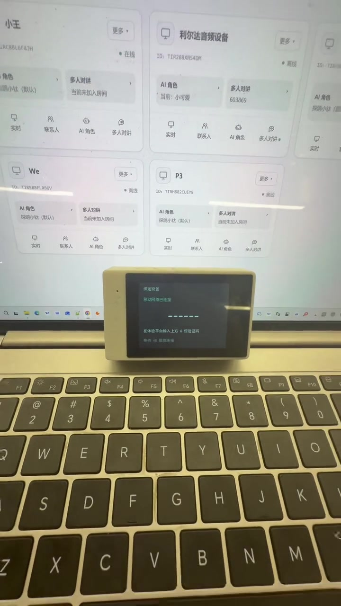
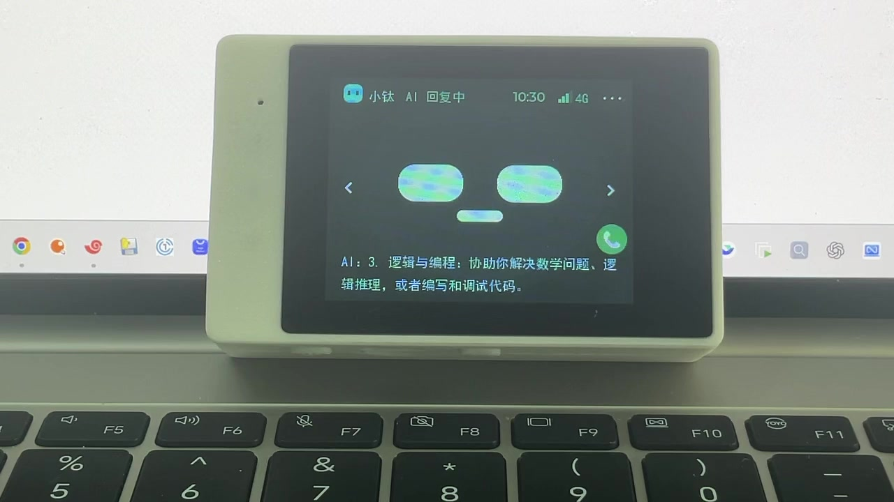
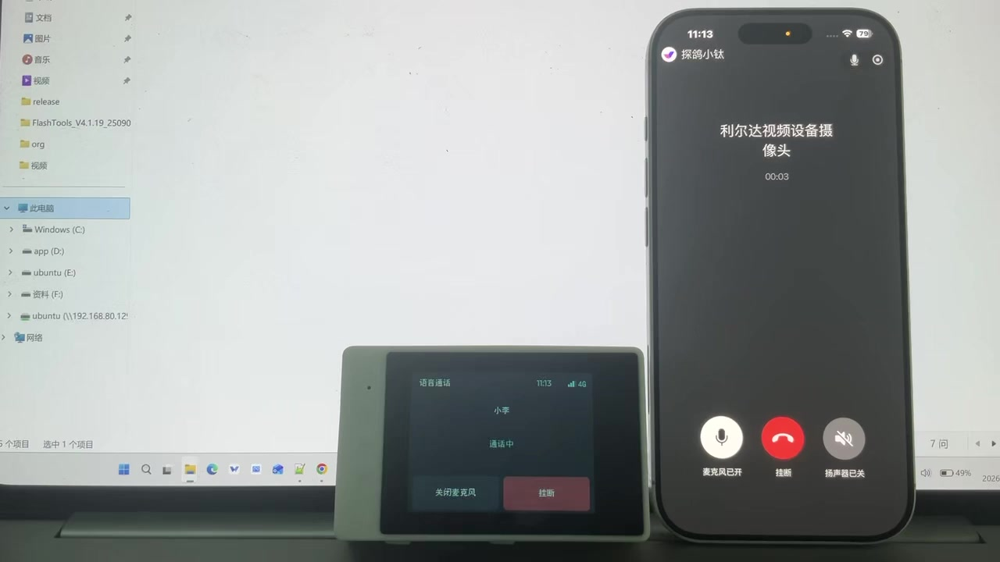
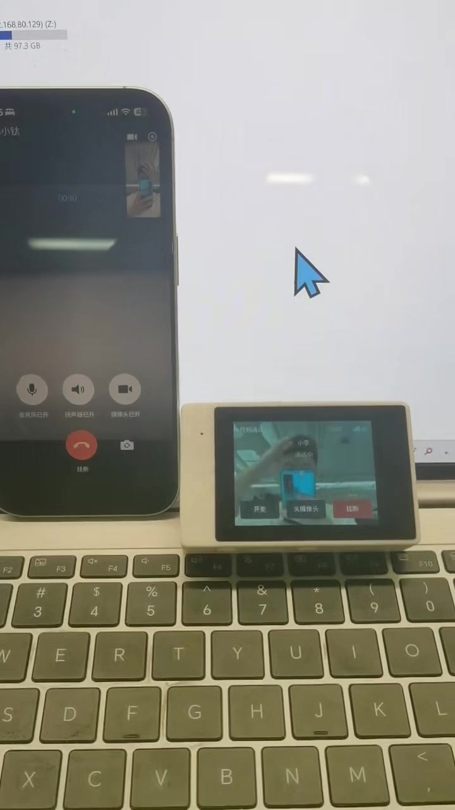
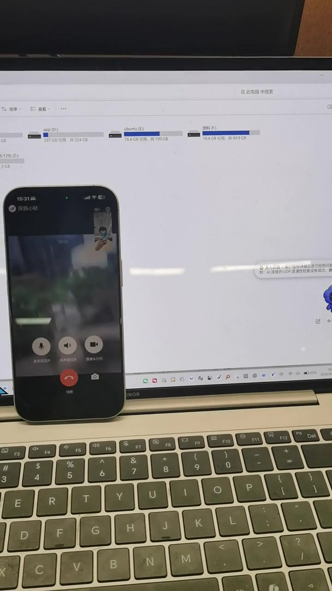
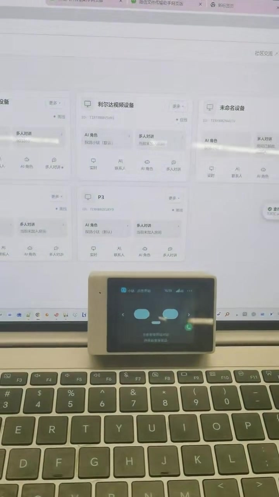

# pro · TiRTC × 利尔达 OpenCPU 触屏音视频示例

[返回产品选择](../../../README.md)

用一台带屏幕、摄像头、麦克风和喇叭的 4G 设备，体验 **AI 对话、AI 呼叫联系人、微信/设备音视频电话、实时查看与远程对讲**。

本项目基于 **L_CT4IT00_YP00W_01_V04 / NT26F6D0（EC718PM）**，展示 TiRTC 如何接入这套 OpenCPU 硬件。先按本文把设备运行起来，再沿文档读懂平台接入、媒体传输和应用代码，最后替换成自己的产品界面与业务。

<p>
  
  
</p>

图为**当前 UI 源码的离线渲染**，使用工程内的字体、图标、背景和布局，原生尺寸 320×240；时间、联系人等为示例数据。不是硬件拍照，也不代表真实连接状态。左右箭头切换表情/时钟，右上角 `···` 打开菜单。

**阅读顺序：** [认识功能](#features) → [看演示](#demo-videos) → [准备硬件](#hardware) → [利尔达教程](#lierda-guides) → [烧录与体验](#run) → [源码接入与开发](#development)。

> 当前代码使用 TiRTC SDK **2.5.0**，应用版本 **47**。双产品目录整理后的应用及资源安装包已独立编译通过，本次尚未烧录。固件下载、校验值和验证范围见 [发布说明](../../../release/tirtc_pro/README.md)。

<a id="features"></a>
## 1. 先看设备能做什么

| 功能 | 从哪里操作 | 当前实现 | 演示 / 操作说明 |
| --- | --- | --- | --- |
| 联网与绑定 | 首次开机按屏幕提示 | 4G 自动联网、六位码绑定、重启恢复身份、断线恢复 | [观看演示](#video-binding) |
| AI 语音对话 | 点首页表情 | 麦克风收音、字幕、喇叭回答、表情/时钟切换 | [观看演示](#video-ai-talk) |
| AI 呼叫联系人 | 对 AI 说“呼叫小李” | 默认视频；明确指定语音时走音频；需配置云端设备插件 | [观看演示](#video-ai-call) |
| 微信音视频电话 | 通讯录 → 微信联系人 | 语音/视频呼出、来电接听/拒绝、关麦/关摄像头、挂断 | [观看演示](#video-wechat-call) |
| 设备间音视频电话 | 通讯录 → 设备联系人 | 同步平台联系人，向另一台已绑定、在线设备发起通话 | [操作说明](docs/当前设备操作.md#device-call) |
| 实时查看与远程对讲 | 平台打开设备实时查看 | 上传摄像头/麦克风，接收远端音频；设备保持首页或时钟 | [观看演示](#video-remote-view) |
| 声音设置与记忆 | 设置页、KEY0/KEY1 | 音量调节、麦克风/扬声器开关、内部 NVM 保存 | [操作说明](docs/当前设备操作.md#settings) |
| 状态查看 | 菜单 → 网络信息/运行状态 | 注册状态、无线质量、内存与存储、运行事件 | [操作说明](docs/当前设备操作.md) |

### 开始前了解这些边界

- 一次保持 **一路媒体会话**；AI、电话、实时查看共用连接和音视频硬件。
- **AI 普通呼叫默认视频**；首页绿色电话仍是“第一位微信联系人”的**语音快捷入口**。手动视频从通讯录选择。
- 视频电话显示远端画面，本机摄像头上传但不显示本地预览小窗。
- 实时查看由远端发起，本地菜单没有开启监控入口；设备显示查看状态，可点红色电话结束。
- “多人对讲”有保留界面，当前尚未接入业务后端；不列为已完成能力。
- 本例由触摸开始 AI，没有实现语音唤醒；AI 播放时抑制麦克风上行，不宣称已经实现 AEC 全双工语音打断。

<a id="demo-videos"></a>
### 操作演示视频

以下 6 段为真实设备录像，按首次使用的顺序排列。点击视频链接，或展开条目后点击封面；仓库页面若没有内嵌播放器，可下载 MP4 播放。横竖画幅均保留原比例，没有把竖屏录像拉伸成横屏。

| 演示 | 时长 | 视频文件 |
| --- | --- | --- |
| 设备绑定与基本信息查看 | 01:29 | [播放 / 下载 · 18.4 MiB](../../../assets/videos/pro/binding.mp4) |
| AI 对话与字幕 | 01:53 | [播放 / 下载 · 7.2 MiB](../../../assets/videos/pro/ai-talk.mp4) |
| 通过 AI 呼叫微信（语音演示） | 00:37 | [播放 / 下载 · 2.9 MiB](../../../assets/videos/pro/ai-call-wechat.mp4) |
| 设备呼叫微信（视频） | 00:53 | [播放 / 下载 · 8.9 MiB](../../../assets/videos/pro/wechat-outgoing.mp4) |
| 微信呼叫设备（视频） | 00:39 | [播放 / 下载 · 10.1 MiB](../../../assets/videos/pro/wechat-incoming.mp4) |
| 网页与微信实时查看 | 00:55 | [播放 / 下载 · 11.3 MiB](../../../assets/videos/pro/remote-view.mp4) |


**演示与当前版本：** 录像未注明对应固件版本；其中 AI 呼叫录像展示的是**语音电话**，当前源码普通 AI 呼叫默认视频、明确要求语音时仍可发起音频通话。录像用于了解操作，不能代替 [发布包验证记录](../../../release/tirtc_pro/README.md)。视频文件的 720p / 30 fps 是录制与分发格式，不是设备摄像头上传参数。

<a id="video-binding"></a>
<details>
<summary>设备绑定与基本信息查看（01:29）</summary>

<a href="../../../assets/videos/pro/binding.mp4"></a>

[播放 / 下载视频（18.4 MiB）](../../../assets/videos/pro/binding.mp4)

从平台绑定到设备信息查看，先了解设备和平台的关系。操作步骤、资源准备及绑定失败检查见 [联网与绑定](docs/当前设备操作.md#binding)。

</details>

<a id="video-ai-talk"></a>
<details>
<summary>AI 对话与字幕（01:53）</summary>

<a href="../../../assets/videos/pro/ai-talk.mp4"></a>

[播放 / 下载视频（7.2 MiB）](../../../assets/videos/pro/ai-talk.mp4)

观察触屏设备的 AI 对话、字幕和语音回答。如何开始、结束及检查有字幕无声音，见 [AI 对话](docs/当前设备操作.md#ai)。

</details>

<a id="video-ai-call"></a>
<details>
<summary>通过 AI 呼叫微信（语音演示）（00:37）</summary>

<a href="../../../assets/videos/pro/ai-call-wechat.mp4"></a>

[播放 / 下载视频（2.9 MiB）](../../../assets/videos/pro/ai-call-wechat.mp4)

这段录像展示 AI 把语音请求转成真实微信电话，设备画面为“语音通话”。要体验当前默认视频策略，按 [AI 角色与插件配置](docs/AI呼叫微信与设备配置详解.md) 设置，再检查真实呼叫页面和对端画面；AI 口头回复不等于已经拨号。

</details>

<a id="video-wechat-call"></a>
<a id="video-wechat-outgoing"></a>
<details>
<summary>设备呼叫微信（视频）（00:53）</summary>

<a href="../../../assets/videos/pro/wechat-outgoing.mp4"></a>

[播放 / 下载视频（8.9 MiB）](../../../assets/videos/pro/wechat-outgoing.mp4)

设备作为主叫、微信接听，观察两端的视频通话。手动视频入口在通讯录，首页绿色电话仍是语音快捷入口，详见 [通讯录和音视频电话](docs/当前设备操作.md#calls)。

</details>

<a id="video-wechat-incoming"></a>
<details>
<summary>微信呼叫设备（视频）（00:39）</summary>

<a href="../../../assets/videos/pro/wechat-incoming.mp4"></a>

[播放 / 下载视频（10.1 MiB）](../../../assets/videos/pro/wechat-incoming.mp4)

微信作为主叫、设备接听，配合上一段了解呼入和呼出两个方向。接听、拒绝、关麦、关摄像头和挂断的说明见 [电话操作](docs/当前设备操作.md#calls)。

</details>

<a id="video-remote-view"></a>
<details>
<summary>网页与微信实时查看（00:55）</summary>

<a href="../../../assets/videos/pro/remote-view.mp4"></a>

[播放 / 下载视频（11.3 MiB）](../../../assets/videos/pro/remote-view.mp4)

远端发起查看，设备上传摄像头画面；声音订阅、按住说话及结束方式见 [实时查看与远程对讲](docs/当前设备操作.md#live)。设备停在首页或时钟页，进入菜单等其他页面会结束本次查看。

</details>

<a id="hardware"></a>
## 2. 准备硬件与账号

| 项目 | 本示例要求 |
| --- | --- |
| 板卡/模组 | L_CT4IT00_YP00W_01_V04，NT26F6D0 / F6D_A；采购时核对带触屏、摄像头的板型 |
| 显示与触摸 | ST7789、FT6336；当前逻辑横屏 320×240 |
| 摄像头/声音 | GC032A、ES8311、麦克风、喇叭 |
| 外置资源存储 | P25Q32SH 4 MiB SPI Flash，配套字体/背景资源 |
| 4G | 能上网的 SIM 卡、接好的天线、稳定供电 |
| 开发电脑 | Windows 10/11、数据 USB 线、USB 驱动、利尔达下载工具；完整工程含工具链 |
| 平台与对端 | [小钛体验平台](https://xiaotai.chat)、微信联系人授权；设备通话另需一台已绑定设备 |

本示例通过 4G 联网，不提供 Wi-Fi 配网页面。不要仅根据外观相似或同为 EC718 就混用底包、引脚和固件；板级依赖说明见 [board_compat](board_compat/README.md)。

<a id="lierda-guides"></a>
## 3. 跟随利尔达教程准备环境

按顺序阅读下面四项，完成驱动、工程和下载工具准备，再回到第 4 节选择 **TiRTC 应用**。

| 顺序 | 官方资料 | 需要完成什么 |
| --- | --- | --- |
| 1 | [利尔达快速体验](https://opendocs.lierda.com/docs/CAT.1_Doc_Protal/zh_CN/general/quick_run_demo.html) | 认识下载、调试串口和开发板连接 |
| 2 | [USB 驱动安装](https://opendocs.lierda.com/docs/CAT.1_Doc_Protal/zh_CN/tools/usb/USB_Driver_Installation_Guide.html) | 让电脑识别模组接口，确认实际 COM 号 |
| 3 | [SDK 快速开始](https://opendocs.lierda.com/docs/CAT.1_Doc_Protal/zh_CN/general/quick_start.html) | 工程目录、编译环境、硬件型号选择 |
| 4 | [固件下载工具说明](https://opendocs.lierda.com/docs/CAT.1_Doc_Protal/zh_CN/tools/flash/flash-tool.html) | 选择镜像、进入下载、确认成功与查看日志 |

[利尔达文档首页](https://opendocs.lierda.com/docs/CAT.1_Doc_Protal/zh_CN/) · [本仓库保留的原始 SDK 英文说明](../../../README_SDK.md) · [原始 SDK 中文说明](../../../README_ZH.md)。

**板卡应用补充：** [NT26FxDx OpenKit 应用指导（含 V04）](https://opendocs.lierda.com/docs/CAT.1_Doc_Protal/zh_CN/examples/NT26FxDx%20OpenKit/NT26FxDx%20OpenKit%20Application%20Guide_Rev0.1.html) · [OpenKit TiRTC 应用开发指导](https://opendocs.lierda.com/docs/CAT.1_Doc_Protal/zh_CN/examples/NT26FxDx%20OpenKit%20TiRTC/NT26FxDx%20OpenKit%20TiRTC%20Application%20Guide_Rev0.1.html)。原始 SDK 中的旧 V04 快速开始链接现已失效，改从这些入口查阅；原始 SDK 说明仍保留原文。官方示例的界面和业务可能与本触屏应用不同，编译选项和操作以本文为准。

官方教程中的硬件 Demo 是通用示例，本产品通过下面的 pro 脚本选择 `APP_VARIANT=pro BUILD_MODE=tirtc`。官方在线 SDK 可能继续更新，本仓库按自己的固定依赖构建，不要求先覆盖为最新公共 SDK。

<a id="run"></a>
## 4. 烧录并体验 TiRTC

### 4.1 选择固件，或从源码编译

直接体验可下载 [pro 最新固件](../../../firmware/pro/latest.binpkg)。这是包含正常应用、配套底包及外置 Flash 字库和背景的**出厂初始化包**，首次使用只需一次烧录。需要编译时，先按 [源码准备](../../../README.md#编译与下载)获取完整仓库，再完成 [Python 环境准备](docs/当前设备操作.md#python-setup)，然后在工程根目录执行：

```powershell
.\build_tirtc.bat pro
```

统一入口自动选择 pro 配置，生成 `firmware/pro/latest.binpkg`。烧录步骤和开发维护入口见 [编译烧录](docs/当前设备操作.md#build-flash)；构建记录与实机验证范围见 [发布说明](../../../release/tirtc_pro/README.md)，不能把编译通过等同于实机验收。

### 4.2 一次烧录固件与 UI 资源

1. **备份外置 Flash 中需要保留的文件**；出厂初始化包会覆盖该文件区，写入配套字库与背景。
2. 结束设备当前媒体会话，关闭占用串口的软件，保持 USB 连接。
3. 在下载工具中启用“自定义镜像”，选择 `firmware/pro/latest.binpkg`，按板型执行全量下载。
4. 等待下载成功后重启，检查字体、背景与触摸，再继续联网绑定；无需另外烧录资源安装程序。详见 [首次资源准备](docs/当前设备操作.md#assets)。

旧资源安装程序保留为开发维护选项，使用方法见 [资源维护说明](resource_store/README.md)。`F6D_A_base.binpkg` 不包含完整业务；也不能将资源安装程序当作正常应用使用。

### 4.3 按这个顺序验收

```text
开机页面和触摸正常 → 4G 移动数据连接 → 平台绑定完成
→ AI 一问一答 → 通讯录手动视频电话 → 来电接听
→ 实时查看和对讲 → 声音设置保存 → 配置 AI 拨号
```

每一步的界面、操作、预期结果、失败检查和错误码都在 [当前设备操作](docs/当前设备操作.md)。先跑通手动通话，再配置 AI 工具，能更快判断问题出在媒体还是工具调用。

<a id="development"></a>
## 5. 从源码接入与二次开发

面向使用者的文档收敛为 **四篇**，按需逐步深入：

| 文档 | 读完可以做什么 |
| --- | --- |
| [① 当前设备操作](docs/当前设备操作.md) | 编译、烧录、绑定、按图体验；查设置记忆范围、常见故障和应用错误码 |
| [② 代码与流程详解](docs/代码与流程详解.md) | 看懂任务分工、状态机、一次通话、媒体管线和资源/性能统计 |
| [③ TiRTC 接口调用与模块流程](docs/TiRTC接口调用与模块流程.md) | 接好身份、连接、媒体、回调和回收；查流号、能力声明、SDK 错误码并移植到自己的产品 |
| [④ AI 呼叫微信与设备配置详解](docs/AI呼叫微信与设备配置详解.md) | 配置角色和 `call_contact`，理解默认视频、协议兼容、联系人匹配与失败返回 |

业务源码集中在 [`examples/L_CT4IT00_YP00W_01_V04/tirtc_pro`](.)。从 [`user_main.c`](user_main.c) 看启动和动作分发，再按业务进入 `ai`、`calls`、`remote`；硬件采播在 `media/video/port`，SDK 生命周期在 `runtime`。

本产品与 lite 共用公共 SDK 源码和工具链，业务代码各自在独立目录内。本产品必要的底包与兼容处理集中在 `tirtc_pro/board_compat`，TiRTC 库与对应头文件在自己的 `sdk` 中。它们是构建依赖，不能当“备份”删掉；原厂 `app/demo` 保持独立。历史同步范围见 [SDK_DIFF.md](SDK_DIFF.md)。

未来可共享的是 TiRTC 连接/媒体/错误码概念及 AI 工具协议；触屏布局、GPIO、摄像头方向、存储布局、实际代码路径和默认配置属于本产品，不能直接套给另一块板。更细的复用说明见 [文档目录](docs/README.md)。

本仓库已按 `tirtc_lite / tirtc_pro` 分别维护两个产品；[双产品构建与依赖](docs/README.md#two-products) 说明目录和输出隔离方式。pro 的操作说明、视频和设置行为只适用于本产品，lite 请从 [仓库首页](../../../README.md) 选择对应入口。

## 参考与许可

- [TiRTC 产品文档](https://docs.tange.ai/products/tirtc/)：实时音视频产品及接入资料。
- [小钛利尔达参考工程](https://github.com/tangeai/xiaotai-lierda)：本页采用其“功能—硬件—官方教程—烧录—开发”阅读顺序，操作与参数以当前触屏产品源码为准。
- [小钛 ESP32 参考工程](https://github.com/tangeai/xiaotai-esp32)：UI 与产品交互参考，不能直接照搬其硬件参数。
- [设备能力协议](https://github.com/tangeai/tirtc-server-example/blob/main/thing-connect/api-reference.md)：服务端业务与能力声明参考，部署服务版本需与设备配套。
- 仓库及第三方代码保留各自许可；TiRTC 预编译 SDK 遵循独立协议，详见 [SDK 分发说明](sdk/README.md) 与 [仓库许可](../../../LICENSE)。
