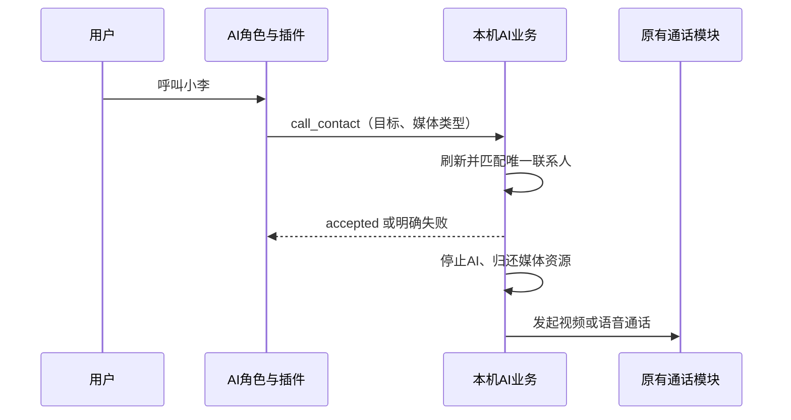
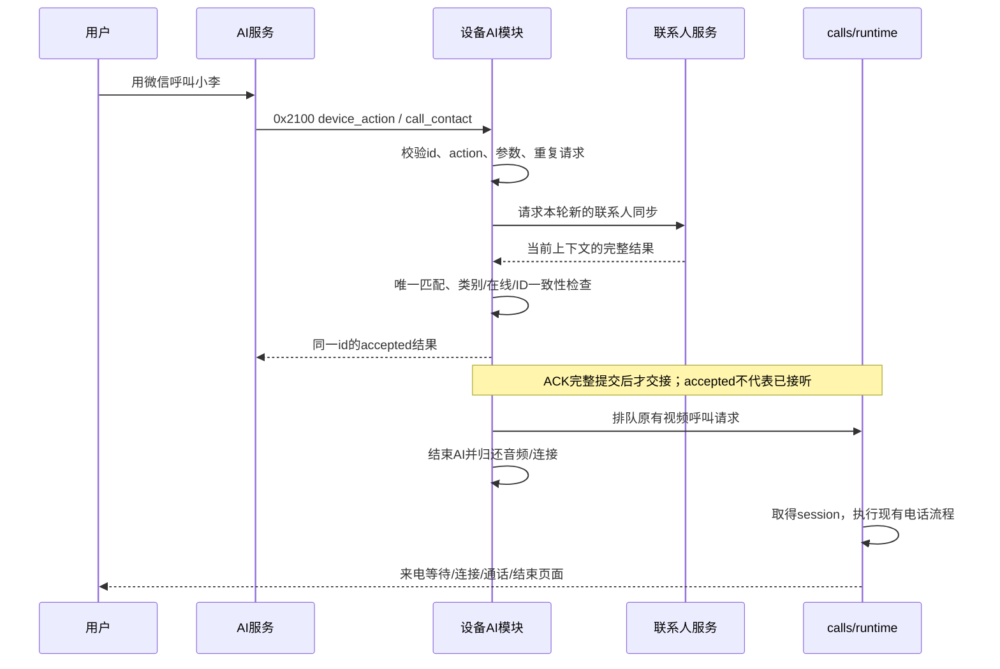

# AI 呼叫微信与设备配置详解

本示例可以通过 AI 语音要求，呼叫通讯录中的微信用户或另一台设备，并自动切换到原有通话页面。

**本摄像头产品普通呼叫默认视频；用户明确要求语音时，工具传音频类型。**

[项目首页](../README.md) · [文档目录](README.md) · [上一篇：TiRTC 接入](TiRTC接口调用与模块流程.md) · [手动体验电话](当前设备操作.md)

**按需跳转：** [配置与调用关系](#setup-picture) · [完整交接时序](#handoff) · [工具返回示例](#tool-replies) · [业务错误状态](#tool-status) · [测试用例](#test-cases)

## 1. 先理解这项功能

```text
用户说“用微信呼叫小李”
→ AI识别意图并下发call_contact工具命令
→ 设备刷新通讯录、确认唯一目标
→ 回复已受理，结束AI会话
→ 调用现有微信视频电话流程
→ 对端接听，进入通话页面
```

AI 对话本身是音频会话，它通过工具操作设备，转接到视频电话。AI 口头说“正在呼叫”并不代表工具已经执行；以真实通话页面和设备命令日志为准。

[观看 AI 呼叫微信演示](../README.md#video-ai-call)：现有录像展示的是**语音通话**，用于了解从 AI 到真实电话的交接；当前代码普通呼叫默认视频，配置方式见下文。录像未标明固件版本，不能代替 47 版默认视频的实机验收。

## 2. 使用前准备

1. 设备完成平台绑定，AI 对话已经正常。
2. 在平台建立微信授权关系或设备联系人关系。
3. 设备通讯录能看到目标，并能手动完成视频通话。
4. 确认设备使用的固件包含当前 AI 呼叫功能；构建与验证状态见 [发布说明](../../../../release/tirtc_pro/README.md)。

先验证手动电话，是为了把平台关系、对端在线与媒体问题和 AI 工具配置分开。

## 3. 配置设备使用的 AI 角色

在平台打开**这台设备实际绑定的智能体/AI 角色**，添加或修改设备插件。平台界面名称可能随版本变化，关键是动作名、参数、插件启用和角色绑定保持一致。

<a id="setup-picture"></a>


平台页面可能随服务版本更新；云端配置项以实际部署版本为准，设备字段按下面的协议表填写。

原 GitHub 纯音频产品的角色规则写有“只支持语音”，本设备应使用下方的视频版本。写好文档和刷入固件都不会替用户创建、保存或启用云端角色。

### 3.1 插件信息

| 字段 | 建议填写 |
| --- | --- |
| 名称 | 呼叫联系人 |
| Action / 动作名 | `call_contact` |
| 描述 | 根据用户明确要求，呼叫通讯录中的微信或设备联系人；普通呼叫默认视频，明确只要语音时使用音频 |

### 3.2 输入参数

| 参数 | 类型 | 必填 | 填写规则 |
| --- | --- | --- | --- |
| `target` | string | 是 | 服务器选用的完整联系人名称或 `device_id`；不包含“呼叫”“微信”等操作词 |
| `contact_type` | string | 否 | 微信 `wechat`，设备 `device`；未确定时省略 |
| `call_type` | string | 否 | 视频 `video`，音频 `audio`；本设备缺省为视频 |

`target` 不设置固定人名默认值，`contact_type` 不固定为微信。如果平台要求设置通话类型默认值，填 `video`。

名称不是任选一个别名：设备按 `remark → device_name → name → nickname` 取**第一个非空值**，用它的完整内容匹配。例如服务器设置了备注“小李”，就以“小李”或该联系人的 `device_id` 呼叫，不再同时匹配被备注覆盖的昵称。UI 可能截短长名称，语音工具仍需完整名称。

返回参数可以声明 `ok`（boolean）和 `message`（string），不要把固定“成功”填成默认返回。设备会按实际处理返回受理或错误。

### 3.3 可直接采用的角色规则

```text
当用户明确要求联系某个联系人时，执行 call_contact 设备工具。
target 使用服务器选用的完整联系人名称或 device_id，不自行编造目标。
明确说微信时传 contact_type=wechat，明确说设备时传 device。
未指定类别时省略 contact_type；目标不明确时先询问用户。
本设备带摄像头，普通呼叫和视频电话使用 call_type=video。
仅在用户明确要求语音或音频时使用 call_type=audio。
收到 accepted 只说明正在发起呼叫，不能说对方已经接听。
同名、未找到、离线、设备忙或查询失败时据实说明，不自动换人拨打。
```

若旧角色写有“只支持语音”“视频请求告知不支持”，替换冲突规则。固件默认视频不会自动修改云端角色，也不会自动开启插件。

### 3.4 保存并启用

保存角色和插件，确认插件已启用、角色已绑定到本设备，再结束旧 AI 会话并重新开始。

## 4. 体验一次 AI 视频电话

先使用通讯录里一个唯一、完整的名称，例如：

| 说法 | 预期工具参数/结果 |
| --- | --- |
| “用微信呼叫小李” | wechat，默认视频 |
| “给客厅设备打视频电话” | device，video |
| “呼叫小李” | 不指定类别，唯一匹配后默认视频 |
| “只用语音呼叫小李” | audio |

观察设备由 AI 会话进入呼叫页面，对端接听后检查画面与声音。挂断后不会自动重开 AI，可回首页再次开始。

本策略只影响 AI 工具呼叫，通讯录的语音按钮和首页语音快捷入口继续保持原行为。

## 5. 云端下发的命令是什么样

推荐使用以下结构；这是命令示例，不是串口 AT 指令：

```json
{
  "jsonrpc": "2.0",
  "id": "call-example-001",
  "method": "device_action",
  "params": {
    "action": "call_contact",
    "data": {
      "target": "小李",
      "contact_type": "wechat",
      "call_type": "video"
    }
  }
}
```

AI 服务通过命令 `0x2100` 将 JSON 交给设备。设备按请求 `id` 返回结果，受理成功的 `status=accepted` 只表示开始处理呼叫，不表示对端已接听。

当前也兼容 `call_intent / ai_call_intent` 等既有方法及常用参数别名。新接入优先使用上面的标准结构，完整兼容规则见 [ai/ai_call_protocol.c](../ai/ai_call_protocol.c)。

#### 已实现的兼容边界

- 接受有效旧式 `call_intent/ai_call_intent`；仍需 `jsonrpc:"2.0"`、有效 id 和对象 params，不能以无编号通知直接拨号。
- 兼容 `call_device`、`call_wechat`、`start_voip_call` 等 action；同时支持参考工程的 `target_name`、`target_id`、`channel`、`source`、`room_type` 等别名。
- 同时给名称和 ID 时必须匹配同一条服务器联系人；明确的非法字段不会被低优先级别名悄悄覆盖。
- id 可为非空且不超过 96 字节的字符串，或 ±9007199254740991 范围内的整数；回复保留原编号类型，拒绝浮点/越界编号。
- target 去除首尾空白后最多 256 字节；不做模糊匹配或猜名字。

旧式请求示例：

```json
{"jsonrpc":"2.0","id":7,"method":"call_intent","params":{"target_name":"小李","channel":"wechat","media":"video"}}
```

兼容是为了接收既有协议，不建议新插件同时发送一组互相冲突的别名。

媒体规则为：省略/空字符串默认视频，`video` 为视频，`audio/voice` 为音频；不接受 `null`。为兼容旧请求，媒体字段中的已知联系人类别（如 `call_type=wechat/device`）也可解析为默认视频，并在没有显式类别时补充联系人范围。**新插件仍应拆开 `contact_type` 和 `call_type`**，避免依赖旧别名。

## 6. 设备端怎样避免误拨

入口：[ai/tirtc_ai.c](../ai/tirtc_ai.c)、[ai/ai_call_protocol.c](../ai/ai_call_protocol.c)。

- 每次呼叫等待本轮新的通讯录同步，不立即使用旧缓存。
- 按服务器选用的完整名称或 `device_id` 匹配；名称取值顺序见第 3.2 节。同名、类别不清或列表不完整时，不随便选第一位。
- 同时给出名称和目标 ID 时，二者必须指向同一联系人。
- 查询超时、断网、身份改变或用户取消后，迟到结果不再拨号。
- 工具 ACK 完整提交后才转交原 calls 模块；AI 连接和音频释放后再建立电话。
- 微信视频请求携带 `wx_room_type=video`，设备视频请求携带 `call_type=video`。

当前本地联系人上限 12 条，AI 等待新同步最多 12 秒。目标超限或不可用时会明确失败，不自行换联系人。

## 7. 配好了但没有拨号，怎么查

常态必要日志可以看到：

```text
[AI-CALL47] enabled default=video explicit_audio=1 legacy=1
[AI-CALL] received method=... scope=... video=1
[AI-CALL] status=... send=... bytes=...
[AI-CALL] handoff wx=1 video=1
```

| 现象 | 排查位置 |
| --- | --- |
| AI只口头说话，没有received | 先找 `[AI-CALL] ignored` 或失败 `status`，消息可能在早期校验被拒绝；都没有再查实际角色、插件开关、设备版本及云端下发 |
| received显示video=0 | 云端明确传了audio/voice，检查角色和参数默认值 |
| 有received、无handoff | 参数、联系人同步、唯一性、设备忙或ACK失败 |
| 有handoff、对端没有接听 | 进入普通calls流程排查平台、网络、对端状态 |
| AI口头说只支持语音 | 同时查角色限制和设备收到的命令，不能仅凭口头回答判断硬件能力 |

`handoff` 表示交给电话模块；`wx=1` 是微信，`wx=0` 是设备。继续观察通话状态和实际画面，才算完成一次验证。

## 8. 上线前验证与跨产品复用

对微信和设备分别验证：默认视频、明确语音、同名/不存在目标、对方拒绝、无人接听、取消、挂断后重开 AI。确认失败不会误拨或重复呼叫。

插件配置方法和工具到电话的交接流程可供其他产品复用；**默认媒体类型与实际能力必须按产品决定**。纯音频产品不能照搬本设备“默认视频”的角色规则。

## 9. 配置时最容易混淆的四件事

### 9.1 参数名不是参数值

平台添加输入参数时，名称填写 `target`，不是“小李”；用户说“呼叫小李”后，AI 才把“小李”填进参数值。参数类型为 `string`，必填目标不能传空字符串。

`contact_type` 区分联系人类别；`call_type` 区分媒体类型。下面这个目标既是微信联系人，又使用视频，二者可以同时成立：

```json
{
  "target": "小李",
  "contact_type": "wechat",
  "call_type": "video"
}
```

这是工具参数片段；完整的 `device_action` 消息仍按第 5 节包装。

### 9.2 固件默认值不会覆盖明确参数

当前解析器缺省视频，但收到 `call_type=audio` 或 `voice` 时仍尊重语音请求。因此“固件支持视频”与“云端这一次传了视频”需要分别确认。

| 下发情况 | 当前解析结果 |
| --- | --- |
| 不提供 `call_type`，或提供空字符串 | 默认视频 |
| `call_type=video` | 视频 |
| `call_type=audio / voice` | 语音 |
| 旧式 `call_type=wechat / device` | 默认视频；没有显式联系人类别时同时采用该类别，供旧协议兼容 |
| 非空但不支持的媒体值 | 返回 `unsupported_call_type` |
| 类型不是字符串等非法结构 | 返回 `invalid_params` |

新接入对没有值的可选参数优先省略，不依赖空字符串兼容。不要传 `null`、数字或自行发明 `video_call` 等值。

### 9.3 插件必须作用于设备正在使用的角色

在另一个测试角色上配置正确，并不会改变这台设备。依次确认：设备绑定哪个角色 → 该角色有此设备工具 → 工具已启用 → 改动已保存 → 已重启 AI 会话。

配置完成仍只口头拒绝视频时，先找是否存在旧的“仅音频”“不允许视频”角色规则，再查设备的 `received`、`ignored` 和 `status`。无效编号、参数错误或忙碌等分支可能在打印 `received` 前返回，不能把“没有 received”直接认定为“云端没有下发”。

### 9.4 联系人关系由平台提供

设备从平台同步可呼叫联系人，不从手机系统通讯录随意搜索。微信授权关系、另一台设备的关系与在线状态，应先通过手动拨号验证。

同名联系人可以通过 `contact_type` 限定范围；同类别仍有重名时，使用唯一 ID 或调整备注，设备不会挑第一条。

<a id="handoff"></a>
## 10. 一句语音怎样变成一次真实电话



### 代码入口逐层看

| 入口 | 职责 |
| --- | --- |
| `ai/ai_call_protocol.c: ai_call_parse` | 校验工具消息，解析媒体与联系人范围 |
| `ai/tirtc_ai.c: call_reply` | 用原请求 ID 返回受理/失败，检查完整发送 |
| `contacts/tirtc_contacts.c` 的解析、刷新和匹配接口 | 取得新列表、关联当前上下文、唯一匹配 |
| `calls/tirtc_calls.c: tirtc_calls_dial_contact` | 接受已解析联系人和媒体类型，复用现有电话业务 |
| `calls/calls_protocol.c` | 生成微信 `wx_room_type` 或设备 `call_type` 请求 |

具体函数声明以 [解析头文件](../ai/ai_call_protocol.h)、[通讯录头文件](../contacts/tirtc_contacts.h) 和 [电话头文件](../calls/tirtc_calls.h) 为准。云端只触发工具，设备仍负责检查当前资源和联系人，不能跳过这些条件直接建连。

<a id="tool-replies"></a>
## 11. 设备返回的结果长什么样

以下依据 `ai_call_reply_json()` 的结构给出示例；不包含真实联系人或平台凭据。

### 已受理微信视频呼叫

```json
{
  "jsonrpc": "2.0",
  "id": "call-example-001",
  "result": {
    "message": "已受理呼叫，正在切换",
    "ok": true,
    "status": "accepted",
    "contact_type": "wechat",
    "call_type": "video"
  }
}
```

这是设备已完成目标检查并准备转交电话模块，随后仍可能遇到用户取消、网络变化、对方拒绝或连接失败。角色应回答“正在呼叫”，不能据此说“对方已接听”。

### 没有找到联系人

```json
{
  "jsonrpc": "2.0",
  "id": "call-example-001",
  "error": {
    "message": "没有找到联系人，请使用完整备注或 ID",
    "code": -32000,
    "data": {
      "ok": false,
      "status": "not_found"
    }
  }
}
```

这里 `-32000` 是工具回复中的通用业务错误，具体原因在 `error.data.status`。它不是 TiRTC 的连接错误码，不能据此判定网络中断。

<a id="tool-status"></a>
## 12. 工具状态、原因与处理

| `status` | 当前含义 | 怎样处理 |
| --- | --- | --- |
| `accepted` | 目标检查通过，受理转接 | 等真实电话页面/接听结果 |
| `invalid_params` | 消息或参数无效 | 核对 JSON-RPC、id、action、字符串类型、目标内容 |
| `unsupported` | 不支持此设备动作 | 新配置使用 `call_contact` |
| `unsupported_call_type` | 非空媒体类型不受支持 | 使用 `video` 或 `audio`；本产品支持视频 |
| `not_found` | 找不到唯一对应目标，或名称/指定 ID 不一致 | 使用通讯录完整名称、备注或正确 ID |
| `ambiguous` | 名称/类别不能唯一确定目标 | 补充微信/设备类别或唯一 ID |
| `offline` | 目标设备当前离线 | 等目标上线；不假定微信联系人也有同等在线状态 |
| `contacts_timeout` | 本轮刷新未在 AI 等待时间内完成 | 检查通讯录服务和网络，再重新发起 |
| `contacts_unavailable` | 无法获得可用于安全拨号的本轮列表 | 看鉴权、同步、列表截断/完整性和上下文 |
| `busy` | 已有呼叫或当前工具请求在处理 | 等待结束，不重复说话制造多次拨号 |

解析器对重复字段、非法 ID、控制字符和过长内容等进行校验；修复应在云端生成有效参数，不通过放松本地校验绕过。

### 一条最短的排查路径

```text
没有 received
  → 先查 ignored / 失败 status，排除早期校验和忙碌拒绝
  → 仍无工具处理记录，再查实际角色、插件开关和服务下发
received 中 video=0
  → 看是否明确传了 audio/voice
received 后返回失败 status
  → 按上表检查参数、联系人和忙碌状态
accepted 但没有 handoff
  → 看 ACK 完整提交、是否取消、会话是否仍有效
handoff wx=1 video=1
  → 已交给微信视频流程，继续查 CALL22 / 平台 / TiRTC
```

常态保留关键 `AI-CALL` 日志；不要为了观察工具执行而长期打印完整 token、授权或个人联系人列表。

<a id="test-cases"></a>
## 13. 用这组例子验收，不只测一句成功指令

| 测试 | 预期 |
| --- | --- |
| “用微信呼叫小李” | 唯一微信目标，默认视频 |
| “给客厅设备打视频电话” | 在线设备目标，视频 |
| “只用语音呼叫小李” | 音频，不强制改成视频 |
| 名字不存在 | 返回未找到，不换人 |
| 两个联系人同名 | 要求明确，不任选一人 |
| 明确的设备联系人离线 | 提示离线，不持续拨号 |
| 刷新时掉网/重新绑定 | 旧结果不触发新呼叫 |
| 短时间重复同一请求 | 不重复创建电话 |
| 已受理后取消或切页 | 按当前状态取消/停止，不让迟到结果再次拨号 |
| 对端拒绝、无人接听或主动挂断 | 正常收尾，不残留麦克风/摄像头占用 |
| 挂断后重新开始 AI，再次拨号 | 下一次会话正常 |

验证记录应同时覆盖“云端生成的命令”“设备受理和交接”“对端接通与媒体”。只看到编译成功或听到 AI 口头回答，都不等于整项功能已经实机验收。
