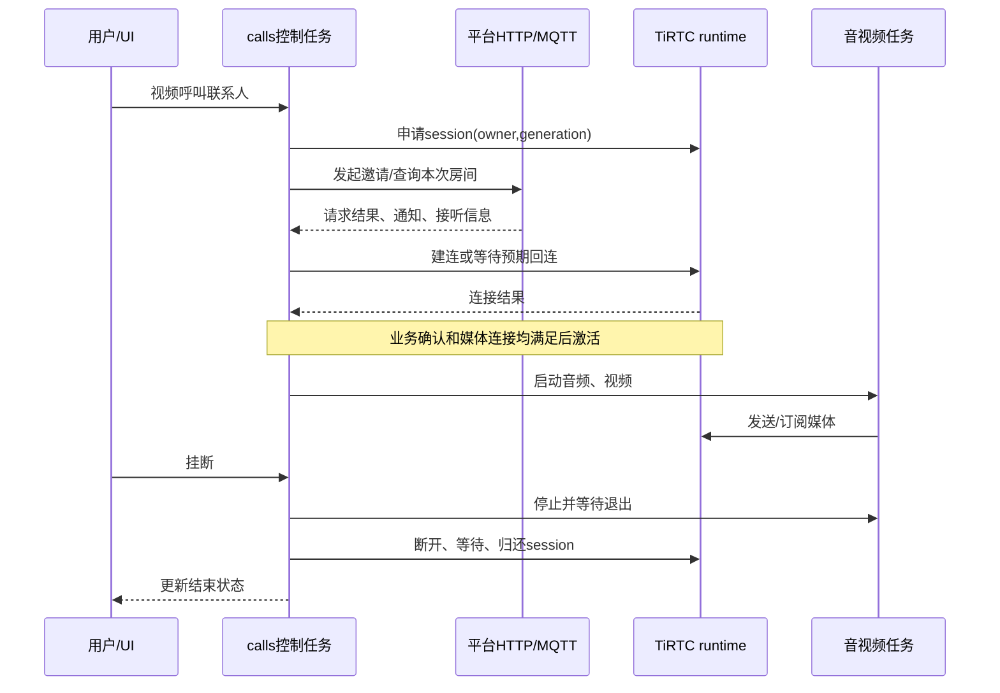

# TiRTC 接口调用与模块流程

本篇面向准备接入 TiRTC 的开发者。以这套利尔达触屏摄像头示例为参考，说明 **设备怎样上线、怎样建立通话、怎样收发声音和图像，以及怎样迁移到自己的产品**。

[项目首页](../README.md) · [文档目录](README.md) · [上一篇：代码结构](代码与流程详解.md) · [下一篇：AI 呼叫](AI呼叫微信与设备配置详解.md)

**阅读路线：** 前 10 节完成一次接入；后半篇按需查接口、回调、帧头、能力声明、错误码和移植步骤。

[业务协议对照](#protocols) · [API 与回调](#api-reference) · [媒体帧头](#frames) · [能力声明](#profile) · [SDK 错误码](#sdk-errors) · [迁移清单](#porting)

## 1. 接入时先分清三部分

| 部分 | 负责什么 | 本工程位置 |
| --- | --- | --- |
| 平台业务 | 设备绑定、访问凭据、联系人、呼叫邀请、房间信息 | `platform / contacts / calls` |
| TiRTC SDK | 连接建立、媒体和命令传输、连接事件 | `sdk / runtime` |
| 本地设备 | 录音、播放、摄像头采集编码、视频解码和显示 | `media / video / port / ui` |

例如“呼叫微信联系人”不是只调用一次发送视频接口：设备先向平台发起业务请求，取得本次连接信息，再由 TiRTC 建立媒体连接，最后启动采集与播放。

基于本示例开发，可以复用这些流程；不需要从头把每个 UI 按钮直接接到 SDK。

### 第一次接触时，先认清这些词

| 名词 | 在本示例里怎么理解 |
| --- | --- |
| SDK | 可供应用调用的库与接口；本例的 TiRTC `.a` 库和头文件配套使用 |
| 平台信令 | “谁呼叫谁、是否接听、哪个房间”等业务消息，区别于实际声音和图像 |
| MQTT | 设备与平台接收/发布通知的消息通道 |
| session / generation | 一次媒体会话 / 这次会话的代次，用于区分先后两次连接 |
| WHIP 连接 | 本例 AI 和微信业务使用的建连入口，消费各自平台提供的服务描述和凭据 |
| PCM / A-law | PCM 是采样后的音频数据；A-law 是本例传输所用的音频编码 |
| MJPEG | 以一张张 JPEG 组成的视频；分辨率、帧率和单帧大小分别影响效果和负载 |
| ACK | 对请求的确认；“已受理”不等于整项业务已经完成 |
| ABI | 编译产物间约定的调用、数据布局等兼容规则；决定头文件和库能否正确配合 |
| NVM | 掉电后仍保留数据的存储，本例保存身份和音频偏好 |

## 2. 接入前准备

### 2.1 设备端

- 能稳定上网的网络接口；本示例使用 4G。
- 可用的任务、锁、时间、内存、网络套接字等底层能力。
- 麦克风录音和喇叭播放接口。
- 视频产品还需摄像头采集、编码、接收解码和显示接口。
- 与芯片、工具链及 ABI 匹配的 TiRTC 库和头文件。

当前使用 TiRTC 2.5.0，库及配套头文件在 [sdk](../sdk)，链接适配在 [runtime/runtime.mk](../runtime/runtime.mk)。升级时成套更换并核对兼容层；相同芯片名称不能替代 ABI 检查。

### 2.2 平台端

准备设备接入服务、正式设备身份、AI 角色、微信授权或设备联系人关系。直接体验当前示例可沿用配套平台流程；接入自己的业务后台时，由后台提供相应身份、业务和连接信息。

本工程的服务发现入口定义在 [platform/device_binding.c](../platform/device_binding.c) 的 `BIND_DISCOVERY_URL`。更换平台不只是改一个 URL，还要保证服务发现、鉴权、MQTT 和呼叫协议与设备一致。

## 3. 第一步：联网并取得正式身份

```text
SIM注册与移动数据连接
→ 服务发现
→ 首次设备上报、显示绑定码
→ 收到绑定授权并可靠保存
→ 获取正式token
→ 连接正式MQTT并完成订阅
```

本示例相关请求：

| 请求 | 用途 |
| --- | --- |
| `GET /services` | 发现设备、AI、通话等服务入口 |
| `POST /v1/device/report` | 首次设备上报及临时绑定流程 |
| `POST /v1/device/token` | 使用正式授权申请访问 token |
| `GET /v1/call/device/contacts` | 同步可呼叫联系人 |
| `POST /v1/device/profile` | 上报设备媒体能力 |

首次授权保存在设备侧，正常重启恢复身份，不重复要求用户绑定。正式 MQTT 负责来电、接听、挂断、联系人变更等消息，媒体另由 TiRTC 传输。

复用平台请求时，优先使用 [device_binding.h](../platform/device_binding.h) 的 `demo_binding_service_request_guarded()`。它把请求与当前身份、凭据和网络上下文关联，防止旧响应在重连或重绑后继续生效。

**验证点：** 设备绑定完成，正式消息订阅成功，通讯录可正常同步。到这一步只证明业务在线，还没有证明媒体可用。

## 4. 第二步：启动 TiRTC 服务

本工程由 `tirtc_runtime_start_service()` 启动唯一管理任务。待正式身份与网络可用后，它完成：

```text
配置日志、发送缓冲
→ TiRtcInit
→ 设置最大连接数、网络类型、服务地址和身份相关选项
→ TiRtcStart
→ 等待服务就绪事件
```

当前配置：

| 配置 | 值/原则 |
| --- | --- |
| `TIRTC_OPT_MAX_SEND_BUFFER` | 128 KiB，须在 `TiRtcInit` 前设置 |
| 最大媒体连接数 | 1 |
| 网络及身份 | 从当前网络、正式绑定上下文取得 |
| 常态日志 | 保留启动与必要错误，关闭周期调试刷屏 |

已有 runtime 时，不要再从业务模块调用第二套 `TiRtcInit/Start`。任务已创建、Start 已提交和服务已就绪是三个阶段，连接请求应等到就绪后发起。

**验证点：** TiRTC 服务报告就绪，可以接受下一步会话申请。

## 5. 第三步：管理一次连接

本工程使用 `owner + generation` 管理连接：owner 是 AI、微信、设备电话或 LIVE，generation 表示具体哪一次会话。所有者和代次可防止迟到回调操作下一次电话。

| 受管接口 | 用途 |
| --- | --- |
| `demo_tirtc_session_claim` | 申请本次会话使用权 |
| `demo_tirtc_connect` | 普通连接，内部调用 `TiRtcConnect` |
| `demo_tirtc_whip_connect` | AI / 微信连接，内部调用 `TiRtcWhipConnect`；由各业务提供参数 |
| `demo_tirtc_expect_incoming` | 为设备电话预留本次回连 |
| `demo_tirtc_adopt_incoming` | 接管平台发起的 LIVE 连接 |
| `demo_tirtc_disconnect` | 结束本次连接 |
| `demo_tirtc_session_release` | 安全回收完成后归还使用权 |

完整声明见 [runtime/tirtc_runtime.h](../runtime/tirtc_runtime.h)。

正常顺序是：**取得使用权 → 建连 → 收发媒体 → 停止媒体 → 断开并等待清理 → 归还使用权**。BUSY 也可能表示上一会话还在退出，应等待，而不是强行清空所有者。

**验证点：** 连上之后能够正常断开，并立即开始下一次完整连接，没有残留摄像头、音频或旧回调。

## 6. 第四步：接入麦克风和喇叭

### 本机音频数据

本示例采用 8 kHz、单声道、16 位 PCM；每 20 ms 为 160 个采样、320 字节 PCM，经 A-law 编码后为 160 字节。

```text
录音接口 → PCM → A-law编码 → demo_tirtc_send_audio
on_audio回调 → 有界队列 → A-law解码 → PCM → 播放接口
```

受管接口内部对应 `TiRtcSendAudioStream`、`TiRtcSubscribeAudio`。硬件复用入口为 [media/audio_device.h](../media/audio_device.h)，电话和 LIVE 的队列处理见 [calls/calls_audio.c](../calls/calls_audio.c)。

换音频器件时，先确认本地录放正确，再接网络，重点核对采样率、声道、PCM 字节格式、采样数与字节数的区别，以及增益、功放和停止时序。

### 回调处理规则

SDK 提供的音频数据通常只在回调期间有效。需要异步播放时，在返回前复制到有界队列，不保留借用指针；不要在回调中等待喇叭播放完成。

麦克风和扬声器开关应作用到真实数据/硬件路径，不能只改 UI 图标。当前 AI 播放有收音门控，完整电话双向收发不等于已实现 AEC。

**验证点：** 先让远端听到设备，再让设备播放远端声音，最后验证双向和静音/音量控制。

## 7. 第五步：接入摄像头和显示

### 采集与上传

本示例使用 GC032A，采集端输出 320×240 YUYV，编码为 MJPEG，质量 50；上行编码/发送调度目标为 15 fps，实际采集和提交速率分别统计：

```text
摄像头完整帧
→ JPEG编码
→ 填写帧媒体类型、流号、时间戳、长度
→ demo_tirtc_send_video
→ TiRtcSendVideoStream
```

编码输入格式必须与采集输出一致。JPEG 中应包含完整且正确的图像信息；不能把原始 YUYV/RGB 数据直接标成 MJPEG 发送。

### 接收与显示

```text
订阅视频 → on_video回调 → 复制完整JPEG
→ 工作任务解码 → 方向与大小处理 → 发布给UI
```

对应受管接口为 `demo_tirtc_subscribe_video()`、`tirtc_video_receive()`，实现见 [video/tirtc_video.c](../video/tirtc_video.c)。解码和刷屏在工作任务/UI 任务完成，SDK 回调只做校验和复制。

当前接收路径只处理符合限制的 JPEG：单帧不超过 **64 KiB**，宽高各不超过 **640**，总像素不超过 **640×480**；解码器入口要求 **8 位基线 JPEG、1 或 3 个分量**。超限或格式不符会拒收/丢弃，不能只修改平台分辨率声明就认为本机能够显示任意输入。

当前双向视频主缓冲约 566 KiB，LIVE 主缓冲约 364 KiB，还要预留网络、音频、UI、任务栈和编解码器对象内存。提高分辨率前同时核对连续内存、编解码耗时和网络负载。

### 上报真实能力

`tirtc_video_profile_json()` 为不同场景生成能力，提交到 `/v1/device/profile`：

| 场景 | 用途 | 本示例主要区别 |
| --- | --- | --- |
| `call` | 设备间电话 | A-law音频、MJPEG上下行 |
| `voip` | 微信电话 | 声明144×192下行处理区域及微信方向/填充参数 |
| `stream` | 平台实时查看 | 视频只上传，音频可双向，摄像头方向声明90° |

能力声明要与真实编解码实现一致。改声明不会自动改变摄像头采集分辨率；上传、接收、画布和屏幕尺寸可以不同。

**验证点：** 红蓝白物体颜色正确，人物方向正确；微信呼入、呼出和 LIVE 分别验证，不能只通过其中一路就认定全部正确。

## 8. 第六步：串起具体产品功能

### 8.1 AI 对话

```text
平台获取AI访问凭据
→ 申请AI会话并连接
→ 0x2100命令协商start_session
→ 上传麦克风、接收回复和字幕
→ end_session/本地结束
→ 回收媒体和连接
```

入口：[ai/tirtc_ai.c](../ai/tirtc_ai.c)。AI 语音工具发起电话的配置另见 [AI 呼叫篇](AI呼叫微信与设备配置详解.md)。

### 8.2 微信电话

```text
选微信联系人
→ POST /v1/voip/device/call
→ 关联本次通知和房间
→ 获得服务描述与凭据
→ TiRtcWhipConnect
→ 接通后启用媒体
```

视频传 `wx_room_type=video`，语音传 `voice`。微信来电由正式 MQTT 触发，用户接听后进入对应连接流程。

### 8.3 设备间电话

```text
主叫预留本次回连
→ POST /v1/call/request
→ 被叫收到邀请并处理接听
→ 获取房间/对端信息并连接回来
→ 业务接听与媒体连接都满足后通话
```

视频传 `call_type=video`，语音传 `audio`。设备互呼不能简单实现成双方同时主动建连；应沿用示例的邀请、回连、确认和取消顺序。

微信和设备电话共用 [calls/tirtc_calls.c](../calls/tirtc_calls.c) 与 [calls/calls_protocol.c](../calls/calls_protocol.c)。

### 8.4 实时查看与远程对讲

```text
设备空闲待机
→ 平台发起被动连接
→ LIVE接管
→ 订阅后开始摄像头/麦克风上行
→ 接收远端对讲音频并播放
→ 网页关闭或设备结束，释放资源
```

入口：[remote/tirtc_remote.c](../remote/tirtc_remote.c)。平台连接成功与收到第一张视频是两个阶段；没有本地监控菜单，设备停在首页。

### 当前流号约定

| 场景 | 音频 | 视频 |
| --- | --- | --- |
| AI | 应用上行流号1，按AI协议协商 | 无视频 |
| 微信 | 0 | 1 |
| 设备电话 | 10 | 11 |
| LIVE | 上行10，下行订阅10/14 | 上行11，无下行视频 |

这些是本示例与配套服务的约定，换协议时同步调整，不能给所有场景机械套用同一流号。

## 9. 结束和异常恢复同样属于接入流程

一次正常挂断只结束该会话，TiRTC 服务继续在线等待下一次业务。网络变化或 SDK 需要全局恢复时，由 runtime 统一执行：

```text
停止新业务
→ 排空/关闭当前媒体与连接
→ TiRtcStop
→ 等待SYS_STOPPED
→ TiRtcUninit
→ 重新检查网络与身份并启动
```

不要在媒体回调中直接停止全局 SDK；也不要释放仍被 DMA、录音或异步回调使用的内存。平台请求返回、连接断开回调和实际资源释放可能发生在不同时间。

发送成功只表示相应接口接受操作，工具 accepted 只表示受理，HTTP 200 也不代表电话已接听。返回值逐一按接口定义处理，不能全部用 `ret == 0`。

## 10. 如何确认接入完成

建议按以下顺序验证，每一步正常后再进入下一步：

| 阶段 | 最小验证 |
| --- | --- |
| 本地硬件 | 录放音、摄像头、显示及触摸正常 |
| 平台上线 | 绑定、正式消息订阅、重启身份恢复 |
| TiRTC连接 | 连上、主动/被动断开、再次连接 |
| 音频 | 单向上行、单向下行、双向、静音与音量 |
| 视频 | 上行、下行、颜色与方向，再测双向 |
| 完整业务 | 微信/设备主被叫、AI、LIVE、AI转接 |
| 恢复 | 取消、拒接、超时、掉网重连、重复开关 |

卡顿时先分别统计采集、SDK 接受、应用接收、解码和显示，定位最慢的一段；不要一开始就同时改分辨率、码率、任务优先级和 UI。

## 11. 复用到自己的产品

建议先完整运行本例，再依次替换：

1. `media/video/port`：硬件和数据格式。
2. `ui`：自己的页面与操作入口。
3. `platform/contacts/calls`：自有业务平台或产品规则。
4. 能力声明、资源预算和完整回归。

尽量保留 runtime 的会话保护、回调数据复制和统一清理机制，减少重复建连、黑屏、随机退出等问题。

本篇的联网身份、SDK 生命周期、媒体回调与异常恢复原则可在多个产品间复用；本板格式、流号、缓冲和方向参数应留在产品适配中。SDK 使用与分发说明见 [sdk/README.md](../sdk/README.md)，平台与器件的具体许可保持各自约定。

<a id="protocols"></a>
## 12. 把平台协议与媒体协议对照起来

### 12.1 同一项功能有两条配合的路径

| 路径 | 承载内容 | 关键实现 |
| --- | --- | --- |
| 平台 HTTP / MQTT | 绑定、联系人、邀请、房间信息、取消/挂断通知 | `platform / contacts / calls_protocol` |
| TiRTC 实时连接 | 音频、视频和会话命令 | `runtime / ai / calls / remote` |

“MQTT 在线”证明业务消息路径可用；“TiRTC 连接建立”说明实时连接到了下一阶段。二者必须与实际媒体配合，用户才有完整通话体验。

### 12.2 四种场景的区别

| 场景 | 谁发起 | 设备如何取得连接信息 | 接通后的媒体 |
| --- | --- | --- | --- |
| AI | 用户点表情 | 平台 AI 凭据，AI 命令协商 | 上下行音频、字幕及工具命令 |
| 微信 | 设备或微信 | 呼叫请求/正式 MQTT 通知中的服务信息 | 语音或双向视频，由房间类型决定 |
| 设备互呼 | 主叫设备 | 平台邀请、房间信息与回连流程 | 语音或双向视频 |
| LIVE | 平台播放器 | 设备收到被动连接，LIVE 接管 | 摄像头/麦克风上行，对讲音频下行 |

设备电话主叫要先预留预期回连再发邀请，避免被叫很快连接回来时没有归属。LIVE 是被动查看，不应绕过现有忙碌判断抢占另一路媒体。

### 12.3 从“发起”到“接通”的简化时序



这是共同逻辑示意，不表示各场景使用完全相同的平台请求顺序；具体以 `tirtc_calls.c` 对微信、设备和呼入/呼出的分支为准。

<a id="api-reference"></a>
## 13. 常用接口与回调速查

### 13.1 SDK 头文件怎么读

| 文件 | 重点 |
| --- | --- |
| [tiRTC.h](../sdk/include/tirtc/tiRTC.h) | SDK 生命周期、连接、帧头、发送订阅、错误定义 |
| [tiRTC_stat.h](../sdk/include/tirtc/tiRTC_stat.h) | 统计与相关结构 |
| [runtime/tirtc_runtime.h](../runtime/tirtc_runtime.h) | 本应用实际使用的受管接口及所有权约束 |

应用侧先看 runtime 的参数和限制，再沿实现定位原始 SDK 调用。不要只把示例中的函数名复制过去，遗漏上下文和生命周期。

### 13.2 媒体与服务 API 映射

| 应用调用 | 内部对应 SDK | 调用位置/用途 |
| --- | --- | --- |
| `demo_tirtc_send_command` | `TiRtcSendCommand` | 业务工作任务发送会话命令或响应 |
| `demo_tirtc_send_audio` | `TiRtcSendAudioStream` | 编码后的音频上行 |
| `demo_tirtc_subscribe_audio` | `TiRtcSubscribeAudio` | 请求接收指定音频流 |
| `demo_tirtc_send_video` | `TiRtcSendVideoStream` | 完整编码视频帧上行 |
| `demo_tirtc_subscribe_video` | `TiRtcSubscribeVideo` | 请求接收指定视频流 |
| `demo_tirtc_unsubscribe_video` | `TiRtcUnsubscribeVideo` | 取消视频接收需求 |
| `demo_tirtc_get_send_buffer_used` | `TiRtcGetSendBufferUsed` | 编码/发送前判断积压 |
| `demo_tirtc_video_send_monitor_start` | `TiRtcSetVideoSendMonitor` | 可选诊断，失败不应阻断通话 |
| `demo_tirtc_service_request` | `TiRtcServiceRequest` | SDK 服务请求，放在允许阻塞的工作任务 |

这些受管接口校验当前 owner/generation，临时持有连接引用。挂断先停止新的引用，再由管理任务关闭连接，业务不应绕开包装层持有私有句柄长期发送。

### 13.3 回调里只做必要的短工作

| 回调/事件 | 应用做什么 | 后续由谁处理 |
| --- | --- | --- |
| `on_event: SYS_STARTED` | 记录 SDK 启动结果 | runtime 更新就绪状态 |
| `on_event: SYS_STOPPED` | 记录 SDK 已停止 | runtime 推进 Uninit/恢复 |
| `on_conn_accepted` | 路由到预期回连或 LIVE，被接受后建立归属 | 对应业务控制任务 |
| `on_conn_error` | 记录本次连接错误，停止继续使用 | 业务清理与 runtime 断开 |
| `on_disconnected` | 确认 SDK 断开操作已完成 | runtime 安全释放/归还 |
| `on_audio` | 校验格式、长度，复制到播放队列 | 音频工作任务 |
| `on_video` | 校验 JPEG 边界，复制到帧槽 | 视频工作任务解码 |
| `on_command` | 按命令类型复制/记录有界事件 | AI 或电话状态机 |
| 订阅/取消订阅回调 | 记录对方需要哪一路媒体 | 业务任务开始/停止对应数据 |

传给 `TiRtcStart()` 的回调结构必须在 SDK 整个运行期间有效，不能是函数返回后失效的栈变量。收到错误后也需要断开和清理，并不是 SDK 出错就自动释放了全部应用资源。

### 13.4 返回值不能统一写成 `ret == 0`

| 调用类型 | 正确理解 |
| --- | --- |
| Init/配置/Start | 按接口定义检查；Start 的 0 只代表初步受理，实际结果看事件 |
| 媒体发送 | 正返回值表示 SDK 接受提交，不是对端播放确认 |
| 命令发送 | 按发送字节数判断；本工程 AI 工具 ACK 校验完整 `JSON长度 + 4` |
| 订阅 | 不要把正常非负返回误判失败，依对应接口约定 |
| 断开 | 提交断开与断开完成回调分开处理 |
| 平台 HTTP | 本地返回、HTTP 状态和业务 JSON 三层都检查 |

<a id="frames"></a>
## 14. 一帧媒体至少要填对哪些内容

帧信息结构为 `TIRTCFRAMEINFO`：

| 字段 | 本工程含义 | 常见错误 |
| --- | --- | --- |
| `stream_id` | 当前场景的媒体流号 | 微信流号直接复制给设备互呼，或音视频使用同一号 |
| `media` | JPEG、A-law 等真实 payload 类型 | 把原始像素当 JPEG，或把 PCM 当 A-law |
| `flags` | 视频关键帧标记；音频采样规格 | 音视频用同一个 flags 含义 |
| `reserved` | 当前填 0 | 未初始化结构残留随机值 |
| `ts` | 主机序毫秒时间戳 | 把采样点数/微秒当毫秒；丢弃音频后仍复用旧时间 |
| `length` | payload 字节数，不含帧头 | 写成缓冲容量或包含未初始化尾部 |

### 音频例子

本例 20 ms PCM16 为 160 个采样、320 字节；编码后 A-law 为 160 字节。真正发送的是 160 字节编码数据，采样规格对应 8 kHz、16 bit、单声道的音频定义。不能因为编码后每个采样只占 1 字节，就把采样规格改成任意“8 bit PCM”。

### 视频例子

本例每次提交一张完整 MJPEG 图像，关键帧标志与 JPEG 帧对应。采集输出 YUYV，编码器也按 YUYV 读；实际编码长度写入 `length`。帧头不是图像转码器，改 `media` 不会改变原始数据格式。

JPEG 输出提交成功后才计入 `tx`。发送积压时应用可以跳过这次编码/提交、优先保留新帧，而不是无限排队积累延迟。

<a id="profile"></a>
## 15. 能力上报与本地参数为什么要一起看

当前生成入口：[video/tirtc_video.c](../video/tirtc_video.c) 的 `tirtc_video_profile_json()`。平台通过 `/v1/device/profile` 获得设备声明。

| 字段/配置 | 控制什么 | 不会自动改变什么 |
| --- | --- | --- |
| `up_video_mt` | 上行编码能力 | 不会把摄像头原始数据自动编码 |
| `down_video_mt` | 下行可接收编码 | 不会自动为设备增加解码器 |
| `screen_width/height` | 向服务描述的下行显示/处理尺寸 | 不等于物理屏幕分辨率，也不直接改上行采集 |
| `camera_rotation` | 相应场景摄像头画面的方向声明 | 不应作为所有本地 LCD 路径的通用旋转开关 |
| `down_video_rotation` | 微信下行方向约定 | 不能代替核对实际帧方向 |
| `object_fit / video_res_mode / aspect_ratio` | 缩放、宽高比和尺寸策略 | 不保证增加原图细节 |
| 本地采集窗口/scale | 实际原始帧尺寸与视野 | 不会自动更新服务端能力 |

当前 `stream.camera_rotation=90` 用于实时查看，`call/voip` 的摄像头方向声明仍为 0；微信呼入/呼出还分别有本地兼容处理。改一处前先确认它作用于上行还是下行、哪种业务。

接入另一块硬件时按顺序验证：本地原图 → 编码后的 JPEG → 服务收到的图像 → 最终播放器。这样能区分采集格式、编码、平台处理与显示，而不是靠反复交换颜色或角度碰运气。

<a id="sdk-errors"></a>
## 16. TiRTC SDK 2.5.0 错误码说明

以下与本工程携带的 [tiRTC.h](../sdk/include/tirtc/tiRTC.h) 一致。可用 `TiRtcGetErrorStr()` 获取该 SDK 的错误说明；它不能解释所有应用自定义码和厂商驱动码。

| 错误码 / 定义后缀 | 含义 | 应用处理方向 |
| --- | --- | --- |
| `-40001 NOT_INITIALIZED` | SDK 未初始化 | 核对唯一初始化顺序，等待 runtime 就绪 |
| `-40002 INVALID_HANDLE` | 连接句柄无效 | 检查旧会话/已断开连接，不继续发送 |
| `-40003 INVALID_PARAMETER` | 参数不合法 | 查长度、结构、选项及能力支持 |
| `-40004 INVALID_LICENSE` | 设备 license 无效 | 查正式身份和服务授权 |
| `-40005 TIMEOUTED` | 操作超时 | 查对应阶段和前序传输/服务结果 |
| `-40006 BUSY` | 发送缓冲满等忙状态 | 限制积压，按策略丢弃/推迟视频，不无限重试 |
| `-40007 CONN_TIMEOUTCLOSE` | 连接心跳超时关闭 | 停止媒体、安全断开，再按当前网络条件恢复 |
| `-40008 CONN_REMOTECLOSE` | 远端主动关闭 | 正常完成本地资源回收，结合业务判断结束原因 |
| `-40009 CONN_OTHER_ERROR` | 其他连接错误 | 保留连接前后上下文 |
| `-40010 LACK_OF_RESOURCE` | 资源不足，包含内存 | 看运行堆、连续块、连接和资源是否回收 |
| `-40011 CACHE_EXPIRED` | 连接参数缓存过期 | 重新取得有效 token/参数 |
| `-40012 SERVER_ERROR` | 服务端错误 | 结合请求与服务端结果定位 |
| `-40013 INTERNAL_ERROR` | SDK 内部错误 | 保留版本、调用顺序与复现日志 |
| `-40014 NO_SECRET_KEY` | 未设置 secret key | 查初始化身份选项，不打印密钥本身 |
| `-40015 UNEXPECTED_RESPONSE` | 服务响应格式不符合预期 | 核对端点、协议版本和服务响应 |

表中后缀均以 `TIRTC_E_` 开头。`-40008` 是 SDK 判断远端关闭，仍需业务通知才能区分用户挂断与远端服务主动终止。

### SDK HTTP 返回值单独看

**仅当该值来自 TiRTC 的 HTTP/服务请求接口时**使用下表；利尔达 HTTP 包装层和本应用也使用小负数，不能混用。

| 值 | SDK 头文件中的含义 |
| --- | --- |
| `-2 / -3 / -4` | 连接超时 / 连接被复位 / 对端关闭 |
| `-5 / -6 / -7` | 域名解析失败 / 连接失败 / SSL 握手失败 |
| `-8 / -9` | 通用连接错误 / WebSocket 握手失败 |
| `-10 / -11 / -12` | 无效 HTTP 句柄 / 服务不可用 / 无效协议 |
| `-13 / -14` | Socket 错误 / 内存不足 |
| `-101 / -102` | HTTP 头解析错误 / URL 格式错误 |

### 本工程 runtime 自定义错误

定义位置：[runtime/tirtc_runtime.c](../runtime/tirtc_runtime.c)。

| 值 | 含义 |
| --- | --- |
| `-2001` | 启动所需条件未就绪 |
| `-2002` | 初始化阶段失败 |
| `-2003` | 选项设置失败 |
| `-2005` | 等待服务阶段超时 |
| `-2006` | 路由/网络条件失效，需要恢复 runtime |

联系人的 `-61xx`、通话的 `-63xx`、LIVE 的 `-64xx`、AI 的 `-14xx`、视频的 `-17xx` 属于应用层，见 [操作篇错误表](当前设备操作.md#error-guide)。

<a id="porting"></a>
## 17. 用本例接入自己的产品：每次只替换一层

### 阶段 A：先复现完整参考链路

保留当前 SDK 2.5.0 配套头文件和库、板级配置、身份流程、媒体格式。完成联网绑定、AI、手动电话与 LIVE。确定基线后，再改 UI 或外设。

### 阶段 B：接上自己的硬件

| 能力 | 需要提供/核对的内容 | 最小验证 |
| --- | --- | --- |
| 网络 | 路由有效性、IP、时间、socket、上下文变化通知 | 连续业务请求和掉线恢复 |
| 音频 | PCM 格式、录音阻塞行为、播放复制/排队行为、停止完成 | 单独录放音，再双向 |
| 摄像头 | 像素排列、宽高、stride、完整帧、DMA 所有权 | 保留 JPEG，核对红蓝白颜色 |
| 显示 | RGB565 顺序、方向、触摸映射、flush 完成 | 静态图，再连续视频与触摸 |
| 存储 | 身份与偏好可靠保存，资源文件加载 | 重启恢复，读写错误可见 |

驱动能显示本地预览，并不保证它输出给 JPEG 编码器的像素格式已经一致；两条链路要分别核对。

### 阶段 C：接平台与业务

体验平台使用服务发现、正式鉴权和平台约定协议。替换自有服务时，同时核对身份、联系人模型、邀请、token、MQTT 通知、能力上报和媒体流号，不只替换域名。

当前示例服务发现与部分体验连接使用 HTTP/MQTT 配置，不等于已经提供完整生产 TLS 接入模板。产品部署的传输安全、权限和凭据管理由实际平台方案配套落实；不要把设备密钥硬编码到公开示例。

### 阶段 D：换界面，保留业务边界

UI 发动作、业务执行、快照回 UI；不把网络请求移到触摸回调。新产品若仅支持音频，应相应调整能力、按钮和 AI 角色规则，而不是对用户宣称视频后丢弃视频数据。

### 阶段 E：回归与交付

逐项记录：首次启动、已绑定重启、呼入/呼出、取消/拒接/超时、重复连接、掉网恢复、开关静音、音量保存、颜色方向、实际 fps 与资源低水位。对外写明**配置能力、实测结果和未实现项目**，不要把示例目标帧率写成芯片性能保证。

## 18. 参考关系与文档复用

本篇沿用 [原 xiaotai-lierda 接入文档的组织方式](https://github.com/tangeai/xiaotai-lierda/tree/f159bfd3e82cc514dfe6b5b2269b2c96fa8e8f93/examples/L_CT4IT00_YP00W_01_V04/tirtc/docs)，按当前触屏摄像头工程的目录、TiRTC 2.5.0 接口和媒体配置重新说明。原产品的纯音频操作、显示界面与默认语音策略不直接套用。

后续适合提到两个产品共享目录的是：SDK 生命周期、回调规则、公共错误码解释、平台/媒体职责。当前流号、分辨率、旋转、默认视频策略、资源预算和页面操作继续留在各产品文档；本次已整理当前产品的首页入口，尚未实施双产品目录与共享文档拆分。
