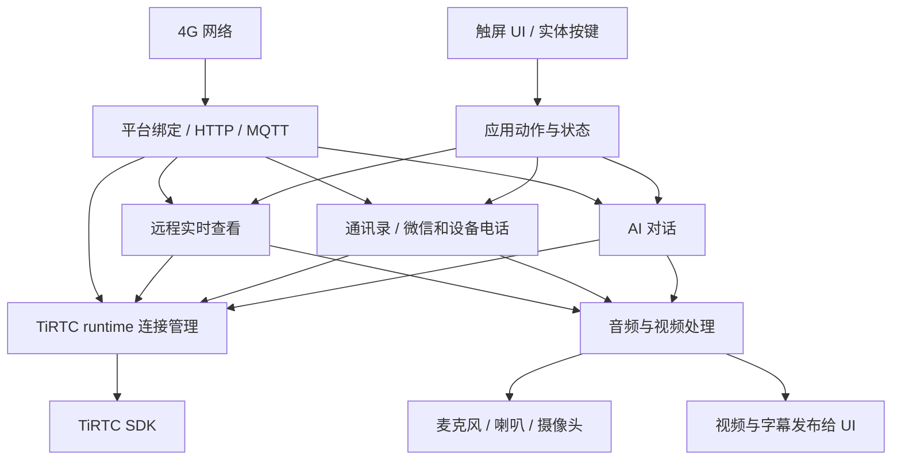
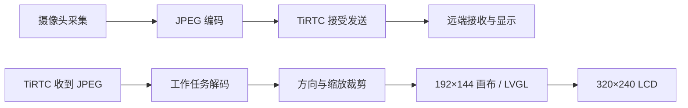

# 代码与流程详解

本篇介绍示例如何把 **UI、平台业务、TiRTC 和板级驱动** 组合起来。开发自己的产品时，可以沿用网络与通话流程，替换界面和硬件适配。

[项目首页](../README.md) · [文档目录](README.md) · [上一篇：设备操作](当前设备操作.md) · [下一篇：TiRTC 接入](TiRTC接口调用与模块流程.md)

**阅读层次：** 第 1～6 节看结构，第 7～11 节看媒体和修改边界；后半篇用一次真实动作串起代码，再深入状态、并发、性能和资源。

[一次点击的代码路径](#code-walkthrough) · [状态与任务](#states-tasks) · [并发保护](#concurrency) · [统计与性能](#performance) · [资源预算](#memory-budget) · [扩展方法](#extension)

## 1. 先看整体分层



- **UI** 收集用户操作，显示业务状态。
- **平台业务** 完成身份、联系人、呼叫邀请和房间协商。
- **TiRTC runtime** 管理 SDK、连接和媒体会话的使用权。
- **音视频模块** 负责采集、编解码、播放与视频画布。
- **板级适配** 把这些能力落到实际芯片、摄像头、音频器件和屏幕。

这样新增页面不需要重写连接协议，换一块板子也可以优先替换硬件接口。

## 2. 建议按这个顺序读代码

| 顺序 | 入口 | 重点看什么 |
| --- | --- | --- |
| 1 | [user_main.c](../user_main.c) | 启动服务，接收 UI/按键动作，更新偏好 |
| 2 | [ui/tirtc_ui.h](../ui/tirtc_ui.h)、[ui/tirtc_ui.c](../ui/tirtc_ui.c) | 业务动作、状态快照和页面切换 |
| 3 | [runtime/tirtc_runtime.h](../runtime/tirtc_runtime.h) | 连接、发送、订阅与会话管理接口 |
| 4 | [calls/tirtc_calls.c](../calls/tirtc_calls.c) | 一次微信/设备电话从发起到结束 |
| 5 | [ai/tirtc_ai.c](../ai/tirtc_ai.c)、[remote/tirtc_remote.c](../remote/tirtc_remote.c) | AI 和被动实时查看如何复用同一套媒体能力 |
| 6 | [media/audio_device.c](../media/audio_device.c)、[video/tirtc_video.c](../video/tirtc_video.c) | 声音与图像怎样进入 TiRTC、怎样回到硬件 |

不必一开始就通读底包和所有 SDK 头文件。先沿一条完整业务路径读懂，再进入需要修改的模块。

## 3. 目录职责

| 目录 | 作用 | 常见改动 |
| --- | --- | --- |
| `ui / port` | 页面、LVGL、触摸、LCD | 页面设计、屏幕与触摸适配 |
| `network` | SIM、4G 注册、移动数据、信号、时间 | 网络状态和新模组接口 |
| `platform` | 服务发现、绑定、鉴权、HTTP、MQTT | 平台入口和业务协议 |
| `contacts / calls` | 联系人同步、主被叫、接听与挂断 | 联系人展示、呼叫产品策略 |
| `ai` | AI 会话、字幕、工具调用 | AI 指令与工具业务 |
| `remote` | 平台发起的实时查看和对讲 | 被动接入策略 |
| `media / video` | 音频硬件、G.711、摄像头、JPEG | 更换采集播放接口、调整媒体参数 |
| `preferences / keys` | 设置保存、音量按键 | 新配置字段、按键定义 |
| `storage / resource_store` | 外置文件系统、UI 资源 | 字体背景、新文件资源 |
| `resources / status` | 资源与运行状态快照 | 展示实际设备数据 |
| `runtime / sdk` | 受管连接与 TiRTC 库 | SDK 适配与成套版本升级 |
| `board_compat` | 本板专用底包和兼容依赖 | 经过核对后的板级迁移 |

应用配置在 [config](../config)，源文件与链接选择在 [tirtc_app.mk](../tirtc_app.mk)。新增业务尽量留在本应用目录。

## 4. 从开机到工作

```text
读取保存的音频设置
→ 启动屏幕、触摸和按键
→ 启动资源、4G、平台及各业务服务
→ 后台完成联网、绑定和 TiRTC 就绪
→ 用户操作或平台事件触发一次业务
→ 业务结束，回收本次媒体资源，继续待机
```

UI 先出现，联网在后台执行。主循环每 20 ms 扫描按键，每 500 ms 检查偏好保存，一般状态约 5 秒更新，网络约 2 秒采样；视频和音频使用各自处理节奏，不跟着资源页的刷新周期运行。

服务启动入口支持重复检查，失败可以稍后重试。任务创建成功、平台就绪、连接成功、对端接听、实际出图是不同状态。

## 5. UI 怎样连接业务

触摸事件通过 `app_ui_action()` 分发：例如开始 AI、刷新联系人、视频呼叫、修改音量。事件处理只做短判断和入队，HTTP、录音、文件写入不在触摸回调里等待。

后台通过 `tirtc_ui_publish_*()` 发布状态快照；UI 任务统一操作 LVGL。这样网络线程不会在绘制过程中修改控件，也避免界面滚动时阻塞媒体回调。

增加一个功能通常分三步：

1. 定义 UI 动作和需要显示的状态。
2. 在业务模块执行操作，管理成功、失败、取消和超时。
3. 发布快照，由 UI 更新显示。

不要仅让按钮回调返回成功，就把对应功能标记为已经实现。当前多人对讲正是保留了 UI、尚未接入后端的边界。

## 6. 多种业务怎样共用音视频

当前 TiRTC 最大连接数为 1，音频硬件也是共享资源：

```text
空闲 → AI / 微信电话 / 设备电话 / LIVE 中的一种 → 清理 → 空闲
```

runtime 使用 `owner` 标记谁在使用连接，使用 `generation` 标记这是第几次会话。旧回调即使晚到，也不能操作新会话。

例如 AI 语音要求呼叫微信时：

```text
AI收到工具命令
→ 刷新联系人并确认唯一目标
→ 回复工具受理结果
→ 排队现有 calls 呼叫
→ AI停止并归还音频、连接
→ calls取得使用权，开始视频电话
```

电话、AI 和 LIVE 的停止流程都要先禁止新数据进入，再等待采集、DMA、播放及连接退出，最后释放资源。直接清空状态变量，无法保证硬件真正停止。

## 7. 音视频数据怎样流动



采集、SDK 接受、远端收到、LCD 更新是不同计数点，不能把其中一个数当作全流程帧率。

### 7.1 视频上行

```text
GC032A窗口640×480
→ 采集端缩放为320×240 YUYV
→ DMA完整帧双缓冲
→ JPEG编码，质量50
→ TiRTC接受发送
→ 微信、另一设备或平台播放器
```

上行编码/发送的调度目标为 15 帧/秒；采集任务按传感器、DMA 和完整帧就绪节奏工作，并非由这个目标值保证 15 次采集。应用当前并不是先把完整 VGA 帧搬进内存，再逐像素软件缩小。微信、设备电话和 LIVE 复用同一采集/编码模块，但连接、流号和平台能力声明按场景选择。

编码前会检查发送队列和内存。队列控制目标为 48 KiB，SDK 总发送上限为 128 KiB；拥塞时推迟视频，避免无限堆积。SDK 接受帧不等于手机已经显示该帧。

### 7.2 视频下行

```text
TiRTC视频回调
→ 校验并复制JPEG到有界帧槽
→ 工作任务解码成RGB565
→ 方向、缩放和裁剪
→ 192×144视频画布
→ LVGL合成到320×240横屏
```

微信下行能力声明为 144×192，实际输入仍以收到的 JPEG 为准。等待处理的旧帧可以被新帧替换，减少延迟；正在解码的内存不能被覆盖。

当前方向适配：

| 场景 | 处理 |
| --- | --- |
| 设备呼叫微信 | 保留已验证的顺时针 90° 下行兼容转换 |
| 微信呼叫设备 | 按正向画面居中裁剪填满横屏 |
| 设备间通话 | 不套用微信呼出专用转换 |
| LIVE 上行 | `stream.camera_rotation=90`，仅影响实时查看能力声明 |

上传颜色由采集格式和 JPEG 编码链决定，LCD 颜色顺序只影响本机显示。修改其中一路时，要分别验证微信呼入、呼出和 LIVE。

### 7.3 音频

```text
麦克风 → 8kHz单声道PCM16 → A-law编码 → TiRTC
TiRTC → A-law解码 → PCM16 → ES8311与喇叭
```

每 20 ms 为 160 个采样，PCM16 是 320 字节，A-law 是 160 字节。LIVE 下行同时接受 8/16 kHz A-law，16 kHz 数据转换为 8 kHz 后播放。

录音由独立任务取数，播放采用短预缓冲和硬件预热。音量及麦克风/扬声器开关经统一硬件适配生效，AI、电话和 LIVE 不各自直接重配 I²S。

## 8. 网络、联系人和设置

| 事项 | 当前处理 |
| --- | --- |
| 4G | 使用 CID 1，自动检测注册和移动数据，断线后恢复 |
| 信号条 | 综合 RSRP、RSRQ、SNR；过期样本不继续显示旧满格 |
| 平台 | 服务发现、首次绑定、正式 token、正式 MQTT |
| 通讯录 | 正常约 30 秒刷新，最多 12 条；失败退避，旧数据不能冒充新同步 |
| HTTP/MQTT | 校验身份和路由上下文，避免迟到响应作用到新会话 |
| 音频设置 | 音量、增益、两个开关使用内部 NVM 双槽保存 |
| 连续调节 | 先更新 RAM，稳定约 1 秒后合并写入并读回验证 |

更换平台或对接呼叫协议的步骤见 [TiRTC 接入篇](TiRTC接口调用与模块流程.md)。

## 9. Flash 和内存怎样分配

程序、文件与运行内存分开管理：

| 资源 | 当前用途 |
| --- | --- |
| 应用程序区 | 当前链接配额 1,432 KiB；实际占用看构建结果 |
| 内部 NVM | 正式身份、音量与开关 |
| 外置 4 MiB SPI Flash | 字体、背景及应用文件 |
| 系统堆 | 网络、任务、音频和视频运行缓冲 |
| LVGL 内存池 | UI 对象和绘制资源 |

双向视频主要缓冲约 579,584 字节；LIVE 只上传视频，主要缓冲约 372,736 字节。这不包含 SDK、编解码器对象、音频、任务栈和 UI 的全部内存。

外置 Flash 可以存资源文件，不能直接当新增程序执行区或实时帧 RAM。新业务通过 [storage/tirtc_storage.h](../storage/tirtc_storage.h) 读写文件；现成示例在 [storage/examples](../storage/examples)。

当前外置存储保护已有数据，不把挂载失败直接当成空盘格式化。字体缓存及资源安装方式见 [resource_store/README.md](../resource_store/README.md)。

## 10. 开发时看哪些日志

交付默认关闭周期调试输出，保留启动和错误。需要短时性能诊断时，可临时启用 [tirtc_log.h](../tirtc_log.h) 的 `TIRTC_ENABLE_DEBUG_LOG` 并重编译。

| 日志 | 回答的问题 |
| --- | --- |
| `network / NET41` | SIM、注册、移动数据和信号是否正常 |
| `BIND-HTTP / FORMAL-MQTT` | 平台鉴权、订阅、请求是否成功 |
| `TIRTC-ADAPTER / CALL22 / LIVE42` | 本次连接属于谁，何时接通和结束 |
| `AI-CALL` | AI 是否真的下发工具指令、是否转交电话模块 |
| `VIDEO40-FPS` | 采集、SDK接受、解码后成功交给UI分别多少帧/秒 |
| `VIDEO40-RX / UP / NET` | 接收到达、替换/失败、发送积压和有效反馈 |
| `GUI35` | UI消费和LCD完成帧率，是否卡在显示端 |
| `AUDIO42` | 音频采集、收发、播放和队列情况 |

分析时使用同一会话、同一时间窗口。目标帧率、SDK 接受、远端收到、最终显示不能混为一个数字；无丢包反馈应写未知。Flash/RAM 足够也不能单独证明卡顿一定来自 CPU。

## 11. 改成自己的产品

| 要改什么 | 优先修改 |
| --- | --- |
| 界面和交互 | `ui`、动作分发，保持后台业务接口 |
| 屏幕/触摸 | `port` 及本产品板级配置 |
| 麦克风/喇叭 | `media/audio_device` |
| 摄像头/视频参数 | `video` 和能力声明，配套核对内存 |
| 平台和联系人规则 | `platform / contacts / calls` |
| 新的 AI 工具 | `ai` 的解析与业务分发 |
| 自有资源或配置 | `resource_store / storage / preferences` |

公共 SDK 尽量保持一致；本板专用依赖集中在 `board_compat`，由应用 Makefile 选择。底包与库的哈希检查用于保护 ABI 匹配，升级时重新核对，不直接删掉检查。

当前两个产品已分别放在 `tirtc_lite` 和 `tirtc_pro`。根目录产品脚本选择各自配置、源文件、TiRTC 库和独立输出目录；一个固件只链接一套应用入口与 SDK 生命周期，业务不跨产品引用。构建与依赖边界见 [双产品说明](README.md#two-products)。

<a id="code-walkthrough"></a>
## 12. 跟着一次“视频呼叫”读代码

理解这条路径后，再看 AI 和实时查看，会发现它们复用了很多相同模块。

### 12.1 从触摸事件到业务请求

| 步骤 | 源码入口 | 该层做什么 |
| --- | --- | --- |
| 显示联系人 | `ui/tirtc_ui.c: render_contacts / fill_contacts` | 从已发布的 UI 快照绘制列表 |
| 选中联系人 | `contact_cb / render_contact_detail` | 记住联系人 ID 和微信/设备类别，展示详情 |
| 点视频呼叫 | `dial_cb` | 重新找当前联系人、检查可用性，提交 `TIRTC_ACTION_CALL_VIDEO` |
| 动作分发 | `user_main.c: app_ui_action` | 把动作交给对应业务模块 |
| 通话受理 | `calls/tirtc_calls.c: tirtc_calls_action` | 复制必要信息、检查忙碌和状态，排队本次请求 |
| 执行呼叫 | `step / new_call / request_dial` | 申请使用权，按微信或设备协议发起平台请求 |

联系人用稳定的 ID 与类别识别，不能只记“列表第 2 行”。列表刷新或排序变化后，第 2 行可能已是另一个人。

### 12.2 平台同意请求，还没有开始通话

电话模块把 HTTP 作业交给独立任务。控制任务处理结果、通知与回调，继续走建连、等待接听确认、启动媒体。

这几个概念要分开：

```text
UI动作受理：按钮请求已进入业务
平台请求成功：平台收到并处理了邀请
媒体连接建立：可以通过TiRTC传数据
通话激活：本次连接与业务接听条件均满足
实际出图/出声：采集、传输、解码和播放链路已经工作
```

因此 UI 不应在 HTTP 返回 200 的瞬间直接显示“对方已接听”。当前 calls 的 `C_CONFIRM` 阶段负责等连接与接听条件，再由 `activate()` 开启媒体。

### 12.3 画面和声音各走自己的工作路径

视频启动后，摄像头任务取得完整帧，视频任务编码发送并处理下行 JPEG；音频任务读取麦克风，通话音频模块负责收发和播放节奏。SDK 回调只复制数据或更新事件。

UI 获得的是状态和已处理视频画布。切换页面不应重新建连，也不应让回调等待整个 LCD 刷新。

### 12.4 点挂断后的工作并非一行清零

`begin_close()` 进入清理，`cleanup_step()` 逐步完成协议收尾、停止视频和音频、取消预期回连、断开并释放 session。可能仍在途的 HTTP 作业也要妥善处理，避免取消后服务端刚创建的房间变成残留连接。

UI 提示已结束与资源完全可复用之间可能有时间差；是否可以开始下一次，由业务状态与 runtime 使用权共同决定。

<a id="states-tasks"></a>
## 13. 状态机和工作任务怎样配合

### 13.1 calls 的主要状态

下表中的名称来自 `tirtc_calls.c` 的内部枚举。微信、设备、主叫、被叫不一定逐个经过全部状态。

| 状态 | 等待什么 | 后续去向 |
| --- | --- | --- |
| `C_IDLE` | 新呼叫或来电 | 受理后准备本次会话 |
| `C_OWNER` | 能力上报有效、session 可用 | 呼出进入邀请，呼入进入来电等待 |
| `C_DIAL` | 平台作业结果 | 后续通知/连接/确认 |
| `C_RING` | 用户接听或拒绝 | 建连，或结束 |
| `C_WX_NOTIFY` | 本次微信房间通知 | 取得信息后 WHIP 建连 |
| `C_CONNECT` | 连接回调 | 成功后继续确认 |
| `C_CONFIRM` | 连接和对端接听条件齐备 | 激活音视频 |
| `C_ACTIVE` | 媒体收发及挂断/错误 | 正常结束或异常清理 |
| `C_CLOSING` | 音视频、连接、作业退出 | 全部完成回空闲 |
| `C_BLOCKED` | 清理未安全完成 | 保留故障状态，按提示处理 |

例如“有电话页面但没画面”，应先确定是在 `C_RING/C_CONNECT/C_CONFIRM` 还是 `C_ACTIVE`。前者可能还在业务协商，后者才进入媒体排查。

### 13.2 每个任务为什么存在

| 工作位置 | 负责的工作 | 不适合放进去的工作 |
| --- | --- | --- |
| 主应用循环 | 实体按键、偏好同步、服务重试 | 长时间 HTTP、等待录音、整帧解码 |
| UI 任务 | LVGL、触摸、状态和视频绘制 | 平台请求、Flash 文件安装 |
| 网络任务 | 注册、数据连接、信号与恢复 | 视频编解码 |
| 平台/runtime | 鉴权订阅、SDK 生命周期与连接路由 | 直接绘制控件 |
| 通讯录/电话 HTTP | 服务请求、解析、有界结果交接 | 修改正在显示的控件 |
| AI/电话/LIVE 控制 | 状态推进、资源申请、取消与清理 | 在 SDK 回调里等待硬件停止 |
| 录音/摄像头/视频任务 | 阻塞采集、编码、解码、媒体节奏 | 无限制累积历史帧 |

任务拆分的目的在于隔离等待和工作，不代表每增加一个任务就会增加处理能力。CPU 时间、总线和硬件仍然共享；优先级也要与实际 SDK 调度规则和测量一起看。

启动时先恢复偏好、准备 UI 和按键，再启动后台服务。任务创建成功后，服务还可能等待网络、授权或其他资源，因此使用 `*_is_ready`、快照和回调判断可用性，而不是只看 `*_start()` 是否返回成功。

<a id="concurrency"></a>
## 14. 这几处并发保护，移植时要保留

### 14.1 `owner + generation`：谁在用，以及是哪一次

假设第 8 次微信电话刚结束，第 9 次 LIVE 已开始，而第 8 次的断开回调才到达。如果只判断“音频正在用”，旧电话可能错误关闭 LIVE 的喇叭。比较所有者和会话代次后，旧回调会被挡住。

连接句柄地址也可能重复使用，所以只比较指针地址不够。业务通过 runtime 的受管发送、断开、释放接口，让这些检查保持在同一处。

### 14.2 回调内存属于谁

| 数据 | 有效期/所有权 | 正确处理 |
| --- | --- | --- |
| SDK 接收的音频、视频、命令指针 | 借用，通常只到回调返回 | 校验长度后复制到有界缓冲 |
| 摄像头 DMA 正在写的缓冲 | 由采集硬件使用 | 完整帧确认前不编码，停止完成前不释放 |
| 已交给编码器的一帧 | 消费者持有期间不能覆盖 | 使用双缓冲及持有状态 |
| 待解码的下行帧 | 应用帧槽 | 可替换等待帧，不能覆盖正在解码的一帧 |
| UI 控件 | UI 任务管理 | 后台发快照，不跨线程直接改 LVGL |
| HTTP 回调上下文 | 异步请求仍可能引用 | 关闭回调结束后才释放，超时不等于立即无人使用 |

### 14.3 为什么会话结束后还要等清理

`stop requested` 是发出停止意图，`hardware stopped` 才说明 DMA/录音不再使用缓冲。当前实现还需要处理已提交的 SDK 调用和迟到平台结果。

清理超时进入保护状态，是为了避免释放仍被使用的内存。移植时应定位没退出的具体操作，不通过删除等待或直接置空状态绕过它。

### 14.4 平台请求也有上下文

请求关联绑定代次、凭据代次、路由代次和 SIM。网络重连或身份改变后，即使旧 HTTP 结果刚返回，也不应更新新身份下的通讯录或继续拨号。

因此刷新失败保留“旧列表可见”和“本轮结果有效”两个概念。AI 拨号要求当前刷新票据完成，不能看到 RAM 里有名字就直接拨。

<a id="performance"></a>
## 15. 视频卡顿时，怎样读全流程统计

### 15.1 先按阶段定义“几帧”

| 指标 | 它真正统计什么 | 不能推导什么 |
| --- | --- | --- |
| 目标 15 fps | 上行编码/发送调度目标，约按 66/67/67 ms 间隔准入 | 不是传感器帧率设置，也不保证最终达到 15 fps |
| `VIDEO40-FPS cap` | 统计窗口内完成的采集帧 | 不能等同已编码/已发送 |
| `VIDEO40-FPS tx` | SDK 接受的视频提交帧 | 不能等同远端收到或播放 |
| `VIDEO40-RX in` | 通过格式、长度、锁、会话和流号检查后写入下行帧槽的本会话累计帧数，包含覆盖等待帧 | 不包含所有回调，更不是微信摄像头最初产生帧数 |
| `VIDEO40-FPS rx` | 本地解码并成功发布给 UI 的帧率 | 不代表原始网络到达或 LCD 已显示 |
| `GUI35` 的消费/完成帧 | UI 消费与 LCD 完成情况 | 一帧可能多次区域 flush，flush 次数不是视频帧数 |
| 网络反馈 loss | 有效反馈中的丢失统计 | `NA`、没有反馈或反馈过期不代表 0 丢包 |

本设备无法只靠本地日志知道“服务器本来想下发多少帧”或“手机实际显示多少帧”；这两项需要服务端或手机播放器的同时间窗统计。

`VIDEO40-RX` 的 `in/bytes/replaced` 是本会话累计值，比较前后两条日志时先取差值，再除以相同时间窗；不能把累计 `in` 直接与 `VIDEO40-FPS` 的每秒值对比。换 `generation` 后重新计算，不跨会话相减。

### 15.2 码率怎么算

```text
帧率 fps = 本时间窗帧数 × 1000 / dt_ms
JPEG 负载码率 bps = 本时间窗被接受的 JPEG 字节数 × 8 × 1000 / dt_ms
```

例如 5 秒提交 60 帧，统计为 12 fps；提交 JPEG 共 300,000 字节，负载约 480,000 bit/s，即 480 kbit/s。这是计算示例，不是当前设备实测结果。

JPEG 负载码率不含协议头、音频和重传。固定质量 50 不等于固定码率：画面复杂度变化，每帧字节数也会变化。

### 15.3 看到差距，优先查哪一段

| 同时间窗的表现 | 优先检查 |
| --- | --- |
| `cap` 接近目标，`tx` 很低，`blocked/encode_defer` 增长 | 发送队列和背压，不能直接归因采集 CPU 不足 |
| `cap` 很低且采集超时/错误增加 | 摄像头、DMA 完整帧等待、调度与采集参数 |
| 收到很多帧，解码少，`replaced` 多 | 下行处理来不及消费等待帧，查解码及工作任务耗时 |
| 解码较快，LCD 完成帧少 | UI 合成、缩放、刷屏传输及调度 |
| `memory_drop/mem_pause` 增长 | 堆余量、最大连续块、碎片和生命周期 |
| 单向都好，双向明显变慢 | 编解码、音频、UI、总线与任务竞争，做分项对照 |

`cap_replaced/replaced` 是应用主动替换等待帧的计数；它减少延迟，不能当作网络丢包率。`send_zero/send_error` 虽打印在部分 `RX` 日志行中，实际指向上行提交结果，读字段时按代码含义。

### 15.4 耗时不等于纯 CPU 占用

采集等待可能包含 DMA 和调度时间；刷屏等待可能包含总线传输；`handler/prepare/flush` 等区间可能嵌套。不要把这些 wall time 直接相加当作 CPU 使用率。

若要评价芯片是否满足产品目标，先固定清晰度、目标帧率和 UI 场景，再对比：

1. 本地采集编码，不启动下行显示。
2. 仅下行解码显示。
3. 双向视频加音频。
4. 第 3 项基础上执行正常 UI 操作。

每轮记录实际 fps、码率、帧大小、堆最低值、最大连续块、错误和各阶段耗时。Flash/RAM 充足只排除了部分容量问题；没有 CPU/调度或分项数据，不能仅凭帧率下降证明芯片必然不够。

<a id="memory-budget"></a>
## 16. 从代码看一次视频会话的内存预算

本表按当前 `video/tirtc_video.c` 宏计算，单位为字节。编码器对象、任务栈和 SDK 内部内存另计。

| 缓冲 | 大小 | 用途 |
| --- | --- | --- |
| 两块原始帧 | `320 × 240 × 2 × 2 = 307200` | 一边完整帧采集，一边供消费 |
| 一块上行 JPEG | `65536` | 编码输出 |
| 两块下行 JPEG | `65536 × 2 = 131072` | 有界接收与解码交接 |
| 解码行缓冲 | `640 × 16 × 2 = 20480` | 分行处理 |
| 视频输出画布 | `192 × 144 × 2 = 55296` | RGB565 UI 输入 |
| 双向合计 | `579584` | 约 566 KiB |
| LIVE 上行合计 | `372736` | 两块原始帧＋上行 JPEG，约 364 KiB |

提高宽高会改变原始缓冲、编码量、解码量与传输负载。即使有足够总空闲 RAM，也可能没有足够大的连续块。当前还设有运行期内存水位保护，不能只看启动时剩余多少。

外置 Flash 的字体使用缓存读取，背景按资源路径加载；让资源文件离开程序区可以释放程序空间，但不会替代实时媒体缓冲。应用代码执行区的扩大需要匹配底包和链接布局，不是把 `.a` 放到 SPI Flash 就能实现。

<a id="extension"></a>
## 17. 新增功能时，最小修改应该落在哪里

以“增加一个业务按钮”为例：

1. 在 UI 定义新动作和显示状态；按钮只投递动作。
2. 在应用层模块实现任务/状态推进，校验当前身份和忙碌状态。
3. 需要媒体时申请 runtime 的 session，并复用音频/视频接口。
4. 用快照发布处理中、成功、失败、取消状态。
5. 实现超时和清理，再验证重复进入和退出。

以“换摄像头”为例：先对齐供电、初始化、输出格式、完整帧和尺寸，再核对编码输入与能力声明，最后分微信呼入/呼出、设备互呼、LIVE 测颜色和方向。不要把某一路的 RGB/BGR 或旋转补偿复制到所有路径。

本产品应用功能变更集中在 `tirtc_pro`；共用 SDK、原厂 Demo 继续独立。当前 `board_compat` 中的产品专用依赖要与构建配置一起保留，迁移时按 [其说明](../board_compat/README.md) 核对。

## 18. 代码审核对文档的约束

这次文档核对沿 `user_main → UI 动作 → 各业务工作任务 → runtime → media/video → UI` 检查了入口、默认值、保存字段、流号、视频参数和错误定义。它不替代全面的动态代码审计、长时间稳定性测试或对当前固件的重新验收。

| 容易误读的代码/界面 | 当前应怎样理解 |
| --- | --- |
| `ui_state_defaults()` 的音量 | 通用 UI 初始值；启动后由 preferences 的 8/10 或保存值覆盖 |
| `status` 的“录音 / 播放：尚未接入” | 只读状态模块的保底文字；AI 活跃诊断由独立快照覆盖，不代表整个产品没有采播能力 |
| `TIRTC_PAGE_ROOM`、ROOM 动作 | 存在页面/动作声明，不等于业务后端已经实现 |
| `TIRTC_PAGE_REMOTE` | 历史页面枚举保留；当前正常 LIVE 流程保持 HOME/CLOCK |
| `[VIDEO40]`、`[LIVE42]`、`[BOOT45]` | 模块日志标记，不是正在运行的应用版本号 |
| `.a`、头文件和 `board_compat` | 配套运行依赖；不能为了减少目录差异而直接移除 |

要改变上述行为，应作为独立功能改动验证；本次只校正文档与配图，没有借整理文档修改运行代码。
