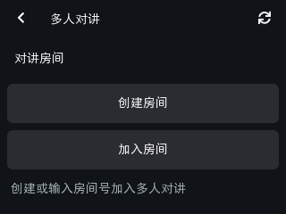
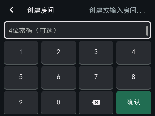
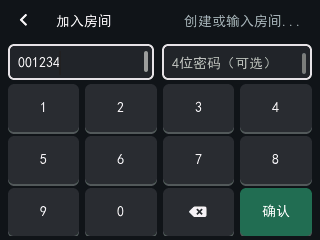
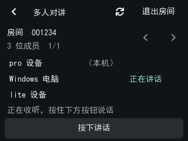
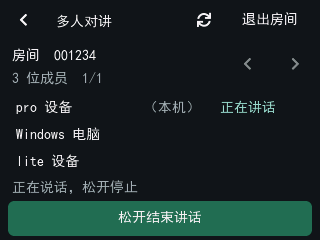
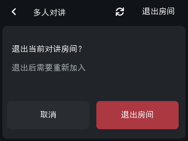
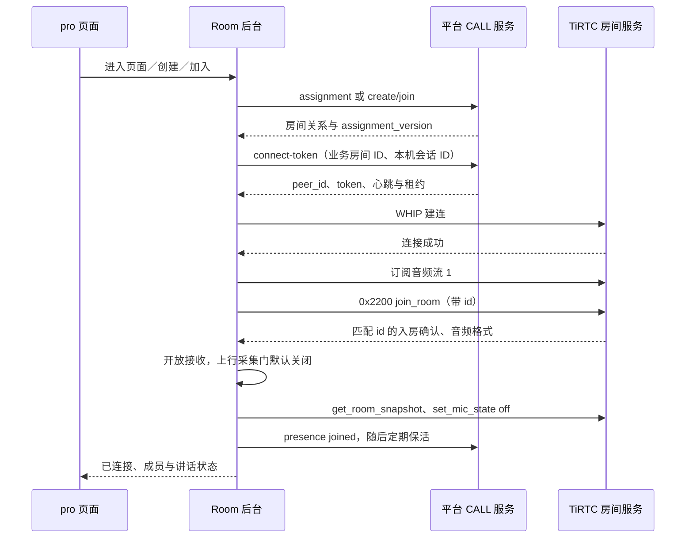

# 多人对讲：操作、接入流程与音频排查

[返回 pro 首页](../README.md) · [文档目录](README.md) · [设备操作](当前设备操作.md#group) · [代码流程](代码与流程详解.md#group-flow) · [TiRTC 接入](TiRTC接口调用与模块流程.md#group-api)

多人对讲让不同设备加入同一语音房间。pro 默认收听，按住页面的“按下讲话”按钮才发送麦克风，松开停止发送；**讲话期间仍处理下行声音，不是互斥抢麦或严格半双工**。本功能没有视频，摄像头仍由微信/设备电话和实时查看使用。

首次体验读第 1～4 节，接入开发读第 5～8 节，声音异常查第 9～10 节，测试与当前核对结果见第 11 节。可先观看 [多人对讲实机演示](../README.md#video-group-intercom)，再按下面的界面图完成操作。

> **配图说明：** 本篇 6 张房间界面图由当前 pro 的 UI 源码离线渲染，保留原生 **320×240、4∶3** 比例；不是实机照片。房间号 `001234`、成员名称和讲话状态都是示例，请以自己的设备为准。截图用于说明操作，不代表音频或网络实测结果。

<a id="quick-start"></a>
## 1. 准备两端，完成第一次对讲

### 1.1 准备条件

- 两端使用**不同的设备身份**，已绑定到支持设备房间的同一平台环境；第二端可以是已支持房间的 lite、ESP32 或 Windows 客户端。界面和启动方式按各自工程说明。
- pro 的 SIM、网络注册、移动数据及正式平台连接正常。只看到 4G 信号格，并不代表平台已经登录。
- 平台 CALL 服务已提供 `/v1/call/group/*` 接口。普通微信视频通话能力不能替代房间接口。
- 设备设置中打开扬声器，音量非零；需要讲话的一端打开麦克风。只收听的一端可关闭麦克风。
- 先结束其他 AI、电话或实时查看；当前 pro 一次只保留一路媒体所有权。
- 使用当前 `pro_release` 应用或配套下载包；版本、包用途和校验值见 [固件与验证记录](../../../../release/tirtc_pro/README.md)。

入口如下：先在“更多功能”点“多人对讲”；未加入房间时，选择创建或加入。

<p>


</p>

### 1.2 在 pro 创建房间

1. 首页右上角 `···` → **多人对讲** → **创建房间**。
2. 密码可留空；设置密码时输入**四位数字**，确认提交。
3. 等待出现六位房间号，把房间号和密码交给另一端。房间号可能以 0 开头，不能省略。
4. 等待连接完成、页面提示正在收听，再让另一端加入。
5. 在另一端讲话，确认 pro 出声；再按住 pro 的 **按下讲话**，确认另一端能听见，松开停止发送。



上图为创建表单：不设密码可直接点绿色“确认”；房间号由平台在创建成功后分配，不需要在这里填写。

### 1.3 在 pro 加入已有房间

1. 进入 **更多功能 → 多人对讲 → 加入房间**。
2. 输入**六位数字房间号**；无密码房间留空，有密码房间输入四位数字。
3. 确认后等待连接和成员同步。输入不合法不会提交；密码错误或已在其他房间时按提示处理。
4. 已接受的提交会清空表单密码；失败后需要重试时重新输入密码。离开表单也会清空房间号和密码，密码不会作为本地设置保存。
5. 已经有房间关系时，先退出旧房间，再创建或加入另一间，不要连续点击重复提交。



上图为加入表单：左边输入对方提供的六位房间号，右边按需输入密码，再点“确认”。图中的前导 0 必须保留。

### 1.4 Windows 端怎样配合

`Start-Room.cmd` 属于另一个 Windows 工程，**不在本仓库内**。先按该客户端说明完成设备绑定并启用麦克风；同一设备 ID 不要同时运行两个客户端。

在支持下列命令的 Windows 房间客户端中，可用 `room status` 确认房间，用 `room ptt down` 开始讲话、`room ptt up` 停止，`room debug on` / `room debug off` 开关诊断；创建和加入命令的参数以该客户端帮助为准。只打开麦克风硬件但没有按下 PTT，不代表已经向房间发送声音。

## 2. 页面状态与成员列表

| 所处阶段 | 代表什么 | 应怎样做 |
| --- | --- | --- |
| 查询/创建/加入房间 | HTTP 正在同步业务关系 | 等待结果，不连续重复提交 |
| 等待资源 | 其他媒体或旧连接尚未释放 | 结束占用业务，等待清理 |
| 正在连接房间 | 正在取凭据、建 TiRTC 连接或等入房确认 | 此时尚不能按成功通话验收 |
| 房间已连接、正在收听 | `join_room` 确认通过，允许收发 | 让另一端讲话，检查实际声音 |
| 正在讲话 | 本机 PTT 有效或收到其他成员讲话状态 | 松开本机按钮停止发送 |
| 暂停/离开页面 | 本机房间媒体暂停，业务关系可仍存在 | 重新进入房间页同步 |
| 失败提示 | 网络、鉴权、关系、协议或音频问题 | 先看错误码，再查对应环节 |



上图演示 pro 收听、Windows 端讲话时的界面。“（本机）”标识当前设备；成员右侧“正在讲话”来自讲话状态，不是音量计。成员超过三人时，可用房间号右侧的左右箭头翻页。

**有成员列表不等于有声音**：列表来自信令，声音来自独立的音频流。

成员通过 `participant_id` 区分，显示名依次采用 `device_name → device_id → participant_id`。当前客户端接受 `state=active` 或未给出/空状态的成员，过滤其他非空状态。每页三人、最多显示前 12 人；“前 12 位成员”只是设备显示上限，不是平台房间人数上限。

入房后请求成员快照，成员加入/离开时再次请求，连接期间还约每 10 秒同步一次；成员麦克风状态事件也更新显示。服务端定义的 `on` 与 `speaking` 不等同，只有实际讲话状态显示“正在讲话”。本机状态先随 PTT 更新。

## 3. 按住讲话、音量与退出

### 3.1 按住发送，松开停止

- 连接完成且麦克风开启时，按钮未按下显示 **按下讲话**，按住后显示 **松开结束讲话**。未连接或麦克风关闭时，按钮显示相应等待/关闭提示。松开、手指移出按钮、离开页面、关闭麦克风、会话失效或电话抢占都会关闭上行。
- UI 按住时约每 **200 ms** 续期；后端超过 **750 ms** 没收到有效续期会关麦。这是本地触摸动作保护，**不是网络心跳或断网检测时限**。
- PTT 生效时仍收听房间声音。设备没有独占发言权仲裁，多人同时发言的混音由服务端处理；测试时先一次只让一端讲话，排除现场回声。



持续按住底部按钮，界面显示“松开结束讲话”；手指松开后回到收听状态。上图由实际 UI 按住事件和示例后台状态驱动。

### 3.2 使用设备统一音量

- Room 和其他业务都读取保存的用户音量、麦克风增益及开关。设置页调扬声器 **0～10 档**，0 档静音；没有单独的“房间音量”。“麦克风音量”下拉选项可选 L0（静音）～L10，默认 L10，已有保存值优先。L0 时 PTT 显示“麦克风静音（L0）”且不可讲话；按住时变为 L0 会立即取消当前手势，恢复后须先松手再重新按下。

### 3.3 返回菜单与退出房间

- **返回菜单**：停麦并暂停媒体，保留服务端房间关系；再次进入房间页会同步并尝试连接。
- **退出房间并确认**：提交 HTTP 离开请求；成功后解除服务端关系。请求失败时不能把本地关闭页面当作已成功退房。
- 重启后通过服务端重新查询房间分配，不依赖本地保存房间密码，也不会恢复上次按住的讲话状态。



右上角“退出房间”会弹出以上确认框；点“取消”继续留在房间，确认退出后还要等待服务器处理成功。左上角返回键只暂停本机房间媒体，不会完成退房。

## 4. 与 AI、电话、实时查看的关系

房间使用独立业务模块，但和 AI、电话、实时查看共用 TiRTC 连接资源及 ES8311 音频硬件。进入房间页后，资源可用才连接；返回首页会暂停房间媒体，以便其他业务使用。

电话优先交接：关闭 Room 收发 → 等音频与旧连接释放 → 电话接管。电话结束、失败或拒接后的返回位置取决于**进入通话前的页面**：

- 原来在 `ROOM` 或 `ROOM_FORM`：返回房间页并重新同步；仍有有效房间关系且资源可用时，连接后默认收听。
- 原来在其他页面：沿用通话结果页。
- 房间页本身没有电话呼出按钮；上述规则也适用于在房间页接到来电。
- 单纯电话抢占、页面暂停、断网不会等价于 HTTP 退出房间。网络或平台恢复后，仍由当前页面意图、房间关系和资源状态决定是否重连，不会自动开麦。

<a id="connection-flow"></a>
## 5. 先有房间关系，再接通媒体



**顺序要点：先订阅，再发送 join_room；确认前拒绝媒体收发。** HTTP 业务成功、WHIP 连接成功、入房成功是不同阶段。

### 5.1 HTTP 接口

通过当前正式绑定的 CALL 服务上下文访问接口，`Authorization: Bearer …` 使用正式平台 token。设备身份由鉴权确定，不能擅自在请求 body 中加 `device_id` 代替鉴权。

| 用途 | 方法与路径 | 请求 body |
| --- | --- | --- |
| 查询关系 | `GET /v1/call/group/device/assignment` | 无 |
| 创建房间 | `POST /v1/call/group/device/create` | 可选 `password`；无密码为 `{}` |
| 加入房间 | `POST /v1/call/group/device/join` | `room_code`、可选 `password` |
| 取连接凭据 | `POST /v1/call/group/device/connect-token` | `room_id、assignment_version、session_id` |
| 媒体保活/状态 | `POST /v1/call/group/device/presence` | 上述三项及 `state` |
| 离开业务房间 | `POST /v1/call/group/device/leave` | `room_id、assignment_version` |

本客户端要求 HTTP 200 且顶层 `code=200`。查询以及创建/加入/离开的成功 `data` 都按 assignment 快照解析；不能只返回一个布尔成功值。

有效加入关系要求 `desired_state=joined`、房间未关闭、非空 `room_id`、六位 `room_code` 和非零 `assignment_version`。对于 `left`、空状态或已关闭的关系，不要求提供有效房间号，版本也可以为 0。

连接凭据要求非空 `peer_id/token`；`heartbeat_seconds` 为 1～3600 的整数，`lease_seconds` 为 1～86400 的整数且大于两倍心跳周期。有效时钟下，数值型 `expires_at` 已过期会返回 `-6104`。不要把服务端默认心跳、房间容量写死为设备能力；设备使用本次响应参数。

### 5.2 MQTT 分配变化

正式 COMMAND 主题 `device/sn_<device_id>/cmd` 中的 `type=room_assignment_changed` 提醒设备刷新分配。事件携带非负整数 `assignment_version`，版本不旧于本地时触发 **HTTP 查询**；有效时钟下已过 `expires_at` 的通知会丢弃。

MQTT 事件不会直接开麦，也不会绕过 HTTP 关系与前台页面检查。主动刷新和前台约 60 秒的分配查询用于补充同步；后台只合并事件/网络恢复提示，待其他媒体空闲后查询。

### 5.3 TiRTC 房间命令

命令号固定 `0x2200`，`join_room` 使用 JSON-RPC 2.0 请求并带 `id`：

```json
{
  "jsonrpc": "2.0",
  "id": 1,
  "method": "join_room",
  "params": {
    "room_id": "平台返回的业务房间ID",
    "device_id": "当前设备身份",
    "input_audio": {"codec": "g711a", "sample_rate": 8000, "channels": 1},
    "output_audio": {"codec": "g711a", "sample_rate": 8000, "channels": 1}
  }
}
```

只接受匹配请求 `id` 的成功确认，并校验媒体 `session_id`、输入/输出格式；确认中若给出 `room_id`，必须匹配当前房间。后续 `room_snapshot、participant_joined、participant_left、participant_mic_state_changed、room_closed` 通知必须带正确房间范围。

`get_room_snapshot、set_mic_state、leave_room` 是无 `id` 的通知；PTT 通过 `mic_state=speaking/off` 表达。媒体固定 **stream 1、G.711 A-law、8000 Hz、单声道**。

三个容易混淆的标识：

| 标识 | 用途 |
| --- | --- |
| HTTP 业务 `room_id` | assignment/token/presence/leave 始终用平台原值 |
| TiRTC wire room ID | 兼容业务 ID 或合法的“前缀:业务 ID”，首次合法范围固定后，拒绝另一范围的通知 |
| 两种 `session_id` | HTTP 使用本机生成的 32 字符十六进制会话 ID；入房 ACK 返回媒体会话 ID，各自校验，不要求两者相等 |

`presence joined` 成功才刷新媒体租约，以该请求开始时刻加租约计算到期时间，失败不续租；结束时的 `left/suspended/connect_failed` 报告属于媒体状态，不等价于解除业务房间关系。真正退房仍用 `/device/leave`。

## 6. 音频从哪里来，怎样播放

| 环节 | 当前格式 / 数量 |
| --- | --- |
| 本机录音与播放硬件 | **16 kHz、单声道 PCM16**；20 ms 为 320 样本、640 字节 |
| Room 网络上行 | **8 kHz G.711 A-law**；每 20 ms 为 160 字节，目标约 50 包/秒 |
| Room 网络下行 | **8 kHz G.711 A-law**；单包可变长，不能把包数直接当播放帧数 |
| 下行交给硬件 | 每个 8 kHz 解码值复制为两个 16 kHz PCM 样本；每次最多 320 样本 |
| 有效语音数据率 | 每方向约 **64 kbit/s**，不含 TiRTC、IP、重传等开销；PTT 松开时本机无语音上行 |

### 6.1 上行

`16 kHz PCM录音 → 相邻两个样本取平均 → 8 kHz PCM → A-law → TiRTC`。

只有当前连接已入房、PTT 有效且麦克风开启时采集。录音返回后再次核对代次和 PTT；松手或被抢占期间的旧帧丢弃。SDK 缓存较高时不继续堆积语音；发送返回正数表示 SDK 接受，不能称为远端已播放。

### 6.2 下行

`接收回调 → 有界队列 → 跨包拼接A-law → 解码 → 每个样本复制两次 → 16 kHz PCM播放`。

1. 回调校验会话、stream、媒体格式及长度，单包接受 1～640 字节；不在回调中直接播放。
2. 队列最多 16 槽，同时限制**总缓存 4096 字节**；不是 16×640 字节都能填满。槽满、总字节超限或超过约 500 ms 的旧包分别计数。
3. 首段软件预缓冲等待约 80 ms，或收到 640 字节提前开始。每次任务最多补 12 块，工作时间预算约 10 ms；预计待播前瞻限制约 240 ms。
4. 当前代码仍保留孤立尾字节等待约 80 ms 的逻辑；超时后复制为两个相同 PCM 样本，**不补零**。16 kHz 双写已经满足对齐，此等待属于现存可进一步收敛的逻辑，不能解释成硬件必需。
5. 播放返回 BUSY 时保留待提交样本，后续重试；成功才推进缓冲。只有播放尾时已过且适配层确认完成，下一段才重新预热。

80 ms 是软件预缓冲条件，**不是端到端延迟保证**。音频适配层在连接准备阶段提交约 1200 ms 静音时钟，扬声器关闭或音量为 0 时也完成这一步；建连可以并行，但要等预计预热尾时结束后才发送 `join_room`，避免首段语音排在长静音后。仅调音量或开关扬声器不会使 Room 已完成的连接预热失效；后续新段仍保留约 80 ms 短预热。

Room 播放使用软件单位增益 10，用户 1～10 档由 codec 的 38～72 映射调节，0 档静音；与设备电话共用此曲线，避免软件先放大削顶再由 codec 衰减。AI、微信和 LIVE 的原曲线不变。该修正不恢复远端已削顶的录音，也不代表实现了回声消除。

### 6.3 为什么不能只看“采样率相同”

Room 网络固定 8 kHz，复制成 16 kHz 只适配本机硬件，不增加声音带宽。AI、微信、设备电话、LIVE 的流号、输入格式与缓冲策略由各自模块决定，不能混用。

所有业务跟随同一份用户音量设置，但硬件映射并非完全一样：Room/AI/微信/LIVE 用公共增益表，设备电话保留自己的软件与 codec 映射。用户设置 0 档或关闭扬声器时静音；“统一音量”不代表所有底层参数逐项相同。

## 7. 生命周期、超时与恢复

退出或被抢占时先关收发闸门，再发送停麦/媒体离房通知、停止音频，等待生产者和在途 SDK 提交完成，释放音频租约后断开 TiRTC 并释放连接。音频仍 BUSY 时保留所有权，不能强行把旧硬件交给新会话。

| 检查 | 当前策略 |
| --- | --- |
| HTTP 请求 | 约 10 秒超时 |
| 等待媒体资源 | 约 30 秒上限 |
| WHIP 建连 / join ACK | 分别约 20 秒 / 8 秒 |
| 连接失败退避 | 指数退避上限 30 秒，加 0～500 ms 抖动；普通失败等待前五档 1/2/4/8/16 秒，累计第 6 次失败后需手动刷新 |
| 进入连接失败处理的特定错误 | `40000、40300、40301、-6101、-6102` 直接转人工刷新 |
| `40921` 旧连接租约冲突 | 单独按已知租约或约 60 秒预算等待；超限提示刷新 |
| 成员 / 分配同步 | 连接中成员约 10 秒；前台分配约 60 秒，事件可提前触发 |

以上退避针对连接恢复；创建/加入/退出的 HTTP 错误会显示提示并重查分配。presence 的 `401/40300/40921/40400` 立即进入连接失败处理；其他失败约 1 秒再试，租约过期则重连。

身份、generation、assignment 版本和页面意图用于隔离迟到结果。**并非所有旧 HTTP 结果都直接丢弃**：同一身份的创建/加入已在服务端生效后，迟到关系仍可更新本地记录，但不能强制跳回页面或开启不再需要的媒体。解绑换身份后的旧结果不得沿用。

## 8. 从哪些代码开始看

| 文件 | 职责 |
| --- | --- |
| [group/tirtc_group.c](../group/tirtc_group.c) / [.h](../group/tirtc_group.h) | HTTP 任务、房间任务、状态、命令、队列、音频收发 |
| [ui/ui_pages.c](../ui/ui_pages.c) | 表单、PTT、成员分页和确认框 |
| [ui/tirtc_ui.c](../ui/tirtc_ui.c) | Room 快照邮箱、页面切换、通话后返回 |
| [user_main.c](../user_main.c) | 初始化、动作分发、音量和开关同步 |
| [calls/tirtc_calls.c](../calls/tirtc_calls.c) | 通过 `tirtc_group_suspend()` 交接电话资源 |
| [media/audio_device.c](../media/audio_device.c) | 公共硬件、音量、租约、录音和播放 |
| [platform/device_binding.c](../platform/device_binding.c) | 正式 CALL 服务请求与鉴权 |
| [tirtc_app.mk](../tirtc_app.mk) | 将 Room 及其依赖编入正常 pro 应用 |

SDK 回调只做有界校验、复制和唤醒；JSON、HTTP、媒体工作与 UI 更新分别在相应任务/邮箱处理。`tirtc_group.h` 中预留的调用辅助函数不等于当前 calls 路径都使用了它们，阅读实际调用点后再移植。

<a id="troubleshooting"></a>
## 9. 错误码与定位顺序

| 错误 | 含义 | 先做什么 |
| --- | --- | --- |
| `40000` | 房间号/密码格式错误 | 六位房间号，四位密码或留空 |
| `401` | 正式身份/登录过期 | 检查绑定与凭据刷新，不等同弱网 |
| `40300 / 40301` | 密码或权限问题 | 核对平台权限、房间密码 |
| `40320` | 密码错误 | 重新输入密码 |
| `42920` | 密码尝试过多 | 等待服务端限流解除 |
| `40400` | 房间不存在/已关闭 | 刷新关系，必要时创建新房间 |
| `40920` | 房间已满 | 等成员退出或换房间 |
| `40921` | 旧媒体连接尚未释放 | 等待租约/清理，超限再刷新 |
| `40922` | 关系已变更 | 刷新 assignment |
| `40923` | 已在其他房间 | 先退出原房间 |
| `-6101` | Room 协议或音频描述不匹配 | 对比入房 ACK、JSON 和媒体参数 |
| `-6102` | Room 音频准备/录放音失败 | 检查租约、采集返回及播放非 BUSY 错误 |
| `-6103` | 网络未就绪 | 依次检查 SIM、注册、数据和平台 |
| `-6104` | 房间媒体租约过期 | 检查 presence 返回与租约，等待重连 |
| `-6105` | Room 服务初始化失败 | 保留日志，后台重试初始化 |

`-610x` 是本模块本地错误；联系人模块也使用相同数字段但含义不同，必须结合日志模块判断。TiRTC SDK 错误另见 [SDK 接入篇](TiRTC接口调用与模块流程.md)。

声音问题按下列顺序检查：

1. **没加入**：查 HTTP status、业务 code、WHIP 与 join ACK，不用零音频计数推断音质。
2. **能看到成员但无声**：确认远端 PTT 已生效、麦克风已启用，本机扬声器非静音，再查接收计数。
3. **收包不连续**：比对发送端有效音频毫秒数与到达间隔；发送“没有报错”不代表每秒送够一秒声音。
4. **收包正常但播放忙/丢弃多**：查格式、队列、播放计数与调度间隔，区分上游节奏和本机供给。
5. **音量小或失真**：检查保存档位、远端麦克风增益/削波、硬件供电与喇叭；不能只凭 8 kHz 就断定程序错误。
6. **像回声**：先让设备只收听，电脑戴耳机或远离设备，排除物理回授。Room 没有承诺已验证的全双工 AEC。

## 10. 最少日志怎样看

`ROOM_AUDIO_DIAGNOSTICS` 当前默认启用，标识沿用 `[ROOM-AUDIO51]`，**51 不是当前应用版本号**。约每 5 秒输出两行窗口汇总，退出补最后一个窗口；不输出语音内容、密码或 token。

| 字段 | 含义与单位 |
| --- | --- |
| `rx … ms、packets、bytes、len=min/max` | 接收窗口毫秒、回调包数/字节数/包长范围；包含随后被格式校验拒绝的计数 |
| `fmt(s/m/f)、bad、over640` | stream/media/flags；优先保留首个异常格式，格式错误/超长包次数 |
| `qpeak=槽/字节、drop(slot/bytes/age)` | 缓存峰值与三类丢弃：槽满、总字节超限、音频过期 |
| `cbgap、ts(repeat/back)` | 回调最大间隔毫秒、时间戳重复/倒退；不是网络丢包率 |
| `play … pcm、blocks` | 被音频适配层接受的 **16 kHz PCM 样本数**与提交块数，不是喇叭实际播放回执 |
| `warm=次数/毫秒` | 首块/恢复段预热统计，不包含连接时提前提交的 1200 ms 静音 |
| `busy/errors` | 播放提交忙/错误次数；BUSY 可重试，不直接等同丢包 |
| `tick(gap/work)` | 最大处理间隔/单轮工作耗时，毫秒 |

连续有效语音的参考值：**8000 个 A-law 字节/秒 → 16000 个硬件 PCM 样本/秒**。用各自行的 `ms` 计算：

- 接收有效负载速率约 `bytes × 8 × 1000 / ms` bit/s；持续语音约 64000 bit/s。存在坏包时不能把所有 bytes 都当有效语音。
- 接受的播放时长约 `pcm / 16000` 秒。例如 5 秒窗口中 80000 个 PCM 样本，代表提交约 5 秒音频。
- 单包若固定 160 字节，应约 50 包/秒；包长不固定时看字节及样本时长，不用包数硬判。
- 起止时刻、静音、预热和缓存跨窗口都会影响比较；静音开关也可能使适配层接受后跳过输出。

这些日志覆盖**设备接收至播放提交**，不是全链路抓包。要判断 Windows 是否送够，需同时记录 Windows 的发送计数、实际包长和时间；SDK 接受不等于网络送达，设备提交不等于喇叭出声。

推荐记录 20～30 秒：只让另一端连续讲话，pro 只收听。保存这两行、连接错误、信号状态、两端版本及实际听感即可；无需打印全部音频码流。编译前将 `ROOM_AUDIO_DIAGNOSTICS` 设为 0 可关闭该汇总。

<a id="validation"></a>
## 11. 当前核对结果与验收

### 11.1 源码、测试与已发布包分开看

- **历史实机反馈**：统一音量的 52 版已由用户确认“音量正常，声音清晰，调节有效”。这只覆盖当时那一轮固件和场景。
- **2026-09-30 源码修复**：Room 播放改用软件单位增益及 codec 曲线；入房前等预计连接预热尾时结束，静音入房与调音量不会使首段重新附加长静音；L0 时明确禁用 PTT 并取消已按住的手势。软件检查结果集中记录在 [测试说明](../tests/README.md)，不能代替本次实机验收。
- **最终软件验证**：八套主机检查通过，包括后端 35/35、下行音频 16/16、协议 5/5、原生 UI 和设置页、Room 开关两种编译配置下的增益与预热，以及电话发送生命周期。全功能全新构建及最终增量构建无警告、错误，包内载荷和资源读回校验通过；实际音质、长时间及弱网仍待实机验证。
- **源码与下载同步**：`APP_VERSION=pro_release`，普通维护包和 `firmware/pro/latest.binpkg` 均由当前完整源码构建；包用途、日期和 SHA-256 见 [发布记录](../../../../release/tirtc_pro/README.md)。本次未烧录新包，历史反馈与演示录像不计为该包的实机验收。

初次复核的五项失败来自旧测试预期：上行直接按旧 8 kHz 样本编码、下行尾样本补零，以及不足以容纳 5120 个硬件样本的模拟缓冲。本次已按 16 kHz 硬件录放、8 kHz A-law 网络转换修正断言和模拟容量，并保留跨包顺序、奇数尾、背压及播放前瞻检查；这些适配本身不构成硬件故障结论。

孤立尾字节仍保留约 80 ms 等待，最终复制为两个相同 PCM 样本；这已非 16 kHz 对齐的必要条件，本次未改变该边界策略。真实 SDK 预热、DMA 回收、长时间调度和声学回声仍需实机验证，本次没有接入可承诺的 AEC。

### 11.2 主机检查入口

在 **`tirtc_pro` 目录**执行，先将变量替换为本机实际文件。Python、Zig 编译器包装和固定版 cJSON 的准备见 [测试说明](../tests/README.md)；房间 UI 与增益脚本使用包装，其余可直接调用 Zig。

```powershell
$roomTestCc = 'C:\实际工具目录\zig.exe'
$roomCompatCc = 'C:\实际工具目录\host-cc.cmd'
$roomTestCjson = 'C:\实际源码目录\cJSON.c'
python tests/run_group_backend_test.py --cc $roomTestCc --cjson $roomTestCjson
python tests/run_group_protocol_test.py --cc $roomTestCc --cjson $roomTestCjson
python tests/run_group_audio_test.py --cc $roomTestCc --cjson $roomTestCjson
python tests/run_ui_room_test.py --cc $roomCompatCc
python tests/run_settings_mic_test.py --cc $roomTestCc
python tests/run_audio_group_gain_test.py --cc $roomCompatCc
python tests/run_audio_warmup_test.py --cc $roomTestCc --check-old-chunk
python tests/run_calls_audio_lifecycle_test.py --cc $roomTestCc
```

测试模拟 HTTP、网络、时钟和硬件，不能替代真实喇叭试听；失败时先保存场景名称和断言，不能只看脚本是否生成了可执行文件。

### 11.3 双端实机验收表

| 场景 | 应观察的结果 |
| --- | --- |
| 无密码/四位密码房间，含前导零号 | 创建、加入成功，号码完整；错误密码可重新输入 |
| 两端轮流按住讲话 | 默认只收听，按住发送、松开停止；两端清晰，无旧语音迟到 |
| 音量调低、恢复、0 档及扬声器开关 | 跟随统一设置，0 档/关闭时静音，恢复后仍清晰 |
| 麦克风 L0、恢复非零档及按住期间静音 | L0 显示静音并禁用讲话；恢复后须新按下，不能复活旧手势 |
| 静音入房后打开扬声器、入房期间多次调音量 | 首段不重新插入 1280 ms 长静音，声音与静音开关一致 |
| 按住时移出按钮、返回页面、关闭麦克风 | 停止上传，不持续开麦 |
| 来电接听/拒绝/失败及结束 | Room 释放资源，原房间页来电结束后返回并恢复收听 |
| 离开页面后再进入 | 保留业务关系，重新同步，默认不开麦 |
| 点击退出并确认、另一端退出 | 本机退房关系解除；成员变化可见 |
| 断网、平台恢复、旧连接超时 | 不假装仍能通话，按策略重连，恢复后不开麦 |
| 快速进退、换房、重绑 | 旧回调/旧触摸不影响新房间，无残留声音 |
| 多轮通话及长时间运行 | 无异常重启、持续资源增长或音频停止 |

每轮记录固件版本或哈希、另一端程序版本、房间环境、步骤、日志及听感。新增 [实机演示](../README.md#video-group-intercom) 尚未标明固件版本，且包含连接重试画面，只作操作参考；后续录像应注明对应固件，不要用演示代替当前源码回归。

## 参考

- [设备房间服务协议](https://github.com/tangeai/tirtc-server-example/blob/main/thing-connect/device-room.md)：平台业务、租约、客户端接入和 Windows 验证入口。
- [lite 多人对讲实现](../../tirtc_lite/src/features/group_intercom.c)：同仓库另一产品的实现参考；UI、音频硬件与默认策略仍以各产品代码为准。
- [音频硬件适配](../media/README.md)、[UI 接入说明](../ui/INTEGRATION.md)：模块开发入口。
