# 当前设备操作

本篇帮助你完成第一次体验：**准备工程与设备 → 编译烧录 → 联网绑定 → AI 对话 → 视频电话 → 远程查看**。

[项目首页](../README.md) · [文档目录](README.md) · [下一篇：代码与流程](代码与流程详解.md)

本篇已合并原图文快速入门。首次使用依次读第 1～8 节；遇到具体错误再查后半篇。配图直接使用当前 UI 源码离线渲染，原生 **320×240（4:3）**，在文档中按原尺寸显示。示例姓名、时间、绑定码不对应真实账号；不要用图中的绑定码。

**快速体验：** [编译烧录](#build-flash) · [联网绑定](#binding) · [AI](#ai) · [电话](#calls) · [实时查看](#live) · [设置记忆](#settings)。六段实机录像统一在 [首页演示视频](../README.md#demo-videos)，可先看操作再按本文动手。

**按需跳转：** [错误怎么读](#error-guide) · [网络与绑定](#binding-errors) · [联系人与通话](#call-errors) · [音视频](#media-errors) · [外置存储](#storage-errors) · [常见日志实例](#log-cases)

<a id="prepare"></a>
## 1. 准备工作

### 硬件与软件

| 项目 | 本示例使用 |
| --- | --- |
| 开发板 | L_CT4IT00_YP00W_01_V04 |
| 构建型号/底包 | NT26F6D0 / F6D_A |
| 屏幕 | 320×240 横屏，ST7789 显示、FT6336 触摸 |
| 摄像头 | GC032A |
| 音频 | ES8311、麦克风、外接喇叭 |
| 联网 | 4G SIM 卡及天线 |
| UI 资源 | 外置 SPI Flash 中的字体和背景 |
| 开发环境 | 完整 OpenCPU 工程、自带工具链、利尔达固件下载工具 |

连接好屏幕、摄像头、麦克风、喇叭和天线，使用可上网的 SIM 卡并保证供电稳定。准备小钛平台账号；体验微信电话时，按平台要求建立微信联系人授权关系。

获取包含本应用及配套依赖的完整工程。本目录位于：

```text
examples/L_CT4IT00_YP00W_01_V04/tirtc_pro/
```

公共 SDK、工具链和板级构建也参与编译，不能仅复制这个目录到空文件夹就直接构建。

<a id="build-flash"></a>
## 2. 编译与烧录

先完成首页列出的 [利尔达环境准备](../README.md#lierda-guides)。工程放在短的英文路径中；下载串口与日志串口按电脑实际枚举选择。

### 2.1 编译或下载出厂初始化包

<a id="python-setup"></a>

先按 [源码准备](../../../../README.md#编译与下载)获取完整仓库，在工程根目录打开 PowerShell。pro 出厂包构建需要电脑安装 **Python 3.10 或更高版本**，用于生成外置 Flash 文件系统镜像并打包；默认使用 `PATH` 中的 `python`，可先运行 `python --version` 确认。准备好后执行：

```powershell
.\build_tirtc.bat pro
```

如果 Python 不在 `PATH` 中，可在同一个 PowerShell 窗口先指定实际安装路径，再执行上面的构建命令：

```powershell
# 将示例路径替换成电脑上实际的 python.exe
$env:TIRTC_PYTHON = 'C:\Python310\python.exe'
```

生成的 `firmware/pro/latest.binpkg` 包含正常应用、配套底包及外置 Flash 字库和背景；也可直接 [下载 pro 最新固件](../../../../firmware/pro/latest.binpkg)。首次使用只需烧录这一个包。

**出厂初始化会覆盖外置 Flash 文件，请先备份需要保留的文件。** 本文描述烧录用法，不代表本次已经完成实机验收；具体构建与验证范围见 [发布说明](../../../../release/tirtc_pro/README.md)。

<details>
<summary>开发维护：应用单独编译参数</summary>

统一入口在内部选择以下应用参数。直接使用下面的底层命令只生成应用构建包，不会生成包含外置资源的完整出厂包：

```text
PROJECT=L_CT4IT00_YP00W_01_V04
APP_VARIANT=pro
BUILD_MODE=tirtc
MODEM=NT26F6D0
MODEMPKG=F6D_A
```

需要单独调试应用时，可使用独立输出目录：

```powershell
$proOut = (Join-Path (Get-Location) 'gccout/tirtc_pro_custom').Replace('\', '/')
.\build.bat build PROJECT=L_CT4IT00_YP00W_01_V04 APP_VARIANT=pro BUILD_MODE=tirtc MODEM=NT26F6D0 MODEMPKG=F6D_A "BUILDDIR=$proOut" BINNAME=TiRTC_pro_NT26F6D0
```

应用中间产物位于 `gccout/tirtc_pro`；上面的自定义命令使用另一个输出目录。应用单独编译生成的 `.elf`、`.bin`、`.binpkg` 不包含外置资源文件系统，不能代替面向首次使用的 `firmware/pro/latest.binpkg`。

`BUILDDIR` 使用绝对路径：构建会切换到 `rules` 执行子 make，相对路径可能指向另一个目录。

原厂 `app/demo` 是另一构建分支。切换产品、原厂 Demo 或资源安装程序时，使用独立 `BUILDDIR`，避免混入旧中间文件。

</details>

### 2.2 下载固件

1. 备份外置 Flash 中需要保留的文件，再结束设备正在进行的 AI、通话或实时查看。
2. 关闭占用设备串口的终端软件，保持 USB 连接。
3. 在利尔达下载工具的“自定义镜像”中选择 `firmware/pro/latest.binpkg` 并启用。
4. 使用本板对应的硬件型号、连接方式，执行全量下载。
5. 等待工具明确显示下载成功，重启后观察设备页面和启动日志。

不要将 `F6D_A_base.binpkg` 当成包含本业务的完整应用。Windows 串口号以实际枚举为准，不固定为 COM9；“打不开串口”应先检查端口和占用。

<a id="assets"></a>
### 2.3 首次资源准备：已包含在出厂包内

`firmware/pro/latest.binpkg` 同时写入固件与外置资源文件系统。空白或已格式化的外置 Flash 也使用同一个包：

```text
一次全量烧录 pro 最新固件
→ 重启进入正常应用
→ 检查字库、背景、触摸
→ 联网绑定并体验功能
```

默认流程不需要先运行独立资源安装器，也不需要烧录两次。出厂包会覆盖外置 Flash 文件；它和仅更新内部应用、保留外置文件的维护包用途不同。

旧的 `build_tirtc_pro_assets.bat` 和资源安装包仅作为开发维护选项保留。如需替换字体、背景或单独修复资源，参阅 [resource_store/README.md](../resource_store/README.md)；安装器模式仍需完成安装后重新烧录正常应用，不能与默认出厂包流程混淆。

<a id="binding"></a>
## 3. 联网和绑定设备

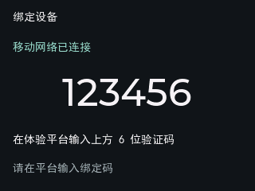


开机先显示 UI，后台完成 4G 联网和平台连接。初次使用时：

1. 等待 SIM 注册和移动数据连接。
2. 设备显示当前六位绑定码。
3. 在平台设备绑定入口输入该码。
4. 等待设备保存授权、完成正式鉴权和消息订阅。
5. 平台与设备均显示正常状态后开始体验。

**成功标志：** 绑定状态变为已绑定、正式 MQTT 完成连接/订阅、TiRTC 就绪；不是只看到 4G 就可以拨号。小钛体验平台入口为 [xiaotai.chat](https://xiaotai.chat)，按平台当前界面选择添加/绑定设备并输入屏幕上的码。

绑定码过期后使用设备提示的重试入口；已绑定设备开机会恢复身份，普通掉网无需重新绑定。

右上信号条根据无线强度和质量综合显示。它不能单独证明平台或媒体连接已就绪；“网络信息”页可查看 RSRP、RSRQ、SNR 等详细数值。

<a id="ai"></a>
## 4. 首页与 AI 对话

<p>
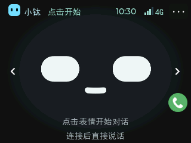
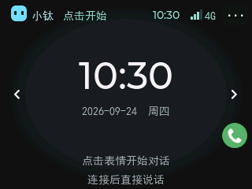
</p>

首页显示表情，左右箭头可切换时钟页，右上更多入口进入功能菜单。

1. 确认麦克风和扬声器开启。
2. 点击首页表情区域开始 AI 对话。
3. 等待聆听状态，说一句“你好，介绍一下自己”。
4. 观察字幕并听取回答；回复期间可以切换表情/时钟页。

AI 在首页、时钟、更多菜单和运行状态页可以继续；进入设置、通讯录等其他页面会提交停止。再次点表情不是结束按钮，已有会话不会重复启动。

<p>
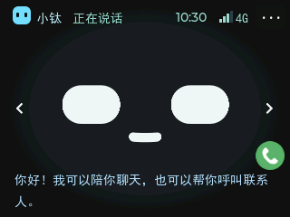
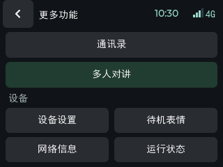
</p>

若 AI 只有字幕无声音，先看扬声器是否关闭或音量为零；若听不到用户讲话，先看麦克风开关。设备是否出声仍需真实听测，离线 UI 图不能证明采播正常。

当前 AI 播放期间会抑制收音上行，减少自身播报再次被识别；不要将其视为已实现随时打断的全双工回声消除。

### 通过 AI 打电话

完成 [AI 呼叫配置](AI呼叫微信与设备配置详解.md) 后，可以说：

- “用微信呼叫小李。”
- “给客厅设备打视频电话。”
- “只用语音呼叫小李。”

普通呼叫默认视频，明确要求语音时使用音频。成功受理后自动进入现有通话页面，挂断后可回首页重新开启 AI。

<a id="calls"></a>
## 5. 通讯录和音视频电话

<p>
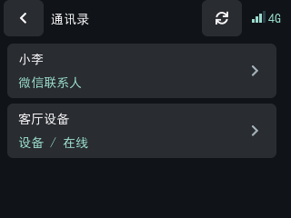
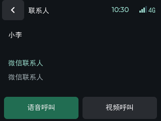
</p>

### 5.1 添加与同步联系人

先在平台建立微信授权或设备联系人关系，再打开设备“更多功能 → 通讯录”。列表从服务器同步，可以手动刷新；当前最多展示 12 条。

设备联系人需在线且关系有效。微信联系人出现在列表里，仅表示存在相应关系，不保证对方此刻可接听。

### 5.2 发起电话

1. 选择联系人，核对名称和类别。
2. 选择“语音呼叫”或“视频呼叫”。
3. 等待对端接听。
4. 接通后使用关麦、关摄像头、挂断等控制。

通话页“关麦/开麦”修改的是**全局麦克风开关**，会按音频设置保存；挂断后不会自动恢复开启。关摄像头仅影响当前通话，不作为永久设置保存。

实机演示：[设备呼叫微信](../README.md#video-wechat-outgoing) · [微信呼叫设备](../README.md#video-wechat-incoming)。设备互呼的步骤见下方第 5.3 节。

<p>
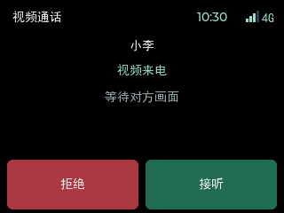
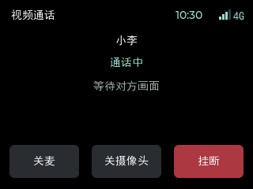
</p>

上图只展示来电和通话控件；离线渲染没有真实媒体，黑色区域不代表正常通话应该黑屏。接通并收到有效视频后，远端画面显示在该区域，按钮保持可用。

视频页显示远端画面；本机摄像头会上传，不显示本地预览小窗。微信和设备来电均通过来电页接听或拒绝。

**首页绿色电话是原有语音快捷入口**：有微信联系人时呼叫列表中第一位微信联系人，没有时显示添加联系人引导。需要手动视频，请从通讯录选择“视频呼叫”。

<a id="device-call"></a>
### 5.3 两台设备互相通话

1. **准备两端：** 两台设备均联网、完成绑定，并在平台建立可呼叫的设备联系人关系。先结束 AI、实时查看或其他通话。
2. **同步联系人：** 主叫进入“更多功能 → 通讯录”，刷新后选择另一台设备，核对名称和在线状态。没有出现时先检查平台关系，设备不会自动搜索附近设备。
3. **选择通话类型：** 双方都支持视频时，点“视频呼叫”；只需声音或对端为原 OLED 纯音频产品时，选择“语音呼叫”。两种产品放到同一仓库不会让纯音频产品自动获得视频能力。
4. **对端接听：** 被叫在自己的来电页面/按键界面选择接听；拒绝或无人接听时，主叫按结果提示处理。
5. **检查与结束：** 两边轮流讲话，视频通话再检查两端画面；任一端挂断后等待回到空闲。通话页关麦会改变本触屏产品的全局麦克风设置，下一次无声时先检查开关。

两种产品之间的语音互呼应在合并后单独验收，不能把它与两台触屏设备的视频互呼视为同一项测试。失败时先从本篇 [联系人与通话错误](#call-errors) 排查，不以“两个项目都编译通过”代替实际接通。

### 5.4 当前视频规格

| 方向 | 本示例配置 |
| --- | --- |
| 设备摄像头上传 | 320×240 MJPEG，质量参数 50，上行编码/发送调度目标 15 帧/秒 |
| 微信下行能力声明 | 144×192 MJPEG，实际输入以收到的帧为准 |
| 本机视频显示 | 192×144 视频画布，经处理合成到 320×240 横屏 |

目标帧率不是实际网络或显示帧率保证。图像方向与填充已按微信呼入、呼出分别适配；详细处理见 [代码与流程详解](代码与流程详解.md)。

<a id="live"></a>
## 6. 平台实时查看与远程对讲

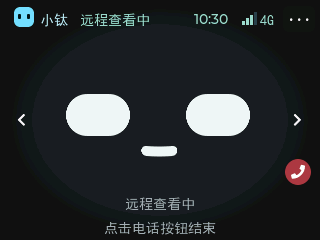

让设备停在首页或时钟页，并结束其他媒体会话。

1. 在平台打开设备“实时查看”。
2. 平台订阅视频后，设备开始上传摄像头画面。
3. 在网页开启声音，收听设备麦克风。
4. 按住远端说话按钮，语音从设备喇叭播放。
5. 关闭页面，或点击设备首页红色电话按钮结束。

[观看网页与微信实时查看录像](../README.md#video-remote-view)。录像展示操作过程；画面采样帧率和设备实际上传帧率是不同指标。

设备保持首页/时钟状态，不跳转本地监控页面；菜单没有主动开启监控入口。本功能上传本机视频、支持双向音频，不接收远端视频。

首页与时钟之间切换可以继续查看；进入“更多功能”、设置、通讯录等其他页面会结束本次远程会话。需再次查看时，先回到首页或时钟页，再从远端重新打开。

当前一次只运行一路媒体会话。AI、电话或上一连接尚未结束时，先等待清理完成，再开始实时查看。

**声音检查：** 网页开启声音后才订阅设备音频；设备麦克风也须开启。按住说话需允许浏览器使用麦克风，设备扬声器须开启且音量不为零。平台“已连接”只说明连接阶段，视频订阅、摄像头采集与媒体到达仍需分别成功。

**验收：** 远端看到正向图像；两边轮流讲话都有声音；结束后设备回待机；间隔几秒再次打开仍能出图。不要同时用多个页面抢占同一路连接。

<a id="settings"></a>
## 7. 设置和按键

<p>
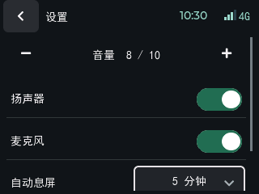
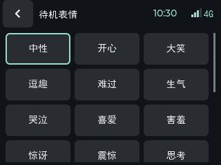
</p>

**操作步骤：**

1. 在“更多功能 → 设备设置”调整音量，或直接用 KEY0 减、KEY1 加。
2. 按需打开/关闭麦克风和扬声器。关扬声器后不会播放声音，关麦克风后对端听不到有效收音；首页/时钟底部会提示关闭状态。
3. 最后一次调整后等待后台保存完成，再正常重启，核对音量和两个开关恢复。保存存在约 1 秒去抖和后台轮询，不要刚点完立即断电。
4. 若重启后仍是旧值，检查保存错误和重试状态；不要通过格式化外置 Flash 来重置内部 NVM 设置。

| 项目 | 出厂/启动默认 | 实际作用 | 重启后是否保留 |
| --- | --- | --- | --- |
| 扬声器音量 | 8/10 | 设置 `−/+`，KEY0 减、KEY1 加；0 为静音 | 是，内部 NVM |
| 麦克风增益 | 10/10 | 当前设置页只提供开关；业务接口仍支持增益配置 | 是，内部 NVM |
| 扬声器开关 | 开 | 关闭后实际静音，保留原音量数值 | 是，内部 NVM |
| 麦克风开关 | 开 | 设置页和通话页共用；关闭后不上传有效麦克风声音，挂断不自动打开 | 是，内部 NVM |
| 自动息屏 | 5 分钟 | 本地背光休眠策略；触摸唤醒 | 否，仅本次运行 |
| 待机表情 | 默认表情 | 切换本次运行的待机表情 | 否 |
| 回应声选择 | 页面默认值 | 只改变 UI 选择，未接入独立提示音服务 | 否 |
| 摄像头按钮 | 随通话状态 | 控制当前视频会话；不是永久保存项 | 否 |
| 正式绑定身份 | 无身份时进入绑定 | 授权成功后保存设备身份 | 是，独立身份 NVM |

已保存设置优先于上述默认值；UI 通用结构里的初始音量不代表开机实际音量，启动时会由 `preferences` 覆盖。只清空外置 Flash 不会同时清空内部身份和音频 NVM。

连续调音量会合并写入，最后一次变更稳定约 1 秒后，由每 500 ms 运行的保存检查写入；系统调度、文件 I/O 或失败重试可能使完成时间更晚。验收掉电恢复时，先等待保存完成，再重启。扬声器关闭不会清除原音量，重新打开继续使用保留值。

麦克风和扬声器关闭时，提示复用首页/时钟底部原来的位置；两者都关闭显示“麦克风/扬声器已关闭”，不额外添加顶部提示行。KEY0/KEY1 的音量变更与触摸设置进入同一保存流程。

“多人对讲”目前保留界面，业务后端尚未接入；回应声选项也尚未接入独立提示音服务。

## 8. 第一次体验遇到问题

| 现象 | 先检查 |
| --- | --- |
| 页面文字或背景缺失 | 外置资源是否安装成功、存储状态是否有效 |
| 有信号但无法使用 | 移动数据、绑定、正式平台连接是否完成 |
| AI 有字幕但没声音 | 扬声器开关、音量、下行音频和播放错误 |
| AI 说“正在呼叫”却没有电话 | 是否启用正确角色的设备插件，是否收到工具命令 |
| 实时查看显示已连接但黑屏 | 设备是否空闲、视频是否订阅、摄像头及发送是否正常 |
| 视频卡顿或自动结束 | 同时看无线注册、发送积压和接收/解码/显示统计，不能只看信号格 |
| 重刷后旧配置或文件仍在 | 下载范围不一定包含全部用户数据区，这是与格式化不同的操作 |

默认固件保留启动和必要错误日志。进一步定位及诊断入口见 [代码与流程详解](代码与流程详解.md)。

完成首次体验后，建议依次验证：AI 一问一答、微信视频呼出和呼入、设备电话、实时查看连续开关、音量保存。每次换库或改硬件适配，再重复这组检查。

<a id="error-guide"></a>
## 9. 先判断是哪一层报错

错误码应和**日志前缀、调用接口、会话时间**一起看。同一个数字在不同模块中可能有不同含义。

| 来源 | 例子 | 怎样解释 |
| --- | --- | --- |
| 应用业务 | `[LIVE42] error=-6402` | 本应用定义的实时查看状态错误 |
| TiRTC SDK | `TIRTC_E_CONN_TIMEOUTCLOSE / -40007` | SDK 定义的连接心跳超时 |
| 利尔达 HTTP 适配 | `[BIND-HTTP] end ret=-7` | 查本工程 HTTP 包装层，不能直接套用 TiRTC HTTP 错误表 |
| HTTP 响应 | `status=401 / 403 / 500` | 服务返回的 HTTP 状态，与本地接口返回值分开 |
| 系统套接字 | `errno=6` | 查当前平台网络适配，不能直接按 PC 上的 errno 含义解释 |
| AI 工具 | `contacts_timeout / ambiguous` | 设备给 AI 的业务结果，详见 [工具状态表](AI呼叫微信与设备配置详解.md#tool-status) |

例如外置存储的 `-110` 是超时，绑定模块的 `-110` 是授权 JSON 无效。只给一个 `-110`，无法准确判断原因。

下表根据本工程源码整理；TiRTC SDK 公共错误见 [接入篇的 SDK 错误码](TiRTC接口调用与模块流程.md#sdk-errors)。驱动原始错误、平台业务码可能继续向上返回，因此以下不是所有负数的全集。

<a id="binding-errors"></a>
## 10. 网络与绑定问题

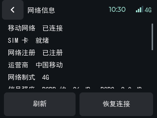

网络和设置页可上下滚动；截图只截取首屏，不代表下方没有更多信息。

### 10.1 先看四个阶段

1. **SIM 就绪吗？** 未插卡、PIN/PUK、SIM 异常先处理卡和硬件。
2. **注册成功吗？** 搜索中、注册被拒绝与已经注册不同。
3. **移动数据可用吗？** 有信号、有注册，不等于已取得可用数据连接。
4. **平台就绪吗？** 正式身份、时间、HTTP 鉴权、MQTT 订阅还需完成。

信号约 2 秒采样，过期超过约 6 秒的样本不继续当作有效信号。信号变差及时下调，变好需连续样本确认，避免在边界跳动。

| 指标 | 白话解释 | 看什么 |
| --- | --- | --- |
| RSSI | 接收到的总能量，包含有用信号、干扰和噪声 | 总能量高不等于网络好 |
| RSRP | 基站参考信号有多强 | dBm 越接近 0，一般越强；例如 -90 比 -110 强 |
| RSRQ | 有用信号在接收环境中的质量 | 一般越接近 0 越好，受干扰、负载等影响 |
| SNR | 有用信号相对噪声是否突出 | dB 越高一般越好；很低或负数需要关注 |

当前信号格以 RSRP 为基础，再由 RSRQ/SNR 限制；它是设备的显示策略，不是吞吐量或通话质量保证。音视频期间才掉网，应同时记录注册、数据状态、无线质量与发送积压，再分别检查天线环境、供电、网络和系统负载。

### 10.2 绑定与正式连接错误

定义位置：[platform/device_binding.c](../platform/device_binding.c) 的 `BIND_ERR_*`。

| 错误码 | 当前含义 | 优先检查 |
| --- | --- | --- |
| `-101` | 设备身份准备失败 | 设备识别信息是否读到，身份字段是否有效 |
| `-102 / -103` | 服务发现 HTTP / JSON 失败 | 发现地址、请求结果、返回是否符合结构 |
| `-104 / -105` | 设备上报 HTTP / JSON 失败 | `/v1/device/report` 的响应与业务结果 |
| `-106 / -107 / -108` | 绑定 MQTT 初始化 / 连接 / 订阅失败 | 临时服务地址、凭据、网络和订阅结果 |
| `-109` | 等待绑定授权超时 | 是否使用当前绑定码、是否在有效期内完成绑定 |
| `-110` | 授权内容解析失败 | 收到的授权消息字段，不是直接判定 Flash 超时 |
| `-111` | 授权存储失败 | 内部 NVM 写入、读回验证及可用空间 |
| `-112` | 绑定确认失败 | 授权确认步骤及平台返回 |
| `-113 / -114` | 正式 token HTTP / JSON 失败 | 身份、签名、服务响应 |
| `-115 / -116` | 时间准备 / 签名失败 | 时间是否有效、鉴权输入是否完整 |
| `-117` | 正式 MQTT 失败 | 正式凭据、地址、连接和订阅 |
| `-118 / -119` | 绑定流程重启 / HTTP 互斥准备错误 | 前序恢复原因、请求资源是否建立 |
| `-120` | AI 所需平台条件未就绪 | 正式绑定、AI 服务与身份状态 |
| `-121 / -122` | AI 凭据 HTTP / JSON 失败 | 获取 AI 凭据的响应，而非直接检查麦克风 |
| `-130` | 请求期间网络上下文变化 | 是否掉网、换路由或重连；旧结果会被作废 |
| `-131` | 当前适配不支持所选 SIM | 当前平台适配使用 SIM 0，检查 SIM 选择 |

遇到 HTTP 错误，同时保存本地 `ret`、HTTP `status`、响应业务码以及阶段。`ret=0` 仅表示该本地调用完成；还要按接口检查响应状态和内容。

<a id="call-errors"></a>
## 11. 通讯录、电话与实时查看错误

### 11.1 通讯录

定义位置：[contacts/tirtc_contacts.c](../contacts/tirtc_contacts.c)。

| 错误码 | 含义 | 建议动作 |
| --- | --- | --- |
| `-6101` | 联系人 JSON 无效 | 核对响应结构、必要字段、重复目标等解析条件 |
| `-6102` | HTTP 状态不符合预期 | 查状态码和服务响应，不能把空列表当成功同步 |
| `-6103` | 鉴权失败，HTTP 401/403 | 查正式身份与访问凭据 |
| `-6104` | 同步期间上下文过期 | 等待重新联网/鉴权后再同步 |

列表最多 12 条；AI 不会在列表截断、过期或同步不成功时随便拨打。手动刷新正常后，使用唯一完整名字测试 AI。

### 11.2 微信和设备电话

定义位置：[calls/tirtc_calls.c](../calls/tirtc_calls.c)。

| 错误码 | 含义 | 建议动作 |
| --- | --- | --- |
| `-6301` | 通话流程通用错误 | 找同一会话更早的 HTTP、协议或连接错误 |
| `-6302` | 当前通话阶段等待超时 | 区分等待能力上报、邀请、连接、接听确认，而不是一律归因无人接听 |
| `-6303` | 身份/网络上下文已变，或 TiRTC 不再就绪 | 检查掉网、重连和服务恢复，等待新会话 |
| `-6304` | 清理超时，音频或连接未安全释放 | 保存前后日志；按页面提示重启，定位未退出的模块 |
| `-6305` | 迟到通知无法安全关联，要求稍后重试 | 按提示等待约 30 秒，避免把旧邀请接到新呼叫 |

### 11.3 实时查看

定义位置：[remote/tirtc_remote.c](../remote/tirtc_remote.c)。

| 错误码 | 含义 | 建议动作 |
| --- | --- | --- |
| `-6401` | 实时查看通用错误；也包括连接后约 30 秒仍无音视频订阅、且没有收到远端音频 | 查前序连接/启动返回，以及播放器是否真正发起订阅 |
| `-6402` | 当前服务/身份/网络条件已失效 | 查网络注册、数据连接及 runtime 是否恢复中 |
| `-6403` | 实时查看资源清理超时 | 不强行复用连接，保留日志检查摄像头、音频和断开完成情况 |

SDK 的 `-40007` 等错误也可以直接传到通话或实时查看状态，不能只查上述 `-63xx / -64xx`。

<a id="media-errors"></a>
## 12. AI、音频和摄像头错误

### 12.1 AI 会话

定义位置：[ai/tirtc_ai.c](../ai/tirtc_ai.c)。

| 错误码 | 含义 | 检查重点 |
| --- | --- | --- |
| `-1401` | AI 启动条件未就绪 | 平台、TiRTC、资源占用 |
| `-1402` | AI token 阶段失败 | 凭据获取；也可能直接返回更具体的平台错误 |
| `-1403` | AI 阶段超时 | 建连或命令协商停在哪一步 |
| `-1404` | AI 协议错误 | `0x2100` 命令内容、会话协商与帧格式 |
| `-1405` | 音频路径错误 | 音频初始化、录音、播放及其原始返回 |
| `-1406` | AI 连接丢失 | 当前会话连接和网络状态 |
| `-1407` | 音频清理失败 | 在途录放音是否退出，不能只清空状态变量 |
| `-1408` | 音频上行持续失败 | 发送返回、连接是否有效、积压情况 |

### 12.2 视频

定义位置：[video/tirtc_video.c](../video/tirtc_video.c)。

| 错误码 | 含义 | 检查重点 |
| --- | --- | --- |
| `-1701` | 视频缓冲/运行内存条件不满足 | 空闲堆和最大连续块，不是只看 Flash |
| `-1702` | 摄像头初始化或采集失败 | 电源、驱动返回、DMA 完整帧与等待超时 |
| `-1703` | JPEG 编码器初始化或编码失败 | 格式/尺寸、输出长度与编码器返回 |
| `-1704` | JPEG 帧/解码结果不符合要求 | 完整帧、尺寸边界、行解码结果；部分失败表现为丢弃该帧 |
| `-1705` | 摄像头停止/释放未完成 | DMA 是否真正停止，不能继续释放其缓冲 |

音频适配另有 `-30`（无效使用权）、`-31`（硬件仍忙）、`-32`（预热写入不完整），定义于 [media/audio_device.h](../media/audio_device.h)。其中“忙”需结合调用阶段判断，正常等候不等于永久故障。

颜色异常优先对比采集格式、JPEG 输入格式、设备实际上传 JPEG 和远端显示。LCD 的 RGB/BGR 顺序只影响本机屏幕，不能用来修复手机收到的视频偏色。

<a id="storage-errors"></a>
## 13. 外置 Flash 状态与错误

定义位置：[storage/tirtc_storage.h](../storage/tirtc_storage.h)。

| 状态值 | 含义 | 怎样处理 |
| --- | --- | --- |
| `0 / 1` | 未启动 / 探测中 | 等待后台初始化；关注是否一直没有进展 |
| `2` | 可用 | 可查询文件区余量和使用文件接口 |
| `3` | 可用但范围受限 | 保留现有文件系统；文件区可能小于芯片物理容量 |
| `4 / 5` | 未发现 / 不支持的器件 | 检查硬件、SPI、JEDEC 型号支持 |
| `6` | 发现无法安全识别的已有数据 | 不自动格式化，先确认原数据布局 |
| `7` | 运行/初始化错误 | 看 `last_error` 和是否正在安全重挂载 |

| 错误码 | 本存储模块含义 |
| --- | --- |
| `-5` | I/O 失败 |
| `-16` | 忙 |
| `-19` | 尚未就绪 |
| `-22` | 参数错误 |
| `-30` | 保护状态，禁止当前修改 |
| `-110` | 操作超时 |

“芯片容量”“文件系统容量”“文件可用空间”分别统计，不应互相替代。资源页的运行内存、程序区和外置文件区也不是同一个空间；外置 Flash 不能直接当视频帧 RAM。

<a id="log-cases"></a>
## 14. 几种常见日志，怎样得出合理结论

### 14.1 大量发送失败后连接断开

观察顺序：`socket_send_data` 失败 → 发送队列积压/视频提交减少 → 心跳超时或网络失去注册 → 业务结束。

这说明数据传输受到阻碍，**并不单独证明 CPU 性能不足**。若随后有“尚未完成网络注册”，应把无线注册和数据链路失效纳入原因；若网络正常但解码/显示耗时很高，再做本地性能对照。

### 14.2 `-40007`、`-40800` 和 STUN `401`

- `-40007` 在当前 SDK 公共头文件中是心跳超时关闭，不等于对端正常挂断。
- 底层 `ev=-40800` 不是此处公开错误表的同名条目，应结合后续适配层映射和上下文，不自编含义。
- STUN/TURN 的 `401` 可以是鉴权挑战中的一环；单独出现一次不代表连接失败，继续看后续建连结果。

### 14.3 `BIND-HTTP ret=-7`

本工程 HTTP 包装层在响应未正常完成或溢出等分支设置该返回，需同时查看 `response failed event=... overflow=...`。不能因为 TiRTC 公共 HTTP 表也有 `-7`，就直接说这里是 SSL 握手失败。

### 14.4 `graceful TiRtcStop / TiRtcUninit / restarting SDK`

这是应用执行 TiRTC 服务恢复，未必是整机重启。整机重启需结合 uptime 是否从头计数、启动原因和 panic 信息；USB 串口断开本身也不足以证明设备崩溃。

### 14.5 `NULL != conn_session`

这是传输/信令路径的检查信息。仅凭这一行无法区分根因与清理阶段的后续现象，保留它前面的连接状态、错误及同一次会话标识交给 SDK 方分析。

## 15. 提交问题时，提供这一份最小信息

```text
板卡/固件：型号、应用版本、TiRTC版本
业务：AI / 微信呼入 / 微信呼出 / 设备互呼 / 实时查看
复现：从哪个页面开始，按了什么，几秒后出现
现象：哪一端无画面/无声/偏色/卡顿/自动结束
环境：设备4G、手机网络、供电方式、天线位置
记录：异常前后日志、会话generation、网络状态、是否主动挂断/重启
预期：应发生什么，实际发生什么
```

先完成一次稳定复现再逐项对照。常态保留必要错误日志，短时诊断才开启周期统计；统计口径及局限见 [架构篇](代码与流程详解.md#performance)。

## 16. 配图与源码对应关系

这些图使用 `ui/tirtc_ui.c`、`ui/ui_pages.c`、`ui/ui_face.c`、`ui/assets` 和 `ui/font`，配合工程内 LVGL 在电脑端离线渲染；没有手绘替代控件，没有修改固件 UI。字体/背景取自同一份资源源数据，省去的是硬件加载过程。

绑定、联系人、时间、AI 字幕及远程状态由示例快照驱动；无摄像头、网络和真实通话。通话图刻意不伪造视频内容。图片无法表达屏幕背光、观看角度、触摸时序、实际帧率和声学效果，这些仍以实机为准。更新 UI 源码后应重新生成配图；不要直接拉伸图片来“适配”页面。

首页视频是另行提供的**真实设备录像**，封面从录像截取并保持原比例。它们用于演示操作，未建立与某一发布包的对应关系；视频里的录制分辨率/30 fps 不代表设备视频流参数，旧画面或名称以当前源码和本篇说明为准。

**下一步：** 已能正常体验后，读 [代码与流程详解](代码与流程详解.md)；准备移植读 [TiRTC 接口调用与模块流程](TiRTC接口调用与模块流程.md)；要让 AI 拨号读 [AI 配置](AI呼叫微信与设备配置详解.md)。
