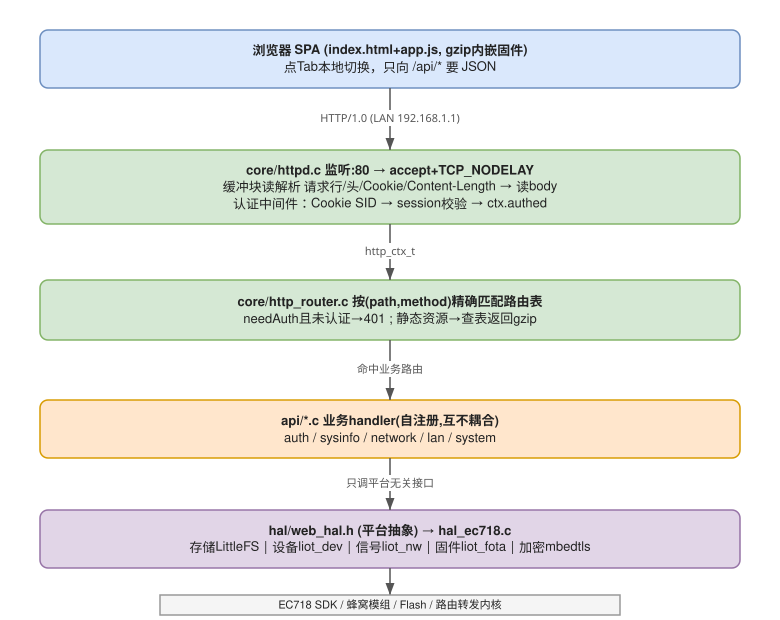
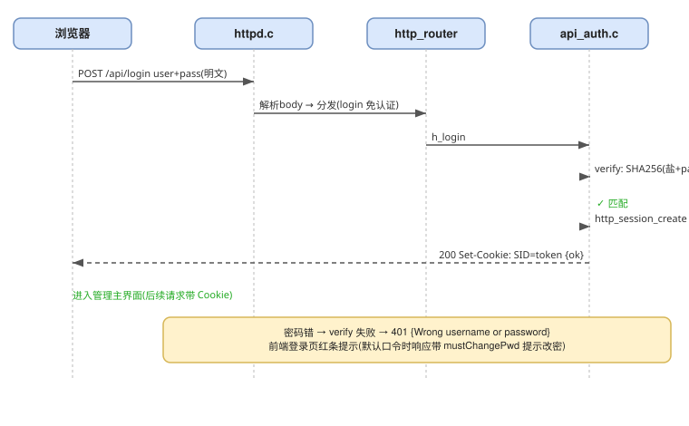
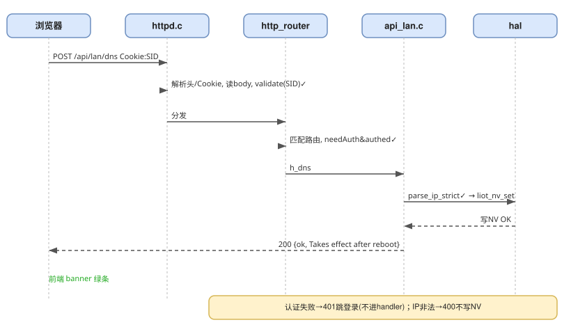

# router — Cat.1 NAT 路由器示例

一个运行在 EC718 Cat.1 模组上的完整「单 WAN / 多 LAN」NAT 路由器示例工程。
以蜂窝数据拨号作 WAN 上行，一个或多个 CH390 SPI 以太网口作 LAN，
在两者之间提供 ARP 代理、DHCP 服务、NAPT（SNAT/DNAT）、端口映射与配置持久化。
可选 Web 管理服务提供登录认证、状态查看、LAN/DHCP/DNS/NAT 配置、系统维护与本地固件升级。

- 工程入口：[src/user_main.c](src/user_main.c) → `Liot_RouterStart()`
- 核心引擎：以预编译库 `libliot_router.a` 形式随底包提供，公共头 `liot_router.h`
  在 `LSDK/components/kernel/lierda_api/liot_router/`
- 本示例包含**板级 / 用户层**代码（引脚、开关、持久化、LAN 设备驱动、入口）以及
  **Web 管理服务侧**代码（前端资源、业务 API、HAL 适配、Web 入口）

## 1. 快速开始

```bash
cd LSDK
make cleanall
make all PROJECT=router MODEM=NT26F6D1
```

生成物：`LSDK/gccout/router/router_<MODEM>.bin` 及 `*_01.binpkg`。
下载 binpkg 到模组后，PC / 设备接入 CH390 LAN 口即可通过蜂窝网络上网。

> `MODEM` 按实际模组型号替换（示例默认 `NT26F6D0`，对应底包生成物 `F6D_A`）。

## 2. 目录结构

```text
examples/router/
├── README.md                 # 本文档
├── config                    # 工程级功能开关（含 CH390 驱动、LAN/灯/复位/Web 开关）
├── Makefile                  # 条件编译 + 产出 lib_router.a
├── inc/
│   ├── user_main.h           # user_main() 声明（内核入口要求）
│   ├── liot_router_user.h    # 硬件引脚 / 默认值 / 功能开关 / 用户接口
│   └── liot_router_nv.h      # NV 持久化数据结构 + API
├── src/
│   ├── user_main.c               # 入口：延时 2s 后 Liot_RouterStart()
│   ├── liot_router_user.c        # 启动编排：NV → 核心 Init → LAN 注册 → Web
│   ├── liot_router_nv.c          # 配置持久化到 /router_cfg.dat（LittleFS）
│   ├── liot_router_atlan0.c      # LAN#0 CH390 实例驱动（SPI1）
│   ├── liot_router_atlan1.c      # LAN#1 CH390 实例驱动（SPI0）
│   ├── liot_router_light.c       # 网络状态指示灯（PS 承载事件驱动）
│   ├── liot_router_reset.c       # 复位按键（长按 5s 清 NV 重启）
│   └── liot_router_web_main.c    # Web 管理服务入口
├── api/                          # Web 业务 API 模块
├── hal/                          # Web 平台抽象层及 EC718 适配
├── resource/                     # 自动生成的 gzip 前端资源 C 数组
├── ui/                           # 前端 SPA 源码（index.html/app.js/logo1.png）
└── tools/                        # 前端资源生成工具与架构图
```

## 3. 编译开关（`config`）

| 开关 | 默认 | 说明 |
| --- | --- | --- |
| `BUILD_DRIVER_CH390_EN` | `y` | 使能 CH390 以太网驱动（LAN 必需） |
| `LIOT_ROUTER_LAN0` | `y` | 编译 LAN#0（SPI1）实例 |
| `LIOT_ROUTER_LAN1` | `y` | 编译 LAN#1（SPI0）实例 |
| `LIOT_ROUTER_LIGHT` | `y` | 编译网络指示灯模块 |
| `LIOT_ROUTER_RESET` | `y` | 编译复位按键模块 |
| `LIOT_ROUTER_WEB` | `y` | 编译 Web 管理服务（前端资源、API、HAL、入口） |

开关 `y` 时 Makefile 追加对应 `-DLIOT_ROUTER_XXX_ENABLE` 宏并编译对应 `.o`。
只用一个 LAN 口时把 `LIOT_ROUTER_LAN1 ?= n` 即可；不需要 Web 管理页面时把
`LIOT_ROUTER_WEB ?= n`。

## 4. 硬件引脚（`inc/liot_router_user.h`）

| 用途 | 宏 | 默认值 |
| --- | --- | --- |
| CH390#0 SPI 端口 | `LIOT_CH390_0_SPI_PORT` | `1`（SPI1） |
| CH390#0 复位 GPIO | `LIOT_CH390_0_RST_GPIO` | `21` |
| CH390#0 片选 GPIO | `LIOT_CH390_0_SSN_GPIO` | `12` |
| CH390#0 中断唤醒 pad | `LIOT_CH390_0_INT_WAKEUP_PAD` | `0` |
| CH390#1 SPI 端口 | `LIOT_CH390_1_SPI_PORT` | `0`（SPI0） |
| CH390#1 复位 GPIO | `LIOT_CH390_1_RST_GPIO` | `25` |
| CH390#1 片选 GPIO | `LIOT_CH390_1_SSN_GPIO` | `8` |
| CH390#1 中断唤醒 pad | `LIOT_CH390_1_INT_WAKEUP_PAD` | `3` |
| LED_LAN1（LAN0 就绪） | `LIOT_LED_LAN0_GPIO_IDX` | `5` |
| LED_LAN2（LAN1 就绪） | `LIOT_LED_LAN1_GPIO_IDX` | `6` |
| LED_LTE_G（网络正常/绿） | `LIOT_LED_LTE_G_GPIO_IDX` | `4` |
| LED_LTE_R（网络异常/红） | `LIOT_LED_LTE_R_GPIO_IDX` | `3` |
| 复位按键唤醒 pad | `LIOT_ROUTER_RESET_WAKEUP_PAD` | `5` |
| 复位长按时长 | `LIOT_ROUTER_RESET_LONG_PRESS_MS` | `5000` ms |

> 引脚与实际硬件板对应，换板时改这里即可，不涉及核心引擎。
>
> **指示灯**：全部 NPN 三极管驱动，GPIO 高电平点亮。LED_LAN1/2 在对应 LAN 口初始化完成后常亮；
> LTE 绿/红互斥，网络就绪（PS 承载 acted）亮绿，未就绪/断网亮红。

## 5. 网络默认值与容量

| 宏 | 默认值 | 含义 |
| --- | --- | --- |
| `LIOT_ROUTER_DEFAULT_GATEWAY_IP` | `192.168.1.1` | 网关 / LAN 侧 IP |
| `LIOT_ROUTER_DEFAULT_SUBNET_MASK` | `255.255.255.0` | 子网掩码 |
| `LIOT_ROUTER_DEFAULT_LEASE_TIME` | `7200` s | DHCP 租期 |
| `LIOT_DHCP_POOL_SIZE` | `32` | DHCP 地址池大小 |
| `LIOT_ROUTER_WAN_CID` | `1` | WAN PDP 上下文 ID |
| `LIOT_ROUTER_WAN_MAC` | `30:89:84:6A:96:AB` | WAN 侧 MAC（ETH 模式用） |
| `LIOT_ROUTER_NV_FILE` | `/router_cfg.dat` | 配置持久化文件 |

## 6. 运行时配置（NV）

首次开机若无 `/router_cfg.dat` 则用编译默认值；之后可通过 `Liot_RouterNvSet()`
写入自定义配置（网关 IP、DHCP 地址池、DNS、静态 MAC-IP 绑定、端口映射规则），
掉电保存、开机自动 `nv_apply` 下发到各模块。数据结构见 [inc/liot_router_nv.h](inc/liot_router_nv.h)。

- **静态绑定**：最多 `LIOT_NV_MAX_STATIC_BIND = 8` 条 MAC→IP。
- **端口映射（DNAT）**：最多 `LIOT_NV_MAX_NAT_RULES = 16` 条 外部端口→内网 IP:端口。
- **恢复出厂**：长按复位按键 5 秒（或调用 `Liot_RouterNvReset()`）删除配置文件并重启。

## 7. 架构概览

示例代码（板级层）之下是预编译的**核心引擎**，二者职责如下。

### 7.1 核心引擎（预编译库，不在本示例内）

| 模块 | 职责 |
| --- | --- |
| `liot_router_main` | 主任务 + 中央消息队列；按来源/以太类型分发每一个报文 |
| `liot_router_wan` | WAN 上行：netpierce 初始化、下行 RX 回调、上行发送（ETH / IPOS 自适应） |
| `liot_router_lan` | LAN 抽象层：每口一个任务（TX 优先再 RX）、异步发包队列 |
| `liot_router_arp` | ARP 代理应答、MAC/IP 学习、免费 ARP |
| `liot_router_dhcp` | DHCP 服务器：租约表、地址池、静态绑定、DNS 选项 |
| `liot_router_nat` | NAPT 会话表（上行 SNAT）+ 静态 DNAT 端口映射 |
| `liot_router_fwd` | 转发引擎：LAN→WAN、WAN→LAN、LAN↔LAN 互通、丢包过滤 |
| `liot_router_netif` | 网关本机流量的虚拟 lwIP netif（ICMP 回显、DHCP 续租、TCP 服务） |
| `liot_router_pktpool` | 报文 slot 分配器（堆内存，句柄即指针） |

设计风格：直接在裸以太网/IP 缓冲区上做**字节级**报文操作。只有「目的为网关自身」的
本机流量才借用 lwIP（单个虚拟 netif）；所有 LAN↔WAN 转发都是手写实现，**不走** lwIP 协议栈。

### 7.2 任务与队列模型

```text
                    ┌─────────────────────────────────────────┐
   WAN 下行           │              主任务 (liotRouter)          │
  netpierce ──cb──▶  │   阻塞读 gMainQueue → 按 source 分发       │
  (0xFF)            │                                           │
                    │   0xFF        → fwd_wan_to_lan (DNAT)     │
   LAN RX            │   0~N(LAN口)   → process_frame            │
  CH390 ─中断─▶      │       ├ ARP(0x0806) → arp_handle          │
  lanTask ──▶gMainQ │       └ IPv4(0x0800)→ fwd_lan_to_wan       │
  (0~N)             │   0xFE        → WAN 变更→更新 DHCP/免费ARP  │
                    └─────────────────────────────────────────┘
                             │发包(异步入各 LAN 口 txQueue)
                             ▼
                    lanTask: TX 优先清空 txQueue → 再收 RX
```

- **主任务**：唯一报文处理线程，串行、无锁，从 `gMainQueue` 阻塞取包。
- **每 LAN 口一个任务**：CH390 中断经 wakeup 回调唤醒；每轮先排空 TX 队列（发包优先）再收 RX。
- **WAN 任务**：由 `liot_netpierce` 内部管理，下行数据经回调提取纯 IP 包投递主队列。
- **source 编码**：`0~N` = LAN 口；`0xFF` = WAN；`0xFE` = WAN 变更控制消息（无报文体）。

### 7.3 数据通路

**LAN → WAN 上行**（按目的 IP 优先级）：命中 LAN 主机→直接互转；目的是网关→虚拟 netif；
发往网关的 DHCP→DHCP 服务器；组播/广播→丢弃；其余→**SNAT** 后上行。

**WAN → LAN 下行**：过滤外网 DHCP 应答 → **DNAT**（先静态映射再 NAPT 会话表还原目的）→
查租约表取 MAC/LAN 口发出。

**网关本机流量**：走虚拟 lwIP netif（名 `lr`，MTU 1500）——ICMP echo 手写应答、
DHCP 续租交 DHCP 处理、其余（如 TCP 本机服务）送入 lwIP 协议栈。

## 8. 启动流程（`Liot_RouterStart`）

```text
user_main()
 └─ 延时 2s → Liot_RouterStart()
     ├─ [可选] Liot_RouterResetInit()   // LIOT_ROUTER_RESET_ENABLE
     ├─ Liot_RouterNvInit()             // 读配置并 apply 默认值
     ├─ Liot_RouterInit(cfg)            // 主队列→nat_init→dhcp_init→netif_init→wan_init→建主任务
     ├─ Liot_RouterLanInit(gRegistLan)  // 按编译开关注册 LAN0/LAN1，建各口任务
     ├─ [可选] Liot_RouterLightInit()   // LAN 初始化后点亮对应 LAN 指示灯
     └─ [可选] Liot_WebInit()           // 注册 Web API/静态资源并启动 httpd :80
```

## 9. 已知边界与注意点

- LAN↔WAN 转发不走 lwIP，只支持 **IPv4**；非 IPv4（含 IPv6）在 WAN 回调处直接丢弃。
- **不支持 IP 分片重组**，超 MTU（1500）报文被丢。
- 主任务单线程串行处理，是吞吐瓶颈点；重负载下关注 `gMainQueue` 深度与 slot 堆分配失败。
- NAPT 映射端口 `10000~60000` 循环分配，未做冲突二次探测，极端高并发可能撞已用端口。
- 组播/广播（DHCP 除外）一律丢弃，依赖组播的业务在 LAN 侧不可用。
- 核心引擎为预编译库，修改路由算法需在底包工程重新编译；本示例只负责板级/用户层。

## 10. Web 管理服务

### 10.1 当前方案

#### 10.1.1 功能清单
- 账号密码登录认证、登录密码修改、登出（Session + Cookie）
- 系统基础信息查看（型号 / IMEI / SN / 固件版本 / 运行时长）
- WAN 状态（在线状态 / IP / 网关 / DNS / 信号 dBm）
- LAN 链路状态、在线终端列表
- LAN 网关设置、DHCP 地址池、DNS 服务器、静态 IP 绑定
- NAT 端口映射（独立栏目，增删规则，端口 1-65535 校验）
- 设备重启 / 恢复出厂（删除失败检查）/ 本地固件升级（完整固件差分）
- 输入校验：所有 IP 严格校验合法性(0-255 各段)，端口范围校验
- 界面为纯英文；合理可扩展（预留后续功能模块）、跨平台可移植（跨芯片 / Linux）

#### 10.1.2 界面栏目（前端 SPA，五栏，英文）
| 栏目(Tab) | 内容 |
|---|---|
| Status | 设备信息卡 + WAN 卡（IP/网关/DNS/信号 dBm） |
| Network | LAN 链路（网关/掩码/在线终端数）+ 已连接终端列表 |
| LAN | 网关/掩码、DHCP 池、DNS 服务器、静态 IP 绑定 |
| Port Mapping | NAT 规则列表 + 新增/删除 |
| System | 改密、固件升级、重启、恢复出厂 |

#### 10.1.3 架构分层

```text
浏览器 (SPA: index.html + app.js + logo, gzip 内嵌固件)
   │  HTTP/1.0，每请求一条连接
   ▼
liot_router_http_server.c   单任务监听 :80 → 缓冲块读解析请求行/头/Cookie/body
   │  (httpd+router+session   → session 认证中间件 → 精确匹配路由表 → 分发
   │   三合一)                → 响应/参数 helper(URL解码等)、10min 会话过期
   │  归属：components/kernel/lierda_api/liot_router (随核心库 libliot_router.a)
   ▼
api/liot_router_*.c          业务模块(自注册路由，互不耦合)
   │              auth / sysinfo / network / lanconfig / system
   │  归属：examples/router/api
   ▼
hal/liot_router_hal.h        平台无关抽象接口
   └ liot_router_hal_ec718.c  EC718 适配(LittleFS / liot_dev / liot_nw信号 /
                  liot_fota2 Liot_FotaUpgrade(本地文件包升级) / mbedtls)
                  归属：examples/router/hal
```

> 命名规范：对外函数 `Liot_XxxXxx`、结构体 `Liot_XxxXxx_t`、枚举 `Liot_XxxXxx_e`。
> 模块分布：HTTP 核心(server.c/.h)在 `components/kernel/lierda_api/liot_router` 侧，
> 前端资源/API/HAL/入口在 `examples/router` 侧，由 `examples/router/Makefile` 统一把
> 双方头文件目录加入 include 路径。

#### 10.1.4 目录结构

Web 服务代码分布在两个模块目录，通过 `examples/router/Makefile` 的 include 路径引用核心库头文件：

**① `examples/router/`**（前端资源 + API 业务 + HAL + 入口）
```
examples/router/
├── src/
│   ├── liot_router_web_main.c    入口：注册模块 + 静态资源 handler + 启动 httpd
│   ├── liot_router_atlan0.c/atlan1.c  LAN0/LAN1 网口驱动
│   ├── liot_router_nv.c          路由配置 NV 读写
│   ├── liot_router_user.c        用户配置/初始化
│   ├── liot_router_light.c       指示灯(可选，ROUTER_LIGHT)
│   └── liot_router_reset.c       复位按键(可选，ROUTER_RESET)
├── inc/
│   ├── liot_router_user.h            用户配置接口
│   └── liot_router_nv.h              NV 接口
├── api/                          Web 业务模块(ROUTER_WEB)
│   ├── liot_router_auth.c            登录/登出/改密
│   ├── liot_router_sysinfo.c         设备信息
│   ├── liot_router_network.c         WAN/LAN 状态、在线终端
│   ├── liot_router_lanconfig.c       网关/DHCP/DNS/静态绑定/NAT 配置
│   ├── liot_router_system.c          重启/恢复出厂/固件升级
│   └── liot_router_modules.h         各模块注册声明(含后续功能预留)
├── hal/                          平台抽象层
│   ├── liot_router_hal.h             平台无关接口
│   └── liot_router_hal_ec718.c       EC718 实现
├── resource/                     [自动生成] gzip 前端资源，勿手改
│   └── liot_router_resource.c/.h
├── ui/                           前端 SPA 源码(index.html/app.js/logo1.png) ← 改这里
├── tools/
│   ├── gen_web_asset.py          资源生成器(编译前由 Makefile 自动调用)
│   └── diagrams/                 架构图资源
└── Makefile                      模块开关(LAN0/1、LIGHT、RESET、WEB) + web 各层 include
```

**② `components/kernel/lierda_api/liot_router/`**（路由核心库 libliot_router.a：公共头文件目录）
```
components/kernel/lierda_api/liot_router/
├── liot_router.h                路由公共 API
└── liot_router_http_server.h    HTTP 核心对外接口
```

> 交叉引用关系：`examples/router` 侧的 web API/HAL 依赖核心库侧的
> `liot_router_http_server.h` 与 `liot_router.h`；核心库中的
> `liot_router_http_server.c` 依赖 `examples/router` 侧的
> `liot_router_hal.h`、`liot_router_resource.h`、`liot_router_user.h`。
> `examples/router/Makefile` 通过 `-I` 把 `examples/router/{,api,hal,resource}` 和
> `components/kernel/lierda_api/liot_router` 加入 include 路径。

#### 10.1.5 流程架构图

##### 图 A：整体分层与数据流



##### 图 B1：登录时序



> 登录免认证(needAuth=false)。密码错返回 401 + 提示；成功签发 Session → Set-Cookie，
> 前端存 SID、进主界面，后续请求带 Cookie 通过认证中间件校验。

##### 图 B2：一次请求的处理时序（以"保存 DNS"为例）



> 认证失败时(SID 无效/过期)：middleware 直接 401，前端跳登录页，不进 handler。
> DNS/IP 非法时：h_dns 返回 400 "Invalid IP address"，前端红条提示，不写 NV。

---

### 10.2 API 接口清单（当前 16 个路由）

| 路径 | 方法 | 需登录 | 功能 |
|---|---|---|---|
| `/api/login` | POST | ❌ | 登录（验证用户名密码、签发 Session） |
| `/api/logout` | POST | ✅ | 登出（吊销 Session） |
| `/api/passwd` | POST | ✅ | 改密（旧密码错返回 400 不跳登录；成功吊销全部 Session） |
| `/api/sysinfo` | GET | ✅ | 设备信息（型号/IMEI/SN/固件版本/运行时长） |
| `/api/net/status` | GET | ✅ | 网络状态（WAN: IP/网关/DNS/信号；LAN: 网关/掩码/在线数） |
| `/api/net/clients` | GET | ✅ | 在线终端列表（port/MAC/IP） |
| `/api/lan/config` | GET | ✅ | LAN 配置（网关/掩码/池/DNS/静态绑定/NAT规则） |
| `/api/lan/gateway` | POST | ✅ | 设网关/掩码 |
| `/api/lan/dhcp` | POST | ✅ | 设 DHCP 地址池 |
| `/api/lan/dns` | POST | ✅ | 设 DNS 服务器（下发给客户端） |
| `/api/lan/bind` | POST | ✅ | 静态 IP 绑定（action=add/del） |
| `/api/lan/nat` | POST | ✅ | NAT 端口映射（action=add/del） |
| `/api/system/reboot` | POST | ✅ | 重启 |
| `/api/system/factory` | POST | ✅ | 恢复出厂（吊销 Session） |
| `/api/system/upgrade` | POST | ✅ | 固件升级（流式写 FOTA NVM → 校验 → FOTA 专用复位） |
| `/`, `/index.html`, `/app.js`, `/logo1.png` | GET | ❌ | 静态前端资源（gzip，Cache-Control: no-cache） |

---

### 10.3 安全机制

| 环节 | 做法 |
|---|---|
| 密码存储 | `盐(16B随机) + SHA256`，不存明文；每次改密换新盐 |
| 会话 | 登录签发随机 token → 内存表 + Cookie(HttpOnly)；10min 无活动过期；最多 4 并发 |
| 会话吊销 | 改密 / 恢复出厂 → 吊销全部会话，掉电即失效 |
| 随机数 | `Liot_WebHalRandom`：tick + 计数器多轮 SHA256 |
| 输入校验 | 所有 IP 严格校验(4段/0-255/无多余字符)、端口 1-65535、MAC 格式；防止越界/截断存入错误配置 |
| 固件完整性 | 整包落地后由 `Liot_FotaUpgrade` 内部校验(格式+SHA256)，通过才复位刷写；失败清残留 |

**已知短板**（局域网单用户场景可接受，如需加固再议）：
- 传输为明文 HTTP，无 TLS（登录密码在网络上明文）
- 默认口令 `admin/admin123` 用固定盐（界面强制提示改密）
- 无登录失败次数限制
- 随机数为软件熵源，非硬件 TRNG

---

### 10.4 扩展与移植指引

- **加功能模块**（核心层不改，6 步；路径均相对 `examples/router/`）：
  1. 新建 `api/liot_router_xxx.c`，写 handler(签名 `int (Liot_HttpCtx_t*)`)
  2. 用 `Liot_HttpRouteRegister("/api/xxx", HTTP_METHOD_x, needAuth, handler)` 注册路由
  3. `api/liot_router_modules.h` 声明 `void Liot_ApiXxxRegister(void);`
  4. `src/liot_router_web_main.c` 的 `Liot_WebInit()` 里调用 `Liot_ApiXxxRegister()`
  5. `Makefile` 的 WEB 块加一行 `ROUTER_COBJSTEMP += $(ROUTER_DIR)/api/liot_router_xxx.o`
  6. **前端 `app.js` 加新栏目**（完全不懂 JS 也能照做，以加个"About"栏为例）：

     **6.1 打开 `ui/app.js`，搜索 `const TABS`，找到这段**（约 51 行）：
     ```js
     const TABS = [
       {id:'status', name:'Status',       render:vStatus},
       {id:'network',name:'Network',      render:vNetwork},
       {id:'lan',    name:'LAN',          render:vLan},
       {id:'nat',    name:'Port Mapping', render:vNat},
       {id:'system', name:'System',       render:vSystem},
     ];
     ```

     **6.2 在最后一个 `System` 那行下面、`];` 之前，复制粘贴加一行**：
     ```js
       {id:'about',  name:'About',        render:vAbout},
     ```
     ↑ 注意结尾也有**逗号**（像上面每行一样）。三个字段：
     - `id:'about'` → 栏目内部标识（英文小写，唯一）
     - `name:'About'` → 显示在导航按钮上的文字（给用户看的）
     - `render:vAbout` → 渲染函数名，马上要写这个函数

     **6.3 在文件末尾（搜索 `function vSystem`，找到它下面位置），复制粘贴加这段**：
     ```js
     function vAbout(){
       $('#view').innerHTML=`
       <div class="card"><h3>About This Device</h3>
         <p>Model: EC718 4G Router</p>
         <p>Firmware Version: 1.0.0</p>
         <p>Copyright © 2025</p>
       </div>`;
     }
     ```
     ↑ 这是你新栏目的**页面内容**，用 HTML 写（反引号`` ` ``括起来的那段）。
     - `$('#view').innerHTML=` 固定写法，把后面的 HTML 显示到页面
     - `<div class="card">...</div>` 是一个卡片，里面放标题 `<h3>` 和段落 `<p>`
     - 照着这个格式，把内容改成你想展示的就行

     **6.4 如果你的栏目要调后端接口取数据**（比如显示日志），改成这样：
     ```js
     async function vAbout(){
       $('#view').innerHTML=`<div class="card"><h3>About</h3><p>Loading...</p></div>`;
       try{
         const d=await api('/api/about');  // ← 调你后端的接口
         $('#view').innerHTML=`
         <div class="card"><h3>About</h3>
           <p>Model: ${d.model}</p>
           <p>Version: ${d.version}</p>
         </div>`;
       }catch(e){banner(e.message||'Load failed',false);}
     }
     ```
     ↑ `${d.xxx}` 是把后端返回的 JSON 数据插进去（`d.model` 对应后端 JSON 里的 `"model":"EC718"` 那个字段）。

     **6.5 保存 `app.js`，直接编译烧录即可**。
     资源打包(gzip + 转 C 数组)由 `Makefile` 在**编译时自动执行**
     (`$(shell ... gen_web_asset.py ...)`)，**无需手动生成**。
     编译日志里会看到 `router web asset: [gen_web_asset] ...` 一行确认已重新生成。
     烧录后界面导航就会多一个"About"按钮，点进去显示你写的内容。
     > 只有想在**本机浏览器预览**(不烧设备)时，才需手动跑一次 `gen_web_asset.py`。

     > **常见错误**：忘了 TABS 最后一行加逗号 → 浏览器 Console 报错 `Unexpected token`；
     > 函数名写错（TABS 里写 `vAbout` 但函数定义成 `function vAboutPage`）→ 点按钮空白页。
  > 用户输入务必校验(仿 `parse_ip_strict`/端口范围)；响应文案用英文(与界面一致)。

- **完整实例：新增"流量统计与限额"模块**（把上面 6 步走一遍的真实样例）

  **① 新建 `api/liot_router_traffic.c`**（含一个 GET 查询 + 一个 POST 设限额）：
  ```c
  /**
   * @file liot_router_traffic.c
   * @brief Web API - 流量统计与限额（示例模块）
   */
  #include "liot_router_http_server.h"
  #include "liot_router_hal.h"
  #include <stdio.h>
  #include <stdlib.h>

  /* 假设 HAL 已提供以下接口(需在 liot_router_hal.h + liot_router_hal_ec718.c 实现)：
   *   uint64_t Liot_WebHalTrafficRx(void);        // 本月已用下行字节
   *   uint64_t Liot_WebHalTrafficTx(void);        // 本月已用上行字节
   *   uint32_t Liot_WebHalTrafficLimitMb(void);   // 限额(MB,0=不限)
   *   int      Liot_WebHalTrafficSetLimitMb(uint32_t mb);
   */
  extern unsigned long long Liot_WebHalTrafficRx(void);
  extern unsigned long long Liot_WebHalTrafficTx(void);
  extern unsigned int       Liot_WebHalTrafficLimitMb(void);
  extern int                Liot_WebHalTrafficSetLimitMb(unsigned int mb);

  /* GET /api/traffic — 查询本月用量与限额 */
  static int h_traffic_get(Liot_HttpCtx_t *ctx) {
      unsigned long long rx = Liot_WebHalTrafficRx();
      unsigned long long tx = Liot_WebHalTrafficTx();
      unsigned int limit = Liot_WebHalTrafficLimitMb();
      char buf[256];
      snprintf(buf, sizeof(buf),
          "{\"ok\":true,\"rxMB\":%llu,\"txMB\":%llu,\"totalMB\":%llu,\"limitMB\":%u}",
          rx/1048576ULL, tx/1048576ULL, (rx+tx)/1048576ULL, limit);
      Liot_HttpSendJson(ctx->sock, buf);
      return 0;
  }

  /* POST /api/traffic/limit — 设置月限额(MB，0=不限) */
  static int h_traffic_limit(Liot_HttpCtx_t *ctx) {
      char v[12] = {0};
      if (!ctx->body || Liot_HttpParamGet(ctx->body, "limitMB", v, sizeof(v)) != 0) {
          Liot_HttpSendStatus(ctx->sock, 400, "missing limitMB");
          return 0;
      }
      long mb = atol(v);
      if (mb < 0 || mb > 1024*1024) {   /* 上限 1TB，防异常值 */
          Liot_HttpSendStatus(ctx->sock, 400, "limit out of range");
          return 0;
      }
      if (Liot_WebHalTrafficSetLimitMb((unsigned int)mb) != 0) {
          Liot_HttpSendStatus(ctx->sock, 500, "Save failed");
          return 0;
      }
      Liot_HttpSendJson(ctx->sock, "{\"ok\":true,\"msg\":\"Limit saved\"}");
      return 0;
  }

  void Liot_ApiTrafficRegister(void) {
      Liot_HttpRouteRegister("/api/traffic",       HTTP_METHOD_GET,  1, h_traffic_get);
      Liot_HttpRouteRegister("/api/traffic/limit", HTTP_METHOD_POST, 1, h_traffic_limit);
  }
  ```

  **② `api/liot_router_modules.h` 声明**（把注释里的那行取消注释即可）：
  ```c
  void Liot_ApiTrafficRegister(void);   /* 流量统计与限额 */
  ```

  **③ `src/liot_router_web_main.c` 的 `Liot_WebInit()` 里调用**：
  ```c
  Liot_ApiTrafficRegister();
  ```

  **④ `Makefile` 的 WEB 块加一行**：
  ```make
  ROUTER_COBJSTEMP += $(ROUTER_DIR)/api/liot_router_traffic.o
  ```

  **⑤ HAL 里实现那 4 个 `Liot_WebHalTraffic*`**（`liot_router_hal.h` 声明 +
  `liot_router_hal_ec718.c` 实现，用途:从模组/PS 层读流量计数、限额存 NV）。
  这是唯一需要碰平台相关代码的地方。

  **⑥ 前端 `app.js` 加"Traffic"栏**（TABS 加一项 + 写渲染函数）：
  ```js
  // TABS 数组里加(注意逗号)：
    {id:'traffic', name:'Traffic', render:vTraffic},

  // 文件末尾加渲染函数：
  async function vTraffic(){
    const d=await api('/api/traffic');
    const pct = d.limitMB>0 ? Math.min(100, Math.round(d.totalMB*100/d.limitMB)) : 0;
    $('#view').innerHTML=`
    <div class="card"><h3>Traffic Usage (this month)</h3>
      <div class="row"><span class="k">Download</span><span class="v">${d.rxMB} MB</span></div>
      <div class="row"><span class="k">Upload</span><span class="v">${d.txMB} MB</span></div>
      <div class="row"><span class="k">Total</span><span class="v">${d.totalMB} MB</span></div>
      ${d.limitMB>0?`<div class="row"><span class="k">Limit</span><span class="v">${d.totalMB}/${d.limitMB} MB (${pct}%)</span></div>`:''}
    </div>
    <div class="card"><h3>Monthly Limit</h3>
      <label>Limit in MB (0 = unlimited)</label>
      <input id="tl" type="number" min="0" value="${d.limitMB}">
      <button class="act" onclick="saveLimit()">Save</button>
    </div>`;
  }
  async function saveLimit(){
    try{ const d=await api('/api/traffic/limit', enc({limitMB:$('#tl').value}));
      flash(d,'Saved'); }
    catch(e){ banner(e.message||'Save failed',false); }
  }
  ```

  改完编译烧录，界面就会多出 **Traffic** 栏，显示本月上下行用量、限额进度，并可设置月限额。
  > 全程 **core 层零改动**；唯一的平台相关工作是第 ⑤ 步的 4 个 HAL 接口。

- **预留功能模块**（见 `liot_router_modules.h` 注释）：蜂窝(APN/制式/拨号)、SIM/PIN、
  流量统计与限额、短信、MAC 过滤/访问控制、静态路由、ping/traceroute 诊断。
- **移植新平台**：仿 `examples/router/hal/liot_router_hal_ec718.c` 实现
  `liot_router_hal.h` 全部接口即可；Linux 侧另将核心库中的
  `liot_router_http_server.c` 的 lwip socket 换成 POSIX socket（接口一致）。
  前端与 API 逻辑一行不用改。
